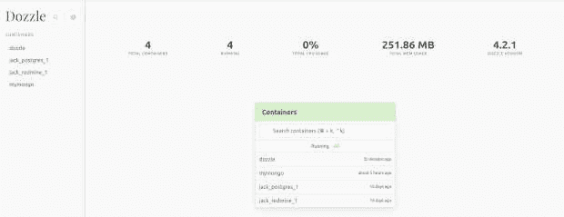
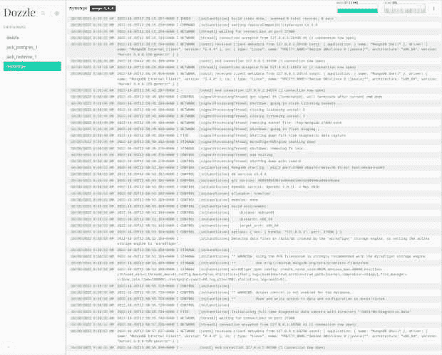

# 安装 Dozzle，一个简单的 Docker 日志文件查看器

> 原文：<https://thenewstack.io/install-dozzle-a-simple-log-file-viewer-for-docker/>

Docker 是我的首选[容器](https://thenewstack.io/category/containers/)部署工具。我总是发现它比 Kubernetes 之类的软件更容易使用。当然，Docker 并不适合所有的部署。然而，当[码头](https://www.docker.com/?utm_content=inline-mention)是中肯的，它不能被击败的简单性，可靠性和稳定性。然后你再加入 [Docker Swarm](https://thenewstack.io/kubernetes-vs-docker-swarm-whats-the-difference/) ，你就可以根据需要进行扩展。

但是有一件事仍然很有挑战性，即使是像 Docker 这样的人，那就是故障排除。对于容器部署(尤其是全栈应用程序)，有许多移动部分会出错，而且，当某些部分确实出错时，找出罪魁祸首可能是一件非常痛苦的事情。

对 Docker 容器进行故障诊断的最好工具之一是日志文件。通过使用日志文件，您将深入了解您的部署，这对保持这些容器可靠、高效地运行绝对是无价的。

但是如何查看 Docker 容器日志呢？如果您熟悉 Docker 命令行，这并不那么具有挑战性。例如，假设您部署了一个名为 mymongo 的容器(一个 [MongoDB](https://www.mongodb.com/cloud/atlas/?utm_content=inline-mention) 容器),并且您在使用该容器时遇到了问题。您可以使用命令查看日志:

你可以用
得到更多的细节

```
docker logs  --details mymongo

```

您还可以跟踪日志，当容器内发生事件时，日志会不断输出新的信息。为此，命令是:

```
docker logs  --follow mymongo

```

您甚至可以查看特定时间戳之前的日志条目，例如:

```
docker logs  --until=2h  mymongo

```

以上输出将仅列出 2 小时前发生的事件。

根据容器的复杂程度，您可能会看到大量的输出需要梳理。您可能有许多需要查看日志的容器。如果在一个服务器上运行 20 多个容器，会发生什么？你记得那些容器的所有名字吗？如果没有，您必须首先使用命令:
定位容器的名称

有了容器的名称，您就可以查看它的日志。

这一点也不高效，考虑到您正在使用容器，效率就是游戏的名字。这就是为什么有像 [Dozzle](https://dozzle.dev/) 这样的工具，它们提供了一个基于 web 的 UI 来查看 Docker 容器日志。相信我，像 Dozzle 这样的工具将大大有助于简化 Docker 容器管理。

让我们看看如何部署 Dozzle，以及查看 Docker 容器日志有多简单。

## 安装 Docker 社区版

您可能已经安装并运行了 Docker(否则，您为什么要费心阅读本文)？万一你不知道，让我告诉你如何在 Ubuntu Server 22.04 上安装 Docker 社区版。

首先要做的是添加官方 Docker GPG 键:

```
curl  -fsSL https://download.docker.com/linux/ubuntu/gpg | sudo gpg --dearmor -o /usr/share/keyrings/docker-archive-keyring.gpg

```

接下来，我们将使用命令
添加官方 Docker 存储库

```
echo  "deb [arch=amd64 signed-by=/usr/share/keyrings/docker-archive-keyring.gpg] \n
https://download.docker.com/linux/ubuntu $(lsb_release -cs) stable"  |  sudo tee  /etc/apt/sources.list.d/docker.list  &gt;  /dev/null

```

安装所需的依赖项:

```
sudo apt-get install apt-transport-https ca-certificates curl gnupg lsb-release  -y

```

使用命令更新 apt:

用:
安装 Docker 社区版

```
sudo apt-get install docker-ce docker-ce-cli containerd.io  -y

```

使用命令:
确保您的用户是 docker 组的成员

```
sudo usermod  -aG docker  $USER

```

最后，注销并重新登录，使更改生效。

## 如何部署 Dozzle

好的。现在是时候部署我们基于 web 的日志查看器了。为此，发出命令:

```
docker run  --name dozzle  -d  --volume=/var/run/docker.sock:/var/run/docker.sock  -p  8888:8080  amir20/dozzle:latest

```

部署容器应该不会花太多时间。您可以使用命令来验证部署:

您应该会看到类似这样的内容:

```
e2e6b75c7af7     amir20/dozzle:latest     "/dozzle"                        29  minutes ago     Up  29  minutes     0.0.0.0:8888-&gt;8080/tcp,  :::8888-&gt;8080/tcp     dozzle

```

部署好容器后，打开 web 浏览器并指向 [http://IP:8888](http://ip:8888) (其中 IP 是托管服务器的 IP 地址)。您应该会看到一个简单的界面，其中列出了您已经运行的所有容器(图 1)。



图 Dozzle 基于 web 的界面简洁易用。

单击任何一个正在运行的容器来查看日志文件(图 2)。



图 2: Dozzle 显示了 mymongo 容器的日志。

Dozzle 的一个非常好的特性是能够为容器下载日志文件。为此，单击打开的日志文件右上角的三点菜单，并选择下载。这将下载文件(扩展名为。gz)到您的本地存储。然后，您可以使用任何文本编辑器查看该文件。

这就是部署 Dozzle 基于 web 的 Docker 容器日志查看器的全部内容。如果您有大量的容器需要进行故障诊断，这可能是最有效和最方便的方法之一。

<svg xmlns:xlink="http://www.w3.org/1999/xlink" viewBox="0 0 68 31" version="1.1"><title>Group</title> <desc>Created with Sketch.</desc></svg>