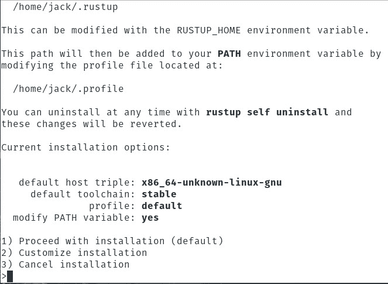
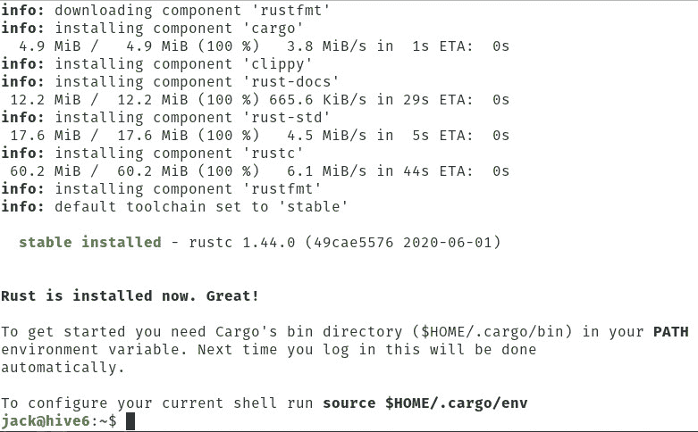
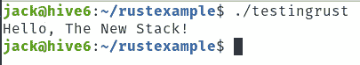

# 在 Linux 上安装 Rust

> 原文：<https://thenewstack.io/install-rust-on-linux/>

作为一种开源编程语言， [Rust](https://www.rust-lang.org/) 在过去几年里变得非常流行。Rust 是由曾经的 Mozilla 开发者[格雷顿·霍尔](https://usesthis.com/interviews/graydon.hoare/)在 2006 年开发的宠物项目，并由 [LLVM](https://llvm.org/) 提供支持，它速度极快，可以防止 segfaults，并保证线程和内存安全。Rust 还支持零成本抽象、移动语义、无数据竞争的线程、基于特征的泛型、类型推理、高效的 C 绑定、最小运行时间和模式匹配。

Rust 被 Dropbox、Red Hat 和 NPM 等公司使用，它是一种关注性能和安全的多平台语言。Rust 语言类似于 C++，可以在许多平台上运行。

如果你想用很少的内存来写非常快的代码，你通常会默认使用 C 或 C++。这些语言的问题是，在生产代码中使用它们意味着您必须手动管理内存，并且确切地了解您可能如何导致未定义的行为。

然而, [Rust 编译器](https://thenewstack.io/the-case-for-rust-as-the-future-of-javascript-infrastructure/)确保你安全地使用内存，所以你可以专注于你试图解决的问题，而不是你的编程语言可能引入的问题。举个例子，Rust 编译器检查你使用的每个变量和引用的每个内存地址。事实上，[根据这个图表](https://phil-opp.github.io/talk-konstanz-may-2018/#14)，2018 年的 Linux CVEs 中，有一半本来是可以避免使用 Rust 的。

如果您想知道什么样的应用程序可以成为好的 Rust 应用程序，请考虑任何可以从非常低的开销中获益的应用程序:

*   嵌入式系统
*   （家用）电器
*   工业机器
*   物联网/边缘计算
*   网络应用
*   裸机开发

对 Rust 的唯一警告是，它确实有一个相当陡峭的学习曲线。这主要是因为开发人员必须非常了解关于内存分配和并发性的基本计算原则。但是，如果您愿意花时间学习 Rust，那么付出的努力是值得的。

也就是说，我想带你完成在 Linux 上安装 Rust 的过程。我将在基于 Debian 和基于 Red Hat 的系统上演示这个过程。您只需要一个正在运行的 Linux 实例和一个拥有 sudo 特权的用户。

让我们安装。

## 照顾依赖性

我们必须做的第一件事是为 Rust 安装必要的依赖项。像 Rust 一样，这些依赖关系可以在标准存储库中找到，因此只需一个命令就可以完成安装。

在基于 Debian 的系统(比如 Ubuntu)上，可以使用以下命令安装依赖项:

`sudo apt-get install build-essential -y`

在基于 Red Hat 的系统(如 CentOS)上，可以使用以下命令处理依赖关系:

`sudo dnf install cmake gcc -y`

## 安装铁锈

Rust 的安装其实挺简单的。为此，我们将利用[卷曲命令](https://thenewstack.io/youre-addicted-to-curl-you-just-didnt-know-it/)。万一您的发行版不包含 curl，您可以从标准库安装它。

在基于 Debian 的系统上，可以用以下命令安装 curl:

`sudo apt-get install curl -y`

在基于 Red Hat 的系统上，您可以使用以下命令安装 curl:

`sudo dnf install curl -y`

安装 curl 后，您现在可以使用相同的命令安装 Rust，而不管您使用的是什么发行版。该命令是:

`curl https://sh.rustup.rs -sSf | sh`

出现提示时(**图 1** ，键入 1 并按键盘上的 Enter 键。



**图 1:** 在 Pop 上安装铁锈！_OS Linux。

安装程序需要一点时间(不超过 2-5 分钟，取决于您的网络连接)。一旦完成，您将被告知成功(**图 2** )。



**图二:**铁锈已经安装成功。

您会注意到，在输出中，它声明一旦您注销并重新登录，货箱目录将被添加到您的$PATH 中。这可能会失败。因此，我们将手动帮助它前进。为此，发出以下命令:

`source $HOME/.cargo/env`

完成这些后，找到你的用户。配置文件，这样它将使用修改后的$PATH 并确保您的 shell 在 Rust 环境中正常工作。为此，发出以下命令:

`source ~/.profile`

## 测试您的安装

安装 Rust 后，让我们进行一个测试。我们将用久经考验的“你好，世界！”举例来说，有一个转折。使用以下命令创建一个新目录:

`mkdir ~/rustexample`

使用以下命令切换到该目录:

`cd ~/rustexample`

接下来，我们将使用命令创建一个新的 rust 文件:

`nano testingrust.rs`

在新文件中，粘贴以下内容:

```
fn main()  {

     println!("Hello, The New Stack!");

}

```

保存并关闭文件。

现在，我们将为我们的 Hello，World 创建 Rust 可执行文件！使用以下命令编程:

`rustc testingrust.rs`

您应该看不到任何输出。

要运行新编译的程序，发出命令(从~/rustexample 目录中):

`./testingrust`

你应该看看你好，新的堆栈！打印在输出中(**图 3** )。



**图 3:** 我们的你好，世界！示例运行良好。

如果您愿意，您可以将该可执行文件复制到您的$PATH 目录中，这样您就可以从任何目录运行该程序。为此，发出以下命令:

`sudo mv testingrust /usr/local/bin`

移动程序后，您现在可以从任何目录使用以下命令运行它:

`testingrust`

这就是在 Linux 上安装和使用 Rust 的全部内容。在这一点上，你可能应该花时间阅读一下 [Rust core 文档](https://www.rust-lang.org/learn)，以便了解如何最大限度地利用这门语言。

<svg xmlns:xlink="http://www.w3.org/1999/xlink" viewBox="0 0 68 31" version="1.1"><title>Group</title> <desc>Created with Sketch.</desc></svg>