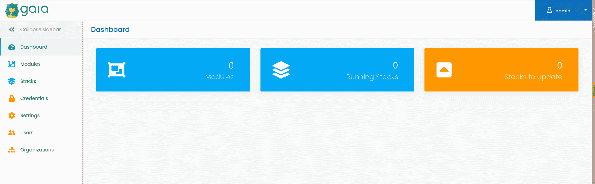

# 在 Ubuntu Server 22.04 上安装 Terraform 和 Gaia Web UI

> 原文：<https://thenewstack.io/install-terraform-and-the-gaia-web-ui-on-ubuntu-server-22-04/>

Terraform 是一个开源基础设施代码(IaC)工具，由 HashiCorp 创建，允许用户使用 HashiCorp 的声明式配置语言(称为 HashiCorp 配置语言)或 JSON 来定义和提供数据中心基础设施。

借助 [Terraform](https://www.terraform.io/intro) ，您可以定义云和内部资源，使用可以版本化、重用和共享的人类可读配置文件，创建一致的工作流来配置和管理您的所有基础架构。Terraform 可用于管理计算、存储、网络资源、DNS 条目和 SaaS 功能。

让我们将 Terraform 安装在我首选的开源服务器 Ubuntu 上，然后看看如何提供 AWS EC2 实例。

## 安装 Terraform

我们必须做的第一件事是安装 Terraform。在此之前，让我们安装一些必要的依赖项。登录到您的 Ubuntu 实例，使用以下命令安装这些需求:

`sudo apt-get install  software-properties-common gnupg2 curl -y`

一旦解决了这些依赖关系，使用以下命令下载所需的哈希公司 GPG 密钥:

`curl https://apt.releases.hashicorp.com/gpg | gpg --dearmor > hashicorp.gpg`

接下来，添加 GPG 键:

`sudo install -o root -g root -m 644 hashicorp.gpg /etc/apt/trusted.gpg.d/`

现在，我们可以使用以下命令添加官方的 HashiCorp 存储库:

`sudo apt-add-repository "deb [arch=$(dpkg --print-architecture)] https://apt.releases.hashicorp.com focal main"`

最后，使用以下两个命令更新 apt 并安装 Terraform:

`sudo apt update`

`sudo apt install terraform`

安装完成后，您可以使用以下命令验证安装:

`terraform version`

输出应该如下所示:

`Terraform v1.2.4`

`on linux_amd64`

`+ provider registry.terraform.io/hashicorp/google v4.27.0`

到目前为止一切顺利。让我们更进一步。

## 如何使用 Terraform 提供 AWS EC2 实例

为了做到这一点，你需要亚马逊网络服务的访问密钥和秘密密钥。这些凭证可以在 AWS Web 服务控制台的安全凭证部分找到。然后，您必须生成一个新的访问密钥，该密钥(一旦创建)将显示访问密钥 ID 和秘密访问密钥，它们都是随机字符串。你需要把那两把钥匙抄下来，因为我们要用它们。

在您的 Ubuntu 实例上，使用以下命令创建一个新的演示目录:

`mkdir terraform_test`

使用以下命令创建新的 Terraform 配置文件:

`nano awsec2.tf`

在该文件中，粘贴以下内容:

```
provider  "aws"  {
access_key  =  "ACCESS_KEY"
secret_key  =  "SECRET_KEY"
region  =  "us-west-2"
}

resource  "aws_instance"  "terraform_demo"  {
ami  =  "AMI"
instance_type  =  "t2.micro"
}

```

其中 ACCESS_KEY 是您创建的 AWS 访问密钥，SECRET_KEY 是关联的密钥，ami 是您要使用的 Ubuntu 版本的 AMI。比如 us-west-1 azone 中 Ubuntu 22.04 的 ami 就是 ami-09dadf5dc6cfa5248。

保存并关闭文件。

我们现在可以用以下命令初始化 terraform:

`terraform init`

初始化完成后，您可以进入计划阶段，这将为基础设施的创建和配置创建一个执行图。用于此目的的命令是:

`terraform plan`

上面的命令应该不会花太长时间。一旦完成，您就可以进入应用阶段，该阶段执行配置文件来启动我们的 AWS EC2 实例。为此，发出以下命令:

`terraform apply`

您将被要求确认您是否想要执行这些操作，因此键入 **yes** 并按下键盘上的 Enter 键。实例将被部署，并应该在您的 AWS 仪表板中列出。

## Terraform GUI 怎么样

有一些可用的 Terraform 图形用户界面，但是它们中的许多要么在启动和运行时具有难以置信的挑战性，要么就是已经崩溃了。然而，有一个可以与 Docker Compose 一起部署，名为 [Gaia](https://github.com/gaia-app/gaia/blob/main/docker-compose.yml) 。让我们把它展开。

我们必须做的第一件事是安装 Docker CE。

首先，使用命令添加 GPG 键:

`curl -fsSL https://download.docker.com/linux/ubuntu/gpg | sudo gpg --dearmor -o /usr/share/keyrings/docker-archive-keyring.gpg`

接下来，添加 Docker 存储库:

`echo "deb [arch=amd64 signed-by=/usr/share/keyrings/docker-archive-keyring.gpg] https://download.docker.com/linux/ubuntu $(lsb_release -cs) stable" | sudo tee /etc/apt/sources.list.d/docker.list > /dev/null`

安装必要的依赖项:

`sudo apt-get install apt-transport-https ca-certificates curl gnupg lsb-release -y`

最后，我们可以安装最新版本的 Docker 引擎:

`sudo apt-get update`

`sudo apt-get install docker-ce docker-ce-cli containerd.io -y`

最后，使用以下命令将您的用户添加到 docker 组:

`sudo usermod -aG docker $USER`

通过以下方式使系统意识到变化:

`newgrp docker`

使用以下内容创建一个 Docker 撰写 YAML:

`nano docker-compose.yml`

在该文件中，粘贴以下内容:

```
version:  "3.9"
services:
  gaia:
     image:  "gaiaapp/gaia"
     ports:
       -  "8080:8080"
     environment:
       -  "GAIA_MONGODB_URI=mongodb://mongo/gaia"
       -  "GAIA_RUNNER_API_PASSWORD=123456"
  runner:
     image:  "gaiaapp/runner"
     environment:
       -  "GAIA_URL=http://gaia:8080"
       -  "GAIA_RUNNER_API_PASSWORD=123456"
     volumes:
       -  "/var/run/docker.sock:/var/run/docker.sock"
  mongo:
     image:  "mongo:4.4"

```

保存并关闭文件。

使用以下工具部署 Gaia 容器:

`docker-compose up -d`

一旦容器启动并运行，通过将 web 浏览器指向 http://SERVER:8080(其中 SERVER 是托管服务器的 IP 地址或域)来访问 web UI。

您应该会看到 Gaia 登录屏幕(**图 1** )，其中的凭据是 admin/admin123)。


图 Gaia 登录屏幕。

成功登录后，你将被引导到主盖亚窗口(**图 2** ，在这里你可以开始使用 Terraform。



图 Gaia web UI 使得使用 Terraform 变得相当容易。

恭喜您，您现在有了一个更简单的工具来管理 Terraform，这将帮助您为云原生开发调配您的数据中心基础架构。享受新发现的力量。

<svg xmlns:xlink="http://www.w3.org/1999/xlink" viewBox="0 0 68 31" version="1.1"><title>Group</title> <desc>Created with Sketch.</desc></svg>