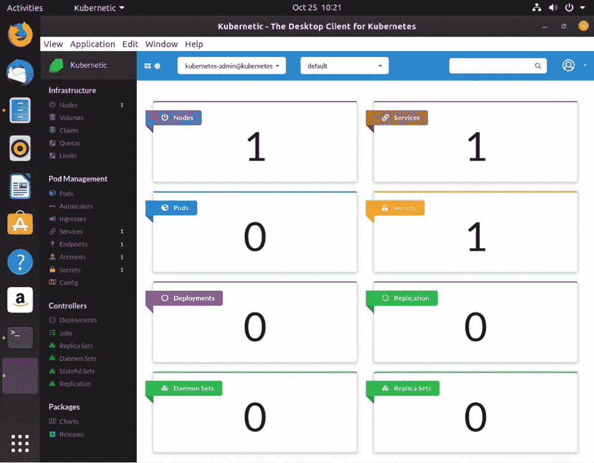

# 在 Ubuntu Linux 19.10 上安装 Kubernetic 桌面 GUI

> 原文：<https://thenewstack.io/install-the-kubernetic-desktop-gui-on-ubuntu-linux-19-10/>

如果您正在努力攀登 Kubernetes ninja 阶梯，您可能渴望一个可靠的桌面客户端来帮助您更高效地使用 container orchestrator。尽管任何希望将容器作为日常工作一部分的人都应该掌握命令行任务，但有时一个好的 GUI 会大大减轻部署、部署、部署的压力。

但是你用什么 GUI 呢？对许多人来说，这个问题止于基于网络的客户端。但是，如果您想在本地集中精力开发和测试您的容器，该怎么办呢？为此，您可能想走桌面客户端路线。幸运的是，有一个出色的工具可以承担这项任务: [Kubernetic](https://kubernetic.com/) 。

Kubernetic 为您提供了一个设计良好的单一窗口，允许您:

*   查看所有集群对象和依赖关系
*   对您的对象进行快速健康检查
*   快速扩展您的应用
*   获取集群的实时更新
*   追踪问题
*   指向并点击您的方式通过集群管理
*   自动保持 Kubernetic 和 kubctl 同步
*   管理您的命名空间

我想带你看一下在最新发布的 Ubuntu Desktop 19.10 上安装 Kubernetic 的过程。

## 你需要什么

首先，你需要在桌面上运行 Kubernetes，同时也运行 Kubernetic。为什么？两个原因:

*   Kubernetic 是一个 GUI 工具。
*   Kubernetic 不具备连接远程主机的能力。

要在你的 Ubuntu 桌面上安装 Kubernetes，给[看一下如何用 Ubuntu Server 18.04](https://thenewstack.io/how-to-deploy-a-kubernetes-cluster-with-ubuntu-server-18-04/) 部署 Kubernetes 集群(因为这个过程也可以成功应用到桌面上)。

你还需要一个拥有 **sudo** 权限的用户账户。

### 安装依赖项

因为我们是在 Ubuntu 19.10 上安装，所以在 Kubernetic 运行之前，需要安装一些依赖项。为此，在桌面上打开一个终端窗口，发出命令:

```
sudo apt-get install libgconf-2-4  libgtk2.0-0

```

一旦安装了这些依赖项，您就可以继续了。

### 获得 Kubernetic

我们将安装 Kubernetic 的免费版本(用于测试目的)。如果你最终使用 Kubernetic，你可以为€30(约 33 美元)购买 1 个座位的许可证，或为€300(344 美元)购买 15 个座位的许可证。无论使用哪个版本，都可以获得无限的集群和无限的名称空间。

使用命令下载 Kubernetics for Linux:

```
wget https://kubernetic.s3.amazonaws.com/Kubernetic-2.4.1.tar.gz

```

注:请务必访问 Kubernetic[网站，确保您下载的是最新版本。](https://kubernetic.com)

文件下载完成后，使用命令:
解压文件

```
tar xvzf Kubernetic-2.4.1.tar.gz

```

上面的命令将创建一个名为 Kubernetic-2.4.1 的新目录。使用命令重命名该目录:

```
mv Kubernetic-2.4.1  kubernetic

```

## 运行 Kubernetic

因为这是一个电子应用程序(它需要新重命名的目录中的所有依赖项)，所以不能简单地在桌面或面板上创建一个启动器。这意味着你有两个选择:

*   每次都从命令行运行 Kubernetic。
*   将文件夹复制到桌面，并从该文件夹中启动可执行文件。

我将向您展示如何做到这两点。如果您想从命令行启动 Kubernetic，命令是:

```
cd kubernetic
./kubernetic

```

如您所见，您必须在包含的文件夹中运行 *kubernetic* 可执行文件。这并不意味着您必须每次都转换到那个目录。假设您的 kubernetic 目录位于您的主目录中。你可以用命令
启动这个应用程序

但是如果您不想通过命令行运行它呢？使用命令将 kubernetic 文件夹移动到桌面:

移动完成后，打开文件管理器并导航到 kubernetic 文件夹。双击 kubernetic 可执行文件(**图 1** )，应用程序将启动。


图 Kubernetic 可执行文件。

Kubernetic 应用程序将启动，并自动检测到 Kubernetes 正在运行(**图 2** )。



图 Kubernetes 主窗口。

如您所见，我只有一个节点在运行。在 Kubernetes 中，您不能加入节点，所以(如果您想将更多的节点添加到您的集群中)您必须遵循在每个节点上运行以下命令的常规任务:

```
sudo kubeadm join MASTERIP:6443  --token TOKEN  --discovery-token-ca-cert-hash TOKENHASH

```

其中 MASTERIP 是您的 Kubernetes 主服务器(运行 Kubernetic 的机器)的 IP 地址，TOKEN 是加入令牌，TOKENHASH 是发现令牌哈希。当您初始初始化您的主机时，将显示上述命令(包括所有正确的信息)。您只需在要加入集群的每个节点的终端中复制/粘贴该命令。一旦你添加了更多的节点，它们就会出现在 Kubernetic 中。

但是，您可以:

*   创建数量、索赔、配额和限额
*   创建窗格和自动缩放
*   创建部署、作业、副本集、守护进程集

以上所有操作都可以通过点击动作来完成。例如，要创建一个新的 Pod，单击 Pod(在左侧导航中)，然后单击 Create ( **图 3** )。


图 3:创建一个新的 Pod。

在出现的窗口(**图 4** )中，填写 pod 的名称(小写)和用于 pod 的图像。


图 4:用 Kubernetic 创建一个新的 pod。

填写完必要的信息后，单击 Create，pod 就准备好了。

您可以对部署、作业等进行同样的操作。一旦您的 pod 被创建，它们将被列在 Kubernetic 仪表板中(**图 5** )。


图 Kubernetic 仪表板显示了我们的新 pod 和部署。

这就是为 Kubernetes 安装和使用 Kubernetic 桌面客户端的要点。使用这个工具，继续你成为 Kubernetes 忍者的追求。

<svg xmlns:xlink="http://www.w3.org/1999/xlink" viewBox="0 0 68 31" version="1.1"><title>Group</title> <desc>Created with Sketch.</desc></svg>