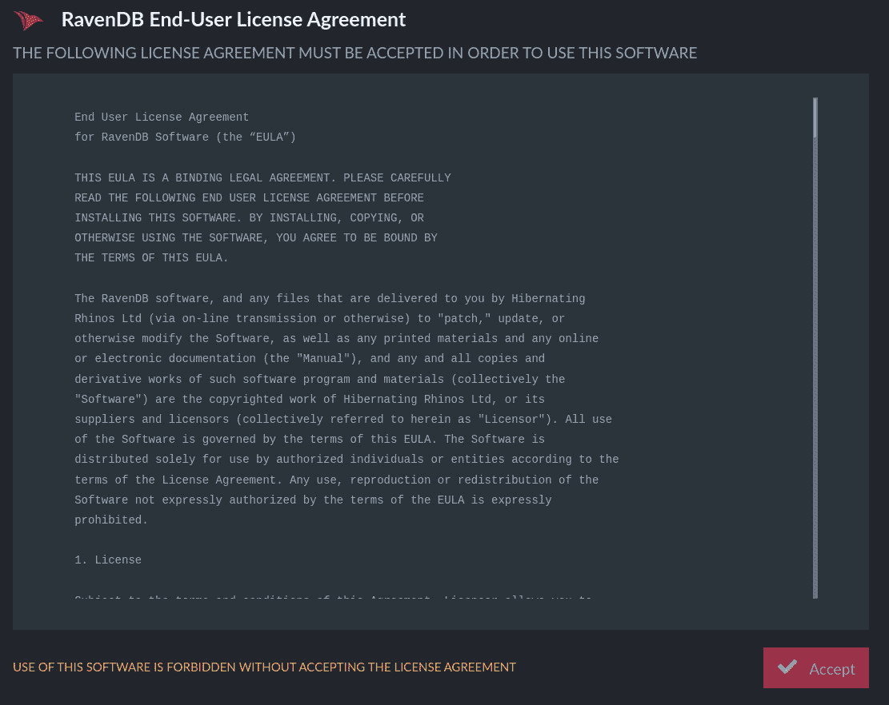
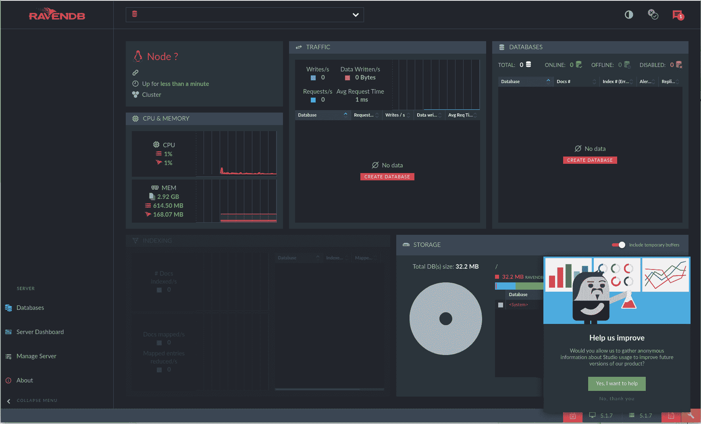
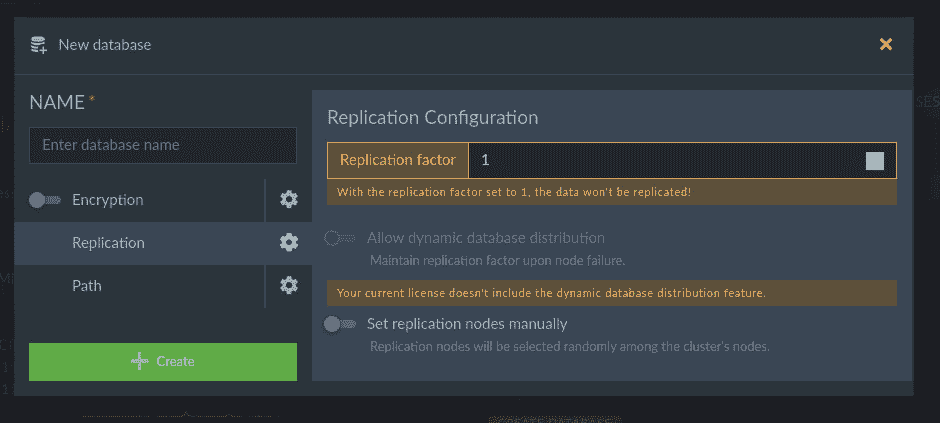

# 安装 NoSQL RavenDB 数据系统

> 原文：<https://thenewstack.io/install-the-nosql-ravendb-data-system/>

原生云、容器、移动、大数据和 web 开发人员通常依赖数据库来扩展其应用程序的功能。在这种情况下，他们很可能会求助于 NoSQL 的数据库。NoSQL 系统非常适合需要速度、敏捷性和可扩展性的工作负载。

有许多可用的 NoSQL 数据库，其中之一是 RavenDB。RavenDB 是为。NET 平台，并提供了大量的特性来吸引所有类型应用程序的开发人员:

*   支持多个数据库
*   分片
*   高级查询语言
*   高可用性
*   缩放比例
*   可以处理多文档事务

我将带你完成在 Ubuntu Server 20.04 上安装和运行 RavenDB 的过程。

你唯一需要的是一个运行中的 Ubuntu Server 20.04 实例(可以是本地的，也可以通过云托管服务，比如 AWS、Azure、Google Cloud、Linode 或 Rackspace)和一个拥有`sudo`权限的用户。

一旦您获得了这些项目，您就可以开始安装了。

## 安装 RavenDB 依赖项

RavenDB 是微软的产品，这意味着你不会在标准的存储库中找到该软件。甚至 RavenDB 的一个依赖项在标准的 repos 中也找不到。所以在我们安装 RavenDB 包之前，我们首先需要下载一个安装程序，它将为依赖项添加必要的 MS 存储库。一旦添加了存储库，您就可以打包所需的包。

登录到您的 Ubuntu 服务器实例，使用以下命令下载`.deb`文件(用于安装存储库):

`wget https://packages.microsoft.com/config/ubuntu/20.04/packages-microsoft-prod.deb -O packages-microsoft-prod.deb`

使用以下命令安装软件包:

`sudo dpkg -i *.deb`

添加存储库后，使用以下命令更新 apt:

`sudo apt-get update`

apt 更新后，使用以下命令安装必要的 RavenDB 依赖项:

`sudo apt-get install apt-transport-https aspnetcore-runtime-3.1 -y`

## 安装和配置 RavenDB

接下来，我们需要使用以下命令下载所需的 RavenDB 文件:

`wget -O ravendb.tar.bz2 https://hibernatingrhinos.com/downloads/RavenDB%20for%20Linux%20x64/latest`

使用以下命令解压文件:

`tar xvjf ravendb.tar.bz2`

您可以将新创建的 RavenDB 目录保留在原来的位置，也可以将其移动到另一个位置。对于本教程，我们将把它留在原处。

使用以下命令打开 RavenDB 配置文件:

`nano ~/RavenDB/Servers/settings.json`

如果您的 RavenDB 目录不是您的主目录，请确保相应地编辑上面的路径。

在该文件中，更改 ServerURL 行以匹配您的托管服务器的 IP 地址。该文件应该如下所示:

```
{
"ServerUrl":  "http://SERVER:8080",
"Setup.Mode":  "Initial",
"DataDir":  "RavenData",
"Security.UnsecuredAccessAllowed":  "PrivateNetwork"
}

```

其中 SERVER 是您的托管服务器的 IP 地址。请注意，我们将使 RavenDB 能够在私有网络上使用，而无需证书。如果您将在公共网络上使用 RavenDB，那么配置文件应该是这样的:

```
{
"ServerUrl":  "http://PRIVATE:443",
"Setup.Mode":  "Initial",
"DataDir":  "RavenData",
"PublicServerUrl":  "PUBLIC",
"Security.UnsecuredAccessAllowed":  "PrivateNetwork"
}

```

其中 PRIVATE 是您的服务器的私有 IP 地址，PUBLIC 是您的云实例的公共 DNS URL。

保存并关闭文件。

接下来，我们必须为 RavenDB 创建一个 systemd 文件。使用以下命令创建一个新文件:

`sudo nano /etc/systemd/system/ravendb.service`

在该文件中，粘贴以下内容:

```
[Unit]
Description=RavenDB v4.0
After=network.target

[Service]
LimitCORE=infinity
LimitNOFILE=65536
LimitRSS=infinity
LimitAS=infinity
User=USER
Restart=on-failure
Type=simple
ExecStart=/PATH/TO/RavenDB/run.sh

[Install]
WantedBy=multi-user.target

```

其中/PATH/TO 是 RavenDB 文件夹的路径，USER 是将启动 RavenDB 进程的用户(比如 root)。

保存并关闭文件。使用以下命令重新加载 systemd 守护程序:

`sudo systemctl daemon-reload`

使用以下命令启动并启用 RavenDB:

`sudo systemctl start ravendb`

`sudo systemctl enable ravendb`

## 访问 RavenDB Web 界面

打开一个网络浏览器，指向`http://SERVER:8080`(其中服务器是主机服务器的 IP 地址或域)。你应该受到乌鸦 EULA 的欢迎。阅读或滚动许可证，然后单击接受。

在出现的窗口中(如下图 1 所示)，将提示您通过生成一个加密证书或上传您自己的证书来保护您的实例。你也可以选择不安全的路线。



图 RavenDB 安装向导首页。

我强烈建议您走安全路线，要么生成一个新证书，要么提供您自己的证书。但是，如果您目前只是在尝试使用 RavenDB，那么可以点击 UNSECURE，立即开始使用该平台。你也可以通过点击选择主题(右上角)来改变 RavenDB。我倾向于选择轻松的主题，所以我会选择轻松的主题。

根据您选择的路线(安全或不安全)，您的设置会有所不同。我选择了不安全的路线(因为我只是出于测试目的使用它)，所以下一步是输入默认端口和 IP 地址。因为我们当前使用端口 8080 进行设置，所以您不能使用它作为 HTTP 端口，所以使用 8081。填写其余信息(使用默认 TCP 端口和托管服务器的 IP 地址，然后单击 Next。

在最后一个窗口中，您需要重新启动 RavenDB 服务器，因此单击 Restart server。在你点击重启按钮后，你会立即看到一个错误页面。等待服务器重新启动，然后单击浏览器上的 refresh，您应该会看到 RavenDB 仪表板(图 2)，在这里您可以开始使用这个 NoSQL 数据库服务器。



图 RavenDB 仪表板已经准备就绪。

此时，您可以单击 CREATE DATABASE 来创建您的第一个 RavenDB 数据库。为数据库命名(图 3)，选择任何必要的选项，然后单击 Create。



图 3:创建您的第一个 RavenDB 数据库。

祝贺您，RavenDB 已经启动并运行，您已经创建了您的第一个数据库。您现在可以开始用数据填充该数据库，然后将其用于您的移动、web 或云应用程序。

<svg xmlns:xlink="http://www.w3.org/1999/xlink" viewBox="0 0 68 31" version="1.1"><title>Group</title> <desc>Created with Sketch.</desc></svg>