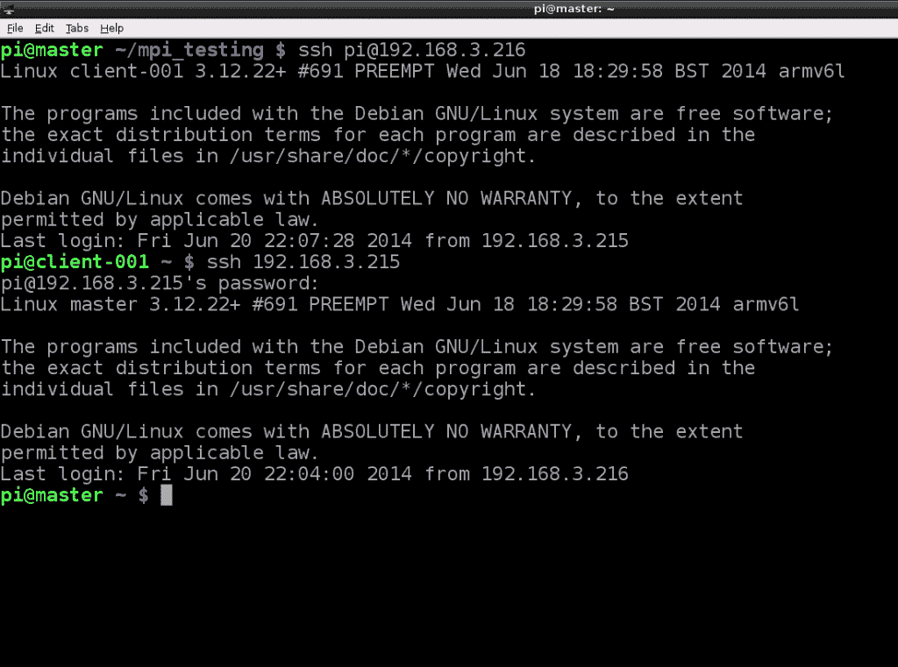
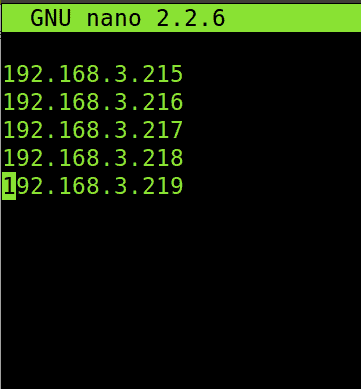
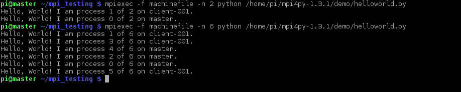
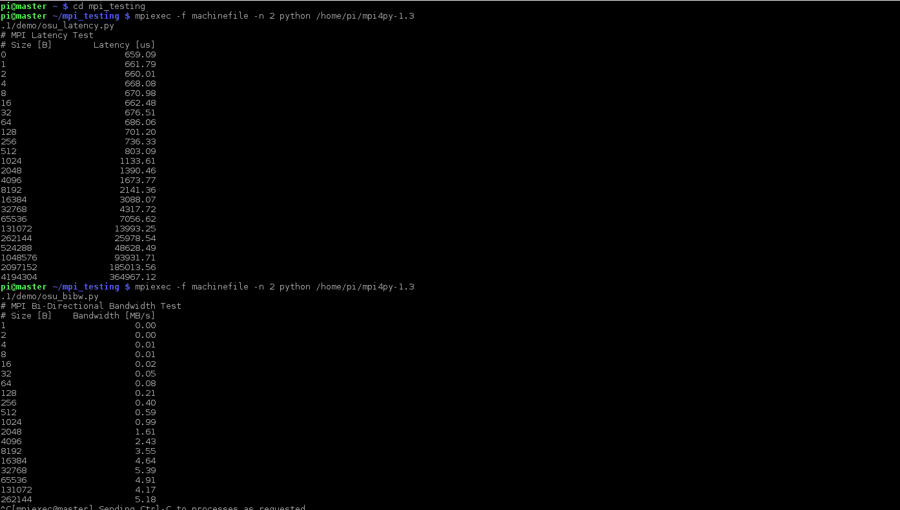
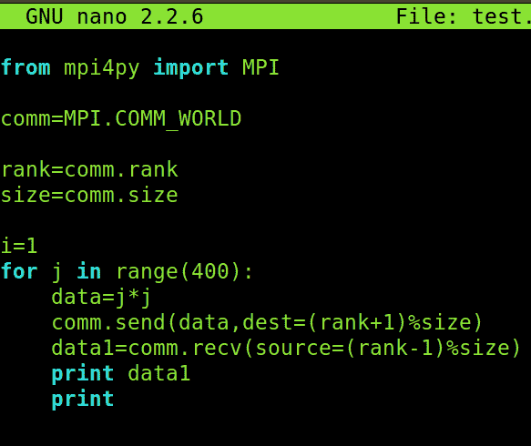

# 在 Raspberry Pi 集群上安装 MPI for Python

> 原文：<https://thenewstack.io/installing-mpi-python-raspberry-pi-cluster-runs-docker/>

我们为非洲的一个项目建立了一个运行五台 Raspberry Pi 的计算集群。这些机器依靠太阳能运行，支持 2000 到 10，000 个并发连接。集群也运行 Docker。

然后，我们希望允许 Python 程序利用集群的多个处理器来执行各种任务。为此，我们需要为 Python 安装消息传递接口(MPI ),它为 Python 编程语言提供了 MPI 标准的绑定。

本文描述了如何安装和测试 Python 的 MPI，并假设 Raspberry Pi 集群运行的是最新的 [Raspbian](http://www.raspbian.org/ "Raspbian Home Page") 操作系统。 [MPICH2](http://www.mpich.org/ "MPICH2 Home Page") 接口也应安装并运行。

MPI for Python 软件需要在每个集群节点上单独加载，因此需要能够使用安全外壳(SSH)登录。如果您已经知道如何使用 SSH，您可以跳过下一节，直接进入 Python 的 MPI 安装和测试说明。让我们看看如何使用 SSH。

## **使用 SSH**

[SSH](http://www.openssh.com/ "SSH Home Page") 代表安全外壳，是一种加密的远程登录协议。一旦在每个节点上设置好，就可以用来与网络上的其他节点进行通信。

SSH 的主要优点是:

*   SSH 使用 RSA 加密算法来生成公钥和私钥，使得入侵变得极其困难。

*   因为 SSH 是一个远程登录协议，所以它可以在笔记本电脑上配置，允许连接到 raspberry pi 集群，甚至通过 WiFi。

*   SCP(安全拷贝)和 SFTP(安全文件传输协议)运行在 SSH 之上，允许您将文件和目录从一个节点直接传输到另一个节点。

*   SSH 支持一次性登录。这意味着您只需在首次登录时输入凭据。从第二次登录开始，您直接进入 shell。

要从主节点登录到另一个节点，请使用以下命令。

*ssh*[*pi @ 192 . 168 . 3 . 216*](mailto:pi@192.168.3.216)(将 IP 地址替换为您的一个工作节点地址)

输入您的密码。登录后，您键入的所有命令都将在该节点上运行，而不是在主节点上运行。

SSH 还可以用于直接在其他节点上运行命令。例如，要更改三个节点上的主机名，请使用以下命令:

*ssh pi @ 192 . 168 . 3 . 216 ' sudo echo " cilent 001 "| sudo nano/etc/hostname
ssh pi @ 192 . 168 . 3 . 217 ' sudo echo " cilent 002 "| sudo nano/etc/hostname
ssh pi @ 192 . 168 . 3 . 218 ' sudo echo " cilent 003 "| sudo nano/etc/hostname*

这是另一个例子。

*ssh pi @ 192 . 168 . 3 . 216‘sudo power off’*

此命令安全地关闭 IP 地址为 192.168.3.216 的节点。

下图显示了如何使用 SSH 登录到工作节点(192.168.3.216 ),并从工作节点将控制终端返回到主节点。

正如您在上图中看到的，登录到一个 worker 节点是直接发生的。但是每次终端的控制权回到主节点(192.168.3.215)时，必须重新输入登录凭证。

因此，在通过 SSH 向其他节点发出命令之后，可能会出现必须通过 SSH 向多个节点发送数据的情况。如果节点数量很少，那么我们可以手动登录到每个节点，将其连接到显示器和键盘，并发送文件。当集群的规模很大时，这是一种非常低效的方法。

简单的方法是使用 SCP 发送文件。使用以下命令安装 SCP。

*sudo apt-get 安装 scp*

该命令的一般形式如下:

scp(本地设备上文件的路径)pi@192.168.3.215(远程位置的路径)

看一下这个例子。

*scp/pi/example . c pi @ 192 . 168 . 3 . 215/pi/project*

在这里，文件使用其 IP 地址发送到远程设备。可以使用递归选项(-R)发送目录中的许多文件，如下所示。

*scp-R/pi/project pi @ 192 . 168 . 3 . 216/pi/project*

该命令将/pi/project 目录中的所有文件从本地主机递归地传输到远程主机上的目录，该目录由 IP 地址标识。

随着使用 SSH 的远程登录的结束，我们现在可以将注意力转向在集群上安装 MPI for Python。

## **为 Python 安装 MPI**

为 Python 加载 MPI 的传统方法(称为 mpi4py)将不起作用。它通常用下面的命令行安装。

*sudo apt-get 安装 python-mpi4py*

这种方法在执行时会崩溃，因为它安装了 openMPI 的副本，这与已经安装的 MPICH2 软件相冲突。MPICH2 系统设计为仅运行一个接口，当启动多个实例时，整个集群都会失败。

为了避免这种严重的情况和将操作系统恢复到以前状态的繁琐任务，有一个变通办法。在集群中的每个节点上手动构建 mpi4py 是一件相对简单的事情。

以下是步骤。

1)下载 mpi4py 包。

*curl–k–O**https://mpi4py.googlecode.com/files/mpi4py-1.3.1.tar.gz*

你可以用 wget 代替 curl，但是我找不到一个选项可以绕过网站维护团队还没有解决的证书问题。

2)将其解包，然后转到 mpi 目录。

*塔尔–zxf mpi4py-1.3.1.tar.gz*

【mpi4py-1.3.1.tar.gz CD

3)在开始构建之前，确保所有 Python 开发工具都可用是很重要的。这确保了存在许多重要的头文件，如 Python.h，并且可以被构建函数使用。

如果已经安装了 python 开发工具，可以跳过这一步。

*sudo apt-get 更新-修复-缺失*

*sudo apt-get 安装 python-dev*

4)现在，构建包。

*CD mpi4py-1.3.1.tar.gz*

*sudo python setup . py build–mpicc =/usr/local/mpich 2/bin/mpicc*

这里需要注意一些事情:

*   选项–mpicc 用于为构建文件提供 MPI 编译器的位置。

*   只有当编译器的位置不在系统路径中时，才必须使用选项–mpicc。

*   路径/usr/local/mpich2/bin/mpicc 是我的节点上构建 mpich2 的位置。它可能对每个人都不一样，因此必须替换为路径，即 mpicc 在该系统中的位置。

现在我们可以开始构建了。将工作目录更改为 mpi4py:

*cd mpi4py*

接下来，运行以下命令

*sudo python setup.py 安装*

命令完成后，在集群中的每个其他节点上重复该过程。然后，可以运行演示程序 helloworld.py 来测试 mpi4py 是否成功安装在所有节点上并正确运行。

在命令行执行以下命令。

*python helloworld.py*

如果集群的节点尚未构建，那么更简单的方法是在一个节点上执行上述过程，读取操作系统的整个映像，并将其写入其他每个节点的 SD 卡中。这将消除在每个节点上单独构建 mpi4py 包。

## **测试 mpi4py 并使用 Python 程序运行 MPI**

我们刚刚完成了 mpi4py 的构建，这样我们就可以使用 MPICH 编写和运行 Python 程序了。我们需要测试 mpi4py，确保一切正常。

您应该有一个名为 machinefile 的文件(下面的示例截图),它存储了网络中所有节点的 IP 地址。MPICH 将使用它在各个节点之间进行通信和发送/接收消息。

在提取的目录 mpi4py 中，还有一个名为 demo 的目录。demo 目录中有各种 Python 程序，可以运行这些程序来测试 mpi4py。

一个好的基本测试程序是 helloworld.py。运行它的过程是:

*cd ~/mpi4py/demo*

*mpiexec–np4–machine file ~/mpitest/machine file python hello world . py*

输出应该类似于下面的屏幕截图。

如果输出看起来与上面类似，并且所有的节点都被包括在内，那么它就工作了。

注意~/mpi4py/demo 是我系统上 mpi4py 的路径，应该替换为您用户名下的路径。这同样适用于机器文件的路径。

演示目录中还有其他程序也可以使用。

俄亥俄州立大学已经创建了一些基准程序。

*   OSU _ bw . py–这个程序计算带宽。主节点向其他节点发送一系列固定大小的消息，接收者只有在收到所有消息后才发送回复。因此，主节点根据经过的时间和用户发送的字节来计算带宽。

*   OSU _ bibw . py——这个程序与上面的类似，除了两个节点都参与发送和接收一系列消息。

*   OSU _ latency . py——这个程序向各个节点发送消息，并等待回复。这重复多次，然后计算等待时间。

演示目录中的许多其他程序也可以用于测试。所有这些都可以以类似于 helloworld.py 程序的方式运行。

下面的屏幕截图显示了 osu_latency.py 程序的输出。

一旦测试完成，就可以使用 Python 编写与 MPI 兼容的程序。集群中的所有节点应该运行相同的程序，并且根据条件，只执行程序的一部分，从而允许并行执行。

这也意味着我们可以写两个不同的程序，在不同的节点上给它取相同的名字。您可以使用这种技术创建一个服务器程序，并将其存储在主节点上。然后，您可以编写一个客户端程序，并以相同的名称将其存储在 worker 节点上。

下面的屏幕截图显示了一个示例 MPI 程序。

该文件是一个通信器应用程序，它包含几个方法并收集一些进程信息。我称之为 MPI。COMM_WORLD 其特征包括以下内容。

*   comm . rank——它给出在该处理器或节点上运行的进程的等级。

*   comm . size–它提供集群中节点的数量

*   comm . get _ processor _ name()–它给出了运行特定进程的处理器的名称。

*   com . send()–用于向 dest 参数指示的节点发送数据。

*   comm . receive()–用于从源节点接收一些数据，这些数据是从 source 参数指示的节点接收的。

这些是创建符合 MPI 的 Python 程序的基本函数，还有许多其他函数可用。

请注意，如果存在边缘条件，并且进程的数量超过了节点的数量，那么程序的执行将会失败。为了避免这种情况，可以使用%size 操作给进程一个循环，如上面的屏幕截图所示。然后，该进程将返回到第一个处理器来执行该任务。

## **接下来的步骤**

我们快速浏览了如何使用 SSH、为 Python 安装 MPI，以及如何测试完成的安装。这个集群可以做更多的事情，包括添加更多的节点。试试吧，一定要在评论里分享你的经历。

<svg xmlns:xlink="http://www.w3.org/1999/xlink" viewBox="0 0 68 31" version="1.1"><title>Group</title> <desc>Created with Sketch.</desc></svg>