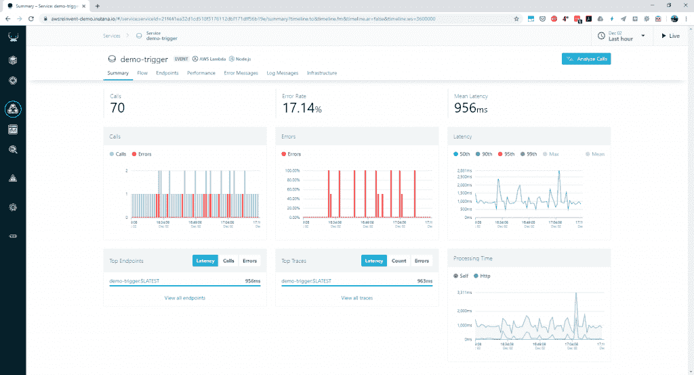

# Instana APM 增加了自动 AWS Lambda 跟踪

> 原文：<https://thenewstack.io/instana-apm-adds-automated-aws-lambda-tracing/>

本周在 [AWS Re:Invent](https://reinvent.awsevents.com/) 上，微服务和云原生应用提供商 [Instana](https://www.instana.com/) 的应用性能管理(APM)推出了跟踪在 [AWS Lambda](https://aws.amazon.com/lambda/) 上运行的无服务器 Node.js 函数的能力，而无需使用 [AWS X 射线](https://aws.amazon.com/xray/)。虽然 X 射线确实提供了同样的能力，但 Instana 在一篇博客文章中指出，它不仅带来了额外的每跟踪成本，而且无法支持混合环境，此外还“将您留在 AWS 的围墙花园中”

根据 Instana 收入营销总监 Chris Farrell 的说法，Instana 的工作方式与其他 APM 工具略有不同，它使用“单代理模型”，其中独立的代理从多个“传感器”收集数据，这比典型的代理更轻量级。该模型允许自动部署，而不是要求开发人员回头修改预先存在的代码来添加工具。Farrell 认为这是 Instana 的 Lambda 跟踪功能的一大优势。

“我们的 Node.js 工具已经存在，不需要修改代码，我们已经找到了一种在 Lambda 环境中部署它的方法，允许它以相同的方式运行，而不是要求开发人员编写一个中间人或 API 来吸引我们。Farrell 在接受新堆栈的采访时表示:“我们实际上能够使用相同的、无需代码、无需修改的工具，并将其应用于 Lambda 函数。“其他工具所做的是，要么提前注入 API，要么预先编写代码。我们对我们的工具所做的就是允许它与由 AWS Lambda 加载的 Node.js 代码一起动态加载，这样我们就可以像往常一样获取数据。”

这项新功能是 Instana 的 [AutoTrace 功能](https://www.instana.com/supported-technologies/instana-autotrace/)的扩展，为 Node.js 10.x 或更高版本中编写的 AWS Lambda 函数以及所有[支持的](https://docs.instana.io/ecosystem/node-js/) Node.js 库和框架提供自动化的本地跟踪，同时支持对其他编程语言、平台和部署的跟踪。Farrell 指出，跟踪需要能够超越 AWS 上的代码，为团队提供他们需要的所有信息。

“跟踪的想法是能够创建与特定请求相关联的端到端连接范围。该请求可能是最终用户登录到特定网站，也可能是设备或其他应用程序在启动时发出的前端请求，”Farrell 说。“关键是，当你进入微服务应用的世界时，能够在服务到服务、容器到容器的过程中，通过工具的 it 用户实际进入并查看时可能存在或不存在的东西，实际跟踪特定的请求。”

通过 Lambda 跟踪，Instana 现在提供了“Lambda Function Overview Dashboards ”,显示函数名称、函数版本、AWS 区域、相互依赖性和其他 Lambda 运行时指标，以及其他性能信息，如 CloudWatch 提供的信息。

要获得新功能的第一手信息，请访问 AWS Re:Invent 的 511 号展位 Instana。

<svg xmlns:xlink="http://www.w3.org/1999/xlink" viewBox="0 0 68 31" version="1.1"><title>Group</title> <desc>Created with Sketch.</desc></svg>