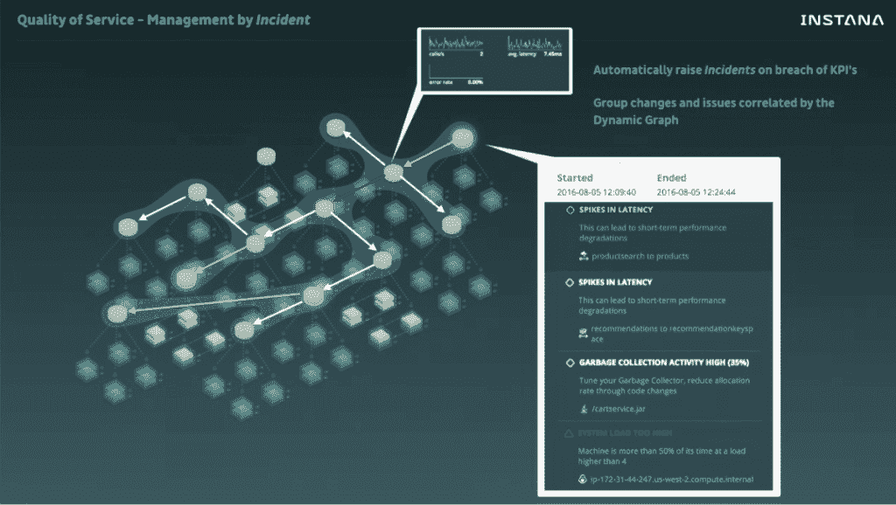
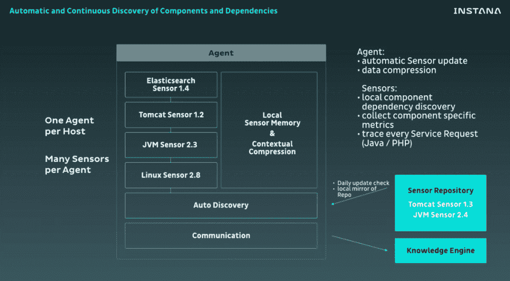
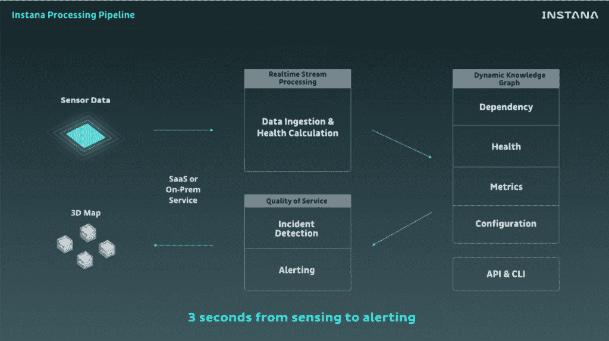

# Instana 将微服务监控提升到服务水平

> 原文：<https://thenewstack.io/instana-brings-microservices-monitoring-service-level/>

基础设施和应用[监控](https://thenewstack.io/qa-james-turnbull-art-monitoring-age-microservices/)的挑战已经成为[微服务](/category/microservices/)时代的共同主题。

德国初创公司 [Instana](https://www.instana.com/) 对微服务监控的[挑战采取了整体观点，结合了服务器级、应用层和网络层的观点。最终，管理员应该真正关心的是服务质量。](https://thenewstack.io/meet-zipkin-tracer-debugging-microservices/)

Instana 首席运营官 [Pete Abrams](https://www.linkedin.com/in/peteabrams) 表示:“我们相信，市场需要一种生产监控工具，它能够发现整个应用程序结构(不仅仅是各个部分，还包括要监控的服务)，并自动跟上不断发生的所有变化，识别任何层的所有问题，并将问题与服务质量相关联，从而让您真正了解真正的问题在哪里，并高效地解决问题。”。

根据 Instana 产品营销经理 Enrico Bruschini 的说法，即使是最近的监控工具也专注于“用一堆时间表填充一个巨大的屏幕”。“然后这个可怜的家伙盯着屏幕试图找到(问题)。”

对于微服务环境中生成的大量数据来说，这不再适用。Instana 增加了机器学习和人工智能来辨别数据的意义。

## 发现、理解、调查

Instana 使用安装在每台主机上的代理来本地发现基础架构及其依赖项。它以一秒钟为增量收集数据，然后使用这些数据来构建所有组件的 3d 模型，它称之为[动态图](https://www.instana.com/blog/monitoring-microservice-applications-introducing-dynamic-graph/)，以建立一个健康的基础架构应该是什么样子。

“因为我们可以了解应用服务质量，所以我们可以看到所有请求是如何在整个基础设施中运行的，”Abrams 说。您甚至可以深入查看代码在给定情况下的表现。

它基本上是一个后端数据流引擎，在其上构建了机器智能。从它收集数据、处理数据并呈现给用户的那一刻起，有三秒钟的响应时间。“这是完全连续和有效的实时，”他说。

Instana 从谷歌那里得到启示，使用标准化的关键性能指标(KPI)模型来确定系统的健康状况。对于每个服务，它计算负载、延迟、错误率、饱和度和实例数量。当任何 KPI 发生重大变化时，都是服务质量问题，会触发事件警报。当触发一个事件时，它会收集与所有相关更改相关的所有数据。

“不需要手动收集数据、构建仪表板和尝试可视化关联数据——一切都在那里，随时可用，”Bruschini 说。

它的[时移](http://t.sidekickopen65.com/e1t/c/5/f18dQhb0S7lC8dDMPbW2n0x6l2B9nMJN7t5XX4QBs98W4WzxYv2zWKdKW4Wzrfn56dSmXf7flTrg02?t=https%3A%2F%2Fwww.instana.com%2Fblog%2Fintroducing-timeshift-application-monitoring%2F&si=4885718672605184&pi=d45ad250-bf01-4bed-aa3a-0ad267395203)功能可以让你回到过去，详细调查甚至复杂的情况。

“如果您想回去查看服务请求的问题，如果您进行抽样，如果您查看 10%或 20%的请求，很可能您没有找到您想要的。…因此，我们开发了一种方法来跟踪应用程序中运行的每一个调用，以便您可以及时返回并准确找出发生了什么。从痕迹中你可以直接看到代码。

Instana 支持 30 多种技术，包括 Docker、Mesos、Kubernetes、Cassandra、Elasticsearch 等等。

## 斯坦，人工智能助手

为了帮助用户，该公司推出了虚拟助理[斯坦](https://www.instana.com/blog/introducing-stan-virtual-devops-expert/)，这是一个永远不会停止学习你的环境的人工智能机器人，可以洞察问题并提出建议。

基于大多数应用性能管理(APM)工具需要高度合格的专家来理解这些工具生成的数据这一理念，该公司建立了 Stan 来帮助筛选数千台服务器上的数百项指标，指导您找到确切的问题并建议采取适当的行动。

艾布拉姆斯说:“我们尽量不要在这个问题上表现得像 T4 一样乖巧。”但他补充道，斯坦为这项任务带来了独特的能力。

Stan 使用传统的 LAMP (Linux、Apache、MySQL 和 PHP/Python/Perl)栈和三层 Java/RDBMS 架构，以及包括 Spark、 [Akka](http://akka.io/) 和 Kafka 在内的新架构。

## 新的 APM

Instana 是德国 IT 咨询公司 Codecentric 的子公司，成立于 2015 年 4 月。它最近在加州圣马特奥开设了业务总部，但仍将工程总部设在德国索林根。

客户包括博彩行业的软件平台 Booxware、云文档管理系统 [CenterDevice](https://www.centerdevice.de/en/) 、汽车共享服务 [DriveNow](https://en.wikipedia.org/wiki/DriveNow) 和 [Enevo](http://www.enevo.com/) ，后者使用传感器来优化垃圾收集路线。

它在 6 月份筹集了 600 万美元的首轮融资，由风险投资公司 Target Partners 牵头。

[Target Partners](http://www.targetpartners.de/) 的合伙人[贝特霍尔德·冯·弗雷伯格](http://www.targetpartners.de/en/people/dr-berthold-von-freyberg/)表示:“Instana 团队对应用性能监控需求的理解以及他们对行业发展方向的愿景一直给我们留下深刻印象。

根据 Gartner 的数据，IT 绩效管理市场价值 26 亿美元，每年增长 15.8%，并且随着包括 [Sysdig](https://thenewstack.io/five-principles-monitoring-microservices/) 、 [SignalFX](https://thenewstack.io/modern-data-is-analytics-problem/) 、Sensu、 [Nagios](https://www.nagios.org/) 在内的许多新进入者的加入而升温。

来自 Instana 的图像。

<svg xmlns:xlink="http://www.w3.org/1999/xlink" viewBox="0 0 68 31" version="1.1"><title>Group</title> <desc>Created with Sketch.</desc></svg>