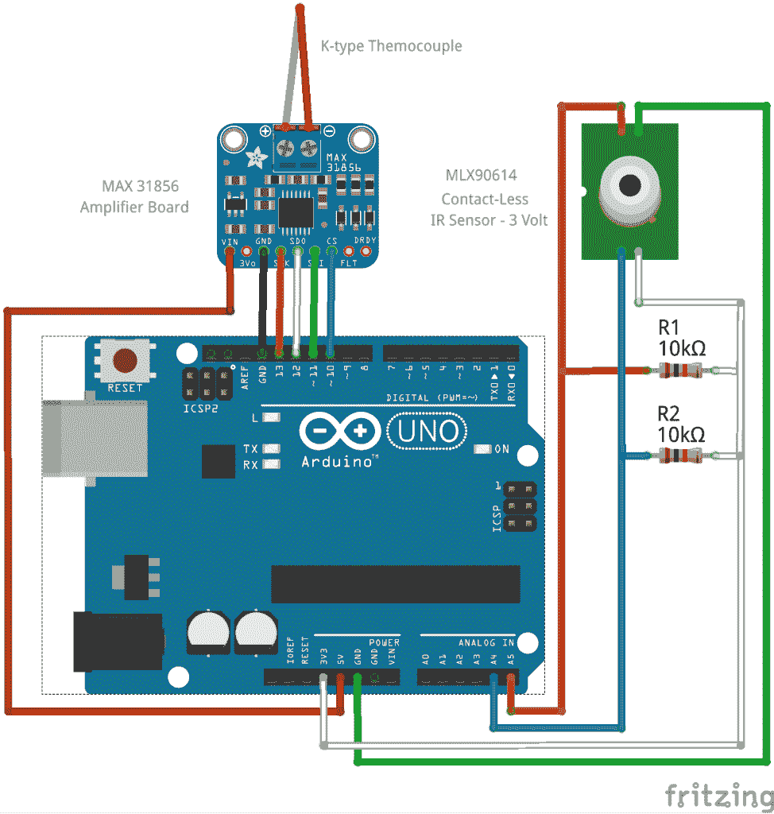
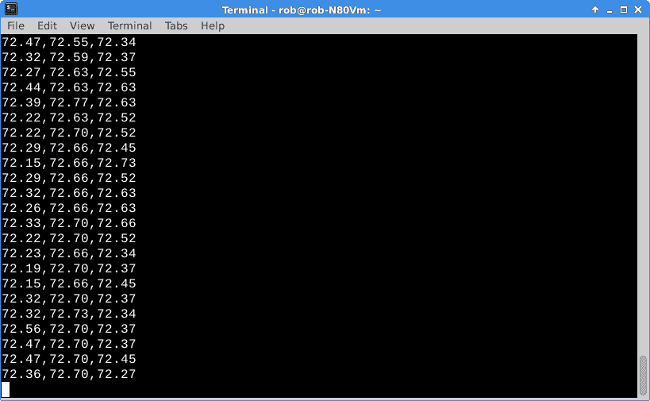

# 现成的黑客:为工作选择正确的数据总线

> 原文：<https://thenewstack.io/instrumenting-pancakebot-phase/>

在过去的周末，我更接近于为 [PancakeBot](http://www.pancakebot.com/) 添加仪器，这是一台定制的煎饼打印机，New Stack 偶尔会在我们的煎饼播客系列中推出。[老读者可能还记得](https://thenewstack.io/avoid-burning-christmas-turkey-thermocouples/)，我讲述了如何将热电偶及其相关放大器连接到 [Arduino Duemilanove](https://www.arduino.cc/en/Main/ArduinoBoardDuemilanove) 以读取温度并将结果数据推送到 Linux 笔记本上。

本周，我们将着眼于将 [MLX90614 红外非接触式温度传感器](https://www.adafruit.com/product/1748)集成到组合中。

MLX90614 实际上有两个版本，一个是 5 伏的，一个是 3.3 伏的。几年前，当“包装”传感器开始出现在 DIY/Maker 社区时，它们通常在 5 伏电压下工作，无论是逻辑电平还是电源。Arduinos 和其他微控制器也普遍使用 5 伏电压。随着时间的推移，随着器件尺寸和功耗要求的降低，很多行业已经过渡到 3.3 伏，有时甚至是 1.8 伏。此外，像 ESP8266 这样的芯片使用 3.3 伏的逻辑和电源，所以现在购买 3.3 伏的传感器是标准的。

将红外传感器放在工作台上，让我们看看如何将它与热电偶和 [MAX 31856 通用放大器](https://learn.adafruit.com/adafruit-max31856-thermocouple-amplifier/wiring-and-test)组合一起使用。

我的计划是热电偶将附在热板加热元件上，并直接监控其温度，而 PancakeBot 则完成其烹饪程序。同时，红外传感器将监控热板的表面温度。然后，我们可以尝试将温度数据与物理煎饼印刷进行关联。

记录和分析数据是物理计算堆栈的重要组成部分。我们将看看如何将“实时”数据反馈到煎饼打印过程中。这也是研究热电偶放大器和 I2C(红外传感器)总线在同一项目中实际应用的绝佳机会

## 同时使用 SPI 和 I2C 接口

MAX31856 热电偶放大器模块通过[串行外设接口](https://learn.sparkfun.com/tutorials/serial-peripheral-interface-spi) (SPI)总线输出数据。在[的上一篇专栏文章](https://thenewstack.io/off-shelf-hacker-comms-across-multiple-microcontrollers/)中，我们了解到 SPI 接口通常用于微控制器和外设之间的短距离、高速数据交换。该协议的缺点是，对于添加到总线上的每个设备，都需要一条额外的控制线连接到 GPIO 引脚。如果你连接很多设备，你很快就会用完 GPIO 管脚。

好在 SPI 都是高速的。小[彩色 TFT 液晶显示器](https://www.adafruit.com/product/358)使用 SPI 总线。总线处理大量数据的速度非常快。在我们的例子中，除了热电偶/放大器组合之外，我们还可以在 Arduino 上连接一个 TFT LCD 来显示温度。像这样的便携式设备可能是有用的，也许是未来故事的候选。目前，我们将只坚持在这个项目中使用一个 thermo/amp 设置。

相比之下，MLX 90614 红外温度传感器通过 [I2C 总线](http://www.i2c-bus.org/)发送数据。这种总线处理中等的数据带宽，仅使用两条线(加上电源和地),可以并行容纳 100 多个设备。今天我们将只使用一个来检查。请随意在您的项目中尝试使用几个 I2C 模块。

## 将 SPI 和 I2C 总线连接到 Arduino

在同一个项目中结合 SPI 和 I2C 总线是常见的做法。看一下项目*的 Fritzing 示意图(我用 UNO Fritzing 图标替换了 Duemilanove 部分，它似乎已经从网络上消失了，再也看不到了。没关系。UNO 有一个相同的引脚排列，用于说明目的。)*:



MAX31856、MLX90614 和 Arduino 烧结接线图

布线很简单。MAX 32856 热放大器板需要四个 GPIO 引脚以及电源和接地。MLX 90614 板只需要两个 GPIO 引脚，以及电源和接地。

这两个电阻充当数据线的上拉电阻。您可能还记得，我们总是希望数据引脚上有一个已知的逻辑电平，以确保可预测的输出。将线拉向源电压会得到默认的“高”或“1”值。像 MLX 90614 这样的器件在工作时会将器件拉至“低”或“0”值，这样就可以使用程序代码检测数据线上的变化。如果没有上拉电阻，引脚只会在高电平(逻辑 1)和低电平(逻辑 0)之间浮动，产生随机的傻瓜式输出。

我通过 USB 线给 Duemilanove Arduino 供电。

## SPI 和 I2C 码

读取 SPI 热电偶和 I2C 红外传感器值的代码也很简单。

首先，引入库来处理 SPI 和 I2C 器件的具体操作细节。

接下来，串行通信开始，器件初始化。loop()部分每半秒读取一次每个设备，并将逗号分隔的数据字符串输出到串行行。在我的 Linux 笔记本上，每一行数据都通过 USB 电缆输出到串行端口。

我下载了 [MAX 31856](https://github.com/engineertype/MAX31856) 和 [MLX 90614](https://github.com/adafruit/Adafruit-MLX90614-Library) 库后，从 Arduino IDE 收集的例子中拼凑出代码。我喜欢用华氏温度来读取温度，因此简单的 C 到 F 转换函数应用于热电偶读数，以达到此目的。默认情况下，MLX 红外线代码输出 F。

```
#include &lt;SPI.h&gt;
#include &lt;Adafruit_MAX31856.h&gt;
#include &lt;Wire.h&gt;
#include &lt;Adafruit_MLX90614.h&gt;

Adafruit_MLX90614 mlx  =  Adafruit_MLX90614();

// use hardware SPI, just pass in the CS pin
Adafruit_MAX31856 max  =  Adafruit_MAX31856(10);

void setup()  {
  Serial.begin(9600);

  max.begin();

  max.setThermocoupleType(MAX31856_TCTYPE_K);

  switch  (  max.getThermocoupleType()  )  {
    case MAX31856_TCTYPE_B:  break;
    case MAX31856_TCTYPE_E:  break;
    case MAX31856_TCTYPE_J:  break;
    case MAX31856_TCTYPE_K:  break;
    case MAX31856_TCTYPE_N:  break;
    case MAX31856_TCTYPE_R:  break;
    case MAX31856_TCTYPE_S:  break;
    case MAX31856_TCTYPE_T:  break;
    case MAX31856_VMODE_G8:  break;
    case MAX31856_VMODE_G32:  break;
    default:  break;
  }

  mlx.begin();  

}

void loop()  {

  // 3 number data output with "," separator
  // 1st number = thermocouple temp measured by MAX amp board
  // 2nd number = ambient temp measured by MLX IR sensor
  // 3rd number = object temp measured by MLX IR sensor

  // 1st number - thermocouple
  Serial.print(Celcius2Fahrenheit(max.readThermocoupleTemperature()));  Serial.print(",");

  uint8_t fault  =  max.readFault();
  if  (fault)  {
    if  (fault  &amp;  MAX31856_FAULT_CJRANGE)  Serial.println("Cold Junction Range Fault");
    if  (fault  &amp;  MAX31856_FAULT_TCRANGE)  Serial.println("Thermocouple Range Fault");
    if  (fault  &amp;  MAX31856_FAULT_CJHIGH)  Serial.println("Cold Junction High Fault");
    if  (fault  &amp;  MAX31856_FAULT_CJLOW) Serial.println("Cold Junction Low Fault");
    if  (fault  &amp;  MAX31856_FAULT_TCHIGH)  Serial.println("Thermocouple High Fault");
    if  (fault  &amp;  MAX31856_FAULT_TCLOW) Serial.println("Thermocouple Low Fault");
    if  (fault  &amp;  MAX31856_FAULT_OVUV)    Serial.println("Over/Under Voltage Fault");
    if  (fault  &amp;  MAX31856_FAULT_OPEN)    Serial.println("Thermocouple Open Fault");
  }

  // 2nd number - ambient
  Serial.print(mlx.readAmbientTempF());  Serial.print(",");

  // 3rd number - object
  Serial.print(mlx.readObjectTempF());  

  Serial.println();
  delay(500);
}

double Celcius2Fahrenheit(double celsius)
{
  return  1.8  *  celsius  +  32;
}

```

Linux 笔记本上的数据收集是通过通常的“命令行上的猫”技术完成的。您也可以看看 [minicom](https://help.ubuntu.com/community/Minicom) ，一个常用的 Linux 串行监视器应用程序。这是输出的样子。



逗号分隔的温度数据输出屏幕截图。

## 后续步骤

我们越来越接近控制和入侵这个机器人了。

我在考虑为这个项目的 2.0 版本将热放大器和红外传感器连接到 Arduino Pro 或 Pro Mini，以取代更大的 Duemilanove。

或者，我们可以使用带有集成 WiFi 的 [ESP8266-07](https://thenewstack.io/off-shelf-hacker-two-way-comms-esp8266/) 模块。走这条路还会使使用 [MQTT](https://thenewstack.io/off-shelf-hacker-lightweight-inter-device-messaging-mqtt/) 作为数据传输协议变得容易，因为我们在过去的故事中也讨论过这个话题。

你怎么想呢?很刺激，对吧？

<svg xmlns:xlink="http://www.w3.org/1999/xlink" viewBox="0 0 68 31" version="1.1"><title>Group</title> <desc>Created with Sketch.</desc></svg>