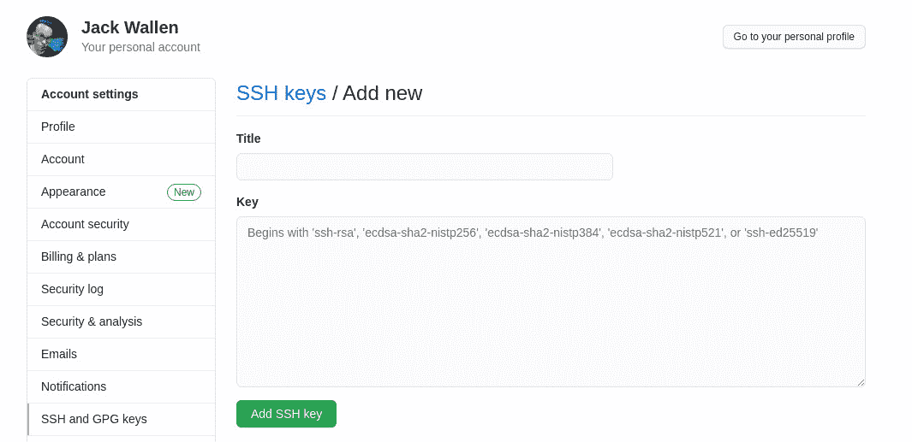
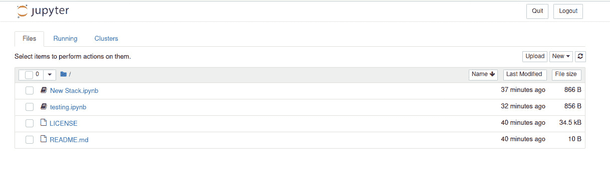

# 将 Jupyter 笔记本与 GitHub 集成

> 原文：<https://thenewstack.io/integrate-jupyter-notebooks-with-github/>

Jupyter Notebook 是一款基于网络的开发工具，让开发者更容易管理项目。通过用户友好的界面，Jupyter 包括交互式元素来创建和共享包含代码、视觉效果、等式甚至叙事文本的实时文档。

我已经在我的文章“Jupyter Notebook:你一直在寻找的基于 Web 的开发工具”中写了如何安装 Jupyter Notebook，所以你应该通读该教程来安装并运行 Jupyter。

问题是，使用默认的 Jupyter 安装，您会错过 GitHub 集成。鉴于如此多的开发者依赖 GitHub 之类的东西，这是一个非常缺失的特性。

幸运的是，一个开发人员已经创建了一个扩展，使您可以将 Jupyter 与 GitHub 一起使用。不幸的是，由于开发人员为 Jupyter/GitHub 创建了扩展，GitHub 方面的情况已经发生了变化，因此使用该工具有一个注意事项(我将在后面解释)。但即使有这样的警告，这个扩展也是保持 Jupyter 笔记本与 GitHub 存储库同步的好方法(否则，所有这些笔记本都将保留在本地机器上)。

让我们把这两项技术联系起来。

在您开始这个过程之前，请确保您已经安装了 Jupyter。确保你还没有推出笔记本。我们一会儿会做的。

## 安装延伸部分

您已经为 Jupyter 安装了必要的依赖项(Python 和 pip)。您现在需要安装 Jupyter GitHub 扩展。登录包含 Jupyter 的机器，打开一个终端窗口。从 CLI 发出以下命令:

`alias pip=pip3`

`pip install git+https://github.com/sat28/githubcommit.git`

`jupyter serverextension enable --py githubcommit`

`jupyter nbextension install --py githubcommit --user`

`jupyter nbextension enable githubcommit --user --py`

上述命令将安装扩展，并确保它可用于所有笔记本电脑。

## 安装剩余的依赖项

您可能已经安装了 git，但是万一您没有安装，发出命令(我在 Ubuntu Desktop 21.04 上演示):

`sudo apt-get install git -y`

如果您使用的是基于 Red Hat 的发行版，该命令应该是:

`sudo dnf install git -y`

## 生成 SSH 密钥

您还需要 SSH 密钥(这样您就可以克隆必要的存储库)。为此，运行命令:

`ssh-keygen`

确保接受默认设置，并为密钥提供一个唯一且强有力的密码。

生成密钥后，使用以下命令查看公钥:

`less ~/.ssh/id_rsa.pub`

复制该密钥的内容，然后转到您的 GitHub 帐户。前往“设置”>“SSH 和 GPG 密钥”,然后点按“新建 SSH 密钥”。在出现的窗口中，粘贴您刚刚生成的 SSH 密钥，为它命名，然后单击 Add SSH Key(图 1)。



图 1:向 GitHub 添加一个 SSH 密钥。

## 克隆存储库

我们需要克隆扩展存储库，使用命令:

`git clone git@github.com:sat28/githubcommit.git`

您将被要求输入刚刚创建的 SSH 密钥的密码。完成后，将创建一个名为 githubcommit 的新目录。

随着存储库的克隆，让我们确保 Git 知道我们是谁。发出以下两个命令:

`git --global user.email EMAIL`

`git --global user.name NAME`

其中 EMAIL 是您的电子邮件地址，NAME 是您的姓名。

## 创建 GitHub 访问令牌

接下来，您需要创建 GitHub 访问令牌。转到您的 GitHub 帐户，然后进入“设置”>“开发者设置”>“个人访问令牌”。单击 Generate New Token，然后在出现的窗口中为其命名，并选中 repo 和 write:packages 复选框。滚动到底部，然后单击生成令牌。然后，您需要将该访问令牌复制到剪贴板。

## 配置扩展

使用命令切换到 githubcommit 文件夹:

`cd githubcommit`

使用命令打开 env.sh 配置文件:

`nano env.sh`

在该文件中，您必须配置以下部分:

```
export GIT_PARENT_DIR=~
export GIT_REPO_NAME=REPONAME
export GIT_BRANCH_NAME=BRANCH
export GIT_USER=USERNAME
export GIT_EMAIL=EMAIL
export GITHUB_ACCESS_TOKEN=ATOKEN
export GIT_USER_UPSTREAM=USERNAME

```

其中:

*   REPONAME 是您将用于此目的的 GitHub 存储库的名称。
*   BRANCH 是存储库分支(可能是“main”)
*   用户名是您的 GitHub 用户名
*   电子邮件是与您的 GitHub 帐户关联的电子邮件地址
*   ATOKEN 是您刚刚创建的访问令牌。

保存并关闭文件。

## 找到 env.sh 文件并启动一个笔记本

下一步是使用以下命令获取 env.sh 文件:

`source ~/githubcommit/env.sh`

系统将提示您输入 SSH 密钥密码。完成后，您在 env.sh 文件中配置的存储库将克隆到您的本地驱动器(在您的主目录中)。完成后，切换到从 GitHub 存储库克隆的新目录(在我的例子中，它被命名为 newstack)。

在该目录中，使用以下命令启动笔记本:

`jupyter notebook --ip 0.0.0.0`

您的笔记本应该会打开，显示 GitHub 存储库中的所有文件(图 2)。



图 2: Jupyter 笔记本，其中包含我创建的 newstack 存储库中的文件。

如果您创建一个新文件或打开一个文件，您现在会在笔记本上看到一个 GitHub 徽标(图 3)。


图 GitHub 徽标现在出现在 Jupyter 笔记本中。

这就是警告发挥作用的地方。您应该能够单击该按钮，然后将任何新代码提交到连接的 GitHub 存储库中。不幸的是，它不起作用。我有一种感觉，这是因为 GitHub 最近对认证所做的改变。因此，开发者有责任解决这个问题。

幸运的是，我有一个变通办法。

当你创建了所有的新文件，并在 Jupyter Notebook 中完成工作后，它们都可以在从你配置的 GitHub 库下拉的目录中找到。在我的例子中，我使用了我在 GitHub 上创建的名为 newstack 的测试存储库。

转到该文件夹，然后使用 git 完成通常的过程:

`git add .`

`git commit -m "Added new files"`

`git push`

一旦你完成了上面的步骤，你所有的新文件都将被上传到 GitHub 库。

第二个警告是，Jupyter 不会自动下载任何由其他队友或 GitHub 内部创建的新文件。为此，返回终端窗口并发出命令:

`git pull`

换句话说，要向 GitHub 推送和从 GitHub 获取新内容，您必须使用命令行(至少在开发人员修复该问题之前)。但是，即使不得不这样做，能够将 Jupyter 笔记本与 GitHub 集成在一起使该工具更加有用。

希望不久的某个时候，开发者将通过内容的推拉来解决这个问题。在此之前，您可以通过一点手动的 git pull 和 git push 来解决这个问题。

<svg xmlns:xlink="http://www.w3.org/1999/xlink" viewBox="0 0 68 31" version="1.1"><title>Group</title> <desc>Created with Sketch.</desc></svg>