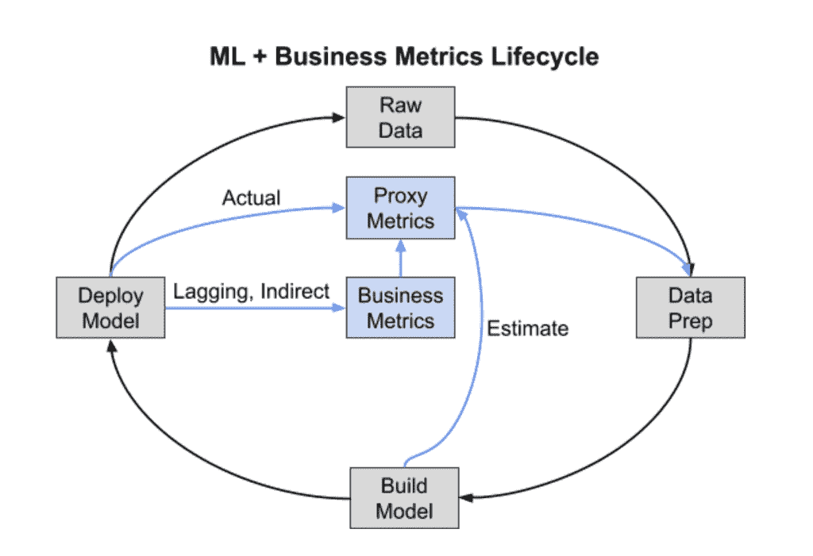

# 整合质量和基础设施，实现最大 ML 速度

> 原文：<https://thenewstack.io/integrate-quality-infrastructure-for-maximum-ml-velocity/>

 [塔尔沙克

塔尔是雪花的机器学习架构师。在加入雪花之前，Tal 在谷歌工作了 16 年，最终成为杰出的工程师/高级主管。他负责了大量的 ML 项目，如 TensorFlow Extended 和 Sibyl——谷歌部署最广泛的两个 ML 平台——以及用于谷歌广告和谷歌搜索的特定 ML 应用。](https://www.linkedin.com/in/tshaked) 

许多组织已经将机器学习确定为改进其产品和整体业务的变革性技术。然而，他们经常把 ML 作为现有操作的附加技术，而不是重新设计系统和组织来完全整合 ML。

这种方法使得从 ML 中提取最大价值所必需的基础设施和质量观点的整体结合变得困难。

基础设施视角，以构建生产系统的工程师为例，集中于如何最好地将 ML 集成到软件栈中。

质量视角以关注业务度量的分析师和数据科学家为特征，捕捉最终推动业务影响的分析和建模。当 ML 系统的产品表面和底层软件被联合设计来考虑基础设施和质量工作之间的所有交互时，ML 系统工作得最好。

## **更好的 ML =基础设施+质量**

传统的 ML 生命周期通常只倾向于一个角度——基础设施或质量。如果不同时捕获两个视图，很可能会出现工作碎片，导致不兼容的组件。例如，质量团队开发模型并要求基础设施不支持的分析是很常见的。

组织通常知道如何在商业问题的背景下构建 ML 机会，例如零售商如何增加客户终身价值。然而，收入等业务指标很难直接优化，并且在部署新模型后需要一段时间来衡量。

因此，确定更容易优化和测量的代理指标是很重要的，比如用户与推荐项目交互的可能性。

下图说明了一个建议的 ML +业务度量生命周期，它共同捕获了在业务和代理度量环境中开发、部署和迭代改进 ML 系统所需的基础设施和质量工作。

黑色箭头表示基础设施工作，蓝色箭头表示质量工作。

让我们考虑广告公司如何应用生命周期将一个标准问题映射到一个 ML 系统:如何从可能的一百万个广告中选择最好的两个广告向网站访问者展示。

从质量角度来看，这些步骤将包括如何:

*   确定要优化的业务指标，如长期收入。
*   进行数据分析以确定代理指标，例如预测点击率(CTR)。
*   组织数据并建立模型来预测点击率，例如，通过将广告印象与点击和其他属性结合起来。
*   根据历史数据评估和改进模型。
*   确定如何部署模型，并测量对代理和业务度量的影响，例如，通过运行 A/B 实验。

从基础设施的角度来看，这些步骤将包括如何:

*   从生产系统获取原始数据。
*   处理数据用于最大似然训练、推理、分析等。
*   支持不同模型的离线培训、评估和实验。
*   支持生产模型的部署、评估和监控。
*   在开发和生产过程中调试和诊断质量和基础设施问题。

最初，上面描述的许多步骤似乎可以独立设计和实现。实际上，细节真的很重要。例如，在训练时，我们每个网页只有两个广告，我们知道它们在页面上的确切位置。

在推理时，我们要考虑每个网页上的 100 万个广告，我们需要预测一个点击率，然后才能知道广告可能会显示在页面的哪个部分。在决定如何将这些细节整合到整体设计中时，我们必须仔细考虑质量和基础设施的影响，以及它们是如何交叉的。

ML 不同于其他软件系统，因为数据集和模型难以验证、监控和调试。假设我们监控一个广告系统的收入，突然，观察到一个巨大的，意想不到的收入下降。

从基础设施的角度来看，我们可以通过测试明确定义的输入和输出来检查模型是否正确地计算了预测，或者我们的数据是否是错误地生成的。

从质量的角度来看，我们可以看到代理和业务指标之间的相关性的变化，或者特征或模型预测的分布。这种高质量的调试工作要困难得多，因为我们不知道什么类型的更改是重要的，也不知道如何容易地找到这些更改的根本原因。当设计一个 ML 系统时，我们需要预测 ML 项目将在哪里遇到这些挑战。

## **获取流经整个 ML 系统的一个字节**

公司应该在每个 ML 项目中包含的一个关键目标是在开发的早期就有一个完整的 ML +业务度量生命周期的实现或原型版本，这样就有可能在整个系统中运行一个字节。这个最佳实践鼓励组织在项目进行中采用以 ML 为中心的方法，这确保了 ML 的基础设施和质量观点之间的协调。

从一开始就对 ML 采取更全面的方法，将基础设施和质量结合起来，使组织能够更快地进行试验和迭代，从而随着时间的推移缩短开发、部署和改进模型的时间。

<svg xmlns:xlink="http://www.w3.org/1999/xlink" viewBox="0 0 68 31" version="1.1"><title>Group</title> <desc>Created with Sketch.</desc></svg>