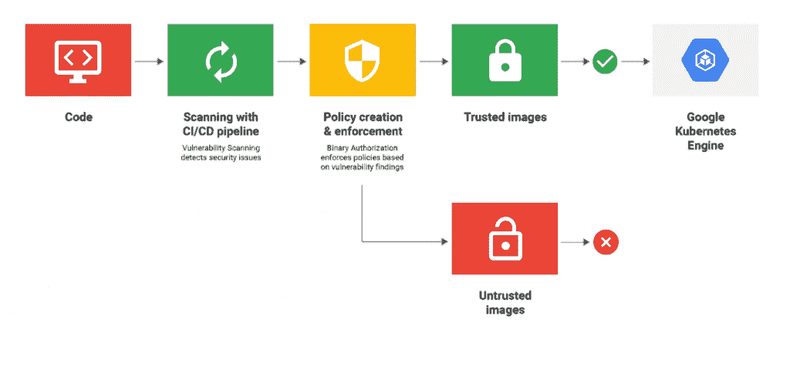

# 将安全性和法规遵从性集成到您的 CI/CD 渠道中

> 原文：<https://thenewstack.io/integrate-security-and-compliance-into-your-ci-cd-pipeline/>

使用云原生工具在云中托管和管理的 CI/CD 管道最适合云原生应用。因此，这些应用程序还将以云环境固有的方式集成安全性和合规性。这听起来是显而易见的，但它对你如何构建你的管道有着重要的影响——包括你采取的保护和加固管道的措施。强化 CI/CD 管道包括端到端地跟踪变更，这在生产中运行容器时是一个挑战。

开发人员如何使用 Skaffold、Minikube 和 Cloud Build 等云原生工具在容器和 Kubernetes 上 [轻松地从本地开发到部署](https://thenewstack.io/the-road-from-local-development-to-cloud-native-kubernetes/) 是这个关于 Google Cloud 上的 CI/CD 的三部分系列的第一部分的重点。这些工具使跨本地和云环境的 CI/CD 流程易于开始和扩展。在第 2 部分中，我们将讨论在云原生应用的环境中，安全性和合规性发生了哪些变化，以及一些有助于保护这些应用的 CI/CD 管道的工具。

## 安全软件交付的现代方法

 [吐温·泰勒

吐温在谷歌开始了他的职业生涯，在那里，他参与了 AdWords 团队的技术支持工作。他的工作包括审查堆栈跟踪，解决影响客户和支持团队的问题，以及处理升级。后来，他建立了品牌社交媒体应用程序和自动化脚本，以帮助初创公司更好地管理他们的营销业务。如今，作为一名技术记者，他帮助 IT 杂志和初创公司改变团队构建和发布应用程序的方式。](https://cloudplatformonline.com/TNS-CI-CD-with-Kubernetes.html?utm_source=google&utm_medium=email&utm_campaign=FY18-Q3-americas-nurture-email-wd-icb_tns&utm_content=cicd&utm_term=tns) 

在当今的云计算世界中，开发人员和运营团队必须学会规划安全性。快速的开发速度意味着要编写更多的代码和发布更多的版本。这在每一步都引入了更多未知的依赖性和漏洞，并在保护容器时带来了新的挑战。传统的基于身份的部署控制等手动安全流程依赖于人的操作知识和信任，无法通过自动构建和发布基础架构来满足企业的需求。

“在 Kubernetes 上构建云原生应用的开发人员需要可扩展、自动化和容器感知的安全实践，”谷歌云平台 DevOps 部门的产品经理 Andrew Phillips 说。“考虑安全性和合规性，并尽早将其融入到您的管道中，是确保跨团队实现一定程度的标准化的好方法。”

我们需要的是一种现代的安全方法，不仅涵盖运行时安全，甚至包括管道安全。这将利用容器映像的内容可寻址特性，并将部署时安全控制与运行时构造联系起来。这种新的安全方法将在开发过程中自动执行安全操作，而不会降低开发人员的速度，同时提供运营所需的集中控制，以确保部署的一切都符合安全要求。

现代 CI/CD 管道需要更深入的可见性和更强的控制，因为它管理更快和更动态的软件交付周期。Grafeas、Google Container Registry 漏洞扫描、二进制授权和 Kritis 等新解决方案提供了这种可见性、控制力，并最终提供了更强大的安全性。让我们来看看这些工具中的每一个，以及它们在容器安全的整体策略中所扮演的角色。

### 1.用 Grafeas 管理工件元数据

容器安全性始于 CI/CD 流程的第一步——当开发人员签入新代码，自动构建由类似 [谷歌云构建](https://cloud.google.com/cloud-build/) 的工具触发。从第一步到最后一步，都会生成元数据，描述容器映像、VM 映像或正在使用的 JAR 文件等组件、存储库、代码来源处的用户和提交，以及任何已知的漏洞。这些元数据充当端到端安全策略的构建块，应该集中存储和分析。

[Grafeas](https://grafeas.io/) 是一个开源元数据 API，用于集中存储、查询和检索软件交付管道中产生的所有元数据。

谷歌的安德鲁·菲利普斯说:“使用 Grafeas 的最大好处是，它可以作为事实的来源，在调试和故障排除时可以放心地依赖。”

这种信心来自于这样一个事实:Grafeas 允许管理员定义细粒度的访问控制，这样元数据一旦创建就不会被修改。这一事实来源对于根本原因分析至关重要，并且可以在实时攻击期间提供实时可见性。

此外，Grafeas 还支持医疗保健和金融服务等高度管控行业中处理数据的应用程序所需的合规性。基于一个可插拔的架构，Grafeas 可以很容易地添加新的元数据生产者和消费者，如第三方安全扫描器和新的构建系统，同时仍然考虑他们生成的元数据。

为了加强法规遵从性和基于策略的安全性，拥有一个带访问控制的集中式元数据存储是很有价值的。Grafeas 就像一个元数据存储库，将元数据放在它在容器安全性和合规性实践中的正确位置:前端和中心。

### 2.使用容器注册表漏洞扫描扫描漏洞

公共 Docker Hub 适用于沙盒环境，尽管团队仍然需要小心谨慎。然而，当运输生产中的容器时，像[Google Container Registry](https://cloud.google.com/container-registry/)(GCR)这样的私有注册中心是必不可少的。它有助于团队积极主动地关注安全性，因为它可以控制开发人员可以使用的容器映像，以及最终部署哪些映像。集装箱安全扫描是集装箱注册的基本特征，其中集装箱图像对照一系列[CVE(常见漏洞和暴露)](https://www.cisecurity.org/benchmark/docker/) 进行扫描。

Container Registry 与 Cloud Build 相集成，因此只要容器映像被推送到 GCR，您就可以执行漏洞扫描。启用容器分析 API 后，GCR 漏洞扫描会识别容器映像中的已知漏洞，从而实施左移方法来确保容器安全。

此外，GCR 漏洞扫描可以使用发布/订阅通知或 Google Cloud 功能与您的 CI/CD 系统集成(例如，在发现漏洞时自动归档错误并跟踪漏洞)。您还可以利用现有的 [云安全指挥中心第三方工具集成](https://cloud.google.com/blog/products/gcp/exploring-container-security-using-cloud-security-comma) 来检测和管理安全问题。这在一个被众多安全工具强化的管道中是必不可少的，这些工具根据需要被添加和删除。

最后，Container Registry 提供了关于漏洞严重性的详细报告，并提供了针对这些漏洞的可用修复的实时状态。

当与容器注册表集成时，Grafeas 可以将关于漏洞的信息记录为元数据。此外，像 Cloud Build 这样的构建工具可以通知容器注册中心代码的来源。在管道中的工具之间共享重要的安全信息，可以提供更全面的安全数据视图，并有助于保护 CI/CD 管道。

### 3.使用 Kritis 和二进制授权实施安全策略

在 CI/CD 流程的每一步都会产生安全数据:提交和构建记录、测试结果、自动或手动审查以及容器图像扫描。组织可以根据这些信息就什么可以或不可以进入生产环境做出明智的决策。

Kritis 是 Kubernetes 的一个开源工具，它使用来自 Grafeas 的元数据执行部署策略。Google Kubernetes 引擎还提供了一个被称为二进制授权的托管实现，作为其安全最佳实践的一部分。

“Kritis 根据 Grafeas 的元数据对容器图像执行两种策略，” [谷歌负责 Kritis 项目的软件工程经理丹·洛伦茨](https://github.com/dlorenc) 说。第一组策略定义了应该对哪些容器映像进行签名。接下来，Kritis 强制执行策略，即只有具有所有必需签名的容器才能在集群中运行。”

Kritis 提供了一个控制循环来定义应该对哪些容器图像进行签名。例如，只对其中没有严重漏洞的容器映像进行签名。因此，每个容器图像都附有 PGP 签名，这些签名作为证明存储在 Grafeas 中。这些证明可以由来自 QA 或安全团队的个人来完成，也可以通过自动化流程来完成。Lorenc 补充道，“这些签名为二进制文件建立了一个信任链。”在这种情况下，二进制文件就是容器映像本身。

然后，Kritis 强制执行一个部署时策略，即只允许由所需授权机构签名的容器映像在您的集群中运行。当每天在几十个生产环境中部署数千次时，这种类型的部署时安全检查是必不可少的。它有助于通过可扩展的自动化，将生产部署与构建和发布时间安全控制联系起来的运营需求整理成文。

总之，在管理以集装箱为中心的 CI/CD 管道时，安全性和合规性是一个挑战。然而，通过采用正确的方法，DevOps 团队可以强化和保护他们的 CI/CD 渠道。只有通过 Grafeas 这样的工具利用元数据的力量，使用有能力的容器注册中心进行容器漏洞扫描，以及使用 Kritis 和 [二进制授权](https://cloud.google.com/blog/products/identity-security/deploy-only-what-you-trust-introducing-binary-authorization-for-google-kubernetes-engine) 这样的工具实施部署时安全检查，才能做到这一点。这些可确保随着开发和部署步伐的加快，组织仍能实现云原生应用的合规性、治理、标准化和生产级安全性。

<svg xmlns:xlink="http://www.w3.org/1999/xlink" viewBox="0 0 68 31" version="1.1"><title>Group</title> <desc>Created with Sketch.</desc></svg>