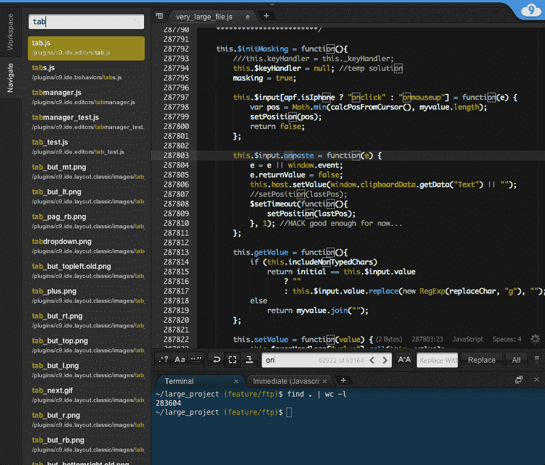
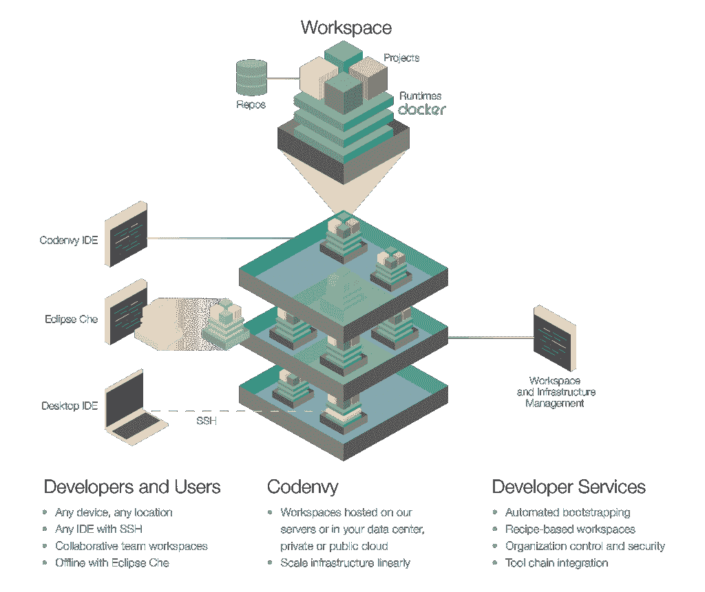

# ide 正在向云迁移

> 原文：<https://thenewstack.io/integrated-development-environments-moving-cloud/>

在我职业生涯的早期，我使用了各种各样的开发环境，包括最流行的 Turbo C、FoxPro、PowerBuilder 和 Delphi，最终还是选择了微软的 Visual Studio。我写过的第一行代码是在微软 DOS 下运行的 QBasic。编辑器有一些有用的特性，比如添加行号和自动将语句转换成大写。点击 F5 将立即运行程序，而不必切换到命令提示符。

Visual Studio 系列捆绑了各种工具— Visual C++、Visual Basic、Visual InterDev、Visual J++。在 20 世纪 90 年代末，当微软开始意识到 Java 的威胁越来越大时，它使用 Visual Studio 作为其对抗竞争的终极武器。

我被 Visual Studio 与操作系统、数据库和设计工具的强大集成迷住了。所见即所得的界面结合拖放画布提供了最终的生产力。当然，IntelliSense 特性为 ide 带来了超酷的代码完成功能。

Delphi，PowerBuilder，甚至 Oracle Forms 2000 都试图击败微软的开发工具，但收效甚微。

从 Turbo C 时代到最新的基于浏览器的开发环境，ide 已经走过了漫长的道路。他们将会有更多的改变。

## 软件开发的动态变化

在过去的五年中，软件开发生命周期发生了巨大的变化。基础设施即代码的概念以及随之而来的 [DevOps](/category/devops/) 文化的发展对软件开发产生了强烈的影响。开源运动在影响 ide 的未来方面也发挥了关键作用。不断变化的动态迫使开发工具供应商回到白板前，从头开始重新设计 ide。

以下是改变 ide 面貌的一些趋势:

*   **多语言**:一个应用程序只用一种语言针对一个堆栈编写的日子已经一去不复返了。在很长一段时间里，开发人员接受 Java 或。NET 宗教来开发应用程序。在今天的世界中，开发人员被期望知道至少三种语言，以便在他们的工作中高效地工作。云和微服务使企业能够为应用选择最佳的语言和工具。

*   **跨平台**:继 polyglot 之后，下一个大的变化是跨平台兼容性。每一行代码都应该能够在各种桌面环境、浏览器、移动设备、平板电脑甚至可穿戴设备上无缝运行。现有工具不足以开发跨平台应用。

*   **协作**:开源运动与 DevOps 文化的结合使得协作开发成为 SDLC 的一个重要方面。源代码管理(SCM)已经成为开发不可或缺的一部分。Git 和 Github 的出现使得协作开发变得更加简单。

*   **构建管理**:持续集成和部署(CI/CD)是 DevOps 的关键支柱。ide 支持对 SCM 的一次点击提交，这将立即触发一个构建过程，该过程将依次触发一系列自动化测试。这种持续的反馈循环缩短了发布软件所需的周期。ide 需要有效地参与这个过程。

*   **可扩展**:在当前的 SDLC 环境中，ide 不仅仅是智能编辑器。他们需要支持新兴语言、脚本环境、声明性标记语言和用于第三方集成的插件。ide 正在逐渐成熟，成为独立的平台。

*   微服务:基于微服务的应用程序由一组模块化服务组装而成。从单片到微服务的转变正在影响开发者的思维过程。他们需要在开发和测试阶段访问整个堆栈。

*   **多目标部署**:开发人员编写的代码进入公共云、裸机服务器、虚拟机、容器，甚至编译成独立的操作系统(Unikernel)。当然，针对 X86、AMD64、ARM 和其他体系结构的传统挑战仍然存在。

亚马逊最近对 Cloud9 IDE 的收购表明了该社区的前景。谁会想到一家提供计算、存储和网络服务的 IaaS 提供商会转型为一家最强大的平台公司？

其他技术，比如 Eclipse Che，正在软件开发领域掀起一股新的 ide 浪潮。

## Cloud9 IDE

Cloud9 是 2010 年创立的首批基于浏览器的 IDE 之一。IDE 用 JavaScript 和 Node.js 编写，具有语法高亮、代码自动完成、实时预览、内置终端和调试器等特性。

Cloud9 IDE 可以连接到 Github、BitBucket、Gitlab 等上托管的现有代码库。它还可以被配置为与数据库服务器通信。已配置的工作区可以轻松地与其他团队成员共享。

开发者可以通过 SSH 将 Cloud9 IDE 连接到自己的 VM。这提供了对依赖项和运行时的直接访问。

在 Cloud9 IDE 中开发的应用程序可以部署到各种目标上，包括 Heroku、Microsoft Azure、Google App Engine 和 Cloud Foundry。

AWS 正在快速发展，成为我们这个时代最大的平台公司。EC2 是新的操作系统，S3 是互联网文件系统，Aurora 是新的 RDBMS，最后 AWS Lambda 是互联网的多语言运行时。亚马逊可能不拥有操作系统或语言，但它正在转型成为元操作系统和元平台公司。竞争不能低估 AWS Lambda 的力量及其对开发者社区的影响。

亚马逊收购 Cloud9 IDE [将会导致许多有趣的场景](http://www.forbes.com/sites/janakirammsv/2016/07/18/the-master-plan-behind-amazons-acquisition-of-cloud9-ide/#3e802d2828db)。AWS 缺乏合适的工具集来编写 IAM(身份和访问管理)策略、云信息模板、AWS 物联网规则、OpsWorks 的 Chef Cookbooks 和 Recipes、Aurora 的存储过程，以及交互运行 CLI 命令的集成外壳。Cloud9 将填补当前 AWS 产品中存在的主要空白。

最终，AWS 将把编码和脚本的每个方面都转移到 Cloud9。开发人员将能够从一个统一的环境中编写、调试、测试和发布 AWS Lambda 函数。随着 AWS CodeCommit 的集成，Cloud9 将自动提交源代码。AWS CodePipeline 将为平台带来 CI/CD 和构建自动化功能，而 AWS CodeDeploy 将把工件推送到 EC2、Lambda 或 ECS。

Amazon 可能包括 IAM 策略、Lambda 函数、CloudFormation 模板、ECS 任务定义的蓝图，作为开发人员可以修改的现成模板。

Cloud9 将帮助亚马逊确立其在云市场的主导地位。

亚马逊的这一举动从多方面挑战了微软。Visual Studio 没有与 Azure 紧密集成的基于浏览器的在线版本。微软在激励忠诚度方面做得很少。NET 开发者瞄准 Azure。尽管 Visual Studio 已经变得跨平台，但它还没有达到赋予 Azure 开发者权力的集成水平。尽管拥有一个庞大的 C#开发人员社区，微软在提供基于云的 IDE 方面还是落后了。

此次收购也是对 Codenvy 等其他基于云的 ide 的认可。

## 科登威

从 2012 年的 eXo IDE 开始， [Codenvy](https://codenvy.com/) 是一个流行的基于云的开发环境。像大多数弹性工作负载一样，Codenvy 工作空间分布在多个节点上，这些节点可以独立扩展。源代码在所有节点上保持同步。该环境针对多分支签出、连续和增量编译以及更快的部署进行了优化。

Codenvy 的出发点是，每个开发人员都应该能够破解代码，而不必花时间设置、安装和配置环境。工作空间的概念提供了一个沙箱，它包含了开发人员需要的一切。这大大减少了修改现有应用程序或为新应用程序设置开发环境的时间。

该服务最近的一些增强包括通用工作区、IDE 的内部部署以及与 Docker 的更紧密集成。

Codenvy 的一个关键区别因素是敏捷开发。组织可以连接到吉拉、Github、Jenkins 和其他工具，实现持续开发。开发人员在一个可共享的工作空间中处理一个特性分支，该工作空间可以向其他团队成员开放，以便获得即时反馈和测试。可以克隆工作区，以便在不中断原始工作流程的情况下实现即时审阅。

在幕后，Codenvy 使用 Docker 使工作区变得可移植。每个工作区都由源代码存储库、特定于项目的工件和打包成 Docker 容器的多个运行时组成。这种分层架构使得 Codenvy 具有模块化和可移植性。通过 workspace recipes 的概念，开发人员可以轻松地在 Codenvy 的集群甚至内部复制环境。即使开发人员不使用 Codenvy IDE，他们仍然可以利用工作区。每个 Docker 容器都支持 SSH 和 Git，以便在需要时提供对命令行的直接访问。

Codenvy 是 [Eclipse Che](http://www.eclipse.org/che/) 的主要贡献者之一，Eclipse Che【】是一个开源的基于 Java 的开发人员工作区服务器和云集成开发环境，围绕 Codenvy IDE 的相同架构建模。除了 Codenvy，IBM、红帽、三星、SAP、微软都在积极为 Eclipse Che 做贡献。

我们将在即将发表的一篇文章中仔细研究 Eclipse Che。

随着大部分工作负载转移到云，开发环境和工作区也在遵循同样的道路。基于 JavaScript 的浏览器框架的发展提供了强大的用户体验，结合了容器的强大功能，推动了下一代 ide 的发展。

<svg xmlns:xlink="http://www.w3.org/1999/xlink" viewBox="0 0 68 31" version="1.1"><title>Group</title> <desc>Created with Sketch.</desc></svg>