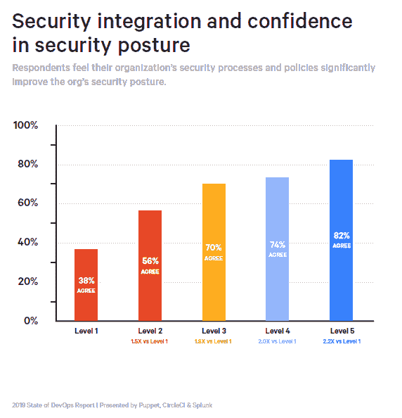
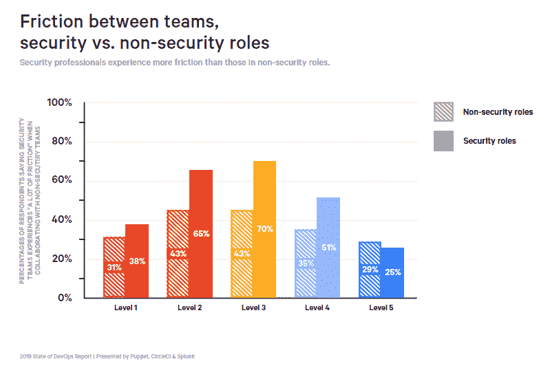

# 将安全性集成到构建过程中标志着 DevSecOps 的临界点

> 原文：<https://thenewstack.io/integrating-security-into-build-processes-signals-devsecops-tipping-point/>

通往 DevSecOps 成熟的旅程不会沿着软件开发生命周期整齐地向左移动(SLDC)。公司开始在测试阶段增加安全性，然后通常在将应用程序部署到生产中时集成安全性。为“ [2019 年开发运营状况报告](https://puppet.com/resources/whitepaper/state-of-devops-report)”接受调查的近 3，000 名技术专业人士和高管认为，这些措施对公司的安全态势产生了积极影响。然而，将“安全性”添加到测试和部署中也会增加安全性团队和开发团队之间的摩擦。

不足为奇的是，完全没有集成安全性的受访者中只有 38%表示安全策略或流程改善了他们公司的安全状况。这份来自[傀儡](https://puppet.com/)、 [CircleCI](https://circleci.com/) 和 [Splunk](https://www.splunk.com/en_us/cyber-security.html) 的报告，使用安全相关的 SDLC 阶段数量来衡量集成水平。测试和部署是最有可能与安全性集成的两个阶段。仅仅这样做就有积极的影响。构建通常是下一个要集成的阶段。总体而言，74%的受访者表示至少整合了三个阶段，这对其公司的安全状况产生了积极影响。在集成了软件开发所有五个阶段的公司中，需求和设计阶段最有可能处理安全性。

1 级(16%的研究)=在任何 SDLC 阶段都没有集成安全性；第二级(22%) =最小整合(五个阶段之一)；第三级(25%) =选择性整合(五个阶段中的两个)；第 4 级(24%) =重要整合(五个阶段中的三个或四个)；第 5 级(14%) =完全整合(所有阶段)。

该研究深入挖掘，以确定最有可能改善受访者前景的安全实践。通过回归分析，该研究发现，在威胁模型和开发人员工具方面的合作(允许在部署阶段实施安全功能)具有最大的影响，但也是所询问的 15 种安全实践中最不常见的。与 Tricentis 的研究相呼应，让安全专家评估(并优先考虑)自动化软件测试对安全性也有很大影响，但发生的频率低于其他 13 种实践。

“级别”越高，SDLC 中涉及“安全性”的部分就越多。

38%没有将安全性集成到 SDLC 中的公司在安全性和开发团队之间也没有摩擦，可能是因为几乎没有协作。在第一个或第二个开发阶段，团队冲突的发生率上升到 48%。在那些声称从头到尾都覆盖了软件安全性的团队中，团队之间的摩擦减少了。到目前为止，人们普遍承认安全性是一项共同的责任，很少有人认为安全性是快速交付软件的主要限制。

安全集成的确切定义很难确定。这是否意味着安全性是企业决策中的一个因素？还是说安全团队直接参与了？研究发现，31%的公司既有集中的安全功能，也有配备指定安全专家的应用程序交付团队，另外 14%的公司分散了安全功能，只配备了基于团队的安全专家。规模在如何处理安全性方面扮演着重要角色。小公司更可能使用纯粹的分散安全组织。此外，拥有 10 名或更少成员的团队很少会有指定的安全专家。

在另一项调查中，这项由[企业战略组](https://www.esg-global.com)进行并由新堆栈赞助商 [Capsule8](https://capsule8.com/?tns) 共同赞助的调查发现，55%的企业将安全性融入了他们的开发运维流程。它还报告称，只有 21%的受访者通过网络安全团队的参与保护了超过一半的云原生应用程序。

“2019 年发展状况报告”中还有许多其他有趣的发现您会发现下面的推文提供了安全漏洞补救速度的颜色。总的来说，它们提醒我们，即使没有利用按需部署，它也是有价值的。

Capsule8、CircleCI、Puppet 和 Tricentis 是新堆栈的赞助商。

通过 Pixabay 的特征图像。

<svg xmlns:xlink="http://www.w3.org/1999/xlink" viewBox="0 0 68 31" version="1.1"><title>Group</title> <desc>Created with Sketch.</desc></svg>