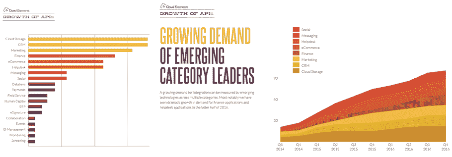
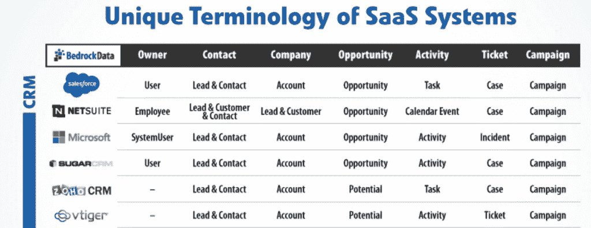

# 企业采用 API 是由内部集成需求驱动的

> 原文：<https://thenewstack.io/integration-drives-api-uptake-enterprise/>

集成企业内部正在使用的日益增多的软件即服务(SaaS)工具的需求正在推动应用编程接口(API)的采用。)虽然许多人认为企业中引入 API 是为了利用[微服务架构](/category/microservices/)或作为更广泛的云迁移工作的一部分，但集成实际上是在跨行业的许多业务中使用 API 的早期驱动因素。

“企业中应用编程接口的头号用例是集成，” [云元素](http://cloud-elements.com/) 首席执行官兼联合创始人[马克·基恩](https://twitter.com/mgeene)说。“数据重复的普遍存在推动了需求。一个普通的企业正在使用 1000 个 SaaS 应用程序，其中每一个都是自己的数据孤岛，”Geene 说。“不连接工具会导致无法从客户数据或业务的某个方面获得全部价值。”Geene 给出了一个自动化制造商的例子，Cloud Elements 与该制造商进行了交流，该制造商“仅仅在人力资本方面”管理着 600 个应用程序。

## 推动集成需求的 SaaS 工具

Gartner 分析师 Mark O'Neill 已经认识到原料药消费的增长是行业的主要推动力。去年 11 月在波士顿举行的 API Strategy and Practice 会议上，12 月在巴黎举行的 APIdays 会议上，以及最近在 LinkedIn 上发表的一篇文章中，奥尼尔认为企业依赖于跨业务部门的外部 API 消费，包括营销、销售运营、it、财务、物流和人力资源。

仅在营销部门，这就导致了使用同类最佳的 API 堆栈和集成平台来构建“宏服务架构:大块的半封闭应用程序，它们之间交换相对较小的数据管道，” [营销技术专家分析师 Scott Brinker](http://chiefmartec.com/2016/12/5-disruptions-marketing-part-2-microservices-apis/) 写道。

> 让 Zapier 感到惊讶的是，在为内部团队创建自己的集成的企业中，使用其新的开发人员程序工具的情况越来越多。

即将发布的云元素研究表明，需要集成平台作为中介层，将各种 SaaS 工具与记录系统连接起来，以便跨各种系统调整数据集。

Cloud Elements 的研究发现，企业对集成的最大需求来自于连接云存储、CRM 和营销应用程序的需求。在 2016 年下半年，集成平台还见证了来自财务和服务台应用程序的同步数据需求的增长。

Geene 指出了两个常见的行业用例，一个面向客户，一个面向内部:

1.  **360 度客户视角**:“我们听到的一个领域是客户和我支持的客户之间的脱节，”Geene 说。“当客户进来并与企业接洽时，服务管理系统是否知道该客户是谁、他们购买了什么或他们如何支付账单？如果你要吸引你的客户，你需要参与销售点系统、账单、你正在使用的任何信息系统:客户希望被了解，而不是每次与你的企业互动时都要重复自己。”
2.  **管理内部资产**:“如果你看看云存储和本地存储的激增，员工经常找不到他们运营业务所需的核心信息，因为这些信息都存储在这些系统中，他们无法阻止这种增长，因为员工现在都带着自己的设备。他们需要开始构建工作流，将这些孤岛中的内容连接起来，这需要集成。”

来自 [Clearbit](http://clearbit.com) 的数据显示了企业在连接其行业中使用的 SaaS 产品的扩散时所面临的日益严重的问题。Clearbit 分析了企业中 298 种常见商业 SaaS 工具的使用情况。以航空业为例，在那些拥有 1000 多名员工的企业中，至少有 25%的企业正在使用 10 个或更多 Clearbit 跟踪的 SaaS 工具。而且这只代表可以通过商业网站阅读的工具。在拥有 1000 多名员工的金融服务业中，至少有 21%的人使用 10 种以上的 SaaS 工具。

管理和集成如此多的软件系统的一个关键挑战是，每个系统对于相似的数据字段可能有自己的命名法。集成平台 [基岩数据](https://www.bedrockdata.com/) 最近发布了一张信息图，展示了不同的软件对相同的数据库字段可能有不同的名称:

来自[基岩数据的](https://www.bedrockdata.com/blog/when-integrating-your-cloud-systems-words-matter-infographic)信息图的详细信息，显示了不同的 SaaS 工具如何描述同一个数据字段

数据度量集成平台 [SumAll](http://sumall.com) 的技术执行官兼负责人托德·桑德斯特德(Todd Sundsted)表示，如果企业试图自己解决每个集成，同一数据字段的不同名称只是企业面临的集成挑战之一。他列举了其他一些常见的棘手问题，这些问题是任何企业在尝试将各种工具与记录系统中的数据集成时都必须解决的:

*   计算和显示时间的不同方式。
*   速率限制了 API 调用的允许数量和频率的差异。
*   开发，舞台和生产令牌。
*   在货币、订单和采购交易以及许多其他领域缺乏标准的使用。

## 另一个集成需求是:访问记录系统

虽然连接企业内使用的 SaaS 工具的扩散是集成的一个关键驱动因素，但 [Zapier](https://zapier.com) 发现同样重要的是类似微服务的功能，即开放对记录系统内数据字段的访问。

最近发布的开发者项目针对的是 SaaS 提供商，他们可能希望加快与 Zapier 的集成路线图，并确保他们的产品功能在 Zapier 不断增长的应用目录中可用。Zapier 的内部团队根据客户需求构建新的集成，但对于 SaaS 企业，新的开发人员计划提供了命令行界面(CLI)工具，以便企业可以在 Zapier 平台上提供自己的集成。

有了这一新功能，Zapier 感到惊讶的是，在为内部团队创建自己的集成的企业中，新的开发人员程序工具的使用越来越多。“企业内部的团队可能会有一个开发人员，他通常会编写一个私有集成，并与团队的其他成员共享。例如，他们可能会将他们的 SQL 数据库与 Salesforce 连接起来，并为他们的专有数据创建一个端点，”Zapier 的联合创始人兼首席技术官 Bryan Helmig 说。

Helmig 说，虽然企业开发人员可以使用 Zapier 的浏览器内工具，但许多人需要访问 CLI，以便他们也可以将他们创建的私有集成添加到测试和 CI/CD 工作流中。

Helmig 说:“CLI 是接近工具集的一种方式。"你可以围绕你的模式建立更多的知识."Helmig 表示，他们的开发者计划的意外市场是那些永远不需要将其集成到品牌产品中，但需要解决内部集成问题的企业。“企业有许多从不更新的小脚本，它们得不到所需的关注。因此，Zapier 解决了许多集成问题，这也是我们看到许多企业将此融入其中的原因。他们只需要私人 zap(扎皮尔称之为整合)。我们没有预料到那种内部缝合。”

## 集成平台架构考虑

来自 Cloud Elements 的 Geene 指出了企业在引入 API 来集成其 SaaS 工具和数据集时需要解决的许多架构考虑事项。

首先，回到面向服务的架构时代，Geene 发现规范数据模型的使用越来越多，这些模型记录了存储在各种工具中的企业各种数据库和数据集的复杂性，并确定需要连接哪些数据以获得客户和运营的更准确、实时的图像。

与此同时，Geene 表示，它对自身角色的认识也发生了变化。“我们发现，企业 IT 越来越成为中介层，”Geene 说。他说，企业必须构建自己的集成平台来管理复杂性，利用企业服务总线(ESB)或利用集成平台即服务。Geene 说，企业通常在特定的记录数据集系统或 SaaS 工具中有自己的个性化数据字段，以统一的方式使所有这些字段可用的复杂性超出了 IT 的能力。

相反，它的重点应该是创建一个规范的数据模型，“将这些 SaaS 工具 API 整合在一起，并使它们以一致的方式可用。”例如，Geene 指出，营销部门可能需要与财务部门不同的数据集视图，但它可以确保维护一致的整体数据架构，以满足两个组织的需求。

“当他们找到我们时，我们的客户已经完成了一些数据建模工作，然后他们将一切映射到云元素中，”Geene 说。

Geene 说，虽然 Cloud Elements 通常部署在云中，但一些金融服务客户确实需要在本地部署集成平台。“但我们越来越多地发现，我们的客户希望在虚拟私有云上部署，这是我们看到的许多企业在其混合云模型中最适应的趋势。”

## 企业内部的 API 成熟度路径

集成平台的使用越来越多，这再次指向一种混合云基础架构模式，这种模式允许企业在不丧失速度或竞争优势的情况下，继续与更懂技术的市场进入者竞争。现在，他们可以添加集成并利用微服务甚至功能级别的优势，而无需放慢速度和重新定位其传统架构。

对于许多企业来说，越来越清楚的是，一条道路正在出现，它首先通过引入 API 来集成内部系统；然后创建内部使用的微服务和功能(通过 API 公开)；在向合作伙伴、经销商和供应商开放这些 API 和功能之前。在某些情况下，接下来的阶段是将这些 API 发展成成熟的产品，让外部开发人员使用，或者直接货币化，或者接触新客户并进入新市场。

甚至在去年，这曾经是领导者的一种策略，现在它正在巩固为企业必须运作的主流方式。

特征图片:由 Unsplash 上的 [Clem Onojeghuo](https://unsplash.com/@clemono2) 拍摄。

<svg xmlns:xlink="http://www.w3.org/1999/xlink" viewBox="0 0 68 31" version="1.1"><title>Group</title> <desc>Created with Sketch.</desc></svg>