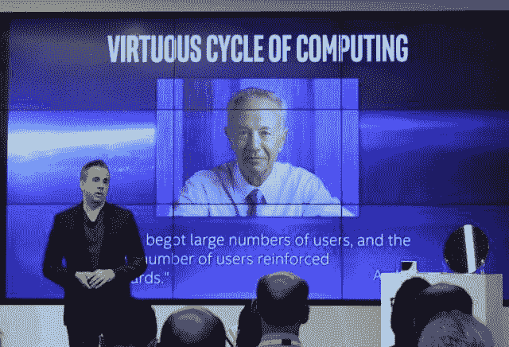

# 英特尔与 CoreOS、Mirantis 合作构建“通用资源调度器”

> 原文：<https://thenewstack.io/intel-coalesce-coreos-mirantis-universal-resource-scheduler/>

容器化和 OpenStack 最终会渗透到大规模实时工作负载领域吗？在周四上午在旧金山举行的媒体和投资者活动中，英特尔宣布了与集装箱化平台提供商 CoreOS 和 OpenStack 平台制造商 Mirantis 的下一阶段合作，目标是最终打破这一障碍。

英特尔公司副总裁兼云平台事业部总经理杰森·瓦克斯曼(Jason Waxman)表示:“我们正在做出新的努力，以确保我们将几个世界的精华结合在一起，创造出一种通用的资源调度器，既可以支持虚拟机，也可以支持容器。”

## 对决定论的追求

世界主要数据中心采用高度可扩展工作负载的最大障碍之一是解决*确定性*-这些工作负载流的实时可预测性和可管理性。金融机构、高端医疗保健提供商和电信公司已经推迟采用容器化甚至普通虚拟化，因为增加的抽象层产生了一定程度的不可预测性，在大规模情况下，将多个租户的实时工作负载扩展到数千台服务器是不切实际的。

CoreOS 首席执行官 Alex Polvi 在英特尔云日活动的与会者中表示，他认为客户需要一个涵盖所有工作负载部署的广泛的水平堆栈，包括作为管理层的 Kubernetes 和作为基础设施即服务提供商的 OpenStack。“这是为那些希望用一个基础设施来统治他们所有人的公司准备的，”Polvi 说，“给他们容器和虚拟机的好处。”

这个合作伙伴的三个成员没有在这么早的时候透露调度程序的技术细节。但是，根据我们之前在[英特尔的 Clear Container initiative](https://thenewstack.io/securing-containers-intels-clear-containers/) 中看到的情况，再加上今天英特尔发布的新公告，很明显，英特尔希望进军其基于硬件的虚拟化技术英特尔 VT。VT 最初旨在为虚拟机管理程序提供微编码硬件资源，完全跳过操作系统，它也有机会为容器化平台提供资源调度优势，尤其是 CoreOS 自己的 constructive。

透明容器是为利用 VT 而设计的，但随着 OCI 的容器行业标准化，从英特尔的角度来看，透明容器可能总是被视为“替代”容器系统。CoreOS 非常了解那个职位的感觉。

因此，这种新的合作关系可能会为 Mirantis OpenStack 带来一种方法，以托管 Kubernetes 并协调所有形式的容器化工作负载，包括 CoreOS 的**rkt**和英特尔 Clear Containers，至少可以在相同的服务器上处理 VM 工作负载。新发布的英特尔至强服务器处理器将包括片上特性，使协调器能够控制对这些处理器高速缓存的访问。这将为更具确定性的工作负载带来更好的可扩展性，即像 NASDAQ 这样的客户所需要的实时类。

## 抖动的终结

纳斯达克首席技术架构师 Sandeep Rao 说:“在过去的十年中，很明显，你对这些交易的工作速度的敏感度已经发生了巨大的变化。“19 年前，当我开始[*]时，人们会期待两秒钟的响应时间；现在好像是几十微秒。*

Rao[*说:“金融服务实际上没有在其核心平台上进行虚拟化的原因之一是因为虚拟机管理程序提供了一层不确定性。*

当一个工作负载被虚拟化后，它的性能会受到工程师所说的*抖动*的影响。在这种情况下，流程花费的时间无法在多次迭代中保持稳定。因此，像 NASDAQ 这样的操作不可能可靠地协调一个过程来检查任意时间单位(例如 100 或 1000 个周期)内的市场价值变化，因为周期时间变成了抖动变量的系数。谁知道你会乘以什么？

Rao 解释说，其结果是，纳斯达克将在不同的数据中心上运行其业务——一个用于日常会计等不太关键的工作负载，另一个用于市值评估等高度关键的工作负载。这种双重性让交易提供商付出了沉重的代价，Rao 表示，由于英特尔至强 E5 v4 处理器(该公司 E5 产品线的第 4 版)的测试部署，他相信现在可以节省这笔费用。

这些 E5 v4 处理器将实现一项奇怪的技术，该公司开始使用这项技术为其至强 E5 v3 系列进行实验。这项技术被称为资源管理器，它允许编排器向处理器发出调用，对处理器的缓存进行分区，以便虚拟机(以及现在的容器化平台)不会过度利用内存缓存。这种过度利用触发了导致不确定性工作负载的“缓存未命中”，而这正是纳斯达克表示其数据中心不允许出现的现象。

Rao 告诉与会者，Xeon E5 v4 在这一点上足够稳定，纳斯达克可以正式将该产品线用于能够在一个平台上调度所有类型工作负载的单一统一数据中心。

## 良性循环

这就是 CoreOS / Mirantis / Intel 合作关系的切入点。为了实现 NASDAQ 现在要求的大规模可预测性，需要一个统一的调度程序标准:一个绕过任何单一供应商的专有或首选机制来大规模部署工作负载的标准。

英特尔的瓦克斯曼说:“我现在最关心的努力之一，也是对云计算效率最重要的努力之一，是一个通用资源调度程序。”

“有很多有趣的容器，也有新的公司涉足虚拟机，他们需要一个高效的调度程序来放置工作负载和自动化他们的云。如果没有一个高效的、真正开放的调度程序，这个行业就不会按照需要的速度发展。”

为了在 OpenStack 上大规模采用集装箱化，Mirantis 首席执行官 Alex Freedland 说，“它需要简单，易于客户消费。最终，此次[ *URS* 的推出为客户带来的价值将是一个平台，它可以在一个平台上运行容器、裸机和虚拟机，并且无需增加资源来管理它们即可进行扩展。

“你必须确保它是非常简化的生命周期管理，”Freedland 补充道，并引用了来自美国电话电报公司的统计数据，该数据中心大约 50%的支出由生命周期管理组成。

韦克斯曼在周四做了一个有趣的观察，引用了英特尔联合创始人安迪·格罗夫的观察(他于本月早些时候在 T4 去世，享年 79 岁)。Grove 指出了组织为创建标准的过程做出贡献的良性循环，这反过来有助于推动人们与建立标准的组织合作。但韦克斯曼指出，这一过程可能需要不时启动。

“尽管开源是标准的重要推动者之一，也是这种良性循环的重要推动者，”Waxman 说，“但我们仍然看到人们不愿开源的情况，他们没有提供真正使[*标准化*]向前发展的全部功能和能力。在英特尔，我们不会坐视这种事情发生。我们必须参与其中；我们必须做出新的努力。”

<svg xmlns:xlink="http://www.w3.org/1999/xlink" viewBox="0 0 68 31" version="1.1"><title>Group</title> <desc>Created with Sketch.</desc></svg>