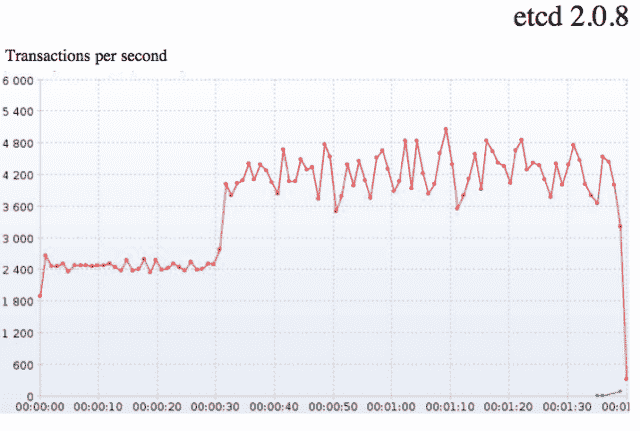
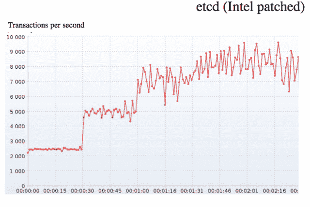

# 英特尔给了 Etcd 键值存储一个必要的推动力

> 原文：<https://thenewstack.io/intel-gives-the-etcd-key-value-store-a-needed-boost/>

Etcd 是用于共享配置和服务发现的分布式键值。Google Kubernetes，Cloud Foundry，Red Hat 都用 etcd。

正如 CoreOS 的 Blake Mizerany 为[的新堆栈](https://www.google.com/url?q=http%3A%2F%2Fthenewstack.io%2Fabout-etcd-the-distributed-key-value-store-used-for-kubernetes-googles-cluster-container-manager%2F%3Fpreview%3Dtrue%26preview_id%3D2302%26preview_nonce%3D0072a9e20d%26post_format%3Dstandard&sa=D&sntz=1&usg=AFQjCNEpB0tkcb9055tqBZvlxqApD4iMlA)所写的，“Etcd 为集群协调和状态管理提供了一个规范的中枢，从而成为分布式系统的主干——系统的真理之源。虽然 etcd 是专门为运行 CoreOS 的集群构建的，但它可以在包括 OS X、Linux 和 BSD 在内的各种操作系统上运行。”

etcd 服务被用于[建筑](https://thenewstack.io/coreos-tightens-fit-with-kubernetes-raises-12m-from-google-ventures/)，这是 CoreOS 的一个新平台，结合了其产品组合和 Kubernetes——谷歌用于管理容器化应用的开源项目。在上周的 CoreOS Fest 上，英特尔宣布他们正在开发一种构造堆栈。当 CoreOS 使大地构造堆栈普遍可用时，英特尔将通过 Redapt 和 Supermicro 使其商业化。

## 理解问题

为了使构造堆栈成为现实，英特尔必须理解 Kubernetes 社区所评论的一个特殊的扩展问题。Kubernetes 有规模限制。

他们如何解决这个问题表明了新技术并不总是解决分布式架构所带来的挑战的答案。有时候，是几十年前开发的技术造成了差异。

## 一些背景

谷歌开发了 [Kubernetes](https://github.com/googlecloudplatform/kubernetes) ，一个编排系统[，它基于 Borg](https://thenewstack.io/google-lifts-the-veil-on-borg-revealing-apache-auroras-heritage/)——它自己的容器系统，管理谷歌的几乎所有事情。structural 是 CoreOS 开发的一项新服务，它将其操作系统和组件与 Kubernetes 结合在一起。这种结合有望让任何需要以某种方式扩展业务的企业客户都可以使用谷歌的基础设施。

CoreOS 上个月从 Google Ventures 获得了 1200 万美元，它以用于大规模服务器部署的以容器为中心的 Linux 发行版和用于自动更新服务器的安全分布式平台而闻名。就像 Chrome 浏览器自动更新一样，用于 Linux 服务器部署的 CoreOS 也会自动更新。它被 MemSQL、Rackspace 和 Atlassian 等公司使用。

Etcd 使用 [Raft 共识算法](https://raftconsensus.github.io/)。在 Raft 共识算法网页上，共识被描述为容错分布式系统的基本问题。共识包括所谓的多个服务器在价值观上达成一致。一旦对某个价值做出决定，该决定就是最终决定:

当大多数服务器可用时，典型的一致性算法取得进展；例如，一个包含 5 台服务器的集群即使有 2 台服务器出现故障，也可以继续运行。如果更多的服务器出现故障，它们将停止运行(但永远不会返回错误的结果)。

Raft 创造者写的一篇论文提供了对该算法更详细的分析。

在 etcd 中，Raft 共识算法在 3 到 9 个对等体之间的小型集群中最有效。对于大于 9 个对等点的集群，etcd 选择一个实例子集来参与算法，以保持算法的效率。

根据 CoreOS 的说法，当写入 etcd 时，对等体会重定向到集群的领导者，然后领导者会立即重定向回对等体:

只有当大多数对等体确认写入时，写入才被认为是成功的。

正如 CoreOS 所描述的[，这意味着在一个由五个对等机组成的集群中，写操作的速度仅次于第三快的机器。在集群操作能够继续之前，领导者由大多数活跃的对等体选出。在此过程中，大规模运行时，写入性能会成为一个问题，因为在群集操作可以继续之前，对等方必须确认领导者，这在写入高延迟环境(如跨多个数据中心的群集)中的性能时会成为一个问题。](https://coreos.com/docs/cluster-management/scaling/etcd-optimal-cluster-size/)

新兴技术总监 Nicholas Weaver 领导下的英特尔团队首先研究了 Raft 协议，以找到瓶颈。

他们在 etcd 代码中发现，跟随者的每个入站条目都是在向领导者确认之前写入磁盘的。韦弗有仓储方面的背景。他看了看参赛作品的数量，意识到这些东西在规模上可以变得多么昂贵。可能的原因是:需要看起来像“[稳定的存储](https://en.wikipedia.org/wiki/Stable_storage)”

[稳定存储](https://en.wikipedia.org/wiki/Stable_storage)的概念在科技史上根深蒂固。根据维基百科，“稳定存储是计算机数据存储技术的一种分类，它保证任何给定写操作的[原子性](https://en.wikipedia.org/wiki/Atomicity_(database_systems) "Atomicity (database systems)")，并允许编写对一些硬件和电源故障具有鲁棒性的软件。为了被认为是原子的，在读回刚被写入的磁盘部分时，存储子系统必须返回写数据或者在写操作之前在该部分磁盘上的数据

稳定存储提供了对 20 世纪 80 年代后期的看法，当时对镜像数据的需求成为更高层次的需求，仅仅是因为使用大型机(当时的大型计算机)带来的成本。同样，从维基百科来看， [RAID](https://en.wikipedia.org/wiki/RAID#History) 控制器作为实现磁盘写入算法的方式，然后允许磁盘作为稳定存储的手段。

但这一切都存在一个问题，即 Raft 协议要求确认所有写入。这就是 DRAM 的用武之地，更具体地说，“异步 DRAM”(ADR)，根据英特尔的说法，这是一种自动将内存控制器缓冲区刷新到系统内存中的功能，并在电源故障时将 [DDR](https://en.wikipedia.org/wiki/DDR_SDRAM) 置于自刷新模式。

为了减少存储到磁盘的延迟影响，Weaver 的团队将缓冲作为一种手段来吸收写入并定期将它们同步到磁盘，而不是针对每个条目。

权衡？他们知道内存缓冲区会有所帮助，但如果它们违反了稳定存储的要求，较小的集群可能会有潜在的困难。

相反，他们向英特尔的芯片架构师咨询了至强产品线的特性。在描述了核心问题之后，他们发现这个问题已经在 ADR 的其他领域得到了解决。在做了一些工作来证明 Linux 操作系统支持这种用法之后，他们确信他们有一个两全其美的角度。

而且成功了。正如 Weaver 在他的 CoreOS Fest 讨论中详细描述的那样，响应时间被证明是稳定的。ADR 可以抓取内存的一部分，将其保存到磁盘上，然后重新通电。它可以将条目返回到磁盘，并恢复到缓冲区。ADR 提供了使小(<100MB) segments of memory “stable” enough for Raft log entries. It means it does not need battery-backed memory. It can be orchestrated using Linux or Windows OS libraries. ADR allows the capability to define target memory and determine where to recover. It can also be exposed directly into libs for runtimes like Golang. And it uses silicon features that are accessible on current Intel servers.

Using the new capability, Intel did its work with Raft and etcd in the lab. They tested a five node etcd cluster and found the maximum number of writes without ADR is about 4,000 to 5,000 writes per second:

 )的能力

通过 ADR，etcd 可以处理大约 10，000 笔交易，交易速度基本上翻了一番:

## 这一切意味着什么

Weaver 和他的团队展示了单台机器的状态如何与分布式系统有许多共同之处。不同之处在于如何管理国家。在某些方面，它归结于什么被监控。直到最近，最有价值的工具还在监控客户机/服务器环境中的机器。

上周我和 SignalFx 创始人兼首席执行官 Karthik Rau 谈到了这个话题。在我们的对话中，我们讨论了容器，它们的行为要求人们收集数据并进行分析，以便应用程序能够跨集群相应地工作。

最重要的是，这意味着人们交流方式的改变。应用程序是宇宙的中心。计算将越来越多地涌向数据，这将通过微服务架构实现自动化和协调。这些服务将由可移植的一次性容器组成，连接到 git 环境和其他地方。容器在这些架构上的编程和行为方式意味着人们自己需要有不同的通信模式。这是一个商业问题，不能用组织结构图来解决。速度和延迟等问题的答案将在数据中浮出水面。

<svg xmlns:xlink="http://www.w3.org/1999/xlink" viewBox="0 0 68 31" version="1.1"><title>Group</title> <desc>Created with Sketch.</desc></svg>