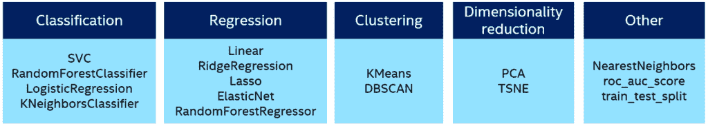

# 面向 Python 机器学习的英特尔 oneAPI 统一编程模型

> 原文：<https://thenewstack.io/intel-oneapis-unified-programming-model-for-python-machine-learning/>

流行的 [Scikit-learn](https://scikit-learn.org/stable/) Python 机器学习工具包是一个简单而强大的经典机器学习框架。如果您正在训练基于线性回归、逻辑回归、决策树或随机森林算法的模型，Scikit-learn 是首选。

在经典的机器学习中，人们被期望执行特征工程——识别正确的属性——并挑选与业务问题一致的正确算法。对于基于存储在关系数据库、电子表格和平面文件中的结构化数据的大多数问题，这是正确的方法。

另一方面，深度学习是[机器学习](https://thenewstack.io/category/machine-learning/)的子集，它依赖于大型数据集和海量计算能力来识别数据中的高级特征和隐藏模式。当基于图像、视频和音频等非结构化数据训练模型时，基于定义良好的神经网络架构的深度学习技术受到 ML 工程师和研究人员的青睐。

除了 Scikit-learn 之外，其他高级 AI 框架，如 TensorFlow、PyTorch、Apache MXNet、XGBoost 等，可用于基于结构化或非结构化数据集和各种算法的训练模型，这些算法用作深度学习和经典机器学习工作流的一部分。ML 研究人员和工程师更喜欢这些框架的版本，它们已经针对加速性能进行了优化。人工智能加速是通过硬件和软件的结合来实现的。

Apache MXNet、TensorFlow 和 PyTorch 等深度学习框架利用了基于[英伟达 CUDA](https://developer.nvidia.com/cuda-zone) 和 [cuDNN](https://developer.nvidia.com/cudnn) 的加速软件，这些软件提供了与底层英伟达 GPU 的接口。AMD 通过异构接口提供了类似的可移植性组合( [HIP](https://rocmdocs.amd.com/en/latest/Programming_Guides/LanguageInto.html#hip-heterogeneous-computing-interface-for-portability) )和 [ROCm](https://rocmdocs.amd.com/en/latest/) ，提供了对 AMD GPUs 的访问。在这些情况下，人工智能加速直接关注 GPU、软件驱动程序、运行时和库。深度学习框架与人工智能加速软件紧密集成，以加快深度学习模型在各自 GPU 上的训练和推理。

虽然 GPU 在深度学习培训中被广泛使用，但 CPU 在完整的端到端人工智能工作流中更普遍:数据预处理/分析以及机器和深度学习建模/部署。事实上，您可能会惊讶地发现，英特尔至强可扩展处理器是从云到人工智能边缘最广泛使用的服务器平台。

英特尔一直处于一项名为 [oneAPI](https://www.oneapi.io/) 的计划的最前沿，这是一种跨行业、开放、基于标准的统一编程模型，针对多种架构，包括前述的 CPU 和 GPU、FPGAs 和其他[人工智能加速器](https://www.intel.com/content/www/us/en/developer/topic-technology/artificial-intelligence/tools.html)。oneAPI 工具包作为一套与 HPC、AI、物联网和光线跟踪用例相一致的工具包，可供开发人员使用。

英特尔 oneAPI 人工智能分析工具包(AI Kit)通过熟悉的 Python 工具和框架面向数据科学家和人工智能工程师。它是英特尔端到端套件[人工智能开发工具](https://www.intel.com/content/www/us/en/developer/topic-technology/artificial-intelligence/overview.html)的一部分，并带有针对 Scikit-learn、XGBoost、TensorFlow 和 PyTorch 的[优化人工智能框架](https://www.intel.com/content/www/us/en/developer/tools/frameworks/overview.html)。

对于使用机器学习工作流的开发人员和数据科学家来说， [AI Kit](https://www.intel.com/content/www/us/en/developer/tools/oneapi/ai-analytics-toolkit.html#gs.mqfoqv) 最有趣的组件是针对 CPU 进行了高度优化的英特尔 Modin 分发版和英特尔 Scikit-learn 扩展，有望实现 10-100 倍的性能提升。这些框架最好的一点是它们与 Pandas 和 stock Scikit 完全兼容。

让我们更深入地了解一下英特尔发布的 Modin 和英特尔 Scikit-learn 扩展。

## 英特尔发布的摩丁

[英特尔分布式 Modin](https://www.intel.com/content/www/us/en/developer/tools/oneapi/distribution-of-modin.html) 是一个高性能、并行、分布式、兼容 pandas 的数据帧加速系统，旨在帮助数据科学家提高工作效率。这个库与 Pandas API 完全兼容。它在后端由 OmniSci 提供支持，并在英特尔平台上提供加速分析。

Modin 兼容 Pandas，同时通过 Ray 和 Dask 实现分布式数据处理。它是 Pandas 的替代产品，可将单线程 Pandas 转换为多线程 Pandas，使用所有 CPU 内核并即时加快数据处理工作流程。摩丁尤其擅长大型数据集，在这种情况下，熊猫要么耗尽内存，要么变得极其缓慢。

Modin 还有一个丰富的前端，支持 SQL、电子表格和 Jupyter 笔记本。

数据科学家可以很容易地切换到 Modin，以利用并行数据处理能力，同时使用熟悉的 Pandas API。

安装 Modin 很简单。它可通过英特尔 oneAPI AI 分析工具包的 Conda 包管理器获得。

```
conda create  -n  aikit-modin intel-aikit-modin  -c  intel  -c  conda-forge
conda activate aikit-modin

```

下面的代码片段显示了使用摩丁是多么简单:

```
import modin.pandas as pd
df  =  pd.read_csv('~/trips_data.csv')
df.groupby("cab_type").size()

```

## 英特尔 Scikit 扩展-了解

用于 Scikit-learn 的[英特尔扩展](https://www.intel.com/content/www/us/en/developer/articles/guide/intel-extension-for-scikit-learn-getting-started.html)提供了许多 scikit-learn 算法的优化实现，这些算法与原始版本保持一致，并提供更快的结果。当您使用扩展不支持的算法或参数时，该包简单地恢复到 Scikit-learn 的原始行为，这为开发人员提供了无缝体验。无需重写新代码，您的 ML 应用程序可以像以前一样工作，甚至更快。

英特尔 Scikit-learn 扩展支持 Scikit-learn 开发人员常用的经典机器学习算法。



学习速度的加速是通过打补丁实现的，打补丁用扩展提供的优化版本替换了常用的 scikit-learn 算法。模块的安装可以通过 conda 或 pip 完成。

```
pip install scikit-learn-intelex
conda install scikit-learn-intelex  -c  conda-forge

```

作为一种替代方案，使用英特尔扩展 Scikit-learn 非常简单。只需将下面几行代码添加到您的代码中:

```
from sklearnex import patch_sklearn
patch_sklearn()

```

在即将发布的教程中，我将演示如何安装和使用英特尔 oneAPI AI Analytics Toolkit 来训练线性回归模型。敬请关注。

<svg xmlns:xlink="http://www.w3.org/1999/xlink" viewBox="0 0 68 31" version="1.1"><title>Group</title> <desc>Created with Sketch.</desc></svg>