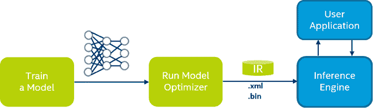

# 英特尔 OpenVINO 将人工智能推理带到桌面和边缘

> 原文：<https://thenewstack.io/intel-openvino-brings-ai-inferencing-to-the-desktop/>

云可能是训练[深度学习模型](/deep-learning-broadens-the-reach-of-artificial-intelligence/)的最佳环境，但推理总是在服务器、台式机、手机和边缘设备上进行。[人工智能](/category/machine-learning/) (AI)融合的应用依赖于硬件和软件的结合，来加速在云中训练的深度学习模型的推理。

英特尔希望开发人员在处理人工智能推理时，无论环境如何，都依赖于一个标准、统一的平台。 [OpenVINO Toolkit](https://software.intel.com/en-us/openvino-toolkit) 是一个平台，旨在加速 PC、MAC、服务器和嵌入式设备上的人工智能推理。它还支持各种硬件加速器，包括高端 CPU、独立 GPU、视觉处理单元(VPU)和现场可编程门阵列(FPGA)。开发人员受益于 OpenVINO Toolkit 的可插拔架构所提供的抽象。

OpenVINO 代表开放视觉推理和神经网络优化。该工具包最初于 2018 年推出，在构建下一代基于计算机视觉的应用程序的开发人员和企业中广受欢迎。

OpenVINO Toolkit 支持以下硬件:

*   英特尔 CPU
*   英特尔集成显卡
*   英特尔 FPGA
*   英特尔 Movidius 神经计算棒和神经计算棒 2
*   基于 Myriad VPU 的英特尔视觉加速器设计

软件平台包括加速推理的基本组件。

### 深度学习模型优化器

模型优化器是一个跨平台的命令行工具，可以将深度学习模型从培训过渡到部署环境。它执行静态模型分析，以调整深度学习模型，从而在目标设备上实现最佳执行。

开发人员可以带来一个经过全面训练的深度学习模型，并通过模型优化器对其进行优化以进行推理。

模型优化器支持各种主流深度学习框架，包括 TensorFlow、Caffe2、Apache MXNet、Kaldi 和 ONNX。与用于训练模型的框架无关，优化器总是生成两个文件—一个描述网络拓扑的 XML 文件，一个包含权重和偏差二进制数据的 BIN 文件。

### 推理机

使用 OpenVINO Toolkit 的开发人员将模型优化器生成的 IR 文件加载到特定于目标硬件的推理引擎(IE)插件中。IE 插件负责通过将 IR 文件卸载到可用的硬件来利用加速器。例如，通过改变 IE 插件的一个参数，开发人员将能够将加速从 x86 CPU 切换到 Myriad X VPU。

推理机是一个 C++库，有一组 C++类来推断输入数据(图像)并得到一个结果。C++库提供了一个 API 来读取中间表示，设置输入和输出格式，并在设备上执行模型。

推理引擎库可以在 Linux(**libinference _ Engine . so**)和 Windows(**Inference _ Engine . dll**)上作为二进制文件使用。预览版中提供了该库的 Python 绑定。

### 集成 OpenCV 和 OpenVX 环境

OpenCV 是构建基于计算机视觉的应用程序最流行的库之一。从 [OpenCV 4.0](https://opencv.org/opencv-4-0/) 开始，该库与英特尔 OpenVINO Toolkit 完全集成。OpenCV 的 DNN 组件可以将推理委托给一个可用的加速器。例如，通过更改基于 OpenCV 的标准推理应用中的几行代码，开发人员将能够加载红外文件，并将其用于英特尔 Myriad X VPU。在幕后，OpenCV 将执行委托给执行加速的推理引擎。

OpenCV 和 OpenVINO 之间的紧密集成为传统的计算机视觉应用打开了大门，以利用最新的人工智能加速器。

OpenVX 是一个软件开发包，用于为英特尔片上系统(SOC)开发和优化计算机视觉和图像处理流水线。该工具包为低级图像处理和计算机视觉原语提供了一组优化的原语。

### 工具、示例和模型动物园

OpenVINO 工具包附带了多个工具和示例来帮助开发人员学习工作流。

虽然大多数示例都是用 C++编写的，但是其中许多可以很容易地移植到 Python 中。图像分类、对象检测、神经类型转移是工具包中包含的一些示例。

英特尔为开发者做的最好的事情是[模型动物园](https://github.com/opencv/open_model_zoo)，它为 OpenVINO 工具包优化了模型。开发人员可以下载文件的 XML 和 BIN 组合，并直接在他们的代码中使用它们。

模型动物园有十几个经过全面训练和优化的模型，用于人脸检测、情绪检测、头部姿势估计、文本检测、文本识别等等。

### 摘要

英特尔 OpenVINO Toolkit 帮助该公司在推理人工智能模型方面获得市场份额和思想份额。与 OpenCV、OpenVX 和 ONNX 的紧密集成使该平台更接近深度学习开发者。独立的软件供应商和独立的设备供应商将接受 OpenVINO Toolkit 作为人工智能推理的标准运行时。

下周，我将带您了解在 Ubuntu 上安装和配置 OpenVINO Toolkit 的步骤。我们还将探讨将 OpenCV 与 OpenVINO Toolkit 和英特尔 Myriad X VPU 配合使用来加速边缘物体检测的概念。敬请关注。

通过 Pixabay 的特征图像。

<svg xmlns:xlink="http://www.w3.org/1999/xlink" viewBox="0 0 68 31" version="1.1"><title>Group</title> <desc>Created with Sketch.</desc></svg>