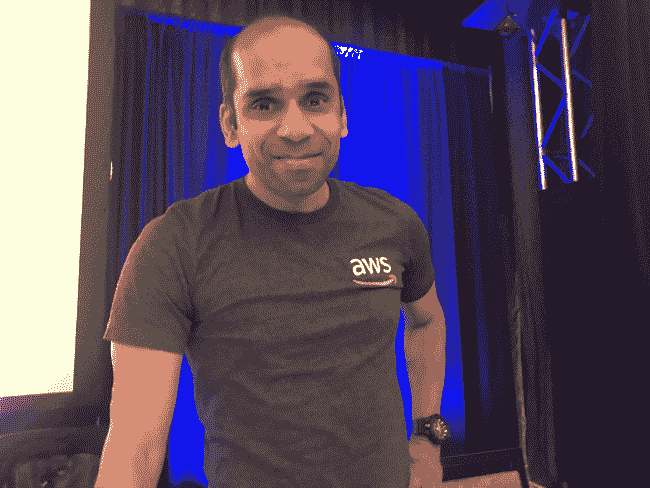

# 英特尔从网飞和苹果挖来开源高管，推动 Linux 的发展

> 原文：<https://thenewstack.io/intel-poaches-open-source-execs-from-netflix-apple-to-boost-linux-efforts/>

芯片制造商英特尔最近几周从苹果和网飞等公司挖来了开源老手，希望清理 Linux 内核，重建与开源社区的对话。

这家芯片制造商上个月聘请了前苹果公司的[阿伦·古普塔](https://www.linkedin.com/in/arunpgupta/)为副总裁兼开放生态系统总经理。不久之后，该公司选择了[布兰登·格雷戈](https://www.brendangregg.com/)，他以前是来自网飞的 Linux 性能工具专家，成为英特尔研究员。

“我正在吸引一些业内最优秀的人才。他们离开大公司，来到英特尔，是因为……我和[首席执行官帕特·基尔辛格]正在推动我们软件第一的承诺。我们的开源承诺又回来了，”英特尔首席技术官格雷格·拉文德在上周的视觉贸易展的新闻发布会上说。

英特尔雇佣了 17，000 名软件工程师，仍然是 Linux 内核的最大贡献者之一。该公司严重依赖开源社区来开发底层软件，以便向企业销售更多芯片。

拉文德说，英特尔将很快恢复其与开源社区的公开接触和对话，这一努力近年来有所减弱。该公司以前通过其开源技术中心和网站 01.org 与开源社区合作，这两个网站现在都处于休眠状态。领导公司开源工作的 Imad Sousou sou 于 2020 年离开英特尔。

## 开源视觉

英特尔在达拉斯附近的 Vision 贸易展上概述了其软件优先战略，该展会最终更像是 9 月份在旧金山举行的[创新大会](https://www.intel.com/content/www/us/en/events/on-event-series/innovation.html)上即将发布的重大公告的预演活动。

在 2019 年的 O'Reilly 软件大会上，当时在 AWS 的 Arun Gupta 向 Java 开发人员介绍了 Kubernetes。

该公司的首要任务是清理 Linux 内核，以支持由人工智能等应用驱动的新型计算。确定性工作负载在很大程度上依赖于人工智能芯片和 GPU 等加速器，英特尔近年来推出了这些加速器，并与公司的 CPU 相邻工作。

Lavender 说，特定的 Linux 发行版仍然支持 1999 年的 x86 体系结构和硬件，现在是时候清理代码并添加对新硬件的支持了。

首先，英特尔正试图解决线程锁定等导致 CPU 周期浪费和能源使用过剩的问题。

“我认为，整个行业都可以为开源生态系统提供更好的质量。这一点与 Linux 内核没有特别的关系，并使它对糟糕的代码更有弹性，”拉文德说。

今年早些时候，英特尔低调收购了德国开源公司 Linutronix。通过这次收购，英特尔还得到了创始人 [Thomas Gleixner](https://www.linuxfoundation.jp/blog/2017/12/linux-kernel-developer-thomas-gleixner/) ，他是开源社区中一个直言不讳但非常突出的声音。

Linutronix 是 [PREEMPT_RT 补丁集](https://rt.wiki.kernel.org/index.php/CONFIG_PREEMPT_RT_Patch)的设计师，它允许 Linux 内核优先处理实时应用程序。由于缺乏开发人员和财务承诺，patchset 已经衰落了大约 20 年，但英特尔的参与将有助于它更快地上游到主流 Linux 内核。

## AI 工厂

“我们希望推动更多实时 Linux 功能，因为对于边缘和汽车行业来说，这是一项很好的投资。拉文德说:“在我们进行这些投资的时候，我们希望将这些投资的最大收益转化为现金。

芯片制造商正依靠软件模式获得更多收入，这种模式是在芯片上提供服务。例如，英特尔正寻求通过其最近收购的另一家公司[gratey 提供代码优化服务。英特尔正在采取一种更传统的开源方法，让合作伙伴开发工具，英特尔通过将其服务嵌入代码来赚钱。](https://techcrunch.com/2022/03/31/intel-confirms-acquisition-of-granulate-reportedly-for-up-to-650m-bringing-ai-based-workload-optimization-into-its-fold)

英伟达通过捆绑其软件、硬件和服务，采取了一种很大程度上封闭源代码的方法。例如，英伟达正在提供其所谓的“人工智能工厂”，包括其 GPU、软件栈和数据集。公司可以将原始的人工智能请求放入英伟达的工厂，输出的是一个完全实现的人工智能产品，可以随时部署。

<svg xmlns:xlink="http://www.w3.org/1999/xlink" viewBox="0 0 68 31" version="1.1"><title>Group</title> <desc>Created with Sketch.</desc></svg>