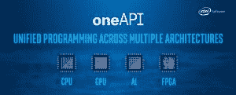

# 英特尔推动 oneAPI 工具包中的跨架构支持

> 原文：<https://thenewstack.io/intel-pushes-cross-architecture-support-in-oneapi-toolkits/>

英特尔长期以来一直是服务器、个人电脑和一系列其他企业系统的计算芯片的主要制造商，在许多这些类别的市场份额在 80%至 90%以上。

然而，在过去的十年里，英特尔已经看到竞争的水域变得越来越波涛汹涌。这仅仅是因为 [AMD 凭借其 Zen 微架构和](https://thenewstack.io/cpu-benchmarks-for-cloud-providers-intel-vs-amd-vs-amazons-arm-based-graviton2/) [Arm 构建的芯片实力崛起](https://thenewstack.io/arm-looks-to-supercharge-iot-software-development/)为其低功耗架构开辟了一条从移动世界进入数据中心的道路，但也是因为加速器的崛起，如[英伟达](https://thenewstack.io/nvidia-gpus-nudge-hpe-supercomputer-into-the-exascale/)的 GPU、AMD 现在的英特尔、现场可编程门阵列(FPGAs)和更具体的芯片，如 DPUs(数据和数字处理单元)、IPUs(智能处理单元或英特尔用于云的[基础设施处理单元](https://www.intel.com/content/www/us/en/newsroom/news/infrastructure-processing-unit-data-center.html#gs.m719vu)

系统芯片和加速器日益多样化，使得开发人员的生活变得困难，他们不得不从一种架构跳到另一种架构，为每种架构使用不同的工具。

英特尔工程师 James Reinders[告诉新的堆栈:“如果曾经有过‘一刀切’硬件的日子，现在已经一去不复返了。”。“现在，我们看到越来越多的新型硬件被设计成更好的捕鼠器，以此来分一杯羹。争夺“最佳 GPU”的战斗确实在升温，但 FPGA 解决方案以及加速机器学习、推理和其他人工智能(AI)工作负载的 ASICs 或定制设计也在升温。”](https://www.linkedin.com/in/jamesreinders/)

## **一致性是关键**

Reinders 说，在这样的环境中，开发人员需要能够在整个企业中一致地部署软件，这从帮助他们的程序一致地跨越多样性开始。这就是英特尔 oneAPI 计划的起源，该计划于 2018 年宣布，经过测试后，将于 2020 年正式发布。

OneAPI 旨在为开发人员提供一个开放的基于标准的统一编程模型，用于英特尔不断增长的硬件阵列，包括其 CPU 和加速器，如 GPU 和 FPGAs。

Reinders 说:“为了让应用程序能够跨越如此多不同类型的加速器硬件，我们需要能够帮助软件开发人员的解决方案。“OneAPI 通过普遍采用‘所有加速器都可以平等访问’的方法来实现这一点。作为一名开发人员，我想学习如何编写一次程序，然后不管硬件如何都使用它。”

这包括从调试器和库到编译器、分析工具和框架的一切，所有这些都可以支持硬件，而不需要为每个硬件创新或供应商提供不同的工具。他说，在对异构机器(使用加速器的机器)进行编程时，需要的包括枚举运行时可用的设备，将工作卸载到可用的设备，错误恢复，安全性，安全性，一整套开发工具和“预装解决方案”库，以使编程更容易。

据 Reinders 称，OneAPI 提供了一种开放的、多供应商和多架构的方法来解决异构计算问题。

## **软件成为英特尔的焦点**

软件已经成为英特尔的一个重点。在过去的一年里，在首席执行官[帕特·基尔辛格](https://www.linkedin.com/in/patgelsinger/)的领导下，该公司采取了一系列举措和投资，以确保其作为关键芯片制造商的地位。然而，Gelsinger 也接受了“软件优先”的方法，即承认在混合云和边缘、正在生成的数据和人工智能、机器学习和分析等新兴工作负载的爆炸时代，共同的统一因素是软件。

盖尔辛格请来了[格雷格·拉文德](https://www.linkedin.com/in/greglavender/)担任公司首席技术官和高级副总裁兼英特尔新软件和先进技术事业部总经理。去年，拉文德告诉记者，英特尔的“观点是，给市场选择，给开发者选择，我们希望成为值得信赖的合作伙伴，提供大量开源技术，我们已经这样做了，但在过去几年里我们没有谈论太多。”

## **新的 oneAPI 2022 工具包**

英特尔最近发布了 oneAPI 2022 工具包，进一步扩大了开发人员可以利用的跨架构功能的数量，包括通过 oneAPI 库对 Python 、C++、OpenMP、MPI、Fortran、SYCL 和 C 等[语言编程的高性能支持。](https://thenewstack.io/guido-van-rossums-ambitious-plans-for-improving-python-performance/)

oneAPI 工具的第四个版本(2021.4)包括新的跨架构功能，如使用通用 LLVM 后端为 CPU 和 GPU 实施 C++、SYCL 和 Fortran 的统一编译器，为 CPU 和 GPU 加速计算的数据并行 Python，以及一个改进的 DPC++兼容性工具，可自动将多达 95%的 CUDA 代码迁移到 SYCL/DPC++。CUDA 是 Nvidia 为其 GPU 在异构计算环境中开发的编程模型。

## **对开发者的跨架构支持**

英特尔官员指出， [Evans Data](https://evansdata.com/) 的一项调查显示，40%的开发者瞄准异构系统，这些系统需要能够将 CPU 和为其提供动力的加速器联系在一起的软件。OneAPI 使用一种开放的方法来支持这种机器，而不考虑供应商或架构。

“我们需要这种类型的未来，以利用我们希望从中受益的硬件平台的丰富多样性，”Reinders 说。“如果我们不能通过跨架构来帮助软件跨越这种硬件多样性，那么我们需要跨不同机器支持的软件堆栈的数量将会激增。”

他说，结果将是部署系统和支持系统的开发人员的 IT 成本增加。

新的工具包还支持当前和即将推出的新芯片，包括英特尔的至强“Sapphire Rapids”CPU(该供应商的第四代至强可扩展处理器产品)和用于数据中心系统和客户端的 Xe GPUs。

其他新功能包括:由于对开源 [TensorFlow](https://thenewstack.io/train-a-tensorflow-model-with-a-kubeflow-jupyter-notebook-server/) 和 [PyTorch](https://thenewstack.io/tutorial-train-a-deep-learning-model-in-pytorch-and-export-it-to-onnx/) 机器学习平台的优化改进，深度学习框架性能提高了 10 倍，[英特尔的神经压缩器](https://www.intel.com/content/www/us/en/developer/tools/oneapi/neural-compressor.html)可实现更好的机器学习推理性能，CPU 和加速器的性能分析，高级光线跟踪和扩展的开发环境支持，包括更深入的 Microsoft Visual Studio 代码集成，对 Microsoft Visual Studio 2022 和 Microsoft ws L2 for Linux development on Windows 的支持。

## **通用语言和工具**

Reinders 说，oneAPI 的一个关键是确保它包括开发人员已经在使用的通用工具和语言，而不是强迫他们学习新的东西。

“如果我是一名 Python 程序员或数据科学家，[Python]需要在我使用的框架和 Python 库中，”他说。“如果我是一名 C++程序员，我需要使用调试器、性能分析器、编译器和库。如果我是一名 Fortran 程序员，那么我的调试器、分析器、库和编译器支持中也需要有它。……需要认真对待‘所有加速器都可以访问’的方法，以便每个加速器在被访问时都能真正发挥作用。”

2022 oneAPI 工具包现已免费提供[下载或通过英特尔开发云](https://www.intel.com/content/www/us/en/developer/tools/devcloud/overview.html)

<svg xmlns:xlink="http://www.w3.org/1999/xlink" viewBox="0 0 68 31" version="1.1"><title>Group</title> <desc>Created with Sketch.</desc></svg>