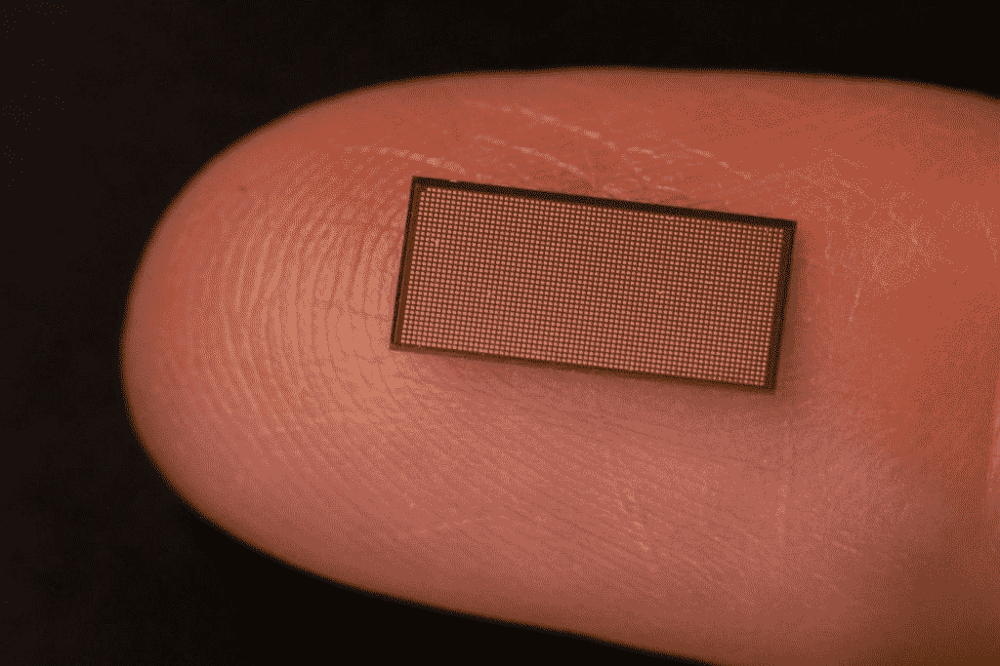

# 英特尔推出下一代神经形态计算芯片

> 原文：<https://thenewstack.io/intel-unveils-next-generation-neuromorphic-computing-chip/>

[英特尔](https://www.intel.com/content/www/us/en/research/blogs/iomniscient-machine-learning-anomaly-detection.html)正在通过其 [Loihi 处理器](https://en.wikichip.org/wiki/intel/loihi)的第二代产品和一个开放框架来支持其[神经形态计算](https://www.intel.com/content/www/us/en/research/neuromorphic-computing.html)的雄心，该公司希望这将加速新兴领域的软件开发。

第二代 Loihi 2 处理器于 9 月 30 日推出，在性能、可编程性、[深度学习](https://thenewstack.io/deep-learning-broadens-the-reach-of-artificial-intelligence/)能力和能效等方面比上一代处理器有了显著改善。然而，同样重要的是 Lava 软件框架的推出，以推动应用程序的开发和促进神经形态计算社区的发展。

英特尔神经形态计算实验室高级首席工程师兼主任 Mike Davies 在关于 Loihi 2 和 Lava 的新闻发布会上表示:“软件继续阻碍该领域的发展。“在过去的几年里，没有太多的进展——没有与硬件同步——也没有出现一个单一的软件框架，正如我们在[深度学习世界](https://thenewstack.io/the-ultimate-guide-to-machine-learning-frameworks/)中看到的那样，在那里我们有 [TensorFlow](https://thenewstack.io/tensorflow-model-deployment-and-inferencing-with-kubeflow/) 和 [PyTorch](https://thenewstack.io/tutorial-train-a-deep-learning-model-in-pytorch-and-export-it-to-onnx/) 聚集了巨大的势头和用户基础。”

神经形态计算是众多新型计算架构之一，包括[量子计算](https://thenewstack.io/a-quantum-challenge-building-a-skilled-workforce/)和[深度学习](https://thenewstack.io/demystifying-deep-learning-and-artificial-intelligence/)。硬件和软件旨在模拟生物大脑和神经系统中的系统，旨在提高从视觉、语音和手势识别到机器人和搜索工作等一系列用途的能效、计算速度和能力。它可以让更多的人了解人工智能(T21)的能力。

## **英特尔、IBM 引领潮流**

英特尔是众多大大小小的芯片制造商中的一员，他们正在开发用于神经形态计算的芯片。英特尔的 Loihi 和 IBM 的 TrueNorth 是最知名的神经形态计算芯片，尽管其他供应商——从高通和三星这样的老牌公司到 T4 的 BrainChip 和应用大脑研究公司的较小公司——也在全球市场寻找动力，验证研究公司预测 T9 将从去年的 2206 万美元增长到 2028 年的 35 亿美元。

英特尔在 2018 年推出了 Loihi 处理器，这是一款旨在测试架构和评估其价值的研究芯片。这是一种新的计算机体系结构，与传统芯片有几个关键区别。不存在所有处理器和内核都可以访问的具有高速缓存层次结构的片外 DRAM 或内存空间。戴维斯说，相反，记忆紧密地嵌入单个核心，并分散到核心内的小记忆库中，类似于突触在大脑中的广泛分布。

英特尔的 Loihi 2 神经形态芯片在指尖。

信息、编码和处理是以高度异步的方式发生的——同样，与大脑类似，被称为“尖峰”的电压脉冲以高效的方式在数十亿神经元之间传递信息。借助 Loihi 架构，计算以基于事件的方式执行，激活电路并使用尖峰来触发处理器。

戴维斯说，英特尔工程师在从手势识别和学习、自适应机械臂控制到场景理解和气味识别和学习的功效、性能和延迟等领域发现了令人鼓舞的结果。然而，Loihi 也有局限性，包括神经元灵活性不足，对最新学习算法的支持有限，性能瓶颈以及与传统计算架构的集成问题。

## **输入 Loihi 2**

Loihi 2 比上一代产品有所改进，包括 10 倍的处理速度和 15 倍的资源密度——在很大程度上归功于 3D 缩放——每个芯片多达 100 万个神经元，是 Loihi 的 8 倍。此外，神经元是可编程的和通用的尖峰信息，提高了 Loihi 2 的深度学习能力。Loihi 中内部存储库的分配是固定的。借助 Loihi 2，可以在流水线的不同阶段分配每个内核的内部存储体。

新芯片还可以更容易地与传统处理器、新型传感器和机器人系统集成。利用英特尔 4 制造工艺的预生产版本，工程师们能够使用极紫外(EUV)光刻技术来简化布局设计规则，以加速 Loihi 2 的开发。

## **密度是关键**

资源密度是英特尔 Loihi 设计中的一个关键问题。戴维斯指出，如果没有片外 DRAM，系统设计者需要使用更多的芯片来解决大问题。英特尔创建了一个名为 [Pohoiki Springs](https://newsroom.intel.com/news/intel-scales-neuromorphic-research-system-100-million-neurons/#gs.cn093k) 的系统，该系统使用 768 个 Loihi 芯片来解决相似性搜索等挑战，这些挑战可以通过使用单个芯片的传统方法来解决。

戴维斯说:“在单个芯片上获得更高数量的存储神经元和突触，对于神经形态芯片的商业可行性[和]经济方面以及以对客户应用有意义的方式将它们商业化来说，确实是必不可少的。”

英特尔 4 工艺使 Loihi 2 拥有 128 个内核，每个内核的内存量与上一代产品大致相同，但芯片却小了 1.9 倍。

英特尔正在通过神经形态研究云向[英特尔神经形态研究社区](https://newsroom.intel.com/editorials/intel-creates-neuromorphic-research-community/) (INRC)的成员提供两个利用 Loihi 2 的神经形态系统。Oheo Gulch 是一个单芯片系统，设计用于早期评估和云使用。Kapoho Point 是一个可堆叠的八芯片系统，带有一个以太网接口，将很快推出。

## **熔岩流入**

戴维斯说，像 Loihi 2 一样，Lava 软件框架是一个研究工具，而不是一个完整的产品。

“我们从过去三年半的软件和应用程序开发中吸取了所有的经验教训，并试图构建一个系统，我们认为该系统可以支持使用 Loihi(现在是 Loihi 2)的社区正在努力支持的所有算法、应用程序和软件方法，并试图探索提供一个基于基于事件的异步消息传递的通用标准框架。 这是最终适用于这些尖峰神经元的模型，也适用于整个系统架构中传统成分中存在的更传统的编码过程，”他说。

灵活性是框架的关键部分。通过 Lava 开发的应用程序将能够在传统的 CPU 上运行，而无需访问 Loihi 2 或神经形态计算硬件。然而，随着用户获得 Loihi 2，他们可以将为神经形态架构设计的部分工作负载映射到芯片，戴维斯说，这将降低进入神经形态计算领域的门槛，“因为你不必处理评估过程和使用涉及芯片架构的研究带来的头痛。”

## **一个开放的框架**

它也是一个带有许可的开放框架。

“这是一个项目，我们希望邀请许多其他人来做贡献，以社区认为最好的方式推进它，”他说。“人们甚至会把它放到其他平台上，就我们而言，这完全没问题。我们认为有必要朝着这个更大的目标进行融合和共同发展，这对于任何人将神经形态技术商业化都是必要的。”

他说，这个框架将有助于围绕神经形态计算建立一个社区，就像 TensorFlow 和 PyTorch 在深度学习方面所做的那样。目前，尽管英特尔在与 Loihi 和它自己的软件的合作中取得了进展，但开发者之间很少分享用于创建这些应用程序的代码。

“这使得其他小组很难在他人取得的进展和成果的基础上继续努力，”戴维斯说。“现在很难将所有这些组合成更大规模的应用程序。…应用程序的整体大于单个部分的总和，我们甚至无法使用当前的软件工具真正创建整体。这一直是个大问题。”

所有这些的最终目标是使通用神经形态计算成熟并商业化，使其能够与更成熟的芯片架构并驾齐驱，运行适合系统的工作负载。他说，这种工作负载包括任何必须在电力预算下快速响应的东西，如移动或边缘应用程序。

该架构还将在数据中心环境中使用，比传统方法更快地解决困难的问题——戴维斯使用了铁路调度的例子。

<svg xmlns:xlink="http://www.w3.org/1999/xlink" viewBox="0 0 68 31" version="1.1"><title>Group</title> <desc>Created with Sketch.</desc></svg>