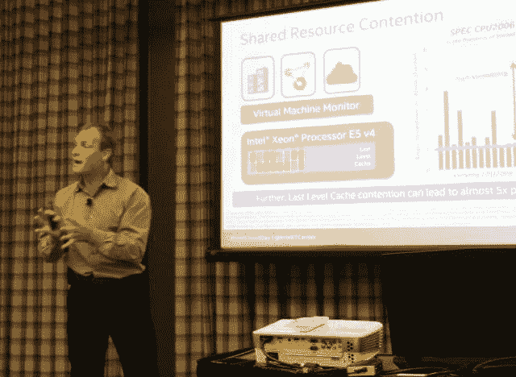

# 英特尔计划为复杂的服务器工作负载带来决定性的性能

> 原文：<https://thenewstack.io/intels-plan-bring-deterministic-performance-complex-server-workloads/>

以下故事是两部分系列的第二部分，探讨英特尔如何帮助提高复杂系统的确定性性能，从基于容器的云工作负载到实时电信运营。读第一部分

[here](https://thenewstack.io/intel-working-improve-deterministic-performance-complex-workloads/)

.

那是 2016 年 3 月 31 日。在旧金山一处租给科技公司(通常是没有自己办公室的公司)的设施的地下室里，英特尔为其客户、合作伙伴和顾客举办了午餐会和演示会，英特尔为其一些客户组织了一场演示会，一些媒体成员对英特尔将要谈论的内容很感兴趣。

对于一些人来说，这是一个美好的一天，不能坐在地下室的木制折叠椅上，这些椅子是从火灾拍卖中获得的。但是对于那些出现的人来说，这个主题已经足够重要了。主题是[确定性](https://thenewstack.io/intel-working-improve-deterministic-performance-complex-workloads/)，以及为什么英特尔会为其主线至强服务器处理器(现为 E5 v4)的更多 SKU 赋予一种称为高速缓存分配的机制，该机制有望为更高级别的工作负载编排带来确定性的性能。

英特尔网络平台部门的首席工程师埃德温·弗普兰克负责解释处理器设计中最深奥的元素。

“如果你看一下通信图表，你可能会看到这种流量正在以天文数字的速度增长，”Verplanke 说。“但实际上，通信供应商和云供应商需要做出巨大的投资来跟上这种数据流量…这基本上意味着他们必须做出的投资，以跟上数据需求，大于他们从网络数据中获得的回报。”

实际上，在服务提供商的网络中增加每个新客户的数据流量的成本(以实际金额衡量)要高于增加前一个客户的流量。原因是延迟。在多租户服务器集群中，新的工作负载往往会干扰现有的工作负载。当任何客户的工作负载横向扩展时，其多样性产生的干扰都会影响到每个人。

诚然，Verplanke 所说的是服务提供商，从数量上来说，他们在工作负载协调的整个市场中只占很小的比例，就像纽约市只占美国人口的一小部分一样。

## 反射

为了节省成本，承载工作负载的硬件基础设施必须使用相同的处理器架构，需要能够承载所有工作负载类别，包括通信服务提供商、云服务提供商和企业。但是，由于每个工作负载类别对同一架构有不同的要求，因此硬件必须具有适应性。虚拟化本身并不能解决问题，因为不同的工作负载类别表现不同，无论它们是如何被虚拟化的。

为此，英特尔发布了其[资源管理器技术](http://www.intel.com/content/www/us/en/architecture-and-technology/resource-director-technology.html) (RDT)，其中包括高速缓存分配技术。它的目标是使编排工具，如 Kubernetes 及其商业分支机构 architectural(其制造商 CoreOS 已正式与英特尔合作)能够对处理器处理工作负载的方式进行必要的调整，而不会迫使软件开发人员改变这些工作负载。

Verplanke 指出，内核数量最多的英特尔至强处理器可能包括多达 40 MB 的*末级高速缓存* (LLC，或至强处理器中的 L3)——从较慢的 DRAM 读取到较快的 SRAM 的共享内存区域。几年前，英特尔使其处理器中的每个内核都有可能平等地访问 L3，如果您的目标是在一个处理器上运行单个多线程应用程序，这是非常合理的。

Verplanke 说，尽管现代服务器处理器包含多达 20 个内核，但现实世界中的并行性将虚拟机限制为只能使用 4 个内核。这一事实实际上保证了多个虚拟机将在任何一台服务器上争夺该 LLC。但是，工作负载可能是经过编排的。据他的团队计算，在最坏的情况下，随着时间的推移，一个应用程序在一个整合的流程中的性能可能会比它单独运行时下降 51%。

在基准测试中使用的压缩算法的情况下，称为 [SPEC CPU2006 Bzip2](https://www.spec.org/cpu2006/Docs/401.bzip2.html) ，当包含该算法的应用程序的 13 个实例共享服务器时，偶尔在没有警告的情况下，一个实例可能会比另一个实例慢五倍。

“很明显，当你开始整合大量工作负载时，”他说，“你真的需要一个架构来处理这些。”

## 过量提取

为了证明他的观点，Verplanke 和英特尔研究科学家同事 Andrew Herdrich 引用了与编排工具制造商 Appformix 联合进行的测试结果。Appformix 工程师后来为新的堆栈重新创建了一些相同的测试。正如我们自己所看到的，这些测试验证了复制容器可能是，并且可能已经是，产生延迟的最大罪魁祸首。

[![[SCM]actwin,0,0,0,0;https://meetings.webex.com/collabs/meetings/landing?meetingID=MEHY99S857GI2X3UT1X6WRRHQ5-LRZH&language=en_US AppFormix's WebEx Meeting - Cisco WebEx Meetings - Mozilla Firefox firefox 4/4/2016 , 4:56:05 PM](img/69f4df430ae012232f7d64046ee0e3af.png)](https://thenewstack.io/wp-content/uploads/2016/04/160404-Appformix-tests-01.jpg)

如象限中左上图所示，当 Appformix 工程师在同一台服务器上运行同一容器的多个副本时，L3 缓存的使用量会激增，这与右下角的 CPU 负载一致。

这是一个绝对不能由容器中复制的软件的开发者解决的问题。无论容器化的工作负载利用资源的效率有多高，也无论它自己如何与处理器配合，当工作负载被复制时，延迟和不确定性问题就开始了。

Herdrich 举了另一个例子:视频代码转换算法，它被电影编辑大规模使用。他建议，从理论上讲，监控工具可以检测到这些算法何时会提高系统的总利用率。正是这些利用率的峰值预示着何时会发生争用。他说，这种工具可以做出反应，在那些竞争似乎正在上升的节点上，调度优先级更高的其他作业。即使不使用[英特尔的资源管理器技术](http://www.intel.com/content/www/us/en/architecture-and-technology/resource-director-technology.html)，这也可能发生，该技术将标记特定线程以监控它们的争用水平，因为调度系统应该知道单个作业何时以及如何导致利用率激增。

Verplanke 随后断言他自己的实验室的测试结果验证了他的团队近两年前的观察:底层 Linux 内核的部分在复制时，在最后一级缓存上行为失常。

“我们发现的另一件事是，作为启动大量容器的结果，你实际上倾向于过量取货，”Verplanke 继续说。“因此，当容器成为彼此的破坏性力量时，发生的另一件事是，由于容器获取相同类型的基础设施，您无法有效地使用 LLC(例如)，如果您调用某个为不同容器重复复制的库。”

首先，内存缓存的全部意义在于支持预取，即将一个相当大的地址空间块复制到更快的内存中，希望在下一次未命中发生之前，这个地址块将被多次寻址。确定预取哪些块是一种艺术形式。从逻辑上考虑，很容易得出这样的结论:大量不同的容器通过虚拟化共享一台服务器可能会迫使 LLC 过于频繁地预取大量分布的地址空间块。

然而，像 Appformix 所使用的那种监控工具告诉我们的是，大量相同的容器可能会导致潜在的更糟糕的问题，因为它们会迫使 LLC 一次又一次地获取相同的地址空间块。“通过隔离容器看到的有限责任公司的[数量]，我们实际上运行得更有效，”Verplanke 说。如果预取太多，就不能有效利用末级缓存

## 资源方向

有许多非常复杂的方法来解释英特尔资源管理器如何寻求解决这个问题。由于我们受到空间和时间的限制，这里有一个更简单的解释，恰好更有意义:

在理想情况下，处理器制造商将能够设计、制造和生产一套完全独立的芯片，用于托管容器和其他虚拟化工作负载，就像高可用性超级计算工作负载一样。为了保持低成本，英特尔没有这个选择。如果工程师们早在六年前就预见到容器化工作负载的需求(Docker 本身还不到四年)，他们可能已经开始推动一类服务器处理器的发展，在这类服务器处理器中，末级高速缓存都是按照设计进行分区的，并为每个内核分配一个。

如果没有这样的硬分区，英特尔需要一种方法来建立临时的链式围栏，如果你愿意的话——本质上由软件构成的障碍。

现在，集装箱化已经成为现实和一个行业，英特尔正在通过资源总监吸引该行业的领导者。然而，在发布 Resource Director 的过程中，英特尔从其对计算堆栈底层的挖掘中揭示了一个如此巨大、如此普遍的事实，以至于那些在堆栈顶部的人都没有注意到它:这个延迟问题，即一个进程的一个副本在同一处理器上的运行速度可能比另一个慢五倍，自从 Docker 首次认为鲸鱼可以制作一个可爱的徽标以来，这个问题就一直在我们面前。如果我们应该感受到稳定的绩效改善…我们没有。

规模已经扭曲了我们的感知。从开发人员的角度来看，复制流程并在它们背后添加负载平衡器的好处似乎超过了成本。但在大范围内，这些成本可以用美元来衡量。在基础设施层面，在我们不应该关注的堆栈部分，英特尔告诉我们做错了事情——有点像李维斯第一个抓住我们的裤子。

对我们来说幸运的是，这个信息以资源总监的形式带来了橄榄枝。

但是，在我们再次奖励自己躲过了又一颗子弹之前，我们应该注意一下英特尔发现的真正信息——英特尔出于礼貌，不愿大声说出来的信息。我们一直依赖[摩尔定律](https://thenewstack.io/farewell-moores-law/),就像自动服务或重力或臭氧层。我们还没有意识到，当它消失时，我们可能需要一个计划。

英特尔是新堆栈的赞助商。

斯科特富尔顿三世的照片。

<svg xmlns:xlink="http://www.w3.org/1999/xlink" viewBox="0 0 68 31" version="1.1"><title>Group</title> <desc>Created with Sketch.</desc></svg>