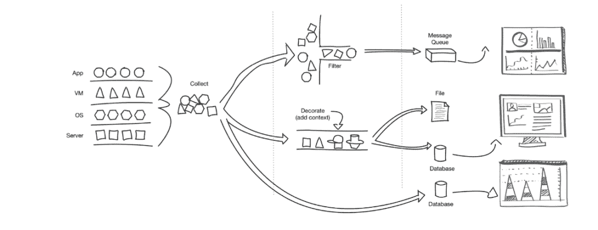

# 英特尔的 Snap 为可组合监控指明了方向

> 原文：<https://thenewstack.io/intels-snap-points-the-way-to-composable-monitoring/>

从上周在 2016 年英特尔信息技术峰会上的演讲来看，英特尔继续在系统监控方面进行深度投资，在那里，英特尔展示了其开源 [Snap 遥测平台](http://snap-telemetry.io/)与流行的数据可视化和分析服务 [Grafana](http://grafana.org/) 的集成。

规模带来了对新企业工具的需求，以更好地了解和管理设备、汽车、建筑等各种不同的工作负载。在我们参加的几乎所有 IDF 主题演讲和会议中，以及在关注 Snap、Grafana 和 Kubernetes 等平台如何作为管理工作负载和大量数据的方式的其他讨论中，都有这种趋势的例子。

Snap 是一个开源框架，用于通过单一 API 从数据中心的不同指标中收集、处理和发布数据。它可以输入到编排引擎或数据分析管道以及其他环境中。它是英特尔“[智能资源协调](https://www.youtube.com/watch?v=TidSwU348ds)”(IRO)方法的一部分，旨在帮助用户更好地了解和管理物理、虚拟化和基于容器的工作负载。

Snap 的一个重要区别是它有一个可插拔架构，以一种为用户提供模块化方法的方式进行解耦，更像是 [Voltron](http://www.voltronlegendarydefender.com/) 动画战士。至少积臣是这么认为的，他在几年前的一篇博客文章中讨论了为什么这个卡通超级英雄是我们这个复杂工作负载和无尽数据流时代开源监控的象征。

一个开源的监控平台应该像 Voltron 一样；迪克森写的[后来呈上](https://speakerdeck.com/obfuscurity/the-state-of-open-source-monitoring)。它有明确定义的职责、接口和协议。它不需要 root 访问权限或操作人员来部署。它具有弹性，可以承受停机。它是自动化的，可以对服务之间的关系进行建模。而且很漂亮，很好用。

回到原点，Dixon 现在在监督 Grafana 开源项目的 raintank 公司工作。

## 可组合快照

根据 GitHub 和该项目的网页，Snap 运行一个代理，连接到分为三类的插件:收集器、处理器和发布器:

*   **收集器**:遥测数据被拉入收集器，并被设计用于其他遥测环境，如 collectd、Facter 和 Ohai。它还可以与英特尔插件和来自社区的插件一起工作。
*   处理器:这些插件允许遥测技术以某种方式改变。有效载荷可以被加密；和移除查询可以被注入到令牌、过滤或其他外部调用的工作流中。
*   发布者:根据 Nick Weaver 在去年 12 月推出该平台时发表的一篇文章，发布者插件将数据汇集到另一个消耗遥测数据的系统中。RabbitMQ、Kafka、MySQL 或 InfluxDB 是与 Snap 一起工作的一些平台。它还可以与电子邮件、文件集成，或者对私有 API 进行自定义发布。

Grafana 是一个流行的可视化测量数据的开源平台。它有数据源插件、可视化插件和应用程序插件，包括 Snap 插件。像 Snap 一样，Grafana 也是一个可插拔、可组合的系统，可以与多个不同的平台集成，如 Graphite、Elasticsearch、Amazon CloudWatch 和 Prometheus。价值体现在可以生成的图形功能、样式和主题上。它具有内置的身份验证，并且可以用数据进行注释。

Snap 和 Grafana 适合作为企业新重组的架构模式。它们允许以更细粒度的方式管理复杂的服务。在这种背景下，我们注意到一种新的思考方式，即如何看待自动化以及人们擅长什么和系统为他们做什么。

[英特尔](https://www.intel.com/content/www/us/en/it-management/intel-it/it-managers.html)是新堆栈的赞助商。

<svg xmlns:xlink="http://www.w3.org/1999/xlink" viewBox="0 0 68 31" version="1.1"><title>Group</title> <desc>Created with Sketch.</desc></svg>