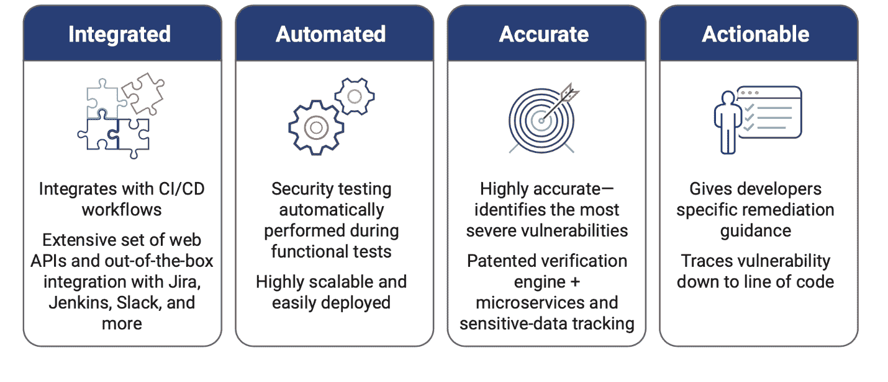

# 交互式应用安全测试是 AppSec 的下一件大事

> 原文：<https://thenewstack.io/interactive-application-security-testing-is-the-next-big-thing-in-appsec/>

 [尤金·帕克霍莫夫

尤金·帕克霍莫夫是新思科技公司的一名安全工程师。他自 2014 年以来一直从事应用安全工作，专注于软件组合分析和交互式应用安全。尤金是 CISSP 和 ISC2 东湾分会的成员。](https://www.linkedin.com/in/eugene-pakhomov-cissp-a7768917/) 

Web 应用程序仍然是试图访问敏感数据的威胁参与者选择的攻击面。根据来自威瑞森的[《2020 年数据泄露调查报告》，](https://enterprise.verizon.com/resources/reports/dbir/)对 web 应用的成功攻击占所有数据泄露的近一半(43%)，是此类泄露的最大原因，是去年的两倍多。

许多开发团队经常使用静态应用程序安全测试(SAST)和软件组合分析(SCA)解决方案来识别专有和开放源代码中的安全弱点和漏洞。它们在代码或组件级别静态地这样做。许多漏洞只能通过在运行时测试和发布阶段动态测试应用程序来检测。

这就是为什么一些组织使用动态应用安全测试(DAST)，或渗透测试。DAST 和渗透测试工具在 QA 阶段或生产后期运行，以检测使用 SAST 或 SCA 工具无法发现的漏洞。

此外，虽然 DAST 和渗透测试可以识别安全漏洞，但它们无法查明包含漏洞的代码行。因此，DAST 发现的关键安全问题很难修复，需要很长时间才能解决，这使得一般开发人员无法进行补救。

这些挑战促使开发和安全团队寻找替代的动态 AppSec 测试解决方案，如交互式应用安全测试(IAST)。

## **什么是 IAST？**

IAST 是一个持续的安全监控解决方案，在不同的测试阶段运行，同时团队执行通常的开发和 QA 测试。IAST 工具可以与持续集成(CI)和测试自动化工具，以及敏捷和特别的测试方法无缝集成。他们可以快速生成分析结果，识别漏洞所在的特定代码行。因此，开发人员可以快速修复问题，并将其提交作为 CI/CD 或自动化工作流的一部分。更高级的 IAST 工具还结合了 SCA，以发现应用程序中易受攻击的第三方和开源组件。

## 是什么让 IAST 如此伟大？

### **在 DevOps 敏捷工作流中易于部署**

IAST 解决方案无缝集成到 CI/CD 管道中，并以敏捷和 DevOps 要求的速度运行。安全和开发团队都受益于将 IAST 集成到 SDLC 中——特别是一个 IAST 工具，它提供了对易受攻击组件的 SCA 洞察。

### **早期漏洞和安全风险报告**

IAST 使开发人员能够在测试时修复安全漏洞。这意味着在将 web 应用程序部署到生产环境之前，找到并修复它们的运行时漏洞。

### **开发团队可操作的发现**

与渗透测试相比，IAST 可以将修复安全漏洞所需的时间减少 65%。这样做的原因很明显:IAST 使开发者能够在开发过程中发现并修复漏洞。

### **低假阳性率**

IAST 解决方案自动验证结果，确保高度的准确性。它们不会返回大量需要长时间手动检查、故障排除和额外扫描才能解决的误报。

一句话:开发团队需要快速的反馈，包括修复哪些漏洞，如何修复，以及在源代码或组件库中哪里可以找到它们。开发人员在 SDLC 早期需要这种反馈，此时他们最熟悉自己的代码，修复漏洞的成本也最低。

## **在 IAST 解决方案中寻找什么**

根据您的需求选择完美的 IAST 解决方案可能会很困难。有许多[必须具备的特性](https://www.synopsys.com/blogs/software-security/8-must-have-features-iast-solution/)你应该评估一下。

一定要寻找一个全面的 IAST 解决方案，就像我们自己的 [Seeker](https://www.synopsys.com/software-integrity/security-testing/interactive-application-security-testing.html) 一样，它可以在您的 DevOps 管道中自动进行 web 安全测试。这将通过向左转移测试来减轻开发人员的头痛，以便在开发周期的早期发现问题——在不中断正常工作流的情况下消除延迟。

<svg xmlns:xlink="http://www.w3.org/1999/xlink" viewBox="0 0 68 31" version="1.1"><title>Group</title> <desc>Created with Sketch.</desc></svg>