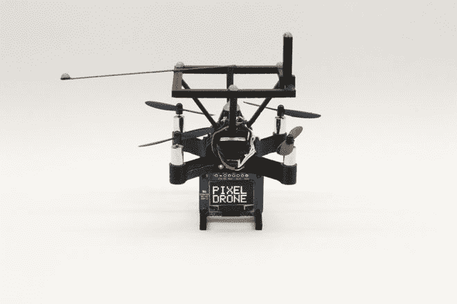
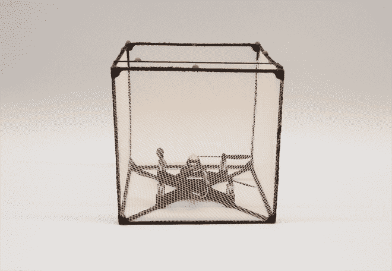
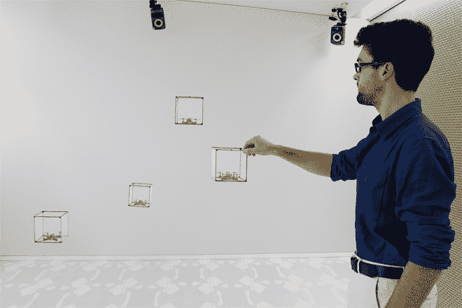
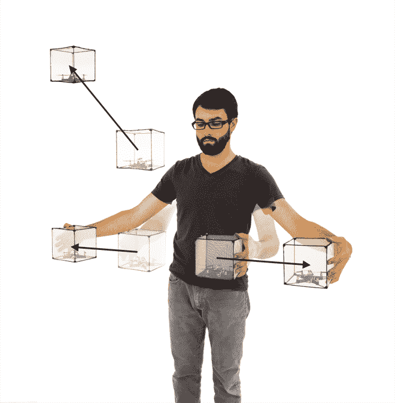

# 交互式 3D 像素群是可编程物质的未来

> 原文：<https://thenewstack.io/interactive-swarms-3d-pixels-future-programmable-matter/>

互动宇宙的概念，即物体和系统可以通过简单的手势来操纵，是一个令人信服的概念，我们已经在流行文化和科幻电影中一次又一次地看到。谷歌的 [Jacquard 项目](https://thenewstack.io/googles-project-jacquard-conductive-threads-that-turn-fabrics-into-touch-screens/)是一个有趣的发展，它将交互性编织到织物本身，使技术更加嵌入到日常物品中。现在，皇后大学[人类媒体实验室](http://www.hml.queensu.ca/)的一个加拿大研究小组公布了他们认为在交互式 3D 显示方面的突破——使用成群盘旋的微型无人机作为可编程物质的三维像素。

## “真实-现实”界面

在他们最近发表的论文[中，研究人员将该平台称为](https://static1.squarespace.com/static/519d10a2e4b090350a2b66a0/t/563d1ecbe4b092f6c6eba7f8/1446846155520/UIST+Bitdrones+paper146.pdf) [BitDrones](http://www.hml.queensu.ca/blog/bitdrones) ，他们设想人们将这些纳米四轴飞行器用作“自悬浮的有形积木”，可以在实时和真实空间中操纵，而不是虚拟现实平台。监督该项目的人机交互(HCI)教授罗尔·维特加尔(Roel Vertegaal)解释道:

> BitDrones 让飞行可编程物质更接近现实。这是允许人们像真实的物理对象一样与虚拟 3D 对象交互的第一步。我们称之为真实现实界面，而不是虚拟现实界面。这就是它与微软 HoloLens 和 Oculus Rift 等技术的区别:你可以实际触摸这些像素，并且不用耳机就可以看到它们。

[https://www.youtube.com/embed/hHBYMWc3ux8?feature=oembed](https://www.youtube.com/embed/hHBYMWc3ux8?feature=oembed)

视频

## 飞行，可编程体素

该团队制造了三种类型的无人机，每种都配置了不同分辨率的不同浮动显示屏。PixelDrones 配备了一个 LED 和一个较小尺寸的点阵显示器，而 ShapeDrones 则封装在一个网状的 3D 打印框架中，用作 3D 模型的基本构建模块。另一方面，DisplayDrones 配备了一个弯曲、灵活的高分辨率触摸屏，此外还有一个前置摄像头和 Android 智能手机板。

BitDrone 的所有三种变体都配备了反射标记，使它们能够使用动作捕捉技术被单独跟踪和定位。这种相同的技术用于跟踪用户手上的标记，允许他或她使用 C#编写的自定义应用程序，使用手势来“控制”这些三维像素，或“[体素](https://en.wikipedia.org/wiki/Voxel)”。每架无人机代表一个互动物质单元，可以悬停在预定义的“互动体积”内，并可用于输入或输出，或两者兼而有之。

PixelDrone

ShapeDrone

## 全室互动电脑

研究人员设想了这项技术的一些可能的应用。首先，用户可以在真实的三维空间中探索他们计算机的操作系统，而不是在屏幕上，使用 PixelDrones 作为文件夹和文件的替身。使用类似于智能设备上使用的滑动或挤压手势，人们可以以这种令人耳目一新的触觉方式打开、关闭和访问文件。除了系统和信息可视化，该技术还可能用于“真实-现实”3D 建模、游戏和机器人行业。

“简单的原子信息可以通过单个无人机来显示，而更复杂的 3D 数据显示可以使用几个无人机来构建，为基于体素的 3D 建模系统提供了雏形，能够在现实中表示稀疏的 3D 图形，”该团队在他们的论文中写道。

科学也将受益于这项技术。例如，它可以用于医学成像，或三维实验模型，在这些模型中，可以使用 ShapeDrones 以 3D 方式可视化和构建化学结构。远程呈现系统——允许用户通过[机器人化身](https://thenewstack.io/telepresence-robot-uses-virtual-reality-offer-immersive-experience/)远程“参观”和查看一个地方——可以部署运行 Skype 的 DisplayDrones 作为笨重机器的轻量级替代。

这里使用无人机群技术是新兴领域[可编程物质](https://en.wikipedia.org/wiki/Programmable_matter)的一种有趣的替代方法，与我们之前看到的 [4D 打印的自我转化材料](https://thenewstack.io/shapeshifted-things-4d-printed-materials-programmed-for-self-transformation/)形成对比。但是据该团队称，这个想法并不新鲜，在过去的 50 年里已经以各种名义进行了探索，如 [claytronics](https://en.wikipedia.org/wiki/Claytronics) 、[有机用户界面](https://en.wikipedia.org/wiki/Organic_user_interface)和[自由基原子](http://tangible.media.mit.edu/project/radical-atoms/)。

当然，该团队基于无人机的界面仍有一定的改进空间。目前，他们的系统由尺寸为 2.5 至 5 英寸的相对笨重的无人机组成，但计划是扩大该系统的规模，以协调数千架尺寸不超过半英寸的小型无人机，从而在未来实现与“高分辨率”可编程物质的接口。

如果未来的开发取得成功，这可能意味着有一天计算机界面将从二维屏幕转移到纳米尺度的无人机群，这是整个房间的空间界面，在所有三维空间中用手直观地操纵，创造一种新的沉浸式体验，这种体验更真实，最终更少虚拟。

在[女王大学人类媒体实验室](http://www.hml.queensu.ca/blog/bitdrones)和 [BitDrones](https://static1.squarespace.com/static/519d10a2e4b090350a2b66a0/t/563d1ecbe4b092f6c6eba7f8/1446846155520/UIST+Bitdrones+paper146.pdf) 阅读更多。

图片:[人类媒体实验室](http://www.hml.queensu.ca/blog/bitdrones)

<svg xmlns:xlink="http://www.w3.org/1999/xlink" viewBox="0 0 68 31" version="1.1"><title>Group</title> <desc>Created with Sketch.</desc></svg>