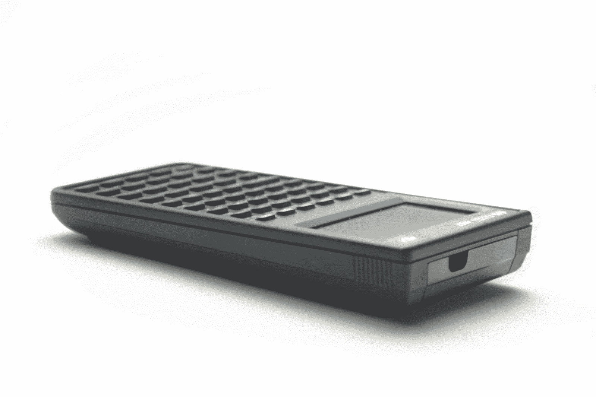

# 互联网档案馆的虚拟复古计算器助长怀旧情绪

> 原文：<https://thenewstack.io/internet-archives-virtual-vintage-calculators-tally-pre-pc-nostalgia/>

对于成长在个人电脑之前的上一代技术人员来说，计算器是进入数字世界的迷人入口。上个月有新的迹象表明，仍然有一群互联网用户对手持计算器情有独钟——尤其是他们很久以前在高中数学课上用过的老式计算器。

随着互联网档案馆发布新的计算器模拟器集合，赞赏的评论开始滚滚而来。

一名 Archive.org 用户将他们自己的现实世界 TI-83 计算器与其新的在线复制品进行了比较，称[仿真](https://archive.org/details/ti83p-calculator)“令人惊讶……颜色准确无误，感觉与真正的计算器相似。”

另一个人发现了他们在 1998 年左右获得机械工程学位时使用的[德州仪器的 TI-89](https://archive.org/details/ti89-calculator) ，并发帖称该模拟器“工作(看起来)和我记忆中的一模一样”一位评论者甚至透露，他们每天都在使用他们在 2001 年买回来的 TI-89。(“他们建得像坦克一样。”)

虽然不可避免地，他们也记得它并不总是用于数学:“我记得在高中玩俄罗斯方块，甚至厄运。”

计算器档案的发布受到了来自 [Engadget](https://www.engadget.com/the-internet-archives-calculator-drawer-lets-you-relive-high-school-math-class-194350966.html) 、 [Ars Technica](https://arstechnica.com/gadgets/2023/01/count-on-old-school-fun-with-these-new-calculator-emulations/) 、 [the Verge](https://www.theverge.com/2023/1/29/23576677/emulated-calculators-internet-archive-mame) 和 [Register](https://www.theregister.com/2023/01/30/internet_archives_calculator_emulator/) 的文章的庆祝，这一切都证明了几十年前的老式计算器仍然拥有他们的粉丝。

但是这个新的在线档案只是重现手持计算和绘图设备乐趣的众多方式之一。在最近的一篇博客文章中，软件策划人 Jason Scott 预言像这样的仿真项目是“软件历史的未来”

## 保存过去

技术建筑师埃里克·雷希林(Eric Rechlin)是老式计算器的长期粉丝。自 1997 年以来，已经有超过 2200 万人访问过他的网站[HPCalc.org](https://www.hpcalc.org/)，那里有他自己的庞大的惠普可编程图形计算器软件档案。还有雷希林收集的惠普计算器的 [280 个仿真器(将在个人电脑上运行)。](https://www.hpcalc.org/hp48/pc/emulators/)

Rechlin 指出，这只是他这些年来看到的许多保存计算器的行为之一。Rechlin 在一次电子邮件采访中告诉我，“惠普 48G 系列基于浏览器的在线仿真已经推出好几年了。

虽然当被问及互联网档案馆的新收藏时，Rechlin 承认“这是我第一次在浏览器中使用基本上被遗忘但仍然具有历史意义的 HP 38G

如果你想浏览这些经典设备的外观，有前英特尔程序员大卫·g·希克斯经营的“惠普计算器博物馆”。

在网上的一篇传记中，希克斯回忆了他 13 岁时在 20 世纪 70 年代为了买一台 HP-25 而省下的便士。到了 20 世纪 90 年代，“我认为这个新的 web/HTML 可能会成为‘下一个大事件’。”“在创建了一个展示他的老式惠普计算器的网站后，”我立即收到了大量来自惠普计算器狂热爱好者的电子邮件，他们喜欢我的博物馆，但希望看到更多。"

所以，他说，“我屈服于网络大众，找出了每一个惠普制造的计算器，并按照大致的时间顺序更新了博物馆。”

互联网档案馆的新收藏——名为“计算器抽屉”——让访问者与计算器互动。为此，Scott 特别赞扬了 games】仿真软件背后的团队，这是一个开源项目，自 1997 年以来一直在重建硬件系统，以保存经典游戏和其他软件程序。

斯科特写道，互联网档案馆的“绝大多数”模拟游戏都在使用 games 这并不奇怪。Scott 在他的博客文章中指出，由于世界各地数百名开发人员正在进行的工作，MAME 团队现在可以模拟“成千上万”的机器、平台和工具。“他们现在涵盖的街机和电脑数量如此之大，以至于有一个网站[只是为了跟踪他们*还没有*模仿](https://unmamed.mameworld.info/)的东西……”

因此，斯科特的博客文章对仿真计算器表示欢迎，称之为“竞争”(互联网档案馆还托管着两个不同的[收藏库](https://archive.org/details/internetarcadeturbo)，其中有数以千计的[街机游戏](https://archive.org/details/internetarcade?tab=collection)，另外还有来自家庭娱乐控制台的[游戏](https://archive.org/details/consolelivingroom?tab=about)和来自掌上游戏机的。)

目前，计算器抽屉里有四个来自惠普的计算器，九个来自德州仪器，还有一个令人愉快的“[电子数字咀嚼器](https://archive.org/details/hh_nummunch)”，这是一个 1989 年的数学游戏，目标是儿童，装在一个黄色的盒子里，盒子里有一只微笑的大象，由香港的伟易达制造。在它的黑白屏幕上，它分发了供孩子们求解的方程，并展示了一只卡通猴子将零食扔进大象的鼻子里。

[https://www.youtube.com/embed/0uVjZD411oc?feature=oembed](https://www.youtube.com/embed/0uVjZD411oc?feature=oembed)

视频

但由于超过 10，000 次浏览，目前浏览次数最多的计算器似乎是经典的 HP 48G+(由惠普在 1990 年至 2003 年期间生产)。

## 手机上的计算器

这不是重现手持计算器体验的唯一方式。也有模仿经典计算器的手机应用程序——最近的黑客新闻讨论显示许多爱好者正在使用它们。

一位评论者[写道](https://news.ycombinator.com/item?id=34572181)他们怀念物理计算器上的老式按钮，但是“我仍然会用我的手机，它运行着一个惠普仿真器，用看起来像一个真正的计算器的东西来进行计算”，称这种体验“仍然比电脑更好”。(“所以，我在这里，有一台电脑，每天使用电脑将近半个世纪，仍然在寻找一个专用的东西来进行某些类型的计算！")

他们不是唯一的一个。至少有一个程序员还[发帖](https://news.ycombinator.com/item?id=34569214)说“我仍然在手机上运行 TI-89 模拟器作为默认计算器。它比手机自带的垃圾计算器应用要强大得多。”

一些评论者表达了他们对互联网档案馆在线重建他们最喜欢的旧计算器的赞赏。

[尼克·科斯马托斯，](https://www.linkedin.com/in/kosmatos/)软件工程师，[发帖](https://news.ycombinator.com/item?id=34566475):“我心爱的 [TI-85 在那里](https://archive.org/details/ti85-calculator)，带回了太多的回忆。在大学的那些年里，这让我受益匪浅。”(Kosmatos 仍然有一个最初的 TI-85——首次发布于 1992 年——但他报告说，“它的屏幕有些破碎，所以我们有一个简单的方法来模仿它，这很好。”)

网络工程师韦斯·特纳发现了他们高中时用过的 [TI-83 Plus Silver](https://archive.org/details/ti83p-calculator) ，[记得](https://news.ycombinator.com/item?id=34574258)它是“当时程序允许使用的最好的计算器”

在一次电子邮件采访中，Archive.org 馆长斯科特告诉我，他很高兴看到 Twitter 上的人们“重新连接到他们的旧机器上”。你可以看到人们自豪地给他们桌子上的计算器拍照。”

斯科特承认，当谈到他自己时，“我实际上在高中 10 年级以后就再也没有学过数学，所以计算器从来不是什么大不了的东西，或者我想太多的东西。”

但是迟早，软件管理员会抓住大众需求的热情。“我碰巧与一些人交谈，他们问我们为什么没有任何模拟！”

* * *

# WebReduce

<svg xmlns:xlink="http://www.w3.org/1999/xlink" viewBox="0 0 68 31" version="1.1"><title>Group</title> <desc>Created with Sketch.</desc></svg>