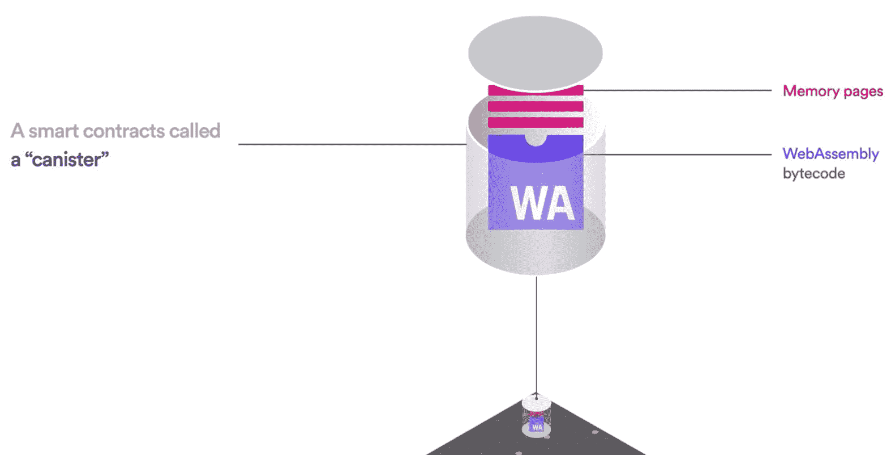
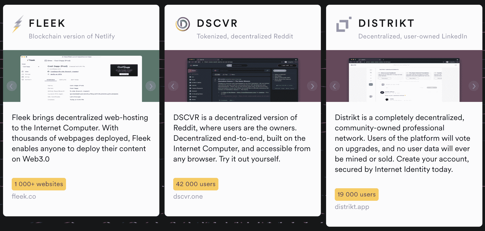

# 互联网计算机:我们要去的地方不需要云

> 原文：<https://thenewstack.io/internet-computer-where-were-going-we-dont-need-clouds/>

乍看之下，被隆重命名为[的互联网计算机](https://internetcomputer.org/)介于区块链和分散式云提供商之间。它由瑞士非营利组织[有限基金会](https://dfinity.org/)运营。自从去年五月发布以来，Dfinity 已经对互联网计算机在新兴的 [Web3 世界](https://thenewstack.io/web3-stack-what-web-2-0-developers-need-to-know/)中的能力提出了一些大的要求——它被定位为“构建几乎任何东西，没有云的 dApps”因此，为了了解更多，我采访了 DFINITY 基金会负责增长的副总裁洛美什·杜塔。

 [理查德·麦克马努斯

Richard 是 New Stack 的高级编辑，每周撰写一篇关于 web 和应用程序开发趋势的专栏文章。此前，他在 2003 年创立了读写网，并将其发展成为世界上最有影响力的博客之一。在 Twitter @ricmac 上关注他。](https://twitter.com/ricmac) 

首先，让我们弄清楚什么是互联网计算机。在去年出版的一本入门书[中，Dfinity 创始人](https://www.youtube.com/watch?v=YWHTNr8RZHg&t=39s) [Dominic Williams](https://twitter.com/dominic_w) 称互联网计算机为“无限的区块链”，并称其为“区块链的第三大创新”，仅次于 2009 年的比特币加密货币和 2015 年的以太坊智能合约。现在，显然我们需要小心密码世界中的夸张。因此，将 Williams 所说的转化为实际的 web 架构语言:互联网计算机是由相互合作的独立数据中心组成的(感谢 Redditor 给出了这个定义)。我不知道为什么这使它“无限”，但我想这是一个点对点的网络，而不是一个公司拥有的。

在我们的谈话中，洛梅什·杜塔将互联网计算机定义为“本质上是一个互连的区块链网络”在 Dfinity 的术语中，这些被称为“子网”。在其文档[中，Dfinity 声明“每个子网都是一个区块链，由一些分散的、独立拥有和控制的机器组成——连接的对等计算机称为节点——运行互联网计算机协议的软件组件。”这意味着每个区块链子网都能够运行 web 应用程序。](https://smartcontracts.org/docs/developers-guide/concepts/nodes-subnets.html)

## 互联网计算机如何与以太坊相比较

那么这一切与以太坊相比如何呢？以太坊是区块链目前领先的网络开发平台。关键的区别在于互联网计算机应用程序是完全“在线”运行的，而以太坊通常只将交易数据放在区块链上。由于以太坊基本上是一个巨大的区块链，作为一个应用平台，它的效率非常低。因此，它严重依赖“链外”解决方案和分散存储服务。Dutta 说，但是有了互联网计算机，任何事情都可以在它的子网上完成。

“你基本上可以把一个区块链和另一个连接起来，”他说，“这样我们就有了一种方法，所有这些区块链可以互相交流。”

批评者指出，由于互联网计算机是一系列相互连接的区块链，依靠有限数量的节点来实现区块链共识，因此它不像以太坊那样分散。当我向杜塔提出这个问题时，他的第一反应是“我们从未说过我们是以太坊的直接竞争对手。”他说，以太坊在它所做的事情上令人敬畏，在他看来，这是“全球结算层”他继续说，互联网计算机所做的是“以太坊甚至没有设计去做的事情。”

“我们说，我们已经创造了一个环境，在这个环境中，你可以完全在区块链上运行任何类型的软件应用程序，而且你可以使用令牌，[所以]它也可以桥接不同的以太坊合同。”

## 接受 Web 2.0 云

互联网计算机是区块链争夺 Web3 开发者份额的众多产品之一。事实上，在撰写本文时，它目前是市值排名第 33 位的区块链，远远低于 Solana、Cardano、Polkadot 和 Avalanche 等公司。也许正是因为这个原因，Dfinity 热衷于强调互联网计算机如何与其他区块链整合——包括两个最大的。

“所以，我们正在做的事情之一是我们正在与比特币和以太坊整合，”杜塔说。“这意味着互联网计算机可以直接连接到这些网络，而不使用任何桥梁。因此，这意味着互联网计算机上的智能合同可以直接在两个网络之间传递消息，而不仅仅是简单的令牌。这使我们能够做到的是，你可以把你的令牌逻辑(比如说)放在以太坊上，你可以在互联网计算机上构建你的前端中间件。”

这听起来很棒，但这与使用 AWS 或 Azure 等云提供商来托管 web 应用程序的前端有什么不同呢？这就是今天许多以太坊“dapp”所使用的——例如在 AWS 上托管应用程序，并让它通过智能合约与区块链对话。似乎互联网计算机，如果以与以太坊或比特币整合的方式使用，本质上是在接管 AWS 所负责的事情。

再次，杜塔偏离了比较。“我们把自己视为区块链，我们不一定说我们与 AWS 和谷歌这样的公司竞争，”他说。然而，他明确表示，在互联网电脑上运行的应用程序不需要 AWS 这样的软件。

“让我们从一个正在开发去中心化应用的人的角度来说。因此，互联网计算机无疑提供了托管整个应用程序的能力，就像在传统云上一样。所以他们不需要 AWS 或者谷歌云。如果他们要构建比如说 Twitter、Reddit、LinkedIn 或企业应用程序，他们可以完全在区块链上运行，完全不需要云。”

正如埃米特·布朗博士在《回到未来》中对马蒂·小飞侠所说，“道路？我们要去的地方不需要道路。”

## 智能合同如何在互联网计算机上工作

任何关于在区块链上运行的应用程序的讨论都需要触及智能合约编程，换句话说，就是如何为区块链上的数据编写指令。在互联网计算机上，智能合约被称为“罐子”，Williams 在他的视频初级读本中将其定义为“一组 WebAssembly 字节码逻辑，可以从任何高级编程语言创建，如 Rust 或 Motoko。”后者是为互联网计算机创造的一种独特的语言。

资料来源:d infinity

根据 Dutta 的说法，互联网计算机有“几千名活跃的开发者”，其中大约一半使用 Rust，另一半使用 Motoko。至于罐编程环境与以太坊的可靠性有何不同，Dutta 说这都归结于 WebAssembly。

“Solidity 是以太坊基金会设计的一种语言，然后编译下来，基本上在 EVM[以太坊虚拟机]上执行。在我们的例子中，我们使用一个开放标准——web assembly——作为我们的执行环境。所以它不同于以太坊的环境。任何编译成 WebAssembly 的东西对我们来说都是公平的游戏。”

## 采用 Web 2.0 应用程序

和大多数其他区块链(包括以太坊)一样，就运行在其平台上的网络应用程序而言，互联网计算机还处于早期阶段。Dfinity 有一个展示区，里面有一些有趣的应用——包括一个被称为 Netlify 竞争对手的虚拟主机服务，名为 [Fleek](https://fleek.co/) 。但就用户数量而言，与 Twitter、Reddit 和 Netlify 等当前的网络主流相比，这些应用都不是真正的网络规模。

来源:Dfinity 主页

很自然，杜塔对互联网计算机上可以和将要建立的东西很乐观。“任何你能想象到的存在于 Web2 世界中的东西，人们都在(互联网计算机上)建造一个版本，”他说。“从 Google Drive，到 Google Photos，到 Reddit，到 Twitter，到 insta gram——所有这些服务都在互联网计算机上被重新想象。它们现在都作为应用程序运行。”

当然，这些 Web3 应用程序是否会取代 Dutta namechecked 的 Web 2.0 应用程序还有待观察。至于 Web 2.0 云…我不想与埃米特·布朗博士意见相左，但我认为未来几十年都需要道路。

<svg xmlns:xlink="http://www.w3.org/1999/xlink" viewBox="0 0 68 31" version="1.1"><title>Group</title> <desc>Created with Sketch.</desc></svg>