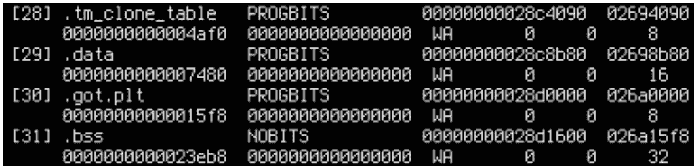

# 节点间缓存抖动:寻找 NUMA 性能错误

> 原文：<https://thenewstack.io/internode-cache-thrashing-hunting-a-numa-performance-bug/>

基于 ARM 的计算机继续在个人计算和云服务器领域取得进展，从开发期间可以使用的基于 ARM 的 MacBooks 到基于 AWS Graviton2 的实例，这些实例[比类似的基于英特尔 x86 的实例](https://www.scylladb.com/2021/09/16/aws-graviton2-arm-brings-better-price-performance-than-intel/)提供更好的性价比。但亚马逊并不是唯一一家拥有基于 ARM 的实例的云提供商。Oracle Cloud 提供了 Ampere Altra A1，它可以扩展到每个 CPU 80 个内核，运行速度高达 3.3 GHz。

 [米哈尔·乔诺夫斯基

Micha 是 ScyllaDB 的一名软件工程师。他拥有华沙大学的本科学位，在那里他参与了 ScyllaDB 的拼花地板的实施。](https://github.com/michoecho) 

我在移植 [ScyllaDB](https://www.scylladb.com/) 时发现了一个奇怪的问题，ScyllaDB 是一个高性能、低延迟的数据库，旨在从现代基础设施中提取尽可能多的性能，运行在基于 ARM 的 Ampere A1 服务器上。我们将在适当的时候分享在如此庞大的服务器上运行 ScyllaDB 的全部性能基准测试结果。但首先，我想分享我的故障诊断结果，以提醒其他开发人员在为基于 ARM 的平台发布代码时可能会遇到的各种问题。

剧透警告:遇到的问题实际上不是由于基于 ARM 的安培 Altra 平台。那么问题是什么呢？

*(如果你喜欢追寻令人费解的表演奥秘，* [*注册 P99 CONF*](https://www.p99conf.io/)*——一个致力于所有事情表演的免费虚拟会议。)*

## 问题是

当在 Oracle Cloud 的新 ARM 机器(80 个 ARM 内核的裸机 Ampere A1)上测试 ScyllaDB 的性能时，我注意到一些测试运行明显比预期慢。

我多次重复基准测试，并确定它的行为是双峰的:要么 ScyllaDB 以预期的满吞吐量运行(大约每内核每秒 45k 次写入),要么以 40%的吞吐量运行——从不介于两者之间。慢速跑和快速跑发生的频率差不多，但是快速跑和慢速跑是随机交错的，没有任何可辨别的模式。


*运行良好时，每个分片每秒能够支持大约 50，000 次写操作。*


*在同一台服务器上，在同一基准的不同运行中，碎片仅达到每秒 16，000 次写入操作——不到良好运行性能的 40%。*

没有进一步阅读，你是否已经有了答案的预感？做一个心理记录，然后让我们看看我们发现了什么。

## 硬件利用率

当寻找任何瓶颈时，最好从检查资源利用率开始。利用率为 100%的资源是瓶颈候选资源。如果没有资源得到 100%的利用，那么要么是客户端问题，要么是调度问题(例如，即使资源可用，线程也在休眠)。在 ScyllaDB 的例子中，我们关注的主要约束资源是 CPU、RAM、网络和磁盘*。*

暴露问题的基准测试是专门为了给 CPU 增加压力:

```
cassandra-stress write duration=1h  cl=QUORUM  -pop dist=UNIFORM\(1..100000\)  -mode native cql3 maxPending=1024  -rate threads=1000  -node  10.0.0.107

```

由于数据集如此之小，所有写入都应该发生在 RAM 中；不应将任何内容刷新到磁盘。我们为这个测试禁用了 commitlog，所以磁盘应该是静默的。

查看 cassandra-stress 的默认模式，我们预计每个查询的网络流量约为 200 字节，这(假设 50k ops/core/秒)总计约为 10mb/core/s。对于该基准测试，我碰巧在 32 个内核上运行 ScyllaDB(我在该网络中没有足够的可用客户端节点来使用所有 160 个内核)，因此总共为 320 MB/s，或约 2.6Gib/s。这与宣传的 100Gib/s 的吞吐量相差甚远，因此我们

让我们检查一下指标:

[](https://cdn.thenewstack.io/media/2022/06/d65e8a03-image2.png)

网路性能

[](https://cdn.thenewstack.io/media/2022/06/16d3d875-image25.png)

磁盘性能

正如预期的那样，磁盘几乎是安静的，网络流量在预期范围内，远低于其最大容量，CPU 负载为 100%。(并非所有碎片都如此，但这是意料之中的。我们要求 cassandra-stress 实现均匀的负载分布，所以稍微快一点的碎片会稍微少用一点。最慢的碎片是瓶颈。)

这显然是一个 CPU 瓶颈。但是如果我们想再次检查网络是否正常，我们可以在同一台机器上运行基准客户机。我这样做了，吞吐量保持不变。所以让我们继续诊断 CPU。

## 基本 CPU 统计

有两种可能性:要么 a)运行速度慢的每次查询做的工作更多，要么 CPU 做的工作更慢。为了找出是哪一种情况，我们从 IPC(每周期指令数)开始。IPC 降低意味着 CPU 工作速度变慢。

```
sudo perf stat  -C8  --timeout  10000

```


我们发现慢速运行的 IPC 为 0.42，快速运行的 IPC 为 0.98。这非常接近吞吐率:慢速运行时约为 16k/内核/秒，快速运行时约为 45k/内核/秒。

这是一个确凿的证据，表明我们正面临一个低级别的 CPU 瓶颈。慢速运行并没有做额外的工作，但是它们在利用 CPU 方面更差。

CPU 利用率低有几种可能的解释。最重要的是:不可预测的分支、不必要的数据依赖和缓存缺失。在这种情况下，只有缓存未命中才有意义，因为在这两种情况下，CPU 都在对相同的数据执行相同的代码。此外，`perf stat`的输出显示，慢速情况下的分支未命中总体较少。

## 火焰图

在我们做任何事情之前，让我们禁用地址空间布局随机化，以简化调查和交叉引用地址。

```
echo  0  |  sudo tee  /proc/sys/kernel/randomize_va_space

```

现在，在我们试图理解摊点的本质之前，让我们试着找到它们。为此我们可以使用[火焰图](https://www.brendangregg.com/flamegraphs.html)。

```
git clone https://github.com/brendangregg/FlameGraph
git  -C  FlameGraph remote add adamnovak https://github.com/adamnovak/FlameGraph
git  -C  FlameGraph fetch adamnovak
git  -C  FlameGraph cherry-pick  7ff8d4c6b1f7c4165254ad8ae262f82668c0c13b  # C++ template display fix

x=remote
sudo timeout  10  perf record  --call-graph=fp  -C8  -o  $x.data
sudo perf script  -i  $x.data  >  $x.perf
FlameGraph/stackcollapse-perf.pl  $x.perf  >  $x.folded
FlameGraph/flamegraph.pl  $x.folded  >  $x.svg

```

[](https://cdn.thenewstack.io/media/2022/06/bd983f7f-image20-1024x972.png)

“好案例”

[](https://cdn.thenewstack.io/media/2022/06/badef3be-image23-1024x974.png)

“坏案例”

有两件事很突出:

1.  在好的情况下，TCP 处理需要更多的时间。这可能是因为其余的代码更快。(我们暂时忽略图表的这一部分。)
2.  坏的情况有两个在好的情况下根本不明显的宽峰:`compact_radix_tree::tree::get_at() and database::apply()`。各占总工作量的 10%左右。我们应该调查他们。

让我们来看看这些样本的指令级分解:

```
sudo perf annotate  -i  $x.data

```


显然，对于两个可疑函数中的每一个，99%的时间都花在一条加载指令上。

交叉引用汇编和源代码，我们看到 for `compact_radix_tree::tree::get_at() that ee9a74: ldr w10, [x20, #8]`是第一条指令，当树被搜索时，从树节点加载一些东西到内存。这似乎是一个非常合理的瓶颈:遍历树正是我们预期会发生缓存缺失的地方。

然而，`database::apply, cbbfa8: ldr w9, [x26, #3720]`中的是从内存加载当前日志级别的指令。(然后与`cbbfc4: cmp w9, #0x4)`中的`log_level::trace`进行比较。这是不合理的:日志级别应该被完美地缓存。此外，它只用于可预测的比较:CPU 应该能够在等待加载结果的同时继续推测性地执行程序。非常奇怪。让我们删除这个指令，看看会发生什么。

```
readelf  --headers  /opt/scylladb/libexec/scylla  |  grep  -A1  -m1  .text

```


```
echo  'mov w9, #0'  |  as  -o  patch.o
objcopy  -O  binary patch.o  patch.bin
sudo dd of=/opt/scylladb/libexec/scylla seek=$((0xcbbfa8  -  0xba6840  +  0x996840))  if=patch.bin bs=1  conv=notrunc

```

我们没有从内存中加载日志级别，而是硬编码了#0 ( `log_level::error`)。让我们试着再跑一次，看看有什么不同。

[](https://cdn.thenewstack.io/media/2022/06/b60eac84-image9-1024x782.png)

`database::apply`已经从图上消失了。然而…


似乎略有改善:IPC 从 0.42 提高到 0.43，吞吐量从 47 万次操作/秒提高到 48 万次操作/秒。但这与我们预期的 10%相差甚远。“瓶颈”只是消散了，而不是消失了。

这说不通。这是怎么回事？

## 电源管理单元

不幸的是，似乎周期火焰图不会帮助我们。让我们后退一步。

我们已经提到，缓存未命中是唯一合理的原因。但是有两种可能:要么 a)他们的数量更多，要么 b)惩罚力度更大。非常不幸的混淆可能会导致大量的高速缓存未命中。我们来看看是不是这样。

CPU 的性能监控单元(PMU)提供对缓存未命中统计数据的访问。我们可以在`perf list`中找到他们的名字，然后读出来(比如用`1perf stat --timeout 10000 -e l2d_cache_refill`)。但是如果我们只搜索看起来相关的事件，我们可能会错过一些东西。我们把它们都扔了吧。

我们编写一个脚本，从 ARM 的文档中提取该架构上所有可用 PMU 事件的列表。我们可以打印出他们的号码，然后传给`perf stat`。我们用
收集所有事件

```
sudo perf stat  --timeout  1000000  -C8  ...events...  -x\t  2>&1  |  sed  's/<not counted>/0/g'

```

PMU 的硬件计数器数量有限，因此`perf`无法一次计数所有事件——它必须多路复用它们。这意味着结果将是近似的。这对我们来说应该不成问题，因为我们正在重复一个工作负载。然而，为了以防万一，让我们使用一个长的超时来最小化方差。

`perf stat -x\t`生成一个制表符分隔的文件。我们可以将结果加载到一个漂亮的表格中:

[](https://cdn.thenewstack.io/media/2022/06/1ff73951-image4.png)

查看所有相关事件，我们会发现好的情况在所有级别上都有更多的缓存未命中。这可能意味着坏情况不会有更多的失误，但惩罚更大。

未命中的惩罚可能是由增加的争用引起的:在糟糕的情况下，可能核心对访问主存储器的竞争更加激烈？让我们看看在不同数量的内核上运行 ScyllaDB 时会发生什么:


事实上，运行不良的 IPC 与使用的内核数量显著相关:30 个内核为 0.42，64 个内核为 0.26。降低内核数量时，运行不良 IPC 会上升，并在 10 个内核时稳定在 1.0 左右。对于少于 10 个内核，不良运行是不可见的。对于任何数量的内核，运行良好的 IPC 都接近 1。

一个非常重要的观察结果是，所有不良运行都在大约 500k ops/s 的速度下遇到瓶颈，这个速度在大约 11 个内核时达到。除此之外增加更多的内核并不能改善它；它只会降低 IPC。很明显，内核会激烈地争夺某些东西，但只是有时。为什么？不知道。

让我们回到牌桌上，看看所有其他事件。也许我们会发现在坏的情况下更经常发生的事情。这可能是一个很好的瓶颈。

有几个这样的事件:

*   `CPU_CYCLES`很明显，因为我们在两种情况下测量的时间是一样的。
*   `LDREX_SPEC`“推测性执行的独占操作”——但由于它每秒仅发生 1000 次，所以不可能是原因。
*   `EXC_UNDEF`“本地发生的未定义异常的数量”——我甚至不知道这是什么意思，但这似乎不是一个合理的瓶颈。
*   `STALL_BACKEND`只能支持我们的猜测，CPU 在内存上遇到了瓶颈。
*   `REMOTE_ACCESS`

## NUMA

[](https://cdn.thenewstack.io/media/2022/06/13a5b853-image6.png)

REMOTE_ACCESS 可疑。为什么我们需要接入另一个插座呢？ScyllaDB 是 NUMA 感知的——它的底层 [Seastar](https://www.scylladb.com/product/technology/shard-per-core-architecture/) 框架将每个碎片的内存绑定到运行碎片的 CPU 插槽。即使没有这样做，默认情况下，Linux 也会在出现页面错误的套接字上为新页面分配内存。碎片应该只在它们自己的内存中引起页面错误，所以应该没有远程套接字访问。此外，我们在 32 个内核上运行基准测试，所有内核都在 socket 0 上。即使碎片共享一些内存，也是在同一个插槽上。也许远程访问发生在内核空间？

我们来看看:


显然，只有 36%的远程访问发生在内核中，但其他的都来自 ScyllaDB！怎么会这样呢？也许装订出了问题。让我们检查一下 [numa_maps](https://man7.org/linux/man-pages/man5/numa_maps.5.html) ，它显示了进程中所有内存映射的 numa 统计信息和策略:

```
sudo cat  /proc/$(pgrep  -x  scylla)/numa_maps

```

啊哈！我们忘记了碎片共享一些内存:静态内存。所有碎片都使用`.text`、`.bss`和`.data`。通常，我们会认为这种内存是只读的或主要是只读的，因为 Seastar 架构避免了共享的原子变量，而支持为可写变量提供每个内核专用的内存。但也许我们违反了这个原则。


`N0=*x* N1=*y*`表示地址范围内的 *x* 页分配在节点 0 上，y 页分配在节点 1 上。通过交叉引用`readelf --headers /opt/scylladb/libexec/scylla`我们可以确定`.text`、`.rodata`等只读段在节点 0 上，而`.data`、`.bss`等可写段在节点 1 上。


这就是远程访问的目的。这可能是性能问题的原因吗？

我们可以通过运行`numactl`下的可执行文件，将内存强制分配给一个给定的 NUMA 节点来测试这一点。让我们预先考虑`/usr/bin/numactl --membind 1 to /usr/bin/scylla scylla_args…:`

`sudo systemctl edit --full scylla-server
sudo systemctl restart scylla-server`


糟糕，我们想把所有东西都绑定到节点 1，但是可执行文件的某些部分(`.text`)仍然在节点 0 上。这是因为 Linux 只有在分配页面时才会参考内存策略——但是`.text`已经在页面缓存中分配了。如果我们也想将`.text`强制到节点 1，我们可以停止 ScyllaDB，丢弃页面缓存并重试。

```
sudo systemctl stop scylla-server
echo  3  |  sudo tee  /proc/sys/vm/drop_caches
sudo systemctl start scylla-server

```


现在一切都在节点 1 上。

让我们试着对节点 0 上的所有内容运行几次基准测试，然后对节点 1 上的所有内容运行几次。啊…就是这样！节点 0 上的每次数据运行都很快，而节点 1 上的每次数据运行都很慢。

我们已经知道远程内存访问是瓶颈。现在我们必须明白为什么。

如果您想知道为什么`.data`和`.bss`有时在节点 0 上，有时在节点 1 上:这是由 ScyllaDB 恰好启动的内核决定的。当 ScyllaDB 启动时，Linux 将它调度到任意一个内核上——有时在节点 0 上，有时在节点 1 上。启动时，`.data`和`.bss`被触碰，导致页面错误。根据默认策略，它们被分配在包含此核心的 NUMA 节点上。只是后来，ScyllaDB 启动碎片线程，并将它们绑定到用户选择的内核。

## 寻找 NUMA 问题的根源

为了进一步挖掘，我们需要比 numactl 更细粒度的东西，它导致所有内存都被分配到给定的节点上。我们必须使用`mbind()`——一个允许为地址范围设置 NUMA 内存策略的 Linux 调用。使用`MF_MOVE_ALL`标志，它还允许在节点之间移动已经分配的内存。

我们来添加一个让 ScyllaDB 调用`mbind()`的方法。我们可以为此修改 ScyllaDB 的 REST API。既然我们懒得添加新的呼叫，我们就劫持一个现有的呼叫吧:


我们侵入了一个随机的 API 调用。现在我们可以

```
curl http://localhost:10000/column_family/metrics/write_latency/0x028b0000,0x10000

```

在节点间移动任意页面范围。

使用这种能力，我们发现只有一个页面是重要的:`0x28c0000`，它包含`.data`、`.got.plt`和`.bss`的开头。当这个页面在节点 1 上时，运行速度很慢，即使所有其他页面都在节点 0 上。当它在节点 0 上时，运行速度很快，即使所有其他页面都在节点 1 上。

对内存的远程访问仅在 L2 缓存未命中后发生。缓存未命中有两种可能的原因:别名和无效。如果它们是因为混叠而发生的，这意味着 ScyllaDB 正在自然地访问足够的内存，以至于所有重要的行都无法放入缓存中。那会很难处理。也许这需要重新设计程序来消除全局变量。

但也许我们不小心使一个缓存行失效了。如果是这样的话，我们应该能找到它。但是`mbind()`不允许我们测试比页面更细粒度的区域，所以我们必须随机应变。

如果我们可以操作可执行文件的布局，我们可以将可疑区域移动足够的字节，用页面边界将它分成两半。然后，我们可以通过将一半发送到远程节点(连同周围的页面)来检查哪一半是坏的。

如果我们重复这种二分法足够多次，我们将找到有问题的高速缓存行。

我们可以通过在可疑区域前填充一些填充物来移动它。似乎是做那件事的好地方。我们可以在 ScyllaDB 的某个地方添加一个数组并重新编译它。(顺便说一下，注意我们被侵入的 mbind API 向这个数组写了一些东西，以防止它被优化掉。如果它没有被使用，链接器就会丢弃它，因为 ScyllaDB 是用`-fdata-sections`编译的。

让我们尝试将`.got.plt`填充到页面边界来测试这种攻击。




它起作用了:我们可以操纵布局。现在我们要重复这个 10 次才能找到罪魁祸首。

## 修复

最终，我们将搜索范围缩小到`.bss`的字节`0x380`–`0x400`。因为`.bss`对齐 32，所以不能再往前走了。让我们使用 gdb 来看看这些字节是如何使用的:

```
sudo gdb  -p  (pgrep  -x  scylla)
(gdb)  watch *0x28d0000
(gdb)  watch *0x28d0008
(gdb)  watch *0x28d0010
(gdb)  watch *0x28d0018
(gdb)  continue

```

当我们用这些观察点运行基准测试时，我们看到只有`0x28d0000`被写入。这发生在`compact-radix-tree.hh`的第 568 行:


有问题的地址下面是什么？

`(gdb) info symbol 0x28d0000`


这解释了一切。

`nil_root`是一个特殊的全局树节点，在树算法中用作防护。然而，这个技巧有一个意想不到的副作用。`node_head_ptr`是一个指针，自动更新赋值目标中的反向引用。每当它被分配给`nil_root`时，它就向一个共享的缓存行写入一些东西。这导致了节点间缓存抖动，代价非常高:根据[https://www . Anand tech . com/show/16315/the-ampere-altra-review/3](https://www.anandtech.com/show/16315/the-ampere-altra-review/3)，每次写入大约需要 2000 个周期！

[](https://cdn.thenewstack.io/media/2022/06/921b2b72-image27.png)

特殊外壳`nil_root`解决了我们的性能问题:

[https://github . com/scylladb/Scylla/commit/126 baa 7850 e 185908681 be 219 a 37 DC 7 ce 7346 c 14](https://github.com/scylladb/scylla/commit/126baa7850e185908681be219a37dc7ce7346c14)

## 后见之明

我后来测量到，有问题的对`nil_root`的赋值在每个查询中大约出现三次。

每秒 3e9 个周期，每个查询三次失效，每次失效 2e3 个周期，我们可以估计每秒 3e9/3/2e3 = 500，000 个查询的瓶颈。这与观察到的结果非常接近。

有了充分的知识，我们现在可以更好地理解循环火焰图。这不是撒谎:由`perf annotate`突出显示的指令确实有一些特殊之处:*它们是从经过反复处理的缓存行加载的。*

`(gdb) info address dblog`


树节点加载指令非常慢，因为它正在加载 nil_root。日志级加载非常慢，因为它碰巧在同一个缓存行上。

尽管日志级负载仅用于完全可预测的比较，但推测性执行无法隐藏它，因为 NUMA 访问的延迟对于它来说太高了。2000 个周期足以耗尽重排序缓冲区中的所有可用空间，现在重排序缓冲区只有几百条指令。

然而，可疑的加载指令并不是瓶颈；当我们移除其中一个时，没有任何改善。真正的罪魁祸首是看不见的，它的性能损失分散在整个程序中。

因此，从这个案例中得到的一个重要教训是:一条无辜的 CPU 指令使整个系统的性能下降了 50%以上，但不可能通过采样来检测。使缓存失效本身就很快；这种惩罚在其他地方也是显而易见的，并且很难与原因联系起来。

## 加入我们的 CONF P99

如果你喜欢这种寻找单个漏洞的数字侦探，你会真的喜欢将在 10 月 19 日至 20 日举行的 P99 CONF 免费虚拟会议上分享的各种侦探故事。P99 CONF 致力于痴迷于 P99 百分位和高性能、低延迟应用的工程师。您现在可以在 [p99conf.io](https://www.p99conf.io/) 注册。

<svg xmlns:xlink="http://www.w3.org/1999/xlink" viewBox="0 0 68 31" version="1.1"><title>Group</title> <desc>Created with Sketch.</desc></svg>