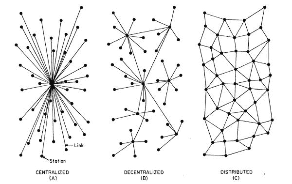

# 星际文件系统可以为分布式永久网络铺平道路

> 原文：<https://thenewstack.io/interplanetary-file-system-could-pave-the-way-for-a-distributed-permanent-web/>

在过去的几十年里，我们中的许多人受益于互联网给我们生活带来的巨大变化。我们现在已经习惯了不断获取信息，社交媒体使虚拟社区的建立成为可能，以及电子商务网站提供的轻松和便利。所有这一切都是通过超文本传输协议(HTTP)实现的，该协议于 1989 年推出，旨在促进 CERN 研究人员之间的信息共享。

但是自从早期的 [Web 1.0](https://www.techopedia.com/definition/27960/web-10) 以来，在线内容已经有了很大的发展，我们现在可以这么称呼它。当时，网页大多是静态的，很少有用户生成的内容或互动。随着 Web 2.0 的成熟，形势开始转向强调互操作性和参与式文化，这可以在维基、博客、视频和图像共享网站、社交媒体平台上的大量用户生成内容中看到，同时也迎合了流媒体服务的[需求。但是，这些带宽密集型](https://www.howtogeek.com/201827/how-much-mobile-data-do-streaming-services-use-and-how-you-can-make-them-use-less/)[超媒体](https://smartbear.com/learn/api-design/what-is-hypermedia/)的出现，以及来自[物联网](https://thenewstack.io/the-internet-of-things-needs-an-infusion-of-web-technologies/)的潜在大量数据涌入，开始给互联网[带来压力](https://www.theverge.com/2020/3/27/21195358/streaming-netflix-disney-hbo-now-youtube-twitch-amazon-prime-video-coronavirus-broadband-network)，促使一些人寻找替代方案。

## IPFS:“更快、更安全、更开放”

构建下一代 Web 3.o 的一个有希望的候选者是[星际文件系统](https://ipfs.io/) (IPFS)，这是一个相对较新的超媒体协议和分散数据存储系统，利用了对等(p2p)网络架构。

IPFS 这个颇具科幻色彩的名字是对美国计算机科学家 J.C.R. Licklider 在 20 世纪 60 年代关于“星系间计算机网络”的思考的肯定。2014 年，美国计算机科学家、协议实验室创始人[胡安·贝内](https://juan.benet.ai/)首次开发了 IPFS，以解决 HTTP 的一些缺点。Benet 的目标是创造一些最终可能成为“[互联网](https://www.axelquack.capital/p2p-data-storage-with-ipfs/)新的主要子系统”的东西，同时也考虑到更新的发展，如[支持](https://www.investopedia.com/terms/d/distributed-ledger-technology-dlt.asp)[区块链](https://thenewstack.io/what-you-need-to-know-about-blockchain-before-making-the-leap/)的分布式账本技术。

“IPFS 是一个分散的数据网络，”协议实验室的工程经理 Mikeal Rogers 解释道。“世界上的任何人都可以在网络上提供数据，世界上的任何人都可以安全地从他们或其他任何人那里接收数据。IPFS 过去是，现在仍然是作为 Web 3.0 的数据传输协议开发的。由于该协议是完全分散的，所有数据都由[哈希](https://thenewstack.io/git-transitioning-away-from-the-aging-sha-1-hash/)处理，因此它非常适合需要处理大量数据的区块链应用程序，这些数据无法放入链中。”

支撑 IPFS 的分散模式与 HTTP 运行的客户端-服务器模式形成了鲜明的对比。HTTP 最初是为在 web 浏览器和 web 服务器之间传输信息而设计的，它使用基于位置的寻址，允许用户访问存储在中央服务器上的数据。虽然这简化了数据的管理和分发，但效率不是很高。这是因为当你点击一个网站时，你的网络浏览器必须直接连接到托管该网站的服务器。对于较大的音频和视频文件，它可能会占用大量带宽，甚至非常昂贵，特别是如果源服务器位于很远的地方。浏览或下载流行内容也会导致网络拥塞。HTTP 也有潜在的隐私和安全问题:数据可以被任何控制服务器的人访问或更改，或者被黑客的[分布式拒绝服务](https://thenewstack.io/a-ddos-emerges-that-busies-a-cipher-with-cpu-intensity/) (DDoS)攻击弄得无法访问。

相比之下，IPFS 使用[基于内容的寻址](https://flyingzumwalt.gitbooks.io/decentralized-web-primer/content/avenues-for-access/lessons/power-of-content-addressing.html)，这样内容可以被验证并从远处的服务器上解耦，存储在离用户更近的地方。它通过使用[内容标识符](https://docs.ipfs.io/concepts/content-addressing/) (CIDs)，或用于指向 IPFS 内容的“标签”来做到这一点。cid 是基于内容的[加密哈希](https://docs.ipfs.io/concepts/hashing/#hashes-are-important)生成的，或者是一个使用数学算法获取任意输入并返回固定长度值的函数。

“当你把数据放在 IPFS 时，可以通过它的散列地址或 CID 获得，”Rogers 说。“世界上任何人都可以取得那个地址，把它输入他们的计算机，并检索数据。就像世界上任何人都可以在浏览器中输入 URL 并检索一样，任何拥有 CID 的人都可以检索 IPFS 网络中的数据。”

内容中的任何差异都会导致不同的 CID，而添加到不同 IPFS 节点的相同内容仍会产生相同的 CID，这意味着用户可以轻松验证数据的完整性。

> 除了提供分散的内容存储和验证，IPFS 还可以用于构建和托管分散的应用程序(DApps)，这是一种开源的计算机应用程序，其后端代码运行在对等网络上。

“有了 CID，您要查找的数据的散列就在地址中，因此您可以从任何地方获得该数据，因为您可以通过比较散列来验证数据是否正确，”Rogers 补充道。这使您可以拥有一个分散的无信任网络，因为您可以从任何地方和任何人那里检索数据，并且可以用密码验证数据是否正确

此外，IPFS 的内容寻址比 HTTP 的基于位置的寻址更有效，因为可以从网络中最近的节点检索数据，而不是从远程服务器。这种配置还意味着，即使一个节点出现故障，仍然可以从其他节点检索完整的内容。即使部分网络瘫痪，数据依然存在，因为这可能发生在大规模停电或 T2 审查活动期间。

Rogers 指出:“IPFS 的主要区别在于，可以从世界上任何希望提供数据的人那里检索到 CID，而 HTTP 网站必须位于 URL 中编码的特定位置。”

要在 IPFS 网络上访问或存储内容，必须安装软件并运行一个 IPFS 节点。要在不安装软件的情况下通过 HTTP 访问 IPFS，可以使用[网关](https://ipfs.github.io/public-gateway-checker/)，比如 [IPFS 公共网关](https://ipfs.io)，或者由 [Cloudflare](https://www.cloudflare.com/) 管理的[分布式 Web 网关](https://www.cloudflare.com/distributed-web-gateway/)。这些网关中的任何一个都允许用户从网络中的任何人那里检索内容。

集中式、分散式和分布式网络系统

## 有一个 DApp

除了提供分散的内容存储和验证，IPFS 还可以用于构建和托管[分散的应用](https://djohnstonec.medium.com/the-general-theory-of-decentralized-applications-dapps-4901877d368) (DApps)，这些应用是开源的计算机应用，其后端代码运行在对等网络上。一些 DApps 拥有自己的区块链，如比特币，而其他的则运行在现有的区块链上，并生成自己的令牌。DApps 的范围可以从[数字资产交易所](https://www.ventureradar.com/keyword/Digital%20Asset%20Exchange)、[游戏](https://dappradar.com/rankings/category/games)和社交媒体平台。

“这些都是利用外链数据的 DApps 的例子，这就是 IPFS 的伟大之处，”Rogers 指出。“任何时候你想在一个分散的系统中引用数据，比如 DApp，你应该使用 IPFS。您可能应该使用网关来读取 web 浏览器中的数据，因为 p2p 协议仍在进入浏览器。但对你在区块链交易的数据的引用应该始终使用 IPFS 地址，这样你就可以在任何内容寻址网络的任何地方查找这些数据，无论是 IPFS 还是未来网络，因为地址不会将你锁定在 IPFS 或任何特定的协议上。”

DApps 的另一个引人注目的用例是不可替代令牌(NFT)的创建、分发和存储，NFT 本质上是存储在区块链上的唯一加密资产。与现实生活中的无价收藏品一样，与法定货币不同，NFT 的价值源于这样一个事实，即它们不能等价交换或交易，由于区块链技术，它们的真实性和所有权历史(或[出处](https://www.artworkarchive.com/blog/provenance-what-is-it-and-why-should-it-matter-to-you))很容易验证。NFT 的范围可以是数字艺术品、推文，甚至是可收藏的角色(比如 [CryptoKitties 的虚拟猫](https://medium.com/dapp-com/10-most-expensive-nfts-hundreds-of-thousands-for-a-crypto-kitty-b152a7983036))。所有这些数字收藏品都需要存储在某个地方，这就是像 IPFS 这样的分散式系统的用武之地。

“特别是对于 NFTs，我们甚至走得更远，建立了一项服务，在 [nft.storage](https://nft.storage/) 无限期免费存储 NFT 数据，”Rogers 补充道。

## 新的无信任网络

那么 IPFS 将来会补充甚至取代 HTTP 吗？也许吧。但可以肯定的是，网络的进化轨迹将很快超过目前的协议，如果它还没有。与此同时，随着越来越多的用户、开发者和公司采用 IPFS，它仍在不断完善。

“IPFS 是通用的，几乎没有存储限制，”Neocities 创始人凯尔·德雷克在 T2 博客 T3 中写道，他宣布他的公司决定成为第一个实施 IPFS 的主要网站。“它可以处理大小不同的文件。它自动将较大的文件分解成较小的块，允许 IPFS 节点不像 HTTP 那样只从一台服务器下载(或流式传输)文件，而是同时从数百台服务器下载。IPFS 网络变成了一个细粒度的、无信任的、分布式的、易于联合的[内容交付网络](https://www.webopedia.com/definitions/cdn/) (CDN)。这对几乎所有涉及数据的东西都很有用:图像、视频流、分布式数据库、整个操作系统、区块链、8 英寸软盘的备份，以及对我们来说最重要的静态网站。”

最终，IPFS 背后的这些核心理念可能是建立一个分布式、永久性网络的一个解决方案。这是脆弱和高度集中的系统的一种可能的替代方案，我们现在已经用 HTTP 等过时的协议实现了这种系统——并且可能是对不确定的未来的一种有用的对冲。

罗杰斯说:“我们在协议实验室的部分使命是建立长期造福人类的技术。“人类文化的很大一部分已经发生在网上——但在 Instagram 这样的封闭平台上。用于分散媒体共享的数据原语——如 NFTs——最终可能取代 Instagram 等封闭平台。我们认为这些数据需要无限期保存:这是我们作为一个物种的历史记录的一部分，我们很高兴能够为人类文化提供长期有保证的持久性。”

更多结束于 [ipfs.io](https://ipfs.io/) 。

<svg xmlns:xlink="http://www.w3.org/1999/xlink" viewBox="0 0 68 31" version="1.1"><title>Group</title> <desc>Created with Sketch.</desc></svg>