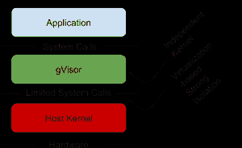

# 采访:Google gVisor 和保护多租户容器的挑战

> 原文：<https://thenewstack.io/interview-google-gvisor-and-the-challenge-of-securing-multitenant-containers/>

上周，谷歌[发布了一个新的开源项目](https://cloudplatform.googleblog.com/2018/05/Open-sourcing-gVisor-a-sandboxed-container-runtime.html)， [gVisor，](https://github.com/google/gvisor)一个在多租户环境中安全运行容器的沙箱。这种方法，如果证明可行，可以消除使用虚拟机(VM)隔离容器的成本。它也可能是正在开发的越来越多的云原生技术的一个组成部分，与 Kubernetes 一起，Kubernetes 是谷歌几年前作为开源项目发布的另一个项目。

我们在 kube con+CloudNativeCon Europe 2018 上采访了谷歌产品经理 [Yoshi Tamura](https://www.linkedin.com/in/yoshiat/) ，以了解更多关于 gVisor 的信息。

【gVisor 的需求是什么？容器比虚拟机更具性能和灵活性。但是它们也有自己的一套安全约束？

绝对的。因此，gVisor 是一种新型的沙箱，它是轻量级的，但在 VM 级别上提供了容器之间的强大隔离。大概 150ms 就能开机，占用空间最小，大概 15MB。我们还看到了多租户的新兴使用案例。人们越来越要求在一个环境中运行多个用户组。这实际上暴露了改善这些容器之间隔离的需要。

**澄清一下，最初对沙箱的担心不是来自人们或从外部进入容器的恶意用户，而是通过共享操作系统进入容器？**

没错。因此，当您实际拥有这种共享环境时，您通常无法完全了解或控制在该容器中运行哪种软件。假设有恶意软件在容器内运行，并且容器暴露于主机内核提供的实时系统接口。如果其中一个恶意应用程序成功篡改并破坏了它，基本上该节点上的所有容器都可能被破坏或至少受到影响。因此，我们试图用 gVisor 来阻止特定的恶意软件攻击系统的其余部分。

**所以你不能将容器与外界隔绝？**

从技术上来说，有很多现有的技术[来做这件事]，如 [seccomp filter](https://www.kernel.org/doc/Documentation/prctl/seccomp_filter.txt) 来过滤系统调用和应用程序访问。还有[塞利努斯](https://selinuxproject.org/page/Main_Page)和[阿帕莫尔](https://wiki.ubuntu.com/AppArmor)。为此，您需要专家来配置它们，以满足这些安全或隔离要求。gVisor 的伟大之处在于，这种隔离嵌入在引擎中，因此即使您不熟悉这些概念，我们也可以提供一个非常快速、强大的隔离边界，并且占用空间非常小。

我们听说过关于配置 SELinux 的恐怖故事，它非常强大，但我想你会说它的扩展性不好，因为它需要大量的专业知识来配置。

我完全同意。如果你熟悉这些技术，当然，你仍然可以使用它们。因此，我们认为 gVisor 本身是现有世界中的一项补充技术。我们认为这是一种非常新的方法，因此我们真的希望尽快开源，这样我们就可以在其余的开源社区中一起推进容器隔离或容器安全领域。

**gVisor 最初是内部项目吗？或者说它是如何产生的？**

没错。所以谷歌一直在使用 gVisor 进行各种服务，它实际上已经投入生产有一段时间了。这实际上给了我们信心，我们的方法肯定是有价值的。

你能描述一下沙盒吗？它是什么，与使用虚拟机有什么不同？

是的。也许我应该从虚拟机方法开始，因为这是现在使用的方法。这是您在虚拟机中放置容器的地方。这肯定是一个非常合理的方法。虚拟机具有非常强的隔离边界。这种方法的缺点是占地面积大。

因此，我们采用的方法是容器照常发出系统调用，gVisor 将跟踪这些系统调用，但不使用 VM 中的来宾内核。有一个称为 Century 的进程，它将模拟应用程序发出的系统调用，然后将它们传播到主机内核或一些必要的 IO 服务。因此，从技术上讲，这实际上不是使用虚拟机作为边界，而是使用操作系统层来提供隔离。

有两种方法可以捕获当前 gVisor 中的系统调用。一个是本地操作系统架构 [pTrace](http://man7.org/linux/man-pages/man2/ptrace.2.html) ，另一个是 [KVM](https://www.linux-kvm.org/page/Main_Page) 。

**为什么拦截系统调用比使用新内核要好？怎么会更好呢？**

让我们从 pTrace 开始。pTrace 部分确实是由主机内核提供的。这里的技巧是，不是主机内核直接处理系统调用——通常的容器就是这种情况——而是将请求转发给 Century，它将模拟用户区域中最精简的内核系统行为。即使这受到损害，也不意味着攻击者可以拥有整个系统，因为它只是驱动器上的一个进程。

即使攻击者损害了 Century，也不一定意味着攻击者拥有整个系统。例如，在常规容器的情况下，如果攻击者成功地破坏了内核，获得了所有权，那么基本上可以认为攻击者拥有了系统。但是在 gVisor 的情况下，即使攻击者能够以某种方式破坏 Century，它仍然会保留在那里。你知道，这只是其中一个过程。

这样可以阻止攻击者逃出集装箱吗？

没错。

**但是，是什么阻止攻击者进入集装箱呢？**

这实际上是非常重要的一点。我认为会有很多新技术来保护这部分。但是万一，特别是回到 gVisor，我们期望所有容器的典型部署是定期运行。你想用沙盒保护哪种软件？你不确定的软件。你无法控制的软件。这些是 gVisor 应该能够将风险包含在容器中的东西。

**博客文章[确实提到了大部分系统调用被覆盖，但不是全部。那么什么样的系统调用是无效的呢？在这种情况下，开发人员应该怎么做呢？](https://cloudplatform.googleblog.com/2018/05/Open-sourcing-gVisor-a-sandboxed-container-runtime.html)**

有一些系统调用没有完全实现——我实际上没有这些数据。然而，我们已经取得了很大进展。通过开源，如果我们真的能得到一些贡献。相信系统通话覆盖问题会解决的。而且绝对是一个可以解决的问题。

请告诉我们希望开放 sourcing gVisor 的愿望。当然，这听起来像是你想让社区看一看它，给它添加内容，甚至可能承担对它的控制。

我们希望与其他开源社区讨论这项技术，以便…真正讨论并找出前进的最佳方式。我们很高兴能与现有的源代码社区合作，真正推动容器领域的发展。

[谷歌](https://cloud.google.com/kubernetes-engine)是新堆栈的赞助商。

<svg xmlns:xlink="http://www.w3.org/1999/xlink" viewBox="0 0 68 31" version="1.1"><title>Group</title> <desc>Created with Sketch.</desc></svg>