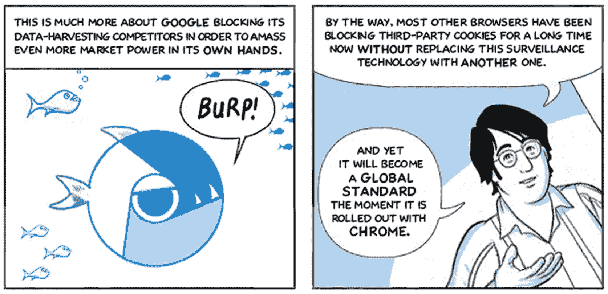

# 采访利亚埃利奥特，“铬合金”漫画艺术家

> 原文：<https://thenewstack.io/interview-with-leah-elliott-contra-chrome-comic-artist/>

在最新的《本周发展》中，我写了一部新的网络漫画，名为《T2》，《魂斗罗》，《T3》，是谷歌在 2008 年推出 Chrome 浏览器时出版的漫画《T4》的创作共用混音版。《Contra Chrome》的作者 Leah Elliott 称自己是一名“数字权利活动家”,在她的漫画中，她将矛头指向了谷歌自 2008 年以来的隐私政策——尤其是与 Chrome 浏览器内部运作相关的政策。

我联系了 Elliott，问了她一些问题，关于她创作这个混音的动机，为什么她对谷歌的隐私政策有如此强烈的感觉，以及她是否有任何专业原因来发布这个混音。她的回答如下。

新的堆栈:你显然花了很多时间来创建“魂斗罗”你做这个项目的动机是什么？

莉亚·埃利奥特

Leah Elliott: 我认为斯诺登的那个[夏天](https://en.wikipedia.org/wiki/Edward_Snowden)对我来说是一个转折点。就在那时，我意识到大规模监控是真实的，实时的，在线的，它威胁着自由民主社会的存在，在这一点上，对此无所作为就像抵抗一样是一种政治行为。

所以我试着自学，攀科技，结果大吃一惊。我认为大多数非技术人员都不知道互联网是一个多么狂野的西部。他们会对从他们那里提取的数据规模感到震惊，并对政治后果感到恐惧。但就目前情况来看，要了解这一点并不容易。这些信息散布在网络各处，隐藏在科技泡沫或冗长的科学文本中，披着误导性公关的糖衣。

我认为，漫画可以成为人们的切入点，因为它有能力将非常复杂的系统组织成清晰有趣的视觉效果。

所以我联系了黑客社区，与隐私专家交谈，Contra Chrome 的概念开始成形。

**你能告诉我们一些你的背景吗——你是做什么工作的，你以前和谷歌有过职业上的联系吗？**

我是一名漫画艺术家，有艺术和通信方面的背景。我没有在谷歌工作过，这辈子也不会画一个谷歌涂鸦。

**你有开发工作经验吗，还是在技术方面更像是自学成才？你听起来像一个非常好奇的人，喜欢看引擎盖下，但也许你可以澄清一点。**

这是自学的，从来没有发展。我能带来的只有最终用户的观点。

铬合金漫画，第 2 页

**显然你对谷歌在 Chrome 隐私方面的立场持悲观态度，但你如何看待它的网络功能创新——例如 [PWAs【渐进式网络应用】](https://thenewstack.io/growth-of-progressive-web-apps/)，以及试图通过其项目 Fugu 倡议来拓展网络的边界？在我看来，谷歌在网络功能方面比 Mozilla 和苹果更具前瞻性，但也许你对此有不同的看法。**

我可以理解为什么 PWAs 会成为下一个大事件。对于公司来说，实现无缝的跨设备和平台体验要便宜得多，为开发人员编写要快得多，这很好。不过，从我关注外部隐私的角度来看，我确实有些担心。

如果你读过我的漫画，你可能会认为我永远不会想使用你基本上一直登录的应用程序，这些应用程序即使在你离线时也一直开着，在后台收集用户行为。当你重新上线时，像 manifest `start_url`这样的元素会为指纹识别打开所有的门，甚至重新显示之前已经清除的 cookies。

就像我在漫画里说的:“为了再多十分之一秒的加载速度，我们愿意牺牲多少？”考虑到这项技术不是在经济真空中创造的，而是由谷歌和微软这样的全明星球员创造的，这对我来说很难通过。

从第 5 页

你似乎没怎么使用社交媒体。(或者至少我在 Twitter 或 LinkedIn 上找不到你！)你确实在使用乳齿象，但我想知道你还使用哪些其他社交媒体类型的服务？

我在尝试使用不会被反复无常的亿万富翁购买的面向未来的服务。所以去中心化对我来说很重要，开源代码也是如此。我喜欢乳齿象的无算法时间线和内置的防骚扰措施，目前不需要其他任何东西。

你的回答引出了下一个问题:你对[“web 3”](https://thenewstack.io/its-a-web3-world-now-how-the-hype-compares-to-web-2-0/)和去中心化区块链应用的前景有什么看法？或者你更喜欢非区块链的分散式应用程序(例如[小道消息](https://thenewstack.io/scuttlebutt-decentralize-and-escape-the-social-media-rat-race/)应用程序)？

我对“区块链”或“NFT”一类的东西没什么兴趣，因为我们只有一个星球可以燃烧。《流言蜚语》看起来很有趣，也很有前途，但我不认为在这一点上，大规模采用是可能的(或目标)。

另一方面，Fediverse 已经为 Instagram 难民准备好了 Pixelfed，为恢复 Goodreads 用户准备了 BookWyrm，或者作为 YouTube 替代品的 PeerTube。因此，人们可以轻松地使用这些服务，改变现状。

关于 Web3，我立刻想到了 Web0 宣言，你知道吗？

**是的，当它第一次出现的时候，我遇到过。今年我在写作中一直在探索 Web3 世界，尽管我仍然有点怀疑，但我确实认为它的一些部分是有希望的，并将及时与当前的网络融合。好了，我们现在知道你对谷歌的看法了，但是其他大型科技公司在隐私方面相比如何呢？**

老实说，对我来说都差不多。所有大型科技公司都采用了谷歌的商业模式，提供所谓的“免费”服务，将你锁在有围墙的花园里，通过无情地挖掘你的数据来利用由此产生的依赖性。

对我来说，苹果只是一个温和的变种，因为他们只是利用“隐私”的概念来控制市场。他们和谷歌一样是 PRISM 的一部分，去年令人憎恶的设备扫描计划证明，如果他们需要出售他们收集的大量用户数据，他们不会眨眼。

摘自第 28 页

**最后，我们的许多读者都从事应用程序开发工作，所以在未来的应用程序中尊重用户隐私方面，你有什么建议想给他们吗？**

决定一切的三个词:设计隐私。

你知道，通常谷歌开发人员和我在很多事情上不同意，当谈到道德或原则时，但是[就像 Dion Almaer](https://twitter.com/dalmaer/status/1516203816156372993) 一样，我真的很难过这部漫画不得不出来。

我们生活在一个怪异的世界里，开发者开发侵犯隐私的应用程序，活动家、学者和偶尔出现的漫画家必须警告、教育和提升公众。事情不应该是这样的。没有人在建造玻璃屋，其居民不得不用百叶窗、窗帘和挂毯来保护自己。

我坚信，从长远来看，谷歌和其他人的大规模监控机制只能导致极权主义。因为这归结为一个简单的等式:那些最有钱的政治实体将能够操纵大众。

因此，开发人员在自由民主中起着至关重要的作用，他们需要认识到，如此巨大的权力带来了难以置信的责任。他们不在社会真空中编码，如果他们不想有一天在他们制造的不人道的反乌托邦中醒来，他们需要极其小心地保护用户的宝贵数据。该应用的所有其他功能——包括加载速度——都必须服从于这个原因。

这就是我的信息，坦率地说，也是我的请求:设计隐私。

<svg xmlns:xlink="http://www.w3.org/1999/xlink" viewBox="0 0 68 31" version="1.1"><title>Group</title> <desc>Created with Sketch.</desc></svg>