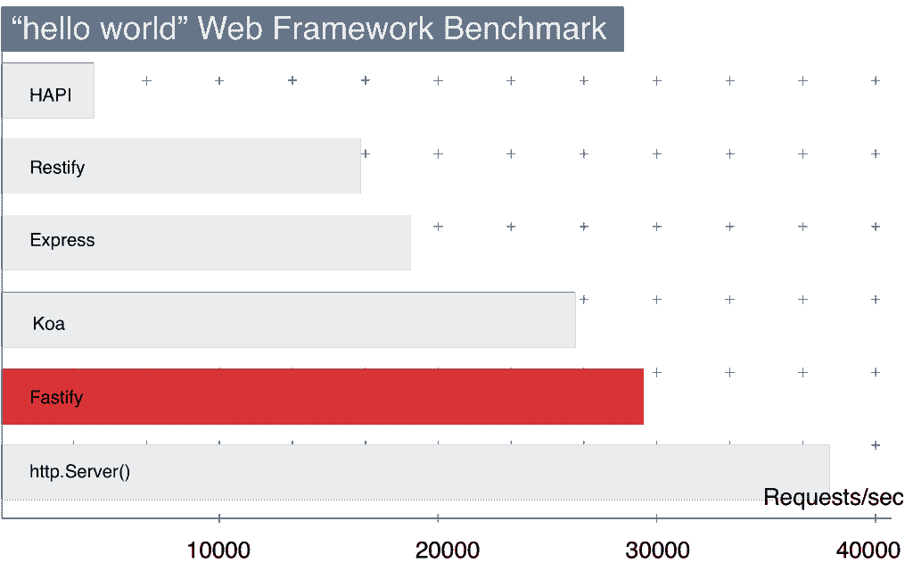

# 介绍 Fastify，一个快速的 Node.js Web 框架

> 原文：<https://thenewstack.io/introducing-fastify-speedy-node-js-web-framework/>

以下是 Node.js 核心技术委员会成员提供的文章

[Matteo Collina](https://twitter.com/matteocollina)

，总结他将在

**Node.js Interactive conference**

，将于 10 月 4 日至 6 日在温哥华举行。

马特奥·科利纳

Matteo 拥有多年的软件行业经验，是全球 Node.js、物联网和开源软件社区的知名人物。他在 2010 年开始使用 Node.js，到目前为止，已经发布了几十个 Node.js 模块。他还是《JavaScript:最佳实践》一书的合著者(FAG 米兰，2013)。

为什么[我们](https://github.com/fastify/fastify#team)为 Node.js 编写了另一个 web 框架？我致力于让 [Node.js](/tag/node.js/) 平台更快、更稳定、更具扩展性。2016 年，[本人](https://twitter.com/matteocollina)和[大卫·马克·克莱门茨](https://twitter.com/davidmarkclem)创办了 [Pino](http://getpino.io/#/) ，它被设计成 Node.js 最快的日志程序，现在它有四个活跃的维护者和一个由数百个模块组成的生态系统。

[Fastify](http://www.fastify.io/) 是受[哈比神](https://hapijs.com/)、 [Restify](https://github.com/restify/node-restify) 和 [Express](https://expressjs.com/) 启发的一个新的 web 框架。Fastify 是作为通用 web 框架构建的，但在构建使用 JSON 作为数据格式的极快 HTTP APIs 时，它大放异彩。这些在 web 和移动软件架构中非常常见，因此 Fastify 可以提高大多数应用程序的吞吐量。

这是一个呈现 JSON 响应的示例 web 服务器:

```
'use strict'

const fastify  =  require('fastify')()

fastify.get('/',  function  (req,  reply)  {
  reply.send({  hello:  'world'  })
  })

fastify.listen(3000)

```

如果你现在想测试一下，这是我们的入门指南。对于那些想了解 Fastify 的原因和作用的人，请继续阅读。

## 减少开销

上图显示了以 JSON 形式发送{ "hello": "world" }响应的请求数/秒。我们使用这个简单的基准来评估所有各种框架的开销——它并不代表真实应用程序的实际吞吐量。我们断言，与它提供的特性相比，Fastify 是开销最低的框架。

Fastify 使用 [fast-json-stringify](https://github.com/fastify/fast-json-stringify) 将 json 渲染的吞吐量翻倍，使用 [find-my-way](https://github.com/delvedor/find-my-way) 将路由减少了 10 倍。Fastify 使用的中间件和 Express 使用的一样，但我们认为它更快。

[](https://storage.googleapis.com/cdn.thenewstack.io/media/2017/08/2854e355-fastify-benchmarks.png)

Fastify 的速度提升很大一部分来自我在 Node.js Interactive 2015 上的“[达到可笑的速度](https://www.nearform.com/blog/performance-reaching-ludicrous-speed/)”演讲中描述的发现:

[https://www.youtube.com/embed/_0W_822Dijg?feature=oembed](https://www.youtube.com/embed/_0W_822Dijg?feature=oembed)

视频

## 完全封装的插件

Fastify 提供了一个类似于哈比神的插件模型。它增加了插件的完全封装，这样每个插件都可以使用自己的依赖项和钩子。这实现了更好的软件重用和解耦。此外，插件模型基于[可重入](https://stackoverflow.com/questions/1312259/what-is-the-re-entrant-lock-and-concept-in-general)锁和基于图，它完美地处理异步代码，并保证插件的加载顺序和关闭顺序。

Fastify 已经开发了广泛的插件，包括模板渲染、React 集成、GraphQL 支持、静态文件服务和数据库驱动程序。

以下服务器利用了此功能:

```
'use strict'

const server  =  require('fastify')()

server.register(require('fastify-helmet'))

server.register(require('point-of-view'),  {
  engine:  {
  marko:  require('marko')
  }
})

server.register(require('./subsystem'),  {
  prefix:  '/subsystem'
})

server.get('/json',  (req,  reply)  =&gt;  {
  reply.send({  hello:  'world'  })
})

server.get('/',  (req,  reply)  =&gt;  {
  reply.view('/index.marko',  {  hello:  'world'  })
})
server.listen(3000)

```

和 subsystem/index.js:

```
module.exports  =  function  (server,  opts,  cb)  {
  server.register(require('point-of-view'),  {
  engine:  {
 marko:  require('marko')
  },
  templates:  __dirname
  })

  server.get('/hello',  (req,  reply)  =&gt;  {
  reply.view('/page.marko',  {  hello:  'world'  })
  })

  cb()
  }

```

注意“子系统”插件和主文件寄存器“视点”都提供了对多种模板语言的处理。插件的这两个实例通过使用原型继承被完全封装，这使得它接近零成本抽象。对于 Express，类似的方法会导致每个嵌套级别的性能显著下降。

查看我们的指南以了解更多关于插件的信息。

注意:示例中省略了 Marko 模板，你可以在 GitHub 上查看[完整源代码。](https://github.com/mcollina/take-your-http-server-to-ludicrous-speed/tree/master/demo/complete)

## 用爱在意大利制造

Fastify 目前由 [nearForm](https://www.nearform.com/) 和 [LetzDoIt](http://www.letzdoitapp.com) 赞助，后者提供了一个新的活动应用程序，并刚刚将 Fastify 部署到生产中。Fastify 完全在意大利制造，位于乌迪内和弗利之间，联合创始人 LetzDoIt 工程师[托马斯·德拉·维多瓦](https://twitter.com/delvedor)和我分别居住在意大利。我们写它是因为我们看到大多数 web 框架的 API 不容易优化，并且打破向后兼容性是不合理的。

我将在 Node.js Interactive 的“让你的 HTTP 服务器达到可笑的速度”会议上展示 Fastify。我还将与我的同事[大卫·马克·克莱门茨](https://twitter.com/davidmarkclem)一起举办一场绩效研讨会。

<svg xmlns:xlink="http://www.w3.org/1999/xlink" viewBox="0 0 68 31" version="1.1"><title>Group</title> <desc>Created with Sketch.</desc></svg>