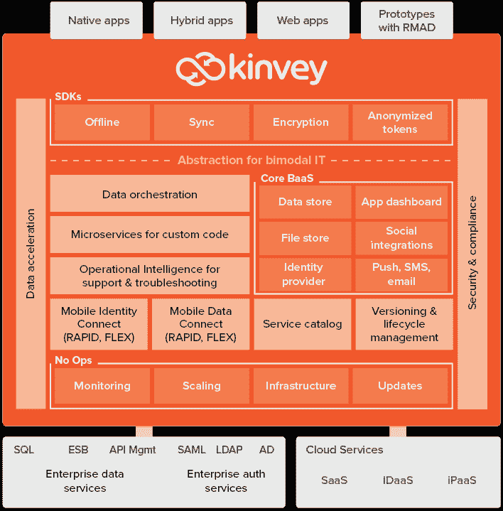

# 不是死星:Kinvey Flex 是一个统一的 Node.js mBaaS 平台

> 原文：<https://thenewstack.io/introducing-kinvey-flex-industrys-first-unified-node-js-mbaas-platform/>

有时候，开发一个新的应用程序感觉就像构建一个乐高模型(非常难的模型之一，就像巨大的死星)。即使在利用后端即服务(BaaS)或任何其他填空即服务时，仍然需要大量的实际操作。您仍然需要集成独立元素的大杂烩，创建必要的代码来连接、测试和维护它们，并围绕整个 kaboodle 构建 CI/CD。

比如:在亚马逊 Web 服务中，用户有 Lambda 来运行和托管函数；但是他们还需要部署 AWS API Gateway，需要定制代码将连接器暴露给第三方企业或云系统。然后，他们需要为您的业务逻辑和其他微服务连接 AWS PaaS。比如说，在 Azure 中，你需要 Azure 功能、服务总线和数据工厂，以及逻辑应用和服务结构。

所有这些都是为了让生活变得更容易，让上市时间更短，事实也的确如此。但是，用不同的 API 和 CI/CD 规则将三个以上的产品缝合在一起，不可能不痛苦。所以，用真正愤怒的乐高建造一个巨大的超级复杂的乐高模型——比如说，巨大的死星。我们都经历过。是的，这就是我们的工作——但是谁不想加快犁的速度呢？

## 那不是月亮。这是一个空间站。或者是一个真正强大的咩咩声。

进入 [Kinvey](https://www.kinvey.com/) 为时间紧迫的开发团队提供的最新平台:Flex Services Runtime。该公司声称，Flex Services Runtime 是业内第一个统一的 [Node.js](/tag/node.js/) 平台，旨在无缝集成和运行微服务和[基于事件的云功能](/category/serverless/)，同时集成企业系统流。

Flex 是 Kinvey 现有开放架构 BaaS 的扩展，通过一个集成的无服务器平台构建这些强大的服务。对于标准系统，无代码实现是可能的；否则，Flex 被设计为需要相对简单的低代码开发来在非标准系统上运行。另外，任何[节点包管理器](https://www.npmjs.com/) (npm)库都可以在 Flex 平台上即插即用。

Kinvey 的后端服务架构。

Kinvey 的目标是让任何地方的任何开发者都能快速、轻松地开发丰富的应用程序体验。该公司的 Rapid 服务系统由零代码、可配置的模块组成，可实现对企业系统以及基于云的 SaaS 应用程序的安全、可控、尤其是即时的访问。

Flex service universe 提供了低代码微服务模块，这些模块执行功能并支持与企业记录系统的快速集成。底层是 Kinvey BaaS 平台，具有完整的功能集，包括用于开发的 Flex SDK、本地测试环境和 CLI 工具，以实现持续集成和自动化部署。Rapid 和 Flex 服务都带有内置的技术支持、故障排除和诊断功能，这些功能由一种称为操作智能的功能提供支持。

### 这是新的一天。一个新的开始。一个新的无服务器平台。

“一个真正无服务器的集成平台，同时允许低代码或无代码配置，这在当今业界是独一无二的。我们的客户可以将资源集中在创新和增值功能上，而不是被传统架构所拖累，”Kinvey 产品副总裁 Jikku Venkat 在一份声明中说。他解释说，IBM 和微软等其他移动平台提供商给了开发者一袋零件(乐高！)需要集成、扩展和维护。

“Kinvey 提供了一个完整的一站式商店，满足您交付现代创新应用程序所需的一切，并帮助您非常、非常快速地做到这一点，”Venkat 说。事实上，Flex Services Runtime 版本似乎已经将 Kinvey 推向了 BaaS 大队的前沿:Kinvey 最近被评为[Forrester Wave:Mobile Development Platforms，4Q 2016](http://go.kinvey.com/forrester-wave-mobile-development-platforms/) 中排名第一的产品，超过了所有其他供应商。

### 只有西斯处理绝对的事情。或者传统架构。

Kinvey 可在多种云平台上使用，并通过多租户和专用云部署模式提供，包括符合 [HIPAA 标准的](https://www.kinvey.com/hipaa/)版本，适用于生命科学和医疗保健需求。客户包括 Farmers Insurance 和 VMware 等企业用户，以及 Thomas Jefferson 大学医院等医疗保健提供商。[移动战略和开发公司 Propelics](http://www.propelics.com/) 最近加入了 Kinvey 的平台，为一个客户建立了一个试点项目。Propelics 的创始人和合伙人 Shahab Choudhry 报告说，这“使我们能够在不到一个月的时间里推出一个非常复杂的应用程序。”他说，Kinvey 的可扩展架构现在将“使这个应用程序很快从试点进入生产变得容易，因为我们可以专注于应用程序功能和 UX，而不是基础设施、运营和合规性。”

### 愿原力与你同在——经济实惠。

Kinvey 的 BaaS —现在有了 Flex 服务运行时！—免费提供给个人开发人员，允许一名管理员或额外的合作者，并包括核心 mBaaS 功能和支持，以及每个应用程序一个环境和 1gb 存储。初创公司(20 名员工以下)每个应用程序每月花费 200 美元获得增强的容量和支持，而企业和大型企业客户可以在定制的基础上构建自己的 Kinvey 服务和支持组合。

这意味着开发者可以指定他们的乐高时间来最终完成那个[3803 块的死星模型](https://shop.lego.com/en-PT/Death-Star-10188)。

专题图片:[乐高死星](http://lego.wikia.com/wiki/10188_Death_Star)。

<svg xmlns:xlink="http://www.w3.org/1999/xlink" viewBox="0 0 68 31" version="1.1"><title>Group</title> <desc>Created with Sketch.</desc></svg>