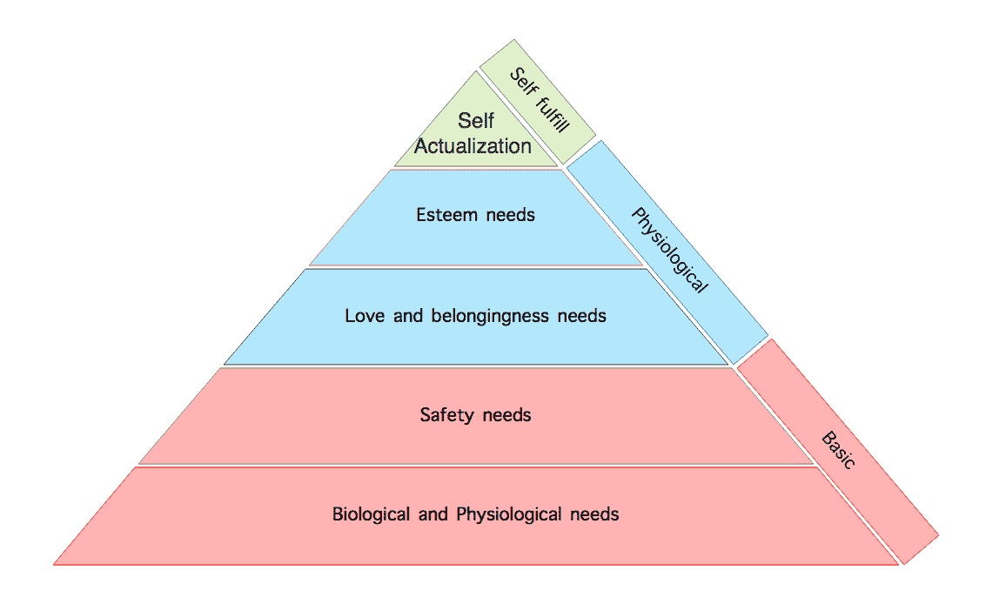
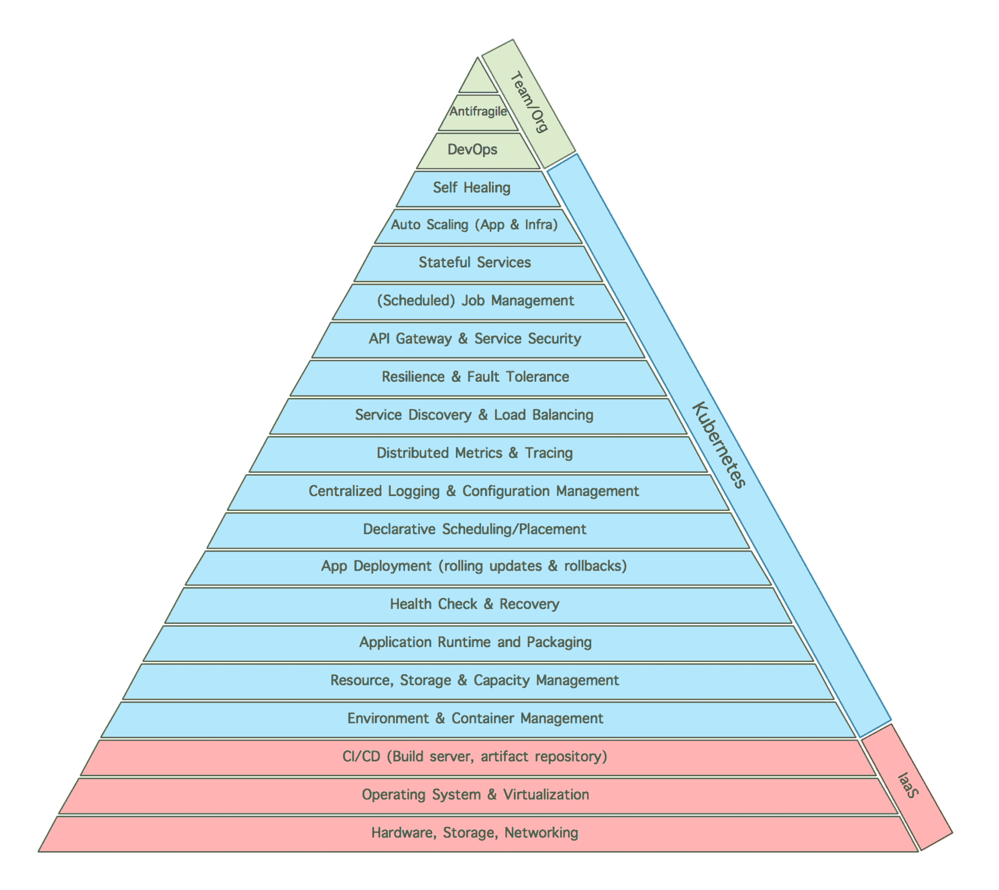

# Kubernetes 和微服务需求层次

> 原文：<https://thenewstack.io/introducing-microservices-hierarchy-needs/>

由心理学家阿尔伯特·马斯洛(Albert Maslow)设计的 [***需求层次***](https://en.wikipedia.org/wiki/Maslow%27s_hierarchy_of_needs) 是一种解释人类动机的心理学理论，由人类需求的多层模型组成，通常被描述为金字塔内的层次。马斯洛使用生理、安全、归属和爱、尊重、自我实现和自我超越等术语来描述人类动机通常经历的阶段。作为人类，首先我们需要满足我们的基本需求，然后是心理需求，只有这样我们才能考虑自尊和实现我们的全部潜力:

马斯洛需求层次理论

这种描述需求的方法是如此的基本，以至于它已经被应用到许多其他领域，比如员工参与度、[云计算](https://blog.giantswarm.io/maslow-hierarchy-of-cloud/)、[软件开发](http://francisshanahan.com/index.php/2009/maslows-hierarchy-needs-software-development/)、 [DevOps](http://www.ecs-digital.co.uk/blog/devops-hierarchy-of-needs) 等等。因此，将它应用于微服务也是有意义的，因为要在微服务之旅中取得成功，必须满足一系列明确的需求。这就是:

微服务需求层次

一旦我列出了主要的微服务关注点(顺序可能因人而异)，我不禁注意到 [Kubernetes](/category/kubernetes/) 容器编排引擎确实很好地覆盖了这些需求中的一大块。所以我也在图中添加了 Kubernetes。

首先，对于基础层，我们需要一些计算资源，并且最好有一个由基础设施服务云提供商管理的可扩展的标准操作环境。其他先决条件是自动化的 CI/CD 流程和工件注册，Kubernetes 也可以帮助我们运行和管理。尽管如此，我们仍然需要一些专门的软件，如用于构建的 [Jenkins](https://jenkins.io/) ，以及用于 Docker 和 Maven 工件的工件库，如内部 Sonatype 的 [Nexus](https://www.sonatype.com/docker) ，或 [Docker Hub](https://hub.docker.com/) 。

然后 Kubernetes 可以帮助我们管理多个隔离环境([名称空间](http://kubernetes.io/docs/user-guide/namespaces/))、管理资源([配额和限制](http://kubernetes.io/docs/admin/resourcequota/walkthrough/))、存储分配([持久卷](http://kubernetes.io/docs/user-guide/persistent-volumes/))、执行部署和回滚([部署](http://kubernetes.io/docs/user-guide/deployments/))、自动调度([调度器](http://kubernetes.io/docs/admin/kube-scheduler/))、服务发现和负载平衡([服务](http://kubernetes.io/docs/user-guide/services/))、弹性和容错( [pod 健康检查](http://kubernetes.io/docs/user-guide/liveness/))。

 [比尔金·伊卜里亚姆

Bilgin Ibryam 是 Red Hat 的架构师，也是 Apache 负责 Camel、OFBiz 和 Isis 项目的开源委员会成员。他是博客作者、演讲者、开源爱好者，也是 Camel 设计模式和即时 Apache Camel 消息路由书籍的作者。在日常工作中，Bilgin 喜欢指导、培训和带领团队在应用集成、分布式系统、微服务、devops 和云原生应用方面取得成功。](http://www.ofbizian.com/) 

对于某些需求，我们还需要额外的工具，如用于容器实现的 Docker 或 rkt，应用内弹性库(如网飞的 [Hystrix](https://github.com/Netflix/Hystrix) )来与 Kubernetes 弹性功能结合。然后，Kubernetes 可以管理应用程序配置，还可以帮助我们运行同类最佳的集中日志记录、指标收集和跟踪软件，随着服务数量的增加，这也变得越来越重要。

根据微服务的性质，我们可能有一些特定的需求。对于 API 驱动的微服务，我们将需要专门的 API 管理解决方案，它还可以处理服务安全性(Kubernetes 不提供)。但是 Kubernetes 可以帮助我们轻松地运行有状态服务( [StatefulSet](http://kubernetes.io/docs/concepts/abstractions/controllers/statefulsets/) )、批处理作业( [job](http://kubernetes.io/docs/user-guide/jobs/) )和调度作业( [cron](http://kubernetes.io/docs/user-guide/cron-jobs/) [job](http://kubernetes.io/docs/user-guide/cron-jobs/) )。

通过一个平台提供所有这些功能，用户可以执行一些更智能的活动，例如[应用](http://kubernetes.io/docs/user-guide/horizontal-pod-autoscaling/)和[基础架构](http://blog.kubernetes.io/2016/07/autoscaling-in-kubernetes.html)通过自动放置、自动重启、自动复制、自动扩展实现自动扩展和自我修复。

Kubernetes 满足了所有这些需求，留给团队的是简化开发流程，拥抱 [DevOps](/category/devops/) 文化以快速交付，并在组织层面实现[抗脆弱性](http://www.ofbizian.com/2016/07/from-fragile-to-antifragile-software.html)。

<svg xmlns:xlink="http://www.w3.org/1999/xlink" viewBox="0 0 68 31" version="1.1"><title>Group</title> <desc>Created with Sketch.</desc></svg>