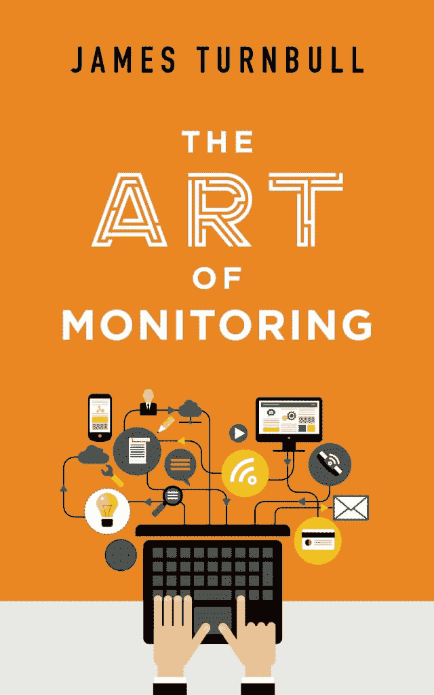

# 监控的艺术:介绍黎曼

> 原文：<https://thenewstack.io/introducing-riemann/>

编者按:以下是詹姆斯·特恩布尔新书一章的节选，

[The Art of Monitoring](https://artofmonitoring.com/)

。点击

[here](https://artofmonitoring.com/TheArtOfMonitoring_sample.pdf)

完整的一章。点击此处获取我们的

[Q&A](https://thenewstack.io/qa-james-turnbull-art-monitoring-age-microservices/)

和特恩布尔一起。

[](https://jamesturnbull.net/)

 [詹姆斯·特恩布尔

詹姆斯·特恩布尔是八本关于开源软件的技术书籍的作者，其中包括一本关于 Docker 的书。詹姆斯在 Kickstarter 担任首席技术官。他之前在 Docker、Venmo 和 Puppet Labs 担任领导职务。James 经常在包括 OSCON、Velocity、Linux.conf.au、FOSDEM 和许多其他会议上发表演讲。他是 Linux Australia 的前总裁，Linux Victoria 的前委员会成员，LCA 2008 的财务主管，并在 Velocity、LCA 和 OSCON 计划委员会中任职。](https://jamesturnbull.net/) [](https://jamesturnbull.net/)

要是我有这些定理就好了！那我应该很容易找到证据。 —伯纳德·黎曼

Riemann 是一个监控工具，它可以聚集来自主机和应用程序的事件，并可以将它们输入到流处理语言中进行操作、总结或采取行动。黎曼背后的想法是让监控和测量事件成为一个简单的默认事件。

Riemann 还可以跟踪输入事件的状态，并允许我们利用事件的序列或组合来构建检查。它提供通知、将事件发送到其他服务和存储的能力，以及各种其他集成。总的来说，Riemann 具有满足我们所有目标的功能。它很快。

总的来说，Riemann 具有满足我们所有目标的功能。它速度快，高度可配置。吞吐量取决于您对每个事件的处理，但商用 x86 硬件上的 stock Riemann 可以在亚毫秒级延迟下每秒处理数百万个事件。

Riemann 是[开源的](http://riemann.io/)，并在 Eclipse 公共许可证下获得许可。它主要是由凯尔·金斯伯里，又名阿佛尔撰写的。Riemann 是用 Clojure 编写的，运行在 JVM 之上。

## 事件、流和索引

Riemann 是一个事件处理引擎。如果我们要利用黎曼，我们需要理解三个概念:事件、流和指数。

先来看事件。

### 事件

事件是黎曼的基本结构。事件流入黎曼，可以被处理、计数、收集、操作或导出到其他系统。黎曼事件是黎曼视为不可变映射的[结构](https://en.wikipedia.org/wiki/Record_(computer_science))。

这里有一个黎曼事件的例子。

```
{:host riemanna,  :service riemann streams rate,  :state ok,
:description nil,  :metric  0.0,  :tags  [riemann],
:time  355740372471/250,  :ttl  20}

```

每个事件一般包含以下字段。

在我们的黎曼配置中，我们通常用关键字来指代事件场。请记住，关键字通常用于标识映射中键/值对的键，我们的事件是一个不可变的映射。我们通过关键词的**:前缀**来识别关键词。因此，主机字段将被引用为**:主机**。Riemann 事件还可以补充可选的自定义字段。您可以在创建事件时配置其他字段，也可以在处理事件时向事件添加其他字段，例如，您可以向事件添加包含摘要或派生指标的字段。

事件之上的下一层是流。

### 流

每个到达的事件被添加到一个或多个流中。你在黎曼配置的 **(streams** 部分定义流。流是可以向其传递事件以进行聚合、修改或升级的函数。流也可以有子流，它们可以将事件传递给子流。这允许对事件流进行过滤或划分，例如通过仅选择来自特定主机或服务的事件。

子流示例:

```
(streams
(childstream
(childstream)))

```

你可以把流想象成现实世界中的管道。事件进入管道系统，流经管道和隧道，收集在水箱和水坝中，并由格栅和排水管过滤。

您可以拥有任意多的流，Riemann 提供了一种强大的流处理语言，允许您选择与特定流相关的事件。例如，您可以从满足其他条件的特定主机或服务中选择事件。

但是，就像您的管道一样，流是为事件流过它们而设计的，并且只保留有限的状态或不保留任何状态。然而，出于许多目的，我们确实需要保留一些状态。为了管理这种状态，黎曼有了索引。

### 黎曼指数

该索引是黎曼跟踪的所有服务的当前状态的表格。你告诉黎曼具体索引你希望跟踪的事件。Riemann 通过映射其 **:host** 和 **:service** 字段为每个索引事件创建一个新服务。然后，索引会保留该服务的最新事件。你可以把指数想成黎曼的世界观和国家真理的来源。您可以从流甚至外部服务中查询索引。

我们在上面的事件定义中看到，每个事件都可以包含一个 TTL 或 Timeto-Live 字段。此字段衡量事件的有效时间。

索引中长于 TTL 的事件会过期并被删除。对于每次过期，为索引服务创建一个新事件，其**:状态**字段设置为**过期**。然后，新事件被注入回流中。

让我们仔细看看这个。这里有一个事件的例子:

```
{:host www,  :service apache connections,  :state nil,  :description
nil,  :metric  100.0,  :tags  [www],  :time  466741572492,  :ttl  20}

```

它来自一个名为 www 的主机，用于一个名为 apache connections 的服务。它的 TTL 为 20 秒。如果我们索引这个事件，那么 Riemann 将通过映射 www 和 apache 连接创建一个服务。如果事件不断进入 Riemann，那么索引将跟踪来自该服务的最新事件。如果事件停止流动，则在 20 秒后的某个时间，事件将在索引中过期。

将为该服务生成一个新事件，状态为**:状态为**的**过期**，如下:

```
{:host www,  :service apache connections,  :state expired,  :
description nil,  :metric  100.0,  :time  466741573456,  :ttl  20}

```

这个事件将被注入到我们可以利用它的流中。这种行为对我们非常有用，因为我们使用 Riemann 来监控我们的应用和服务。我们将监视事件已经过期的服务，而不是轮询或检查失败的服务。

[](https://artofmonitoring.com/)

<svg xmlns:xlink="http://www.w3.org/1999/xlink" viewBox="0 0 68 31" version="1.1"><title>Group</title> <desc>Created with Sketch.</desc></svg>