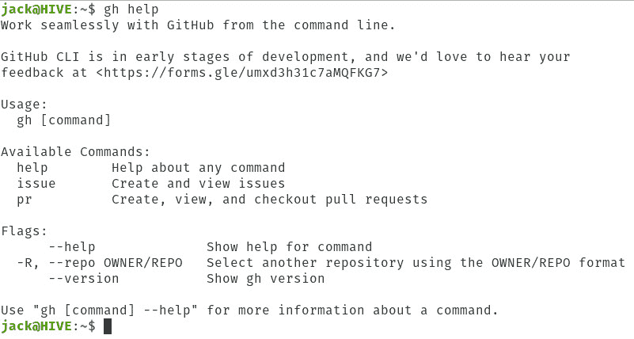
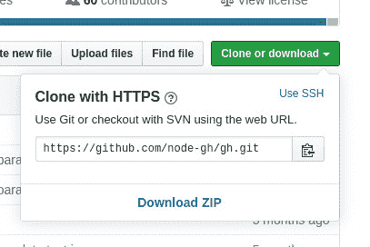
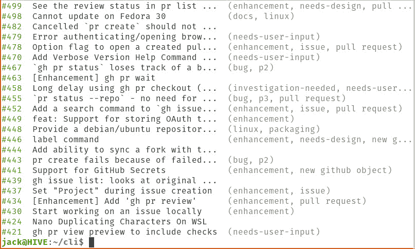
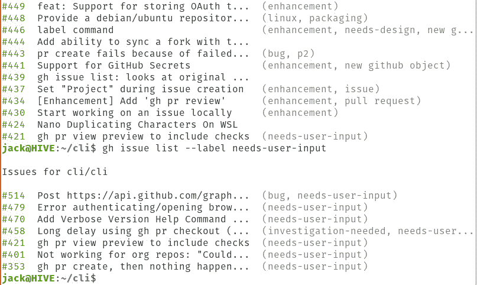
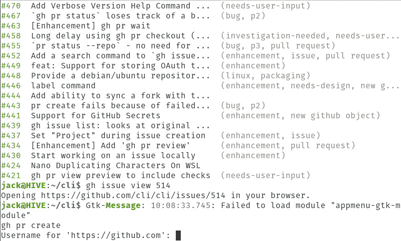

# GitHub CLI 简介

> 原文：<https://thenewstack.io/introducing-the-github-cli/>

全球的开发者都依赖于 [GitHub](https://github.com/) 。它容纳了他们的存储库，并作为个人和团队的版本控制系统。尽管 GitHub 有一个用户友好的基于 web 的 GUI(以及许多第三方桌面客户端)，但许多开发人员倾向于花费大量的开发时间在命令行界面(CLI)中工作。

考虑到这一点，GitHub 最终开始开发一种工具，使从命令行使用 GitHub 变得更容易，这是完全有道理的。这个工具就是 [GitHub CLI](https://github.com/github/hub) ，它现在处于测试阶段。目前这个工具在某种程度上受限于它所能做的(因为它还在测试阶段)，但是我可以想象一大堆的功能最终会进入它的领域。目前，您可以:

*   创建和查看问题。
*   创建、查看和结帐拉式请求。

所以，没错，GitHub CLI 并不像你想象的那样功能丰富，但是给它时间，它就会丰富起来。

我将带你了解在 [Ubuntu Desktop Linux 19.10](http://releases.ubuntu.com/19.10/) 上安装 GitHub CLI 的过程。因为这是一个命令行工具，所以您可以将它安装在任何版本的 Linux 上(无论是桌面还是服务器)。目前，GitHub 已经发布了。黛比。rpm，。msi 二进制安装程序以及源代码。但是，请注意，为了使 **gh** 命令正常工作，它需要一个可用的网络浏览器。如果您使用 ssh 进入服务器并尝试使用 gh 命令，您会发现自己的能力有限。因此，您可能会希望在桌面上使用这个新工具。

让我们安装。

## 装置

GitHub CLI 的安装非常简单。[下载。deb 文件](https://github.com/cli/cli/releases/tag/v0.5.7)到你的~/Downloads 目录。文件下载完成后，打开终端窗口，使用命令 *cd ~/Downloads* 进入~/Downloads 目录。进入该目录后，使用以下命令安装应用程序:

`sudo dpkg -i gh*.deb`

安装完成后，您就可以开始了。您可以通过发出以下命令来查看(令人惊讶地有限的)帮助:

`gh help`

这将列出可用的命令和标志(**图 1** )。

**图 1:** 行动中的 gh 帮助命令。

## 使用 GitHub CLI

使用 GitHub CLI 并没有那么难。您必须做的第一件事是定位并克隆一个项目。比方说，你想帮助改进 GitHub CLI 本身。前往[项目页面](https://github.com/cli/cli)，你会看到**克隆或下载**按钮。点击该按钮显示项目的克隆地址(**图 2** )。

**图 2:** 克隆项目的地址。

接下来我们必须克隆这个项目。目前， **gh** 命令没有克隆项目的能力，所以我们必须使用 *git* 命令。安装 GitHub CLI 应该会同时安装 git。但是，如果这种情况没有发生，您可以使用以下命令安装 git:

`sudo apt-get install git`

git 就绪后，使用以下命令克隆 GitHub CLI 项目:

`git clone https://github.com/cli/cli.git`

在您继续之前，您需要授权 gh。发出命令:

`gh issue list`

系统会提示你按键盘上的 Enter 键，这将打开你的默认浏览器，并要求你登录你的 GitHub 帐户(如果你还没有登录的话)。如果您已经登录 GitHub 帐户，系统会提示您授权已完成，您可以关闭 web 浏览器选项卡。

回到命令提示符处，使用以下命令切换到克隆的目录:

`cd cli`

发出命令:

`gh issue list`

将列出与天然气水合物项目相关的所有当前问题(**图 3** )。

**图 3:** 与 GitHub CLI 项目相关的所有问题。

您还可以过滤问题。假设您只想查看那些标记为“需求-用户输入”的问题。您可以使用以下命令过滤掉除这些问题之外的所有内容:

`gh issue list --label needs-user-input`

结果将只列出您正在寻找的内容(**图 4** )。

**图 4:** 过滤掉问题。

一旦发现您可能想要处理的问题，您可以使用以下命令查看该问题的详细信息:

`gh issue view NUMBER`

其中，编号是与问题相关的编号。比方说，你很确定你可以修复 514 号问题。使用命令查看详细信息:

`gh issue view 514`

上述命令将打开您的默认 web 浏览器，以显示问题的详细信息。在使用的这个阶段，如果一切都可以包含在命令行中就好了，但是我相信开发者有理由在浏览器中打开这个问题。

如果您发现这肯定是一个可以解决的问题，请保持浏览器选项卡打开，并使用以下命令创建一个拉请求:

`gh pr create`

您将被要求输入 GitHub 的用户名和密码(**图 5** )。

**图 5:** 验证您的 GitHub 帐户。

一旦您通过了身份验证，您的拉取请求将会完成。您可以使用以下命令查看您的工作状态:

`gh pr status`

一旦您的拉取请求被审查，您将看到它被列为通过的**检查(带有与您的请求相关联的编号)，这意味着您可以检查您的拉取，准备使用以下命令检查拉取请求:**

`gh pr checkout NUMBER`

其中，编号是与您的拉取请求相关联的编号。

检查完拉取请求后，您就可以开始处理该问题了。

这就是如何安装和使用新的 GitHub CLI 工具。我有一种感觉，这个命令行实用程序将很快成为使用 GitHub 库的事实上的标准。

照片由 Pixabay 的 Michael Gaida 拍摄。

<svg xmlns:xlink="http://www.w3.org/1999/xlink" viewBox="0 0 68 31" version="1.1"><title>Group</title> <desc>Created with Sketch.</desc></svg>