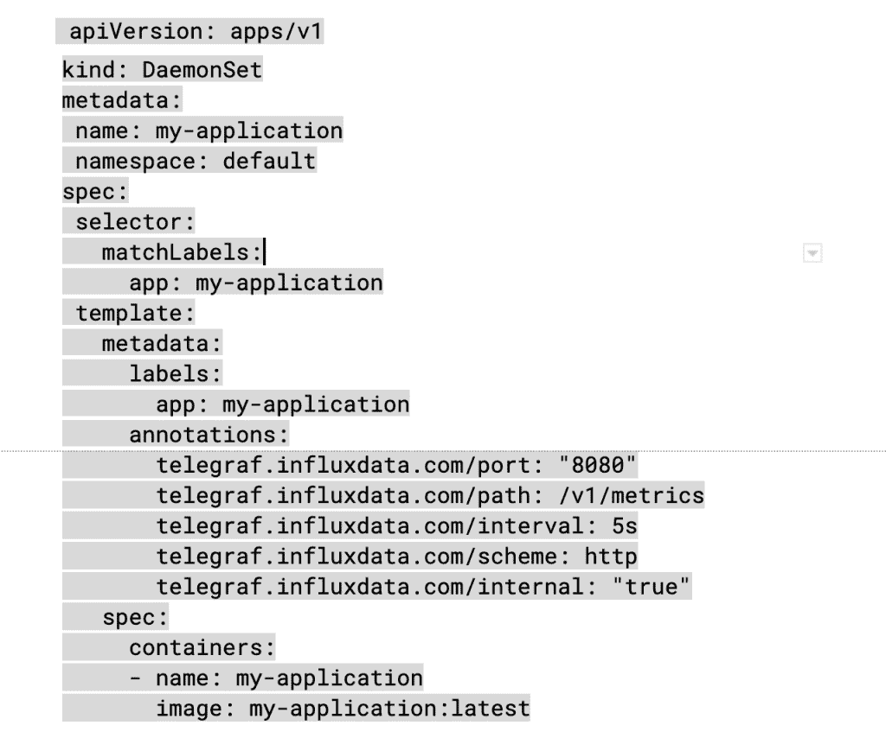
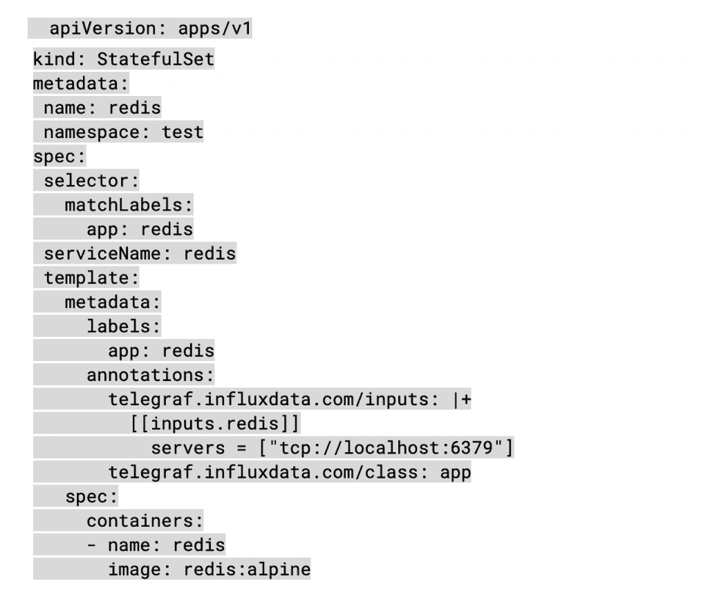
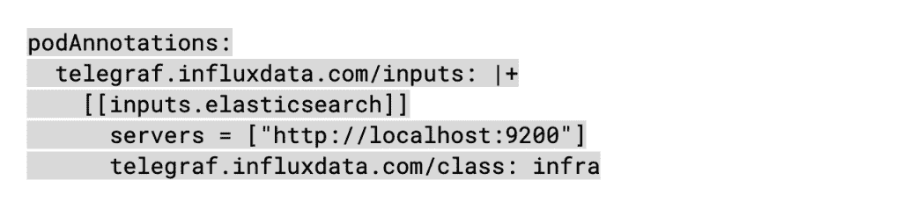
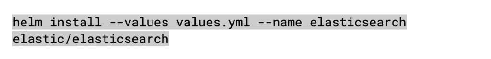

# 介绍 Telegraf 运营商:Kubernetes 边车变得简单

> 原文：<https://thenewstack.io/introducing-the-telegraf-operator-kubernetes-sidecars-made-simple/>

 [贾科莫·蒂拉巴西

贾科莫是 InfluxData 的一名现场可靠性工程师。](https://www.linkedin.com/in/gitirabassi/) 

Kubernetes 很棒。它以声明性和自动化的方式负责容器化应用集群的部署、扩展和升级/更新。尽管自动化减轻了生产中管理应用程序的操作负担，但它也使监控变得更加必要。为了保持应用程序的功能和性能，必须对指标和事件进行全栈观察，包括容器和 Kubernetes 编排层。如果不加注意，自动化可能会隐藏问题，直到为时已晚，你已经到了临界点。

监控被认为是任何现代系统的第一属性，Kubernetes 也不例外。部署监控代理有两种主要机制:

*   DaemonSet 部署，确保所有节点运行一个监控代理 pod 的副本。
*   Sidecar 部署，其中监控代理容器与应用程序容器共享 pod。

在 DaemonSet 类型的监视中，节点代理将从节点上运行的所有 pod 中收集数据。通常，它用于观察框架基础设施，如 kubelet(节点、容器和 pod)度量、网络度量、日志、跟踪和错误报告。然而，当从容器上运行的特定工作负载/应用程序收集指标时，Sidecar 部署通常是更好的选择。

这是因为，使用 Sidecar 监控代理，可以定义特定应用程序的自定义指标和监控，而不会影响其他工作负载共享的整体监控框架。随着时间的推移，应用程序开发人员公开的越来越多的 [Prometheus](https://prometheus.io/) 端点指标可能会导致 DaemonSet 类型部署中的可扩展性问题。参见[这篇博文](https://www.influxdata.com/blog/scaling-kubernetes-monitoring-without-blind-spots-or-operations-burden/)了解更多关于使用 Sidecar 部署来扩展 Kubernetes 上的应用程序监控的信息，使 IT 运营部门能够让开发人员监控他们自己的应用程序。

## 用于 DaemonSet 和 Sidecar 部署的 Telegraf Kubernetes 运营商

DaemonSet 和 Sidecar 对 Kubernetes 的监测都很重要。在 InfluxData，我们从自己监控 Kubernetes 上运行的 InfluxDB 云的工作中学到了这一点。我们有多个云和区域用于为全球的 InfluxDB 云客户提供服务。

随着我们的开发人员对构成我们平台的微服务进行测试，以公开性能监控和诊断的指标，我们很快发现，DaemonSet 抓取应用指标的实现遇到了实际挑战，一些微服务公开了越来越多的指标。所以我们采用了:

*   节点、单元和容器指标的 DaemonSet
*   针对暴露大量指标的微服务的边车监控

通过做到这两点，我们使应用程序监控成为基础设施团队和开发团队之间的无争用问题。

## Telegraf 接线员如何提供帮助？

简而言之，Telegraf 操作员允许您为所有指标定义一个公共输出目的地(我们认为 [InfluxDB 输出](https://github.com/influxdata/telegraf/tree/master/plugins/outputs/influxdb_v2)是一个不错的选择，但是您可以使用任何 [Telegraf 输出](https://github.com/influxdata/telegraf/tree/master/plugins/outputs/))，并使用标签在您的应用程序单元上配置 Sidecar 监控。

一个好的 [Kubernetes 监控解决方案](https://www.influxdata.com/solutions/kubernetes-monitoring-solution/)还必须是无痛的，这也必须适用于监控的扩展。考虑到这一点，InfluxData 希望通过在 GitHub 上构建一个名为 [telegraf-operator](https://github.com/influxdata/telegraf-operator) 的开源项目来解决在 Kubernetes 上添加 DaemonSet 和 Sidecar 监控部署的问题。

[Telegraf](https://www.influxdata.com/time-series-platform/telegraf/) 是 InfluxData 基于插件的轻量级代理，您可以使用它来收集 Prometheus 指标、自定义应用程序指标、日志、网络性能数据、系统指标等。目前有超过 200 个插件[用于各种应用、工具、协议和虚拟化框架。如果您发现缺少什么，我们邀请您通过添加您自己的](https://www.influxdata.com/products/integrations/)自定义插件[来提供帮助。](https://github.com/influxdata/telegraf/blob/master/docs/INPUTS.md)

现在，让我们解释一下什么是 Kubernetes 操作符。Kubernetes 操作符是一种使用 Kubernetes 构造打包、部署和管理应用程序的方法。基本上，它扩展了 Kubernetes 以支持特定于应用程序的其他工作流和功能。因此，telegraf-operator 将在 Kubernetes 上部署 telegraf 代理的操作方面打包为一个应用程序侧柜，并对其进行配置以收集公开的应用程序指标。所有这些都是在一个 yaml 文件中以声明方式定义的。就是这样！

让我们在实践中检验这一点。

## 在 Kubernetes 安装 Telegraf 操作员

telegraf-operator 在其自己的名称空间中启动集群中的 Pod。安装 telegraf-operator 非常简单，可以通过 kubectl 完成，如下所示:

`kubectl apply -f telegraf-operator.yml`

(yml 文件的例子可以在[部署目录](https://github.com/influxdata/telegraf-operator/blob/master/deploy/dev.yml)中找到。)

也可以使用其他工具安装，如 [Helm](https://github.com/influxdata/helm-charts/tree/master/charts/telegraf-operator) 或 Jsonnet。

`helm upgrade --install my-release influxdata/telegraf-operator`

telegraf-operator 将开始监视使用一组特定的[吊舱注释](https://github.com/influxdata/telegraf-operator#pod-level-annotations)部署的吊舱。然后，它会自动将 Telegraf Sidecars 和相应的输入插件配置安装到这些 pod，并将指标数据发送到您设置的输出。部署应用程序的用户永远不需要担心配置指标目标。它由您为整个集群设置一次。

## 开始收集指标

例如，如果您希望 Telegraf 抓取您的应用程序/度量端点，您只需要注释应用程序容器的 pod。

请参见下面一个带有 Telegraf 配置数据的 DaemonSet 部署 yaml 文件示例:

以及带有 Telegraf 配置数据的 Redis yaml 文件的 StatefulSet 部署的[示例:](https://github.com/influxdata/telegraf-operator/blob/master/examples/redis.yml)

## tele graf-带舵操作员

大多数舵轮图提供了向 pod 添加自定义注释的可能性，这是使用带舵轮的 telegraf-operator 所需要的。例如，下面是一个使用 Helm 将 Telegraf 监控添加到 Elasticsearch 部署中的示例。

您只需要将 values.yml 中的 *podAnnotations: {}* 替换为:

接下来，使用新更改的值文件安装 Elasticsearch:

就这么简单！

## 增强客户和开发人员社区体验

扩展 Kubernetes 构造的功能以自动化和简化应用程序的管理是运营商的巨大价值。因此，我们利用 Kubernetes operator 框架，开发了一个 telegraf-operator 来简化 Sidecar 部署模式下 telegraf 代理的部署和配置。通过这样做，我们使得监控 Kubernetes 和其上运行的工作负载从技术和运营角度来看都是可扩展的。我们 InfluxData 致力于利用现代工程实践和技术不断增强我们的平台，不仅为我们的客户，也为我们的开发人员社区提供最佳体验。

我们很乐意在我们的[闲置频道](https://influxcommunity.slack.com/join/shared_invite/enQtNjA4MTM2NDgyNDUwLTE3NjNlZDAzZjQxOTNlZDkxOGIwZmQwNDgyYmI4YzMxYmQzNzE0ODQxYjE5NGE0MWVlYjcxZGU2YzZiODQwNjU#/)或 [GitHub repos](https://github.com/influxdata/telegraf-operator) 中听到你的声音。让我们知道你的想法！

<svg xmlns:xlink="http://www.w3.org/1999/xlink" viewBox="0 0 68 31" version="1.1"><title>Group</title> <desc>Created with Sketch.</desc></svg>