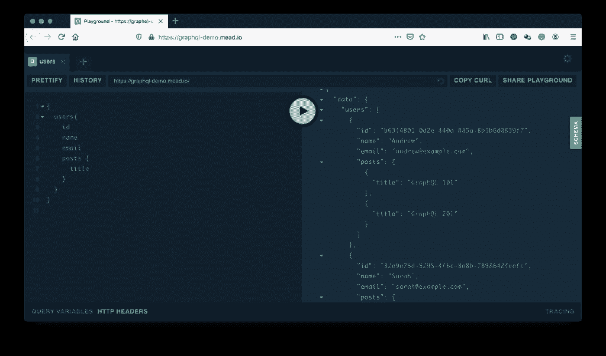
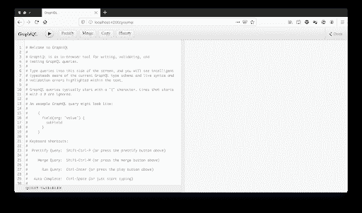
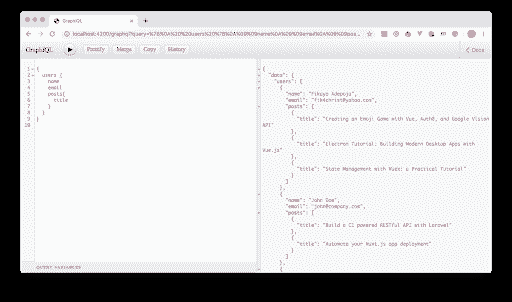

# GraphQL 简介

> 原文：<https://thenewstack.io/introduction-to-graphql/>

[](https://www.linkedin.com/in/fikayoadepoju/)

[Fikayo Adepoju](https://www.linkedin.com/in/fikayoadepoju/)

[Fikayo 是一名全栈开发者和作者，拥有十多年开发 web 和移动解决方案的经验。他目前是技术专家咨询公司的软件主管，为 Packt 和 Udemy 开发课程。他对教学有着强烈的热情，并希望成为一名全职作家。](https://www.linkedin.com/in/fikayoadepoju/)

[](https://www.linkedin.com/in/fikayoadepoju/)[](https://www.linkedin.com/in/fikayoadepoju/)

*“graph QL 是一种用于 API 的查询语言，也是使用现有数据完成这些查询的运行时。GraphQL 为您的 API 中的数据提供了完整且易于理解的描述，使客户能够准确地要求他们需要的东西，使 API 更容易随着时间的推移而发展，并支持强大的开发工具。”*

以上定义来自官方 [GraphQL](https://graphql.org/) 网站，但是我们能不能用更简单的术语来定义 GraphQL？我将尝试用一句话来定义它。请注意，这些定义不是官方的，而是来自我对技术的理解:

*   GraphQL 是一种为客户端应用程序设计的语言，用于从 API 获取所需的精确数据。
*   GraphQL 允许客户端应用程序描述后端 API 所需的数据类型和形状。
*   GraphQL 允许客户端应用程序为任何类型的请求调用单个端点。
*   GraphQL 类似于 SQL，但用于前端。

原谅我在定义如此复杂的技术时过于简单的尝试，但是这些定义都以这样或那样的方式抓住了 GraphQL 的目的(尽管我不会在采访中使用最后一个:)。这是 GraphQL 如何运行的高级视图。在这篇文章结束的时候，你会更详细地了解它，并且能够用它来构建一些东西。

那么 GraphQL 是怎么来的呢？是什么带来了这种范式转换的创新？

原来 GraphQL 是由工程师李·拜伦、丹·斯查费和尼克·施勒克在脸书启动的一个项目。

第一个原型于 2012 年 2 月开发，同年 8 月左右在脸书 iOS 应用中发布。这项技术本身直到 2015 年才开源[。](https://engineering.fb.com/core-data/graphql-a-data-query-language/)

移动应用程序的开发人员需要处理大量嵌套和相互关联的数据。为了使应用程序具有高性能，他们需要查询所需数据的确切形状——为新闻订阅、消息传递和脸书墙等模块提供帖子，以及他们各自的评论、喜欢和帖子下评论的喜欢……您发现问题了吗？

他们最终用我们现在所知的 GraphQL 技术解决了这些问题。虽然这对脸书有好处，但这项技术对我们有什么帮助呢？它如何让我们的生活变得更好？

## 为什么选择 GraphQL

让我们假设您有一个博客 API，其中有用户，这些用户创建帖子，并且您可以检索与下面的集合类似的数据。

```
[
  {
    id:  1,
    name:  "Fikayo Adepoju",
    email:  "fik4christ@yahoo.com",
    posts:  [
      {
        id:  1,
        title:  "Debugging an Ionic Android App Using Chrome Dev Tools",
        published:  true,
        link:
          "https://medium.com/@coderonfleek/debugging-an-ionic-android-app-using-chrome-dev-tools-6e139b79e8d2",
        author:  1
      },
      {
        id:  2,
        title:  "Hosting a Laravel Application on Azure Web App",
        published:  true,
        link:
          "https://medium.com/@coderonfleek/hosting-a-laravel-application-on-azure-web-app-b55e12514c46",
        author:  1
      }
 ]
  },
  {
    id:  3,
    name:  "Jane Paul",
    email:  "jane@company.com",
    posts:  []
  }
];

```

用户数据具有以下属性:

每个用户帖子都有以下属性:

*   身份证明
*   标题
*   已发布(布尔值，表示文章是否已发布)
*   链接(链接到文章)
*   作者(用户 ID)

现在假设您需要构建这三个前端组件:

*   显示用户信息的配置文件组件
*   显示文章、文章链接和作者姓名的文章组件
*   一个作者组件，显示用户的详细信息和用户的文章标题列表

所有这些组件都需要不同形式的数据。对于传统的 REST API，每种不同形式的数据都需要自己的端点，或者需要将大量难看的查询参数添加到端点。例如，当前端将请求用户数据时，将无法指定您是只想要用户的 ID 和电子邮件(没有名称)，还是只想要用户的名称。API 返回所有的用户数据。如果您的用户数据包含的参数比上面的例子更多，那么祝您好运。

你可能会问，返回所有用户数据真的那么贵吗？答案是，一如既往，视情况而定。

假设您需要显示博客上的所有作者，但您只需要显示作者的姓名。如果你有 50 个作者要显示，而你的用户正在从移动应用程序中查看页面，那么为了显示他们的名字而将这 50 个作者的完整用户数据下载到移动应用程序中是非常昂贵的。

使用 GraphQL，客户机可以控制要查询的数据的形状。用户可以简单地这样说:

*给我用户，但我只要他们的名字，谢谢。*

API 用一组只包含作者姓名的用户数据作为响应。您可以只从一个端点完成这项工作。与 REST 不同，GraphQL API 公开了一个端点。这是为客户端发出的所有请求提供服务的端点。

我确信我们的心现在激动不已，你只想用 GraphQL 重写所有的 API。或者作为一个前端开发人员，开始给你的 API 开发人员施加压力，让他们给你提供只支持 GraphQL 的 API。放松点，我们快到了。

## GraphQL 查询如何工作

到目前为止我们了解到 GraphQL 是客户端说的一种语言，但是客户端用什么方式说这种语言呢？在 GraphQL 中发送请求的格式是什么？

请求使用一种特殊的格式来描述数据。学习这种格式的最好方法是编写一些 GraphQL 查询。让我们挑选最后一节中的三个组件，并在 GraphQL 中为它们各自的数据请求编写查询。

### 显示用户信息的配置文件组件

该组件需要用户信息。在 GraphQL 中，请求应该是:

```
{
    user(id  :  1){
        Id
        name
        email
    }
}

```

上面的请求使用用户的 ID 查询 GraphQL 端点，并获取用户的 ID、姓名和电子邮件。

### 显示文章、文章链接和作者姓名的文章组件

这个组件需要一个特定的帖子和帖子作者的名字:

```
{
    post(id  :  2){
        title
        link
        author  {
            name
        }
    }
}

```

上面的查询通过发送帖子的 ID 来请求单个帖子。文章会返回标题和链接。帖子的作者也被返回。

### 一个作者组件，显示用户的详细信息和用户的文章标题列表

该组件需要获得一个用户和由该用户创作的文章标题

```
{
    user(id  :  2){
        email
        name
        posts  {
            title
        }
    }
}

```

上面的查询请求一个用户的数据，并包含用户的所有文章，但只检索文章的标题。在返回的文章数组中，每个 post 对象中只包含文章的标题。

让我们在我最喜欢的作者之一 Andrew Mead 创建的 GraphQL 演示上测试一个查询。这个演示也基于一个公开用户及其帖子的 API。

我们将查询所有用户及其帖子的标题。在查看解决方案之前，尝试自己写下问题:

```
{
    users{
        id
        name
        email
        posts{
            title
        }
    }
}

```

拿到了吗？GraphQL APIs 的好处是它们是自文档化的，可以标记任何不正确的查询并返回有用的错误消息。

现在将该查询粘贴到位于[https://graphql-demo.mead.io/](https://graphql-demo.mead.io/)的 GraphQL playground 的左侧窗口中，然后点击 play 按钮运行该查询。您将看到类似于以下屏幕的内容:



厉害！

这样，您就有了 GraphQL 如何工作的实际演示。请随意在查询窗口中进行一些查询，以便更好地理解在 GraphQL 中查询数据是如何工作的。点击屏幕右边缘的绿色小标签，上面写着**模式**来检查 API 公开的数据结构。

## 如何解析 GraphQL 查询

还记得我们在本文开头提出的关于 GraphQL 的简单观点吗？其中一点是:它(GraphQL)用于与后端 API 通信。

这意味着我们的 API 必须能够读取和理解 GraphQL 查询。

突发新闻！实现 GraphQL APIs 所需的大部分工作都是在后端完成的。抱歉后端开发者。

我们需要从我们的后端公开一个 GraphQL 端点，客户端可以根据需要查询它以获取数据。那么我们该怎么做呢？

在后端，我们需要创建一个向客户端公开数据的接口。

让我们来看看我们的博客 API。我们有用户的数据，也有帖子的数据。这是两个独立的实体。在 GraphQL 中，我们需要通过创建一个模式来定义这些。

在 GraphQL 中，实体(或者任何您用来表示独立数据片段的方便术语，例如模型)由类型表示。因此，我们需要在模式中定义一个用户类型和一个 Post 类型。类型定义只是列出该类型的客户端可用的属性。下面是我们如何为我们的用户和文章类型定义类型:

```
type  User  {
        id:  Int!
        name:  String!
        email:  String
        posts:  [Post!]
}

type  Post  {
    id:  Int!
    title:  String!
    published:  Boolean!
    link:  String
    author:  User!
}

```

我们来分解一下这些。类型被定义为键/值对，键是您希望公开的属性，而值是标准的 GraphQL 数据类型或自定义类型。

GraphQL 附带了几种默认类型，最常见的是标量类型。有五种标量类型用于定义从 API 返回的任何属性的数据类型。这些是:

*   **ID:** 定义一个具有唯一标识符的字段
*   **Int:** 一个有符号的 32 位整数
*   **Float:** 有符号双精度浮点值
*   **字符串:**UTF‐8 字符序列
*   **布尔:**真或假

您也可以定义自定义标量类型，但这超出了这篇介绍性文章的范围。

我们刚刚定义的用户和文章类型是定制类型。注意，我们将用户类型上的 post 属性设置为自定义类型 Post，这将返回一个属于用户的 Post 数组。我们在 Post 类型上也有一个 author 属性，它返回文章作者的详细信息。

感叹号(！)表示不可为空的字段。任何没有感叹号的字段都可能返回 null。

为了查询这些类型，我们需要定义 GraphQL 的默认类型之一，即查询类型。

查询类型用于定义要查询的数据点。例如，如果我们编写以下查询:

```
{
 users  {
    name
    email
 }
}

```

表示查询类型中已经定义了用户的数据查询点。典型的查询类型定义如下:

```
type  Query  {
    users:  [User!]!,
    user(id:  Int!):  User!
}

```

这个定义暴露了两个查询点。第一个，用户可以获取一个用户集合。第二个是 user，它可以获取一个用户的 id。

现在，这一切都很好，但我相信你会问，我如何将这些查询点连接到我的数据源？我如何确保只返回客户机请求的属性？我们可以用 GraphQL 中另一个称为解析器的概念来回答第一个问题。第二个问题由 GraphQL 自己处理，所以我们不必担心。

解析器是映射到查询点的函数，用于返回请求的实体。

例如，我们的数据源是一组用户。用户查询点的解析器如下所示:

```
function  ()  {
    return usersArray;
}

```

用户查询点的解析器看起来像:

```
function  ({  id  }){
    return  usersArray.find((user)  =&gt;;  user.id  ==  id);
}

```

不要过于依赖语法，因为各种编程语言都有自己编写解析器函数的方式。

总而言之:

*   为每个数据实体/模型定义了自定义类型
*   查询类型用于根据需要公开各种查询点
*   解析器用于将查询解析到每个查询点

在这一点上，你可能会问，我如何用 PHP、Node.js、Python 或任何其他后端语言做到这一点？不要担心，这正是我们将在下一节讨论的内容。

## 对现有后端使用 GraphQL

我们仍然有以下问题要回答:

*   如何用我喜欢的后端语言实现这些概念？
*   类型、查询类型和解析器如何整合到一个 GraphQL API 中？
*   如何公开回答我所有查询的单个(神奇的)端点？

GraphQL 是语言不可知的，因此上述概念都不依赖于任何特定的语言。这些概念适用于目前支持 GraphQL 的所有语言。

至于实现，所有流行的后端语言都有库，可以用来实现 GraphQL API。

在 GraphQL 官网的[服务器库](https://graphql.org/code/#server-libraries)页面，你会发现 C#、Node.js (Javascript)、Go、PHP、Java 等后端语言/框架的库。

有了这些库，并很好地掌握了到目前为止所学的概念，您可以很快建立并运行一个 GraphQL 服务器。

## 用 Node.js 构建一个简单的 GraphQL 服务器

我们将在 Node.js 中构建一个简单的 GraphQL 服务器，它使用一个静态数据存储(在生产中，该数据主要来自数据库)。

这个练习的唯一要求是在系统上安装 node . js(NPM 附带的)。

让我们开始吧。首先，为项目制作一个目录:

很好，现在进入项目的根目录，运行下面的命令来快速构建一个 package.json 文件:

现在我们需要来自 NPM 的三个包裹，它们是:

*   [Express](https://expressjs.com/) :创建一个简单的 Node.js 服务器
*   [GraphQL](https://www.npmjs.com/package/graphql):node . js 的 graph QL 服务器库
*   [Express-GraphQL](https://github.com/graphql/express-graphql) :用于组成 GraphQL 服务器的 Express 中间件。

让我们通过运行下面的命令一次性安装这些包:

```
npm install express graphql express-graphql

```

安装完成后，让我们开始组装我们的 GraphQL 服务器。

我们要做的第一件事是创建静态数据存储并将其导出。在项目的根目录下创建一个名为 data.js 的文件，并用下面的代码填充它:

```
/* data.js */

const Users  =  [
  {
    id:  1,
    name:  "Fikayo Adepoju",
    email:  "fik4christ@yahoo.com",
    posts:  [
      {
        id:  1,
        title:  "Debugging an Ionic Android App Using Chrome Dev Tools",
        published:  true,
        link:
          "https://medium.com/@coderonfleek/debugging-an-ionic-android-app-using-chrome-dev-tools-6e139b79e8d2",
        author:  1
      },
      {
        id:  2,
        title:  "Hosting a Laravel Application on Azure Web App",
        published:  true,
        link:
          "https://medium.com/@coderonfleek/hosting-a-laravel-application-on-azure-web-app-b55e12514c46",
        author:  1
      }
 ]
  },
  {
    id:  3,
    name:  "Jane Paul",
    email:  "jane@company.com",
    posts:  []
  }
];

module.exports  =  {
  Users
};

```

该文件导出用户数据和每个用户帖子的集合。

接下来，让我们构建模式并导出它。在项目的根目录下创建一个名为 schema.js 的文件，并输入以下代码:

```
/* schema.js */

const  {  buildSchema  }  =  require("graphql");

const schema  =  buildSchema(`
    type  Query  {
        users:  [User!]!,
        user(id:  Int!):  User!
    }

    type  User  {
        id:  ID!
        name:  String!
        email:  String
        posts:  [Post!]
    }

    type  Post  {
        id:  ID!
        title:  String!
        published:  Boolean!
        link:  String
        author:  User!
    }
`);

module.exports  =  schema;

```

在这个文件中，我们使用 Node.js 的 GraphQL 库中的 buildSchema 方法来设置我们的模式。我们创建两个自定义类型 User 和 Post，然后在查询定义中公开用户和用户查询点。

接下来，让我们构建将处理这些查询的解析器。在项目的根目录下创建一个名为 resolvers.js 的文件，并输入以下代码:

```
/* resolvers.js*/

const  {Users}  =  require('./data')

const resolvers  =  {
  users:  async  (_)  =&gt;;  {
    return Users;
  },
  user:  async  ({  id  },  context)  =&gt;;  {
    return Users.find((user)  =&gt;;  user.id  ==  id)
  }
};

module.exports  =  resolvers;

```

在这个文件中，我们从 data.js 导入 Users 集合，并使用它在我们的解析器中为用户和用户查询点返回适当的数据。

是时候将我们的模式连接到解析器并公开我们的 GraphQL 端点了。

在项目的根目录下创建一个名为 index.js 的文件，并输入以下代码:

|  | /* index . js */constexpress=require(“express”)；constgraphql http=要求(“express-graphql”)；constschema=require()。/schema ")；constresolvers=require()。/resolvers ")；constapp=express()； app 。 使用("/graph QL "，graph QL http({schema，root value:resolvers，  const 端口=过程 。 env 。 端口&#124;&#124;4200；app。 监听 ( 端口)；控制台控制台。 日志(`的🚀  服务器 就绪athttp://localhost:4200/graph QL `)； |

在上面的文件中，我们创建了一个 ExpressJS 应用程序，并使用 express-graphql 中间件包将我们的模式连接到我们的解析器，并在端点/graphql 上公开我们的 GraphQL API。

我们还设置了第三个参数 graphiql : true。这样做是为了启用[图形 QL](https://github.com/graphql/graphiql) 工具。GraphQL(注意 I)是一个基于 web 的 GUI，用于测试我们的 graph QL 查询。这个工具是 GraphQL 包附带的。

最后，我们将服务器设置为监听端口 4200。

现在，让我们来看看我们的 GraphQL 服务器。

通过在项目的根目录下运行以下命令来启动服务器:

控制台消息应该表明服务器正在端口 4200 上运行。

进入您最喜欢的浏览器并访问 http://localhost:4200/graphql:



厉害！

现在在查询窗口中运行以下查询:

```
{
      users  {
    name
    email
    posts  {    
 title
}
      }
}

```

点击播放按钮，你会看到下面的屏幕:



在 GraphiQL 窗口中随意运行更多的查询，以便更熟悉它们是如何工作的。

点击右上角的 **Docs** 打开一个显示模式的窗口。这将帮助您熟悉模式，以及编写代码并自动记录 API 是多么奢侈的事情。

## 结论

多好的旅程啊！我们从对 GraphQL 知之甚少到构建一个简单的 GraphQL 服务器。GraphQL 肯定比我们在这篇文章中提到的要多得多。像创建一个新用户和编辑用户数据，保存新的职位和分页你的结果。是啊，GraphQL 就是那么强大。我也写过一些帖子，将[持续集成](https://circleci.com/continuous-integration/)管道添加到 GraphQL APIs 中。查看 GraphQL APIs 的自动测试和 Express GraphQL 服务器到 Heroku 的持续部署。

有关 GraphQL 的更多信息，请访问[官方 GraphQL 站点](https://graphql.org/)，也可以查看[服务器库](https://graphql.org/code/)中您选择的后端语言。

编码快乐！

*在介绍完 GraphQL 之后，你可能想要阅读我们的后续文章:[graph QL API 的自动测试](https://thenewstack.io/automatic-testing-for-graphql-apis/)。*

<svg xmlns:xlink="http://www.w3.org/1999/xlink" viewBox="0 0 68 31" version="1.1"><title>Group</title> <desc>Created with Sketch.</desc></svg>