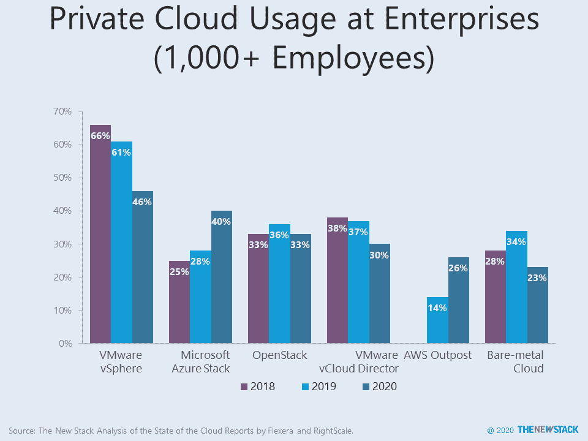

# 调查下一代基础架构即服务

> 原文：<https://thenewstack.io/investigating-the-next-generation-of-infrastructure-as-a-service/>

组织是否正在重新考虑私有云和混合云的概念？

几周前，我们注意到，根据 Flexera 的[云状态报告](https://info.flexera.com/SLO-CM-REPORT-State-of-the-Cloud-2020)的调查，来自 Azure、AWS 和 Google Cloud 的[私有云正在获得用户。这项长期研究的 2020 年版本见证了使用至少一个私有云和一个公共云的企业的大幅增长，该研究将其定义为混合云。这个数字一直相对稳定，直到今年，这个数字跃升至 87%。部分上升可能是由于采样方法的变化，但微软 Azure Stack (28%至 40%)和 AWS Outpost (14%至 26%)在去年有明显上升。Red Hat OpenShift (22%)和谷歌 Anthos (14%)今年刚刚加入调查。尽管有报道称 OpenStack 即将寿终正寝，但它的采用率只下降了一点点(36%到 33%)。降幅最大的是在裸机基础上采用私有云以及使用 VMware vSphere。](https://thenewstack.io/long-running-study-finds-uptake-of-private-clouds-from-azure-aws-and-gcp/)

这是否是私有云和混合云通过满足企业运行自己的基础架构的需求而重新焕发活力的早期迹象？如果是这样，企业是否关心基础架构的管理是否依赖于大型公共云提供商开发的软件？我们不知道答案，但这是对下一代基础设施即服务(IaaS)的新一轮调查的核心。

在接下来的几个月里，我们将与目前运营私有云或混合云的组织的首席技术官和云架构师进行交谈，我们的第一个问题将是未来几年推动基础架构需求的工作负载。然后，这些行业资深人士将帮助评估当前解决方案的架构是否能够满足这些要求。我们希望讨论能够深入可伸缩性、边缘节点以及标准化架构如何刺激基础设施即代码的采用。

这项研究计划仍处于早期阶段。如果你有兴趣分享你的专业知识，请联系劳伦斯·赫特开始对话。

亚马逊网络服务、Red Hat 和 VMware 是新堆栈的赞助商。

通过 Pixabay 的特征图像。

<svg xmlns:xlink="http://www.w3.org/1999/xlink" viewBox="0 0 68 31" version="1.1"><title>Group</title> <desc>Created with Sketch.</desc></svg>