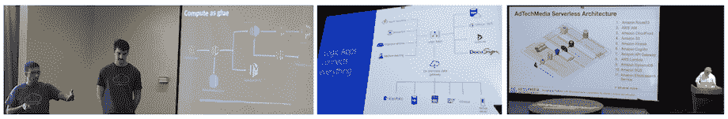

# 无服务器和物联网有哪些可以互相借鉴的地方

> 原文：<https://thenewstack.io/iot-serverless-can-learn/>

无服务器应用架构和物联网(IoT)有许多共同之处:两者都是新兴技术选择，引入了全新的网络管理方式，因此需要围绕应用设计和部署的新思想。

这两个技术领域都还没有成熟，许多工具——特别是关于安全性、日志和大规模部署的工具——都还没有解决。两者都看到了开发人员社区和企业的巨大兴趣，渴望实现解决方案，两者都需要学习如何支持开发人员和系统集成商采用快速发展的技术和快速的创新步伐，这意味着每隔一周就有新的东西要学。

两者还有一个共同之处。在物联网会议上，演讲者几乎无处不在地会以“未来的方向是什么”的幻灯片结束他们的演示文稿，并包括一个“无服务器”的圆点。在无服务器会议上，发言人——就像上周在奥斯汀举行的 Serverlessconf 会议——将有一张最后的幻灯片，用一个圆点“物联网”来描绘未来。

## 物联网能从无服务器中学到什么:设计模式

鉴于所有这些相似性，物联网可以从开发者社区、初创公司和企业如何采用[无服务器](/category/serverless/)中学到很多东西。

在 Serverlessconf 上，案例研究中最常见的演示幻灯片格式之一是先展示一个架构图，说明无服务器模式是如何运行的，然后再介绍细节。我还看到一些实施无服务器方法的企业从架构图开始，以便向他们的内部团队解释他们正在构建什么。像 [LucidChart](https://www.lucidchart.com/pages/aws) 这样的 SaaS 工具已经将 AWS 图标集成到他们的图表制作工具中，以帮助这种映射。

上图*:server less conf 的演讲者分享了他们的设计模式和架构图*

虽然至少有一个 Serverlessconf 发言人打趣说，似乎每个人都需要展示一个强制性的架构图，但这是有充分理由的。无服务器正在被开发人员所接受，他们经常在学习技术的同时构建和测试解决方案。因此，映射和解释设计模式在早期成熟的生态系统中是至关重要的工具。它允许开发人员阐明他们认为系统将如何工作，允许他们测试假设，并鼓励团队投入。

思科首席技术官 Ken Owens 认为，物联网需要推进设计模式的更好共享，以加快开发人员的技能。

“缺少的是没有很多例子可供开发人员查看如何为物联网创建这些模式，”Owens 说，他正在组织将于 5 月 23 日和 24 日在三藩市举行的 [思科 DevNet Create](https://www.devnetcreate.io/2017/) 。他希望那里的演讲者将分享他们实现的设计模式和架构图，以帮助推动该领域的发展。“随着开发人员在公共交流中分享他们的模式，我们可以利用彼此的工作来推进物联网。”

## 无服务器能从物联网中学到什么:便携性

虽然许多评论者 [哀叹物联网](https://thenewstack.io/w3c-linked-data-help-standardize-internet-things/) 的孤岛式方法目前对可扩展解决方案的采用造成了巨大障碍，但事实是大多数物联网参与者都认识到并同意必须克服这一障碍。在过去的半年中，新的合作开始创建物联网系统中连接和消息传递的标准化方法。像 [工业物联网联盟](http://www.iiconsortium.org/) 这样的机构正在扫描该行业，并确保迅速崛起的平台——像[clear blade](https://www.clearblade.com/)——已经在建立强大的工业客户基础——被邀请进来与其他领导者合作，以便共同的协议和标准能够出现。

在最近来自 IBM 的 OpenWhisk 关于其无服务器平台新特性的声明中，首席技术官兼 IBM 云平台 V .[杰森·麦基](https://www.linkedin.com/in/jrmcgee/)很快指出，作为一个 Apache 开源项目，OpenWhisk 提出了“一个不可知事件的标准模型。开发人员如何连接到事件并从事件中获取数据应该是标准的，”McGee 说。“应该有某种标准的事件分类法。例如，对于每个用例，对象存储中的文件更改都应该有一个标准的数据格式，这样就可以跨无服务器平台进行移植。”

> 如果云提供商希望在事件和数据处理的边缘发挥作用，那么他们可能需要友好地与其他系统合作，而不是将客户推入他们自己的生态系统。

事实上，McGee 认为物联网的实现将推动无服务器供应商创造这种便携性。“IoT 会努力做到这一点。在物联网中，存在多级聚合。您需要一个通用的编程模型，它将从边缘一直工作到云。这将给可移植性带来压力，并为此创造一个更加开放的方法，”McGee 预测道。

思科公司的欧文斯已经看到了这一点。“在物联网领域，我看到通用 API 的使用日趋成熟。要让每个人都朝着一个共同的协议发展，还有很长的路要走，但我看到人们正在讨论可移植性。”

到目前为止，当[选择云提供商](https://thenewstack.io/similarwebs-cloud-infrastructure-large-scale-data-analysis/)时，企业需要在一个平台上全力以赴，因为跨一系列云平台集成数据和服务的成本过高。DevOps 的倡导者，如 [Honeycomb.io](https://honeycomb.io/) 的 [Charity Majors](https://github.com/charity) 警告说，这可能会在监控无服务器网络方面造成危险，因为工具可能不太可能能够在其自己的平台内发现问题或潜伏。

Owens 表示，随着该架构应用于物联网用例，物联网用例最终可能会推动无服务器提供商提供更大的便携性。部分驱动因素是需要进行大量边缘处理，以便数据和事件处理与物联网实施相关。物联网网络的分布式本质是，并非所有东西都在云中，消息传递通常由电信提供商完成。因此，物联网为电信公司提供了一条重返市场的途径，他们在很大程度上输给了云提供商。如果云提供商希望在事件和数据处理的边缘发挥作用，那么他们可能需要友好地与其他系统合作，而不是将客户推入他们自己的生态系统。

“他们认识到物联网的分布式本质是他们不会在云中拥有一切，当我想到具有雾节点的新架构并将其分发到边缘时，如果在最后一英里进行更多的处理，云提供商将失去他们的市场，”Owens 说。“为了使其更加可行，他们将希望将其触角延伸到边缘处理领域。”

## 物联网和无服务器:同步成熟

大的范式转变通常是一前一后发生的，并且相互影响。随着[微服务](/category/microservices/)架构原则的兴起，容器开始越来越多地被使用，这两者相互配合得很好。现在，我们看到了物联网和无服务器之间的共生知识学习。每一个都可以单独实现，但是当结合使用时，或者当从一个领域学到的知识应用到另一个领域时，开发人员有了新的方法来更快地学习和行动。

专题图片:来自 OpenWhisk 的 Jason McGee 在 Austin Serverlessconf 上演示。

<svg xmlns:xlink="http://www.w3.org/1999/xlink" viewBox="0 0 68 31" version="1.1"><title>Group</title> <desc>Created with Sketch.</desc></svg>