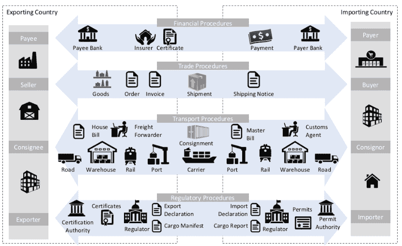
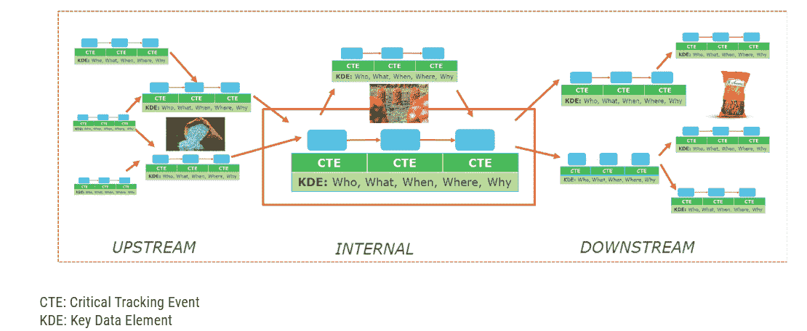
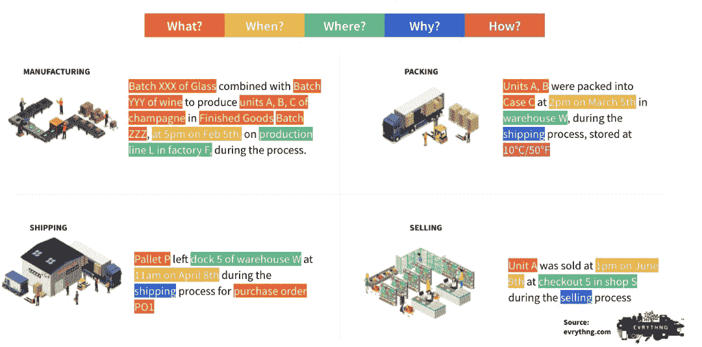
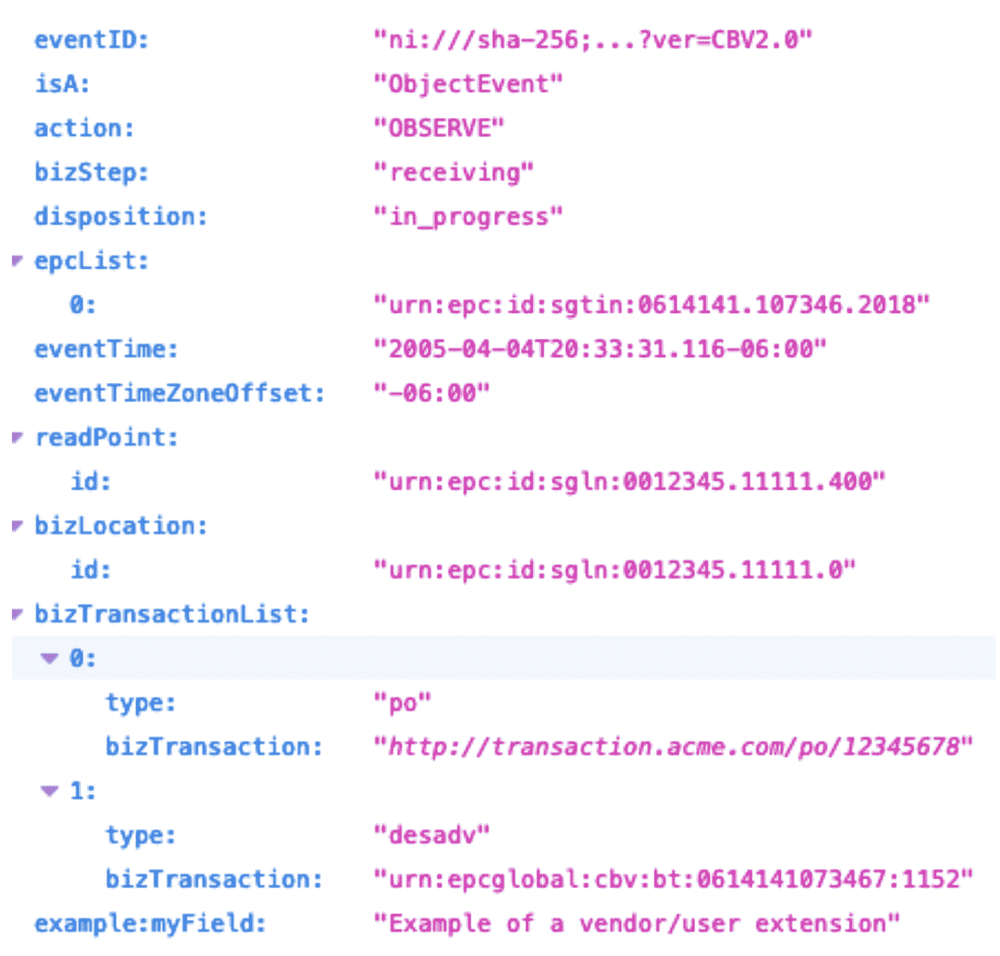

# IOTA 分布式账本:超越供应链的区块链

> 原文：<https://thenewstack.io/iota-distributed-ledger-beyond-blockchain-for-supply-chains/>

[IOTA 基金会](https://www.iota.org/)是 IOTA 开源分布式账本技术背后的组织，专为物联网打造，设想未来全球供应链中的每一个贸易项目都可以被跟踪，其来源可以通过分布式账本获得。由于 IOTA 基金会和[商标东非(TMEA)](https://www.trademarkea.com/) 的合作，这一愿景已经在东非成为现实。这些组织联手应对肯尼亚花卉出口商、航空公司和货运代理出口流程数字化的挑战。

TMEA 发现，仅在一笔交易中，一位非洲企业家就平均完成了 200 次通信，包括 96 份纸质文件。IOTA 基金会和 TMEA 开发的系统将关键贸易文件锚定在 [the Tangle](https://wiki.iota.org/learn/about-iota/tangle) 上，这是一种不同于传统[区块链](https://thenewstack.io/are-blockchains-databases/)模式的新型分布式账本技术，并与目的地国家的海关共享这些文件。这加快了出口进程，使非洲公司在全球更具竞争力。

[https://www.youtube.com/embed/bnAfclXTaeI?feature=oembed](https://www.youtube.com/embed/bnAfclXTaeI?feature=oembed)

视频

从技术角度来看，这一举措背后的原因是什么？IOTA 基金会的技术分析师和项目负责人 José Manuel Cantera 最近分享了这一点。从鸟瞰图来看，它包括使用:

*   用于数据互操作性的 EPCIS 2.0 数据序列化格式
*   IOTA 分布式分类账，用于记录供应链中发生的每一个事件
*   ScyllaDB NoSQL 用于可扩展的弹性持久存储

让我们深入研究两个具体的用例:跨境贸易和端到端供应链可追溯性。但首先，坎特拉对供应链数字化相关技术挑战的看法。

Cantera 为 ScyllaDB Summit 精心制作了这篇演讲，这是一个虚拟会议，旨在探索需要什么来推动大规模分布式数据集的即时体验。 [*立即注册(免费+虚拟)*](https://www.scylladb.com/scylladb-summit-2023/?latest_sfdc_campaign=7016O000001G3LO&campaign_status=&utm_campaign=smo%20new%20stack%202023-02-15%20scylla%20summit&utm_medium=social%20media%20-%20organic&utm_source=the%20new%20stack&lead_source_type=the%20new%20stack) *参加我们的 2023 ScyllaDB 峰会现场直播，届时将有来自 Discord、Hulu、Strava、Epic Games、ScyllaDB 等领域的专家，以及 WebAssembly、Rust、NoSQL、SQL 和事件流趋势方面的行业领导者。*

## 供应链数字化:最大的技术挑战

Cantera 首先介绍了与供应链数字化相关的三个最紧迫的技术挑战。

首先，在整个供应链中有多个参与者和系统生成数据并集成数据，验证每个参与者和系统的身份至关重要。供应商、原始设备制造商、食品加工商、品牌、回收代理商、消费者、港口、承运商、地面运输商、检查员/当局、货运代理、海关、经销商、维修商等。都牵涉其中，而且都必须核实。

第二，所有这些行为者之间有多种关系，这些关系跨越国界，没有中心支柱，也没有单一的真相来源。除了企业对企业和企业对消费者，还有企业对政府和政府对政府的关系。

第三，通过可验证的数据维持不同行为者之间的信任有不同的功能需求。可追溯性是这里的关键。从不同类型的应用来看，它是合规性、产品真实性、透明度和来源的促成因素。例如，可追溯性对于道德采购、食品安全和有效召回至关重要。

## 用例 1:跨境贸易

对于他的第一个例子，坎特拉转向跨境贸易业务。

“这是一个多层次的领域，有许多不同的问题必须在不同的地方解决，”他警告说，然后分享了一个控制这种情况的巨大复杂性的图表:

这里的关键流程是:

*   **财务程序:**双方之间的纯财务交易
*   **贸易手续:**任何一种与商业交易有关的文件
*   **运输程序:**运输货物的所有细节
*   **监管程序:**进口商和出口商之间以及企业与政府关系中的公共机构之间必须交换许多不同的文件

那么 IOTA 基金会是如何优化这个复杂的多层领域的呢？坎特拉解释说:“我们允许不同的行为者、不同的政府机构和私人行为者(交易者)共享文件，并一次性核实文件。每当一批货物在东非和欧洲之间移动时，所有的贸易证书、所有的文件都可以由不同的行为者一次核实，文件的真实性和出处都可以得到适当的追踪。因此，提高了交易过程的灵活性。这样效率更高，效果更好。”

上面可视化的流程中的所有参与者都通过 IOTA 分布式分类帐提供的基础设施使用[架构](https://thenewstack.io/will-blockchain-change-way-businesses-operate/)共享文档，这将在下面第二个用例后详述。

## 用例 2:端到端供应链可追溯性

除了解决跨境贸易的文件共享和验证，还有另一个挑战:追踪贸易项目的来源。坎特拉强调，当我们思考可追溯性时，我们需要思考联合国对可追溯性的定义:“在人权、劳工(包括健康和安全)、环境和反腐败领域，识别和追溯产品、零件和材料的历史、分布、位置和应用，以确保可持续性声明的可靠性的能力。”

原则上，可追溯性意味着跟踪历史的能力。就贸易项目而言，这意味着了解特定贸易项目发生了什么——不仅是它的运输，还有它的来源。如果[供应链](https://thenewstack.io/nsa-software-supply-chain-guidance/)中的一方提出可持续性、安全性等要求。该声明的有效性必须是可证实的。

例如，考虑一包看似简单的薯片。一个农民把土豆卖给一个食品加工厂，食品加工厂把土豆加工成一袋薯片。种植土豆时，这位农民使用了一种肥料，这种肥料是由另一家制造商生产的，含有来自另一位农民的原料。当将土豆加工成薯片时，食品加工机使用的油来自另一种来源。诸如此类。所有这些东西的历史——土豆、化肥、油、装薯片的袋子等等——都需要知道，以便追踪那袋薯片。

所有这些细节——从土豆何时收获到使用的肥料，肥料来自哪里，等等——都被认为是关键事件。这些关键跟踪事件中的每一个都有关键的数据元素，描述了谁、什么、何时、何地、为什么甚至如何。

## IOTA 如何应对最大的技术挑战

IOTA 基金会应用了多项核心技术来解决这些用例中的主要技术挑战:

*   数据互操作性
*   可扩展数据存储
*   可扩展、无权限、无感觉的分布式账本技术

### 数据互操作性

在这些和类似的用例中，许多不同的参与者需要交换数据，所以这需要一个标准的语法和参考词汇表，以实现语义互操作性。此外，它还需要可扩展，以适应不同行业的特殊需求(例如，汽车行业和海鲜行业有明显不同的细微差别)。这里使用的一些关键技术包括带有 [JSON-LD](https://json-ld.org/) 的 W3C，带有 [EPCIS 2.0](https://blog.iota.org/epcis-2-0-a-global-standard-to-build-trusted-and-decentralized-supply-chains-with-iota/) 的 GS1，以及提供 edi3 参考数据模型的 [UN/CEFACT](https://unece.org/trade/uncefact) 。IOTA 还使用行业标准实现数据互操作性；例如，DCSA(海上运输)、 [MOBI](https://dlt.mobi/standards/) (联网车辆和物联网商务)和[海鲜可追溯性全球对话](https://traceability-dialogue.org/)等等。

值得注意的是，IOTA 深入参与了 EPCIS 2.0 的开发，EPC is 2.0 是一个词汇和数据模型(加上一个基于 JSON 的序列化格式和附带的 REST APIs)。它使利益相关者能够共享关于对象(物理或数字)的移动和状态的交易信息，这些信息由密钥识别。使用此模型，事件描述如下:

它以这样的格式翻译成 JSON-LD:

### ScyllaDB NoSQL 的可扩展数据存储

为与每个供应链事件相关的所有关键数据建立可扩展的数据存储是另一个挑战。坎特拉解释说，“如果我们要跟踪供应链中的每一件商品，我们需要存储大量数据，这是一个大数据问题。在这里， [ScyllaDB](https://www.scylladb.com/?utm_content=inline-mention) 提供了许多优势。我们可以非常容易地扩展我们的数据。我们可以在精细的粒度级别长时间保存数据。不仅如此，我们还可以将 NoSQL 和 SQL 世界的精华结合起来，因为我们可以拥有健壮的模式来拥有健壮的数据和可信的数据。”

Cantera 接着详细介绍了 ScyllaDB 在该架构中的作用，并提供了一个汽车供应链的例子。假设一家 OEM 每年生产 1000 万辆汽车。假设:

*   每辆车有 3000 个可追踪部件。
*   每个部分可以有 10 年的寿命。
*   每个部分可以生成 10 个业务事件。

这相当于大约 3000 亿个活跃的业务事件存储在 ScyllaDB 中。另一个例子:假设一家海运运营商每年运输 5000 万个集装箱。考虑到每个容器 10 个事件和五年的运营，Cantera 估计这里大约有 2，500，000 个活动事件—仅来自 EPCIS 2.0 事件存储库。但是也有其他层需要这种级别的数据可伸缩性。

他以 ScyllaDB 在该计划中的众多应用来结束对这一挑战的讨论:

*   事件存储库(EPCIS 2.0、DCSA 等)
*   项目级跟踪
*   库存
*   目录
*   任何 DLT 第 2 层数据存储

### 可扩展、无权限、无感觉的分布式账本技术

在 IOTA 基金会构建的解决方案中，可扩展、无权限和无感觉的分布式账本技术也发挥了关键作用。为此，它将 IOTA 分布式分类账与受保护的存储(如 [IPFS](https://ipfs.tech/) )相结合，在这些点对点交互中提供数据和文档可验证性、可审计性和不变性的功能。

例如，假设您雇佣了一个特定的运输商来运输货物。当活动开始时，运输者可以生成交易项目已经开始在供应链中移动的事件，并且这些事件被提交给 IOTA 分布式分类帐。更具体地说，事件的发起者在分布式分类帐上生成一个交易，该交易以后可以被供应链中的任何参与者用来验证事件的真实性。一旦事件被提交，发起者就不能再修改它。如果事件被修改，验证步骤将失败，供应链合作伙伴可能会担心，这是可以理解的。

以下是所有这些要素的组合方式:

提示:对于 Cantera 对该参考架构的逐块浏览，请参见下面的视频，从 17:15 开始。

[https://www.youtube.com/embed/pA05B-CYBPo?feature=oembed](https://www.youtube.com/embed/pA05B-CYBPo?feature=oembed)

视频

## 结论

供应链数字化充满了技术挑战，因此需要非传统的技术组合来满足 IOTA 基金会高度专业化的需求也就不足为奇了。坎特拉总结得很好:

*“它需要互操作性——这意味着与开放标准 EPCIS 2.0 保持一致非常重要，EPC is 2.0 是来自 W3C 可验证凭证的分散 ID。它需要一个参考架构来保证语义互操作性，并使用一些可重用的构件。它需要去中心化，去中心化的数据需要分布式账本技术——特别是，像 IOTA 这样的公共的、无权限的、无感觉的分布式层，用 IPFS 来补充，越来越依赖于去中心化的应用。它还需要数据的可伸缩性和可用性，ScyllaDB 是这里的完美伙伴。最后但并非最不重要的一点是，它需要使用分散式 IDs、分布式账本技术和点对点等技术进行可信的数据共享。”*

<svg xmlns:xlink="http://www.w3.org/1999/xlink" viewBox="0 0 68 31" version="1.1"><title>Group</title> <desc>Created with Sketch.</desc></svg>