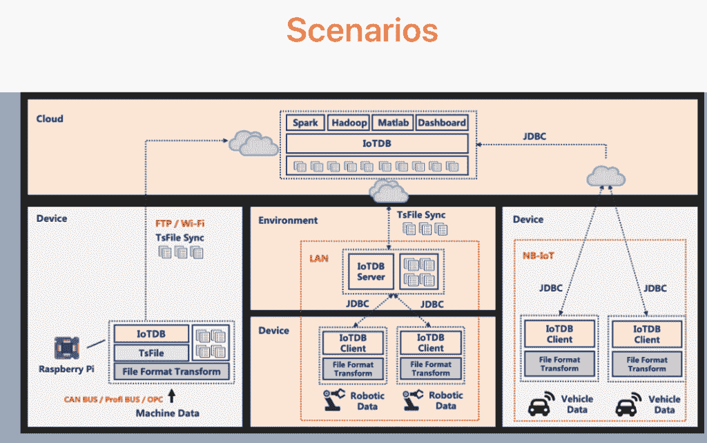
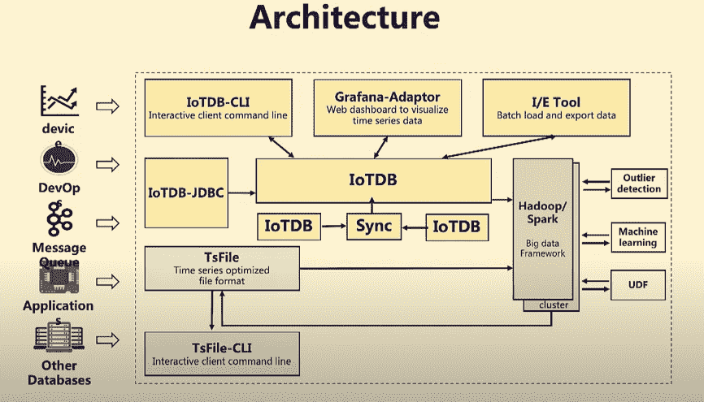
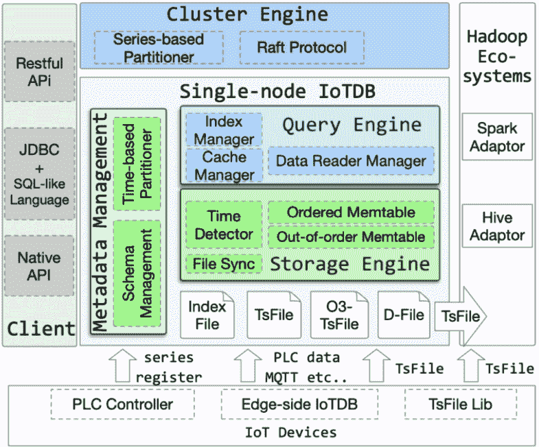

# IoTDB 为工业边缘 IT 提供数据管理

> 原文：<https://thenewstack.io/iotdb-provides-data-management-for-industrial-edge-it/>

随着[工业物联网](https://thenewstack.io/postcard-from-the-edge-government-use-of-internet-of-things/) (IIoT)应用程序全天候产生大量数据，关系型和基于键值的数据库难以跟上。

这个问题清华大学软件学院的团队已经研究了十年。结果是 [IoTDB](https://github.com/apache/iotdb) ，它最近从 Apache 软件基金会孵化器毕业，成为[顶级项目](https://www.globenewswire.com/news-release/2020/09/23/2097876/0/en/The-Apache-Software-Foundation-Announces-Apache-IoTDB-as-a-Top-Level-Project.html)。

“在数据库、物联网(IoT)和人工智能技术的融合以及更广泛地采用工业 4.0 和自动化方法以进一步实现远程工作和提高效率的时候”，退休的 IBM 研究员、IBM 印度公司前首席科学家、美国国家工程院院士 C. Mohan 说。

作为该团队的一名杰出客座教授，“我看到这个项目已经成熟，并围绕它建立了一个充满活力的开源社区，”他说。

### 来自中文大学

大约从 2012 年开始，作为一名中国大学的博士生，[现在担任 Apache 项目副总裁的黄向东](https://scholar.google.com/citations?user=81Fw01kAAAAJ&hl=en)被分配管理一家大型公司的 20 万台机器每分钟生成的时间序列数据。事实很快证明，从甲骨文读取数据太慢，购买更高级的许可证又太贵。

他们决定尝试 NoSQL——卡珊德拉——但是也遇到了性能问题。

“Apache Cassandra 很好，我们使用了五个节点来管理所有数据，”他说，并解释说，“用户可能会在 Cassandra 中创建超过 5000 个表，他们不想购买更多的服务器来形成更大的集群(因为预算有限)。从那以后，我花了大约两年的时间阅读 Cassandra 的源代码，并在 Cassandra 上做了一些修改，花费了大量的精力使用有限的服务器资源来提供更好的性能，这让我们很累。…尽管我们付出了很大努力，但我们发现使用五个节点很难达到每秒写入 1000 万个数据点的速度。”

他们试图将数百个数据点作为键值对保存到 Cassandra 中。但是这意味着自己维护一切，并且仍然会遇到性能问题和数据结构的限制。

然后他们决定从头开始创建一个时间序列数据库。王建民教授提出了在 2018 年将该项目捐赠给 ASF 的想法，作为让更多人参与进来的一种方式。

## 管理海量数据

作为工业物联网的时序数据库，该项目为海量数据集、高吞吐量数据输入和复杂数据分析提供存储。这是一个轻量级的结构，高性能和可用的功能可以很容易地与其他项目集成，如 [PLC4X](https://plc4x.apache.org/) 、 [Hadoop](https://hadoop.apache.org/) 、 [Hive](https://hive.apache.org/) 、 [Spark](https://spark.apache.org/) 和 [Flink](https://flink.apache.org/) 。

“当物联网用于工业应用时，智能设备通常比面向消费者的物联网设备多产生一到两个数量级的数据，”oTDB 开发人员在一篇研究论文[中写道。“这使得分析更难在合理的时间内产生有价值的见解。”](http://www.vldb.org/pvldb/vol13/p2901-wang.pdf)

与边缘计算相关的新时序处理工作负载涉及海量数据、高效数据接收需求以及复杂的低延迟查询和高级数据分析。

总体而言，IoTDB 提供:

*   用于数据接收的高性能和用于节省磁盘空间和 IO 的高压缩。
*   查询万亿字节数据时的低延迟。它可以支持时间范围和值过滤，并支持快速聚合。
*   它支持许多时序互斥操作，如时序分割和子序列匹配。
*   它与多个系统集成，包括用于传统工业分析的 [Matlab](https://www.math.utah.edu/lab/ms/matlab/matlab.html) :
*   Spark 和 [MapReduce](https://www.ibm.com/analytics/hadoop/mapreduce#:~:text=MapReduce%20is%20a%20programming%20paradigm,tasks%20that%20Hadoop%20programs%20perform.) 用于大数据分析； [Grafana](https://grafana.com/) 用于可视化， [Apache Kafka](https://kafka.apache.org/) 用于数据摄取。

元数据管理模块使用树形结构来管理设备的命名空间。IoTDB 以开放的原生时间序列文件格式存储数据，以便通过查询/存储引擎进行数据库访问，并针对数据的单个副本进行 Hadoop/Spark 访问。

作为一个分布式时间序列数据库，在集群引擎中通过在不同节点之间对时间序列进行分组来划分数据，同时在每个节点上实现基于时间的数据切片以提高性能。IoTDB 提供了类似 SQL 的语言、本地 API 和 restful API 来访问数据。

据向东介绍，在物联网场景中，边缘计算和云端部署同等重要。

IoTDB 有三种物理部署模型:

*   Raspberry PI 等边缘设备上基于文件的存储或嵌入式时序数据库。
*   工业 PC 上的独立时间序列数据库。
*   采用 TsFile 存储格式的分布式时序数据库或 Hadoop 集群。

### 数据+分析

“通常，物联网设备从传感器和工业控制器收集数据，并使用定制或标准协议(如 MQTT)实时将数据发送到数据中心。然而，在某些情况下，边缘智能需要实时分析，如故障警报，以从本地数据存储中检索数据，”他说。

“IoTDB 有一个轻量级的嵌入式版本，可部署在物联网设备上，最低运行时内存要求为 32MB，计算由 ARM7 处理器支持。本地存储也是强制性的，以防止在临时网络中断的情况下数据丢失。在这种情况下，TsFile Lib 允许设备以 TsFile 格式保存数据，之后生成的 TsFile 可以使用文件同步模块直接与云上的活动 IoTDB 实例同步和合并。”

在云中，使用集群引擎，使用基于 Raft 的协议来管理多个 IoTDB 节点。在集群模式下，可以根据时间片和时间序列 ID 来定义数据分区。他说，数据的分发和查询操作对最终用户是完全透明的。

他说，IoTDB 是为管理物联网设备中的数据而设计的，而其他时间序列数据库通常是为 DevOps 设计的。IoTDB 更加轻量级，因为它不依赖于其他系统，比如 RDBMS 或 NoSQL 数据库。

IoTDB 的写吞吐量达到每秒千万点。

“Apache IoTDB 非常适合边缘计算，”德国初创公司[practical industries GmbH](https://pragmaticindustries.com/en/)的首席执行官 Julian Feinauer 说，“高压缩率有助于非常有效地使用我们有限的内存。IoTDB 是一个完美的选择，特别是在 IIoT 用例中，网络和计算能力在边缘受到限制。”

[https://www.youtube.com/embed/LLFc3yPyTFY?list=PLU2OcwpQkYCxVGCGWtMxb9d27Z-pcoN9a](https://www.youtube.com/embed/LLFc3yPyTFY?list=PLU2OcwpQkYCxVGCGWtMxb9d27Z-pcoN9a)

视频

与竞争对手 InfluxDB、时标等的比较可以在[这里](http://iotdb.apache.org/UserGuide/Master/Comparison/TSDB-Comparison.html)找到。

## 还会有更多

自从加入 Apache 孵化器以来，IoTDB 吸引了来自世界各地的用户。钢铁和矿业公司[安赛乐米塔尔美洲公司](https://usa.arcelormittal.com/)用它来获取传感器数据。他说，这个项目吸引了它，因为它能够与 Spark、Grafana 和 NiFi 等系统集成。

该团队正在与中国气象局合作构建下一代大数据平台。中国有 150，000 个气象站，每个站收集 100 多个指标，每五分钟报告给数据中心。

它将取代上海地铁管理部门的 KairosDB。它使用 IoTDB 管理 300 辆铁路车辆，每天收集 4000 亿个数据点。

其他用户包括风能技术供应商金风公司；中国家电和消费电子公司海尔，通用电器在美国的母公司；联想；以及“智能”驾驶技术厂商四维图新。

自从加入 Apache 孵化器以来，IoTDB 接受了 1300 多个拉请求，并添加了 100 多个新特性。

展望未来，由于 IoTDB 试图服务于边缘和云，并在两者之间同步数据，它将实现 C++和 Go 数据文件 API，以便在边缘上更容易使用。

为了提高性能和稳定性，该团队正在实施更好的数据压缩模块和强大的内存控制策略。

“IoTDB 会越来越开放，”向东说。它将支持 UDF，触发，二级指标很快。我们将把它与其他开源系统整合在一起，比如 [Apache 方解石](https://calcite.apache.org/)。

“然后，你可以使用 IoTDB 做许多有趣的事情，如离群数据警报、数据计算、相似性搜索和使用标准 SQL 操作数据，”他说。

IoTDB 的集群版本也即将推出。

<svg xmlns:xlink="http://www.w3.org/1999/xlink" viewBox="0 0 68 31" version="1.1"><title>Group</title> <desc>Created with Sketch.</desc></svg>