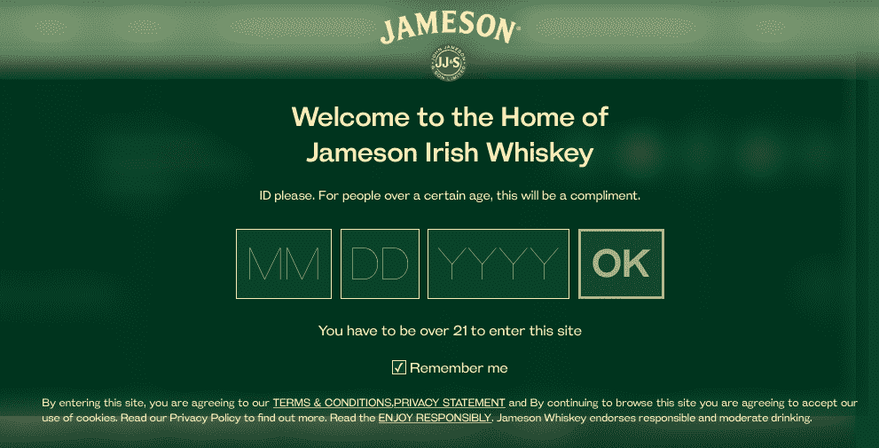

# 保乐力加如何利用亚马逊网络服务协调国际营销工作

> 原文：<https://thenewstack.io/irish-distillers-uses-amazon-web-services-manage-international-web-sites/>

[Pete MC vicar](https://www.linkedin.com/in/petemcvicar/),[保乐力加](https://www.pernod-ricard.com/en)烈酒和葡萄酒公司销售解决方案的 IT 营销主管在今年的圣帕特里克节休息得更轻松了，因为该公司已经完成了大约三分之二的技术革新。

当他在 2015 年圣帕特里克节到达时，美国、加拿大和南非市场的网站正在重建。该公司见证了移动应用的巨大爆炸。麦克维卡在都柏林接受电话采访时说，撒哈拉以南非洲几乎完全是移动的。美国有超过 60%的移动设备，并且主要是 iOS，而非洲则是不同设备的混合体。

他面临的挑战是:让公司的网站尽快在所有这些设备上运行。

他负责数字工程团队，为保乐力加 17 个战略品牌中的 11 个开发营销工具、服务和平台，包括爱尔兰都柏林最大的爱尔兰威士忌生产商爱尔兰蒸馏器公司，包括詹姆森；英国的芝华士兄弟；瑞典斯德哥尔摩的 Absolut。

爱尔兰酒厂的母公司保乐力加提供的一些品牌

旧系统本质上是一堆静态 XML 文件，这些文件是在一台服务器上的定制平台上生成的，没有任何洞察能力。“我会在第二天收到电子邮件，说‘我收到报告说网站很慢，’”他说，但没有数据显示具体情况。他决定开始研究优化性能。新平台的关键问题是“它快吗？对于尽可能多的市场和人群来说，它快吗？”

此外，所有营销项目都必须由位于都柏林的 McVicar 的五人团队进行编码，因为只有他们有权访问定制的 XML 代码。因此，新平台除了要快速之外，还需要更加动态，让本地营销团队能够自己开展活动，而不是必须联系中央品牌团队来编码这些变化。

他的团队使用亚马逊网络服务(AWS)建立了第二个平台，遵循关于设置的最佳实践，使用[λ函数](https://aws.amazon.com/lambda)来搅动数据。一切都很好，但 50 个左右的市场中的每一个都必须逐个添加。过渡到让每个市场都进行内容管理和管理数据本地化是一项非常具有挑战性的工作。挑战的一部分是管理酒精的国际和地方法律的复杂结合。

## 酒精广告的法律

酒精是地球上最受管制的物质之一。McVicar 的团队必须本地化到每个国家的限制性法律，或者在美国各州保留品牌。

例如，在法国，公司不允许展示一个人拿着一杯酒，它必须是一个直的瓶子或容器。在一些东欧国家，它不能显示一个人或一个动物拿着一个装有酒精的杯子。(人们不禁要问，米兰塔斯的伏特加大口熊是如何在这些市场生存下来的。)但不仅仅是成像。

贾米森网站要求按照美国法规进行年龄验证

有些国家要求在网站上注明年、月、日，有些国家只要求注明年份。有些国家没有年龄限制，但有些国家(如美国)非常严格。

所有这些复杂性都被加载到 AWS 中并在那里进行管理。例如，它最近完成了法国版詹姆森威士忌的网站加载，增加了跟踪饼干的功能，满足了在每一页上都有“负责任地饮酒”信息的要求，并在每一件产品上都有一个关于负责任饮酒的图像——所有这些都同时牢记了保乐力加的品牌。

因此，他的团队开始完全在新的平台上建立新的市场网站。如果是旧站点，他们会保留旧系统，并通过虚拟专用网络访问 AWS。

## 崩溃

2016 年 2 月，他们仍然有麦克维科所说的“时髦的软糖”。爱尔兰的升级在他们的待办事项清单上，但一直被推下了待办事项清单。直到当地的营销团队开始发布一个免费的圣帕特里克节派对，并邀请了一个名为[柯达线](https://itunes.apple.com/us/album/in-a-perfect-world/id696982655)的爱尔兰流行乐队，这个派对才刚刚开始。这将是一次全面的媒体推广，包括免费门票、广播广告和媒体博客。没有人向它提到这种推动。

突然，公司的系统崩溃了。开发团队惊慌失措，认为系统受到了外部攻击。

“那是一个混乱的夜晚,”麦克维科说，满嘴脏话。这个团队完全没有准备。他们没有工具去发现发生了什么。

其中一个团队记得新闻稿，他们检查了推荐日志，发现大部分流量来自一个著名的博客。

事实证明，虚拟专用网无法处理营销推广产生的流量。由于爱尔兰网站没有切换到 AWS，系统正在从旧平台向 AWS 进行代理传递，旧服务器无法处理负载。

“这就是我们失败的地方，”麦克维卡说。“这对品牌来说是好事，因为它获得了大量曝光，但对品牌来说是坏事，因为网站似乎要关闭了。”

经验教训:“最好把它放在适当的地方，而不是为了亏损而瞎搞。”此后，他们增加了 [New Relic](https://newrelic.com/) 监控功能，提供系统速度和健康状况的实时数据和可见性。

## 新功能

工程团队一直在努力将这些站点从 XML 平台转移出去，现在已经完成了三分之二。新系统已成为保乐力加的内容营销管理平台。他们内置了比赛、活动、饮料和产品信息的模板，所有这些都可以在本地进行定制。

该平台允许他们在跨市场功能的最佳实践基础上进行构建。例如，为德国市场建立的竞争也可以被日本或阿根廷市场利用。

“我们可以为营销人员内置一些非常酷的功能，让他们兴奋不已，”麦克维卡说。它正在从爱尔兰酿酒厂扩展到其他品牌公司，这样他们就可以利用已经完成的工作。

都柏林的团队负责技术后台。他们构建功能，在 sprints 中为本地公司处理来自营销人员的功能请求，以便本地市场可以添加他们的内容，与团队或本地代理机构一起创建新功能。

当地团队还会了解当地法律，以确保其合规。

## 回报

今年的圣帕特里克节，营销团队正在开展一项名为“为詹姆森欢呼”(cheers for Jameson)的国际比赛，要求消费者与为詹姆森欢呼的伴侣自拍，并贴上标签，然后放到 Instagram 上，以参加他们的全球比赛。获胜者将获得明年圣帕特里克节的都柏林之旅。

在 [DataSift](http://datasift.com/) 的帮助下，这种竞赛管理通过几个 Lambda 函数来完成，以通过竞赛系统验证参赛作品。图像通过 [CopyClear](https://copyclear.ie) 程序运行，以确保在上传到系统之前符合所有当地法律。坦桑尼亚、阿根廷、摩洛哥、马耳他、肯尼亚、加拿大、西班牙、拉托维亚、莫桑比克和波兰都参加了这次比赛。

<svg xmlns:xlink="http://www.w3.org/1999/xlink" viewBox="0 0 68 31" version="1.1"><title>Group</title> <desc>Created with Sketch.</desc></svg>