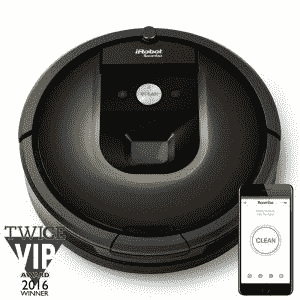
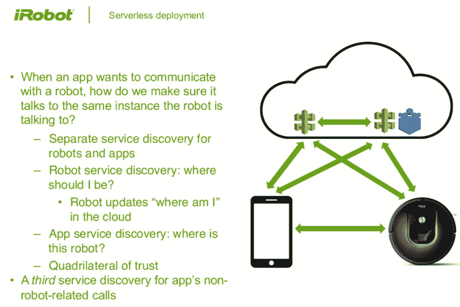
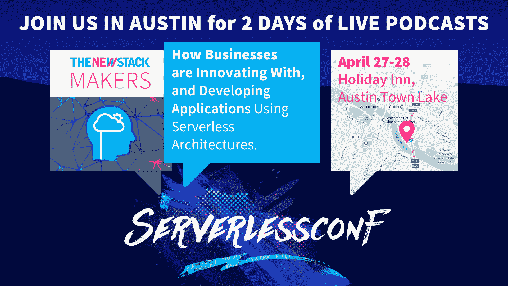

# iRobot 面临大规模运行无服务器的挑战

> 原文：<https://thenewstack.io/irobot-confronts-challenges-running-serverless-scale/>

大规模运行无服务器有哪些挑战？想象你在无服务器上运营一家国际消费机器人公司。大多数机器人单元位于美国以外的家庭中。当机器人连接到云时，您需要保护它们。您需要能够批量识别和发送固件更新。你应该开始考虑如何让 1500 万个家庭机器人中的一部分开始与其他家庭自动化产品对话，或者以新的方式与互联网共享数据。

无服务器是否足够成熟，可以在这种规模下运行？

这是 [本凯霍](https://twitter.com/ben11kehoe) ，云机器人研究科学家 [iRobot](http://irobot.com) 面临的挑战。正如他在布鲁克林和伦敦之前的 Serverlessconf 活动上的演讲所证明的那样，Kehoe 几乎全押在了无服务器上。他将在 4 月 26-28 日于奥斯汀举行的下一届 Serverlessconf 上再次发表演讲。这次他将关注无服务器提供商缺少的东西。

[https://www.youtube.com/embed/yGa2O9qZ95w?feature=oembed](https://www.youtube.com/embed/yGa2O9qZ95w?feature=oembed)

视频

在 Serverlessconf 上，Kehoe 现在已经分享了他在 iRobot 上使用 serverless 的旅程中的几个更新，虽然他是一个热心的倡导者和信徒，但他也非常愿意在他的中型博客 [中讨论 serverless 社区需要](https://medium.com/@ben11kehoe) 关注什么以使工具成熟。

## 在无服务器架构中管理全球机器人车队

iRobot 提供了一系列真空吸尘器机器人，并已扩展到相邻的机器人产品，如拖把、水槽清洁器等。凯霍报告说，现在全球市场上大约有 1500 万个 iRobot 模型正在使用，其中只有 40%在美国。最新的 Roombas 可以连接互联网，并配有一个应用程序，因此消费者可以通过智能手机控制他们的 iRobot。

目前，Kehoe 正专注于 iRobot Roomba 900 系列，并鼓励它成为真正的物联网产品。其他 Roomba 和 iRobot 产品都是联网的，最近集成了 Alexa，Kehoe 指出还有一个[创造机器人](http://store.irobot.com/default/create-programmable/)，这是一个“黑客的 Roomba”

“我们看到，未来我们的大多数产品都将与互联网连接，”凯霍说，这标志着智能家电制造商从设备公司过渡到联网机器公司的举动并不罕见。

为了大规模管理无服务器，Kehoe 使用了一系列 AWS 产品，包括 [AWS 物联网](https://aws.amazon.com/iot/)平台，基础设施即代码服务 [云信息](https://aws.amazon.com/cloudformation/) 和无服务器功能的 [AWS Lambda](https://aws.amazon.com/lambda/) 。

通过结合使用这些服务，iRobot 需要作为一个全球企业来管理审计能力需求，这就是为什么，Kehoe 说，他需要“无服务器操作”这导致 iRobot 的云开发团队开发了名为 Cloudr 的软件，来管理其[无服务器微服务架构](https://www.youtube.com/watch?v=g0M0PN2bFFA)。

“我们创建了一个由一组微服务组成的应用程序。它由每个微服务的一个堆栈组成，”Kehoe 解释道。“开发者在 YAML 定义了一个云形成模板。我们为服务发现注入了一个 [DynamoDB](https://aws.amazon.com/dynamodb/) 表。所有的 lambda 都必须相互通信，并与外部服务通信，你可能不知道它们在部署时会被调用什么，你只知道在运行时会被调用，所以这个表的名称会被注入到你部署的 lambda 中，这样它们就可以在部署后在那里查找信息。

该公司为整个应用程序维护一个单独的堆栈。“这使我们能够创建应用层的连接，然后这些引用进入自定义资源 lambdas，用于填充那些 DynamoDB 表的堆栈，这些信息传播回服务，”他说。“这还允许我们基于您声明的依赖关系来执行跨服务策略，以便只有需要访问任何给定 AWS 资源的资源才被允许访问。”

## 大规模更新无服务器架构

当前的无服务器产品最缺乏的是帮助全球范围内的 iRobots 进行固件更新。

“借助 IaaS 和低级 PaaS，您可以进行大量控制，您可以在负载均衡器之后部署，或者创建一个新实例并引导流量，”Kehoe 解释道。“在无服务器环境中，您无法在负载均衡器之后部署，因为我们对此没有任何控制权。你可以部署到位，但这只是一个大杠杆，你拉，它要么工作，要么不工作。那么我们如何同时托管多个版本呢？”

凯霍说，这是可能的，但不优雅。工程师可以在 API gateway 上创建架构的多个版本，并为每个版本创建单独的 API。但是 AWS 不允许两个 API 使用同一个自定义域。“对于 AWS IoT 来说，情况会变得更糟，”Kehoe 说。“在一个区域中，每个帐户有一个 MQTT 服务器，尽管有可能有多个帐户。但是设备身份的证书只能在一个地区的一个帐户中注册。这对我们来说是一个挫折。”

为了解决这个缺点，无服务器架构变得越来越复杂。为了识别每个机器人在哪里，可能需要更新，这需要三个服务发现组件。

今天，一个关键的缺失部分是集成测试。

“[网飞混沌猴](https://github.com/Netflix/SimianArmy/wiki/Chaos-Monkey)可以进入并搞乱你的系统，并向你展示当你的系统降级时会发生什么。当你没有服务器时，这变得不太可能，因为你唯一能控制的就是你的 Lambda 函数。他举了一个例子，如果 DynamoDB 写数据有困难，开发人员不知道日志消息会是什么样子，所以他们不能针对这种风险场景进行检测。

这就是为什么 iRobot 想出了自己的基础设施破坏代理，恰当地称为[无猴子的混乱](https://serverless.zone/monkeyless-chaos-integration-testing-for-serverless-architectures-9d1a4208c3ca)。“因此，当错误没有发生时，你可以让 Lambda 看到错误，例如，当你看到一个 DynamoDB 条目时，或者当你写一个 Kinesis 流时，Lambda 函数强制它多花五秒钟。我们对这种类型的集成测试感兴趣，以验证系统的健壮性，”Kehoe 解释道。

## 利用无服务器解决业务问题

但这在很大程度上仍然是 iRobot 旅程的开始，他们正在思考物联网，无服务器架构在规模上的样子。虽然该公司正在用 Roomba 980 构建和测试无服务器，但公司工程师也在思考，如果他们的机器人不仅仅能与应用程序对话，客户可能会想要什么样的附加连接产品。

“我们在智能家居中的地位如何？”凯霍问道。例如，Roomba 机器人通过他们的视觉技术来构建他们正在清洁的地板区域的地图。“目前，我们不暴露这一点。还有其他产品可以构建家庭地图，但它们都没有你已经在使用的真空吸尘器那样的理解水平或易用性。家庭中的第一个视觉导航机器人对我们来说是一个非常独特的空间，我们可以从中构建新的智能家居设备。”

## 大规模运行无服务器

“无服务器是关于计算功能的，所以物联网也是一个很好的匹配，所以有很多协同和协调。但是，随着我们越来越深入到产品的大数据方面，我们不会永远使用 Lambda，在某个时候，我们会有大量的批处理作业。它的无服务器部分将主要用于事件驱动的部分，而批处理驱动的部分将转移到 ECS 之类的东西，”凯霍说。

一个因素是 Lambda 的每周期计算成本，这将更加昂贵。“所以当你有了一定的规模时，强迫它进入 Lambda 是不划算的，”Kehoe 说，并补充说，目前，成本并不令人望而却步，所以他们可以从 Lambda 的 [SQS](https://aws.amazon.com/sqs/) 队列中读取，而不是移动到[弹性豆茎](https://aws.amazon.com/elasticbeanstalk/)。

“对于任何技术来说，都有它行得通和行不通的地方，你总是试图在解决方案满足你的目标的务实程度之间找到平衡，”凯霍说。

Kehoe 说，专注于业务逻辑和扩展应用程序的能力是无服务器架构的一大优势。“然而，在该领域有 1500 万个机器人，我们有商业规模，我们需要云规模为此做好准备，”凯霍说。

*凯霍将于本月晚些时候在奥斯丁的 Serverlessconf 上发表演讲，讨论无服务器提供商缺少什么。*

由克里斯·巴特尔制作的特征图像[，由 2.0](https://commons.wikimedia.org/wiki/File:Roomba_time-lapse.jpg) 在 [CC 下授权。](http://creativecommons.org/licenses/by/2.0)

<svg xmlns:xlink="http://www.w3.org/1999/xlink" viewBox="0 0 68 31" version="1.1"><title>Group</title> <desc>Created with Sketch.</desc></svg>