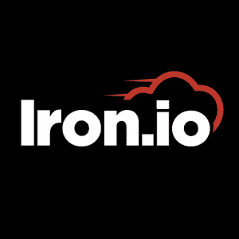
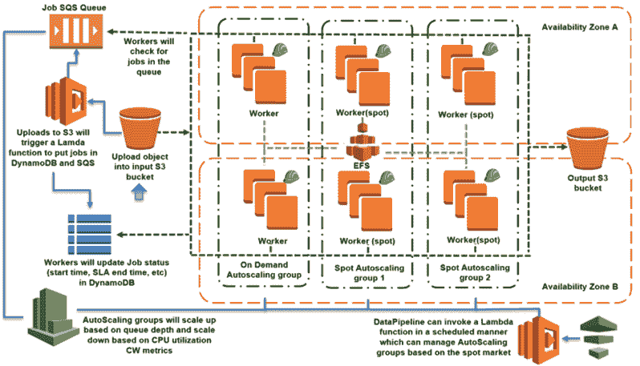
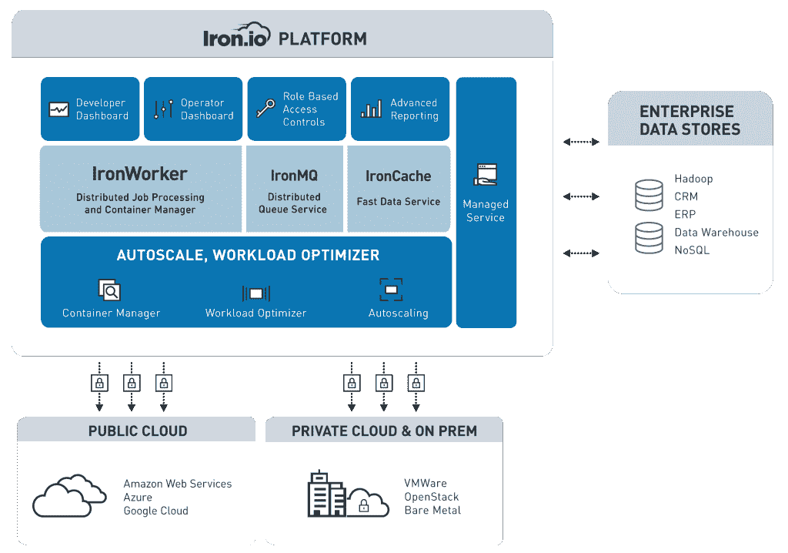
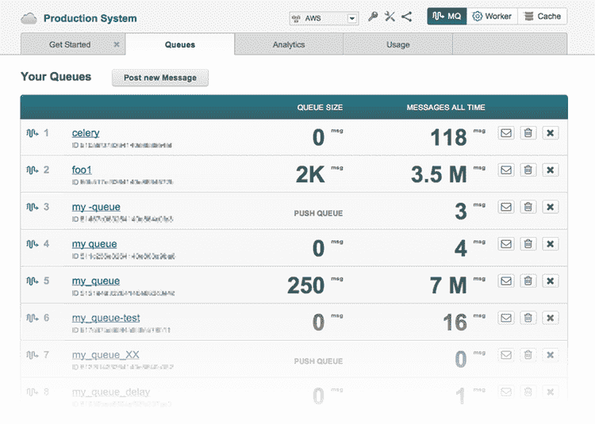
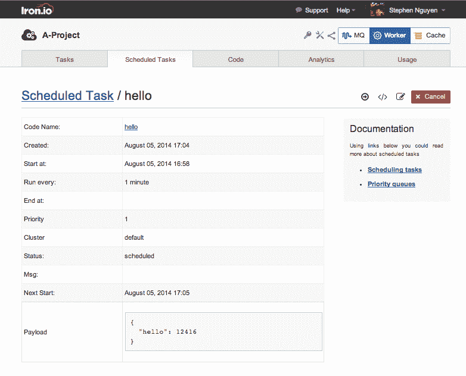

# Iron.io 将 AWS Lambda 引入内部，并融入微容器

> 原文：<https://thenewstack.io/iron-io-brings-aws-lambda-compatibilities/>

很少有技术像 [AWS Lambda](https://aws.amazon.com) 一样吸引了开发者社区的注意，因为越来越多的公司考虑为自己的服务提供无服务器架构的好处，也称为[无状态计算](https://thenewstack.io/year-ahead-stateless-computing/)。

[Iron.io](https://www.iron.io/) 的首席执行官查德·阿里穆拉(Chad Arimura)说:“Lambda 帮助启动了对话，它在地上插了一根桩，并说‘这是我们看到的世界在架构和开发环境方面的发展方向’。”iron . io 自 2009 年以来一直在运营一个事件驱动的无服务器基础，尽管该公司直到 2011 年才正式成立。

一段时间以来，Iron.io 的客户一直要求能够在 Iron.io 上运行 Lambda 代码。现在，这个愿望将会实现。在接下来的几周里，Iron.io 将发布更多关于一项名为 IronLambda 的新服务的信息，该服务将提供 Lambda 代码在任何地方运行的能力——甚至在 AWS 上。

Arimura 指出，Iron.io 的 Lambda 产品将采用一种扩展策略来实现协议、容器化功能、运行 Lambda 功能、导入到 Iron.io 中，并将在任何基础设施上运行，具有超过源代码的灵活性。

## Iron.io 和 AWS Lambda

最初，Iron.io 吸引了一些企业对其架构的兴趣，这些企业希望拥抱无服务器计算，并将他们的整体应用程序分解为基于微服务的方法。正在考虑无服务器架构的企业希望能够控制他们的数据。虽然基于云的 PaaS 和 SaaS 平台通常被誉为数据存储的未来，但对于存储敏感私人信息的公司来说，拥有公共云或异地存储解决方案是不可行的。Iron.io 打包了许多好处，以适应许多部署模型。

自动批处理架构

Iron.io Lambda 的初始测试版将只支持异步 Lambda 调用。同步 Lambda 调用允许开发人员设置一个块，直到客户端在发起直接调用后收到来自服务的最终响应，而[异步函数](https://aws.amazon.com/articles/5496117154196801)会在请求发出后将控制传递回源代码。

“任何 API 网关或 API 的 web 应用程序都可以在 Iron.io Lambda 平台上启动异步调用。未来，我们将添加同步支持和路由器，在 Iron.io 堆栈上构建开箱即用的完整微服务，”Arimura 说。

Iron.io 平台图

当处理各种用例时，一旦大规模部署服务，管理一个人的微服务基础架构很快就会变成一个复杂的网络。Iron.io 试图通过在 Iron.io 平台上提供各种各样的[打包产品](https://www.iron.io/platform/ironmq/)来解决与拆分单一应用程序相关的常见痛点，该平台旨在解决在企业环境中运行服务时面临的诸多挑战。

除了即将发布的 Iron.io Lambda 之外，它还为客户提供了自己的 [IronWorker](https://www.iron.io/platform/ironworker/) 平台，为容器化应用程序和大规模部署应用程序提供简化的流程编排，具有高可用性、堆栈定制、服务隔离和跨多个 API 的 webhooks，可支持各种应用程序。

IronMQ 仪表板

Arimura 指出，许多企业都愿意转向基于微服务的架构，但他们并不总是知道如何将零碎的东西分割开来。“我们围绕数据和文件处理创建解决方案，如果企业在数据处理方面有特定的工作负载，我们可以创建它，或者提供实施合作伙伴来创建它，”他说。

Iron.io 灵活的 onboarding 允许企业转向拥抱微服务，而不必面对开发完全容器化的应用解决方案的典型挑战。

几乎每个企业都有批处理过程。这些有相同的模式。我们通过为部署在 Iron.io 平台上的微服务架构提供支持，提供了一个固有的解决方案。与拥有引擎的其他组织不同，Iron.io 还会给你汽车，这样你就可以开始驾驶了，”Arimura 说。

Iron.io 产品包括企业级仪表板、个人作业控制、表面分析、从容器监控分析的能力等等。用户可以一次启动大量的作业或容器化的服务，能够了解有多少作业失败、它们的内存消耗和整体 CPU 使用情况。

## 微容器的兴起

对于面临将整体数据库耦合到基于微服务的设计的开发人员来说，提取数据可能是一项艰巨的任务。组织选择如何处理、提取和加载数据会对其总体运营成本产生重大影响。Iron.io 通过使用 [ETL](https://docs.oracle.com/cd/E41507_01/epm91pbr3/eng/epm/penw/concept_UnderstandingETLinEPM-99113c.html) (提取、转换、加载)连接器简化了这一过程。

众所周知，Iron.io 一直在推动新兴的[微容器](https://thenewstack.io/microcontainers-iron-ios-new-hack-shrink-docker-containers/)趋势，因为开发人员继续接受让他们基于容器的服务占用更少空间的概念。“Iron.io 在 2015 年推出了超过 10 亿个容器。我们发现，对于非常大的容器，在服务器之间移动东西是低效的。大多数都塞满了微服务用不到的东西。你不需要巨大的容器，所以很多都在缩小，”有村说。

Iron.io 中的任务调度器

开始时，开发人员通常用一种通用的方法来处理容器。其中一个有一套标准的 Docker 容器，通常被迫以特定的语言运行它们的堆栈，然后将它们的源代码放在上面。最终，这个解决方案变得臃肿不堪。Arimura 注意到，使用容器的“标准”方式不是很精简，在许多情况下，根本不再是微容器解决方案。

因此，Arimura 和 Iron.io 的团队开始了一个新的方向，允许他们的客户独立包含他们的员工。由于接受了这一新方向，Iron.io 开发了微容器的概念，为用户提供了一套个性化的构建模块，允许他们构建自定义容器来支持自己的堆栈，而不管它在什么平台上运行。Arimura 指出，这一概念的自然发展已经看到客户使用最初特定于 Iron.io 的容器进行项目，使用他们自己的容器来构建微服务。

Iron.io 的目标是，如果一个团队可以打包一个项目，就可以在 Iron.io 平台上运行。因此，它们不仅仅是一个运行 Docker 容器甚至编排微服务的平台。他们希望为随时随地在全球范围内大规模部署容器做好准备。

专题图片:[机车场](https://www.flickr.com/photos/nlireland/16618218853/)，爱尔兰巴利纳莫尔，1959 年，来自爱尔兰国家图书馆。

<svg xmlns:xlink="http://www.w3.org/1999/xlink" viewBox="0 0 68 31" version="1.1"><title>Group</title> <desc>Created with Sketch.</desc></svg>