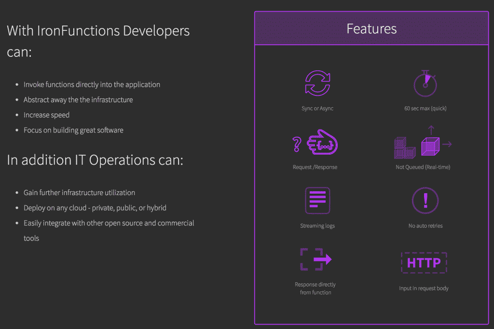

# Iron.io 的开源无服务器平台 IronFunctions 重新定义了混合云

> 原文：<https://thenewstack.io/iron-ios-open-source-serverless-platform-ironfunctions-redefines-hybrid-cloud/>

与云无关的开源平台 [IronFunctions](https://github.com/iron-io/functions) ，来自 [Iron.io](https://www.iron.io/) ，反映了企业市场中正在兴起的一种更加细致入微的混合云方法。

许多大型企业被云托管解决方案所吸引，因为创新的速度和分布式应用程序架构设计工具的可用范围。但是，围绕云存储安全性的新的和持续的担忧，以及对 Amazon Web Services 及其 Lambda 服务潜在垄断的日益担忧，正促使许多公司重新评估内部部署和云的理想组合，以此作为管理其基础架构堆栈的方式。

IronFunctions 提供了一个无服务器平台，企业可以在私有、公共和混合云上运行应用程序和工作流模式。奇怪的是，这意味着无服务器可以在本地运行(也就是说，有服务器)。在这里，工具意味着企业可以像对待私有云一样对待自己的数据中心，在开发速度、减少和自动化开发运维工作负载方面获得许多云托管优势，但是是在自己的硬件上。

Iron.io 首席技术官兼联合创始人 Travis re eder[表示:“我们希望这样做的主要原因之一是，财富 500 强公司希望在本地运行无服务器系统。里德说，公司希望使用 Lambda 函数的能力，“但不想在亚马逊上使用，他们希望主要在自己的数据中心运行。”](https://github.com/treeder)

里德认为，这反映了许多企业目前正在进行的讨论的几个驱动因素。

## 政府政策和云托管的吸引力

第一个驱动因素是安全问题。许多企业仍然不愿意将客户和业务数据转移到云托管提供商。他们希望在内部管理数据，但在创新能力、开发速度和为其业务案例设计非常具体的解决方案的能力方面，他们拥有云的优势。企业还受到与大型供应商的供应商锁定协议的困扰，当他们打破他们单一的遗留代码库时，他们正在寻找可能将他们从那些长期合同约束中解放出来的架构解决方案。

这就是选择 AWS 从促成者转变为关注者的原因。在美国，企业更频繁地考虑如何在防火墙后确保数据安全。在全球范围内，新上任的美国总统最近的评论表明，国际企业可能需要开始寻找非美国数据存储提供商。

在欧洲，当前关于建立开放数据经济的咨询建议减少数据本地化法律。数据本地化是指特定的国家法律可能要求数据存储位于该国境内。例如，德国有一项针对金融技术行业的数据本地化法律，规定某些客户的财务记录必须存储在该国。这催生了微软 Azure 德国公司的产品解决方案 来帮助企业遵守这一规定。欧盟委员会(European Commission)的咨询目前认为，此类法律会减缓创新，并阻碍充满活力的科技创业文化。

美国总统川普关于公共安全的行政命令取消了外国人的隐私保护措施。该行政命令指出，“各机构应在符合适用法律的范围内，确保其隐私政策排除非美国公民。”

这引起了 EU-美国隐私保护盾的执法人员的严重担忧(其中大多数云托管提供商，包括 AWS 、谷歌和微软在内的 [都是签署方)，这证明了美国云托管提供商将遵守欧洲的数据保护法。上周，欧盟司法专员 Vera Jourova](https://aws.amazon.com/compliance/eu-us-privacy-shield-faq/) [寻求隐私保护协议保持不变的保证。无论如何，欧洲政府和企业可能会开始寻找美国云提供商以外的解决方案。](https://euobserver.com/justice/136699)

即使对美国企业来说，公共安全措施的基本原则可能会导致公司希望留在本地，而不是将其数据暴露给潜在的政府监控。

## 避免新一轮的供应商锁定

除了安全问题，越来越多的企业也担心 AWS 的垄断地位。虽然 AWS 的创新能力给人留下了深刻的印象，它与容器化一起，帮助重新发明了当今的许多全球应用程序架构方法，但也有一些人嘀咕说，也许 AWS 吃了太多的馅饼，重现了供应商锁定问题，企业才刚刚开始摆脱他们以前的 IT 合同。

里德在 Lambda 公司看到了这一幕。“我们提供的一件事是，你不会被局限于 Lambda。通常，如果你开始使用 AWS Lambda，你就会被困在他们的生态系统中。如果你用的是我们，你可以在任何云平台或者你自己的硬件上运行功能。这是云的速度，但在本地，”里德说。

## IronFunctions 无服务器平台

IronFunctions 允许用户创建同步和异步函数，以及运行工人作业。该平台允许开发人员创建 API、微服务和功能，并将它们组合到应用程序中，并作为后台作业运行。“仔细想想，100%的应用都有同步组件。接下来是背景材料，但作为开发人员，这不是您想要开始的地方。有了 IronFunctions，你可以覆盖更多的基础:你可以构建 API，构建微服务……Functions 内置了一个 API 网关。

改变混合动力含义的最后一个驱动因素是成本。拥有自己的数据中心的企业希望自己遵循 AWS 模型，并从其数据中心资产的未使用部分中获得更多优化收益。

“无服务器在基础设施层面非常重要，”里德说。他指出，AWS Lambda 的定价模式允许企业只为秒或毫秒级的计算能力付费。“目前的数据中心利用率估计在 6%到 12%之间，其余时间服务器都处于闲置状态，保持正常运转，”Reeder 说。“IronFunctions 使您能够在任意数量的应用程序之间共享该硬件，从而自动减少所需的硬件数量。”

这就是里德认为开源产品最终会产生商业模式的地方。IronFunctions 背后的团队已经在研究可以在该平台上工作并作为商业附加物提供的高级指标。这可以包括更详细地了解 API 的使用方式，因为 API 可能由函数和微服务端点组成，从而可以更深入地了解正在进行的 API 调用，这可以帮助企业在其公共和合作伙伴 API 业务模式上进行创新。

除此之外，先进的指标可以引入人工智能优化解决方案，持续降低混合云和本地基础设施的成本。Reeder 解释说:“例如，你可以在 10 台机器上运行一个工作负载，找出哪一台效率最高，然后将工作负载转移到这些类型的机器上。这是一个与我们习惯的完全不同的范式:您可以动态地移动工作负载，或者如果效率更高，甚至可以完全迁移到不同的云。接下来，我们想尝试自动化。基于度量标准，您应该能够拥有一个可以自动移动事物的系统。我们已经用 [IronWorker](https://www.iron.io/platform/ironworker/) 做到了这一点，用于基于 AI 优化的自动缩放。我们会跟踪队列大小和跑步者数量等信息，因此仅基于应用的 CPU 进行优化是不同的指标。我们正在考虑采用其中的一部分，让人们用 IronFunctions 在内部运行它。”

随着 IronFunctions 向今年 4 月的正式上市日期迈进，该平台有望得到整合。Reeder 的路线图是保持 IronFunctions 主核心的坚固和简单，提供额外的功能，如 [扩展](https://medium.com/iron-io-blog/extending-ironfunctions-with-api-add-ons-listeners-and-middleware-3a31bfcb9aad#.hs4qe2nvu) ，插件和附加组件，而不是固有的平台特性。鉴于它在混合和本地的潜在用途，现在的重点是确保它在 OpenStack 环境中工作。当某些事件在 OpenStack 架构中发生时，函数可以触发动作，就像在 Amazon 中，向 DynamoDB 数据库添加一行或者向 S3 上传一个文件可能会触发 lambda 函数在后台执行一些任务。

除了 OpenStack 之外，在 Kubernetes 和 Docker Swarm 容器编排器中已经有了启动 [IronFunctions 实例的脚本，尽管 Reeder 还希望更正式地构建这些脚本。](http://blog.lwolf.org/post/how-to-run-functions-in-your-kubernetes-cluster/)

## 一种新的混合方法

Iron.io 并不是唯一一个试图让企业重新定义混合动力对他们意味着什么的公司。例如， [复制的](https://www.replicated.com/) 专为 SaaS 提供商打造，这些提供商希望添加企业级功能，并为防火墙后的企业客户提供部署，在公司的数据中心或私有云上运行。 Kontena 提供工具在任何云基础设施或裸机服务器上运行容器化应用。

混合云通常被视为允许企业向云迈出第一步的一种方式，而像 IronFunctions 和这种新型混合云管理产品这样的解决方案正在帮助重新定义混合云，与其说是向基于云的发展，不如说是其本身的目的，甚至是将云的优势带回公司数据中心硬件的一种方式。

Iron.io 是新堆栈的赞助商。

专题图片:由[迈克尔·墨菲](https://unsplash.com/@polygonglider)通过 Unsplash。

<svg xmlns:xlink="http://www.w3.org/1999/xlink" viewBox="0 0 68 31" version="1.1"><title>Group</title> <desc>Created with Sketch.</desc></svg>