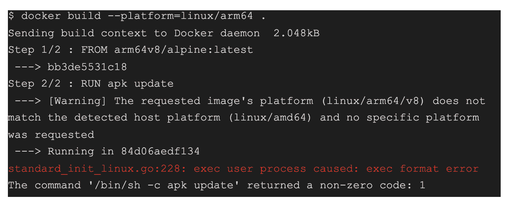
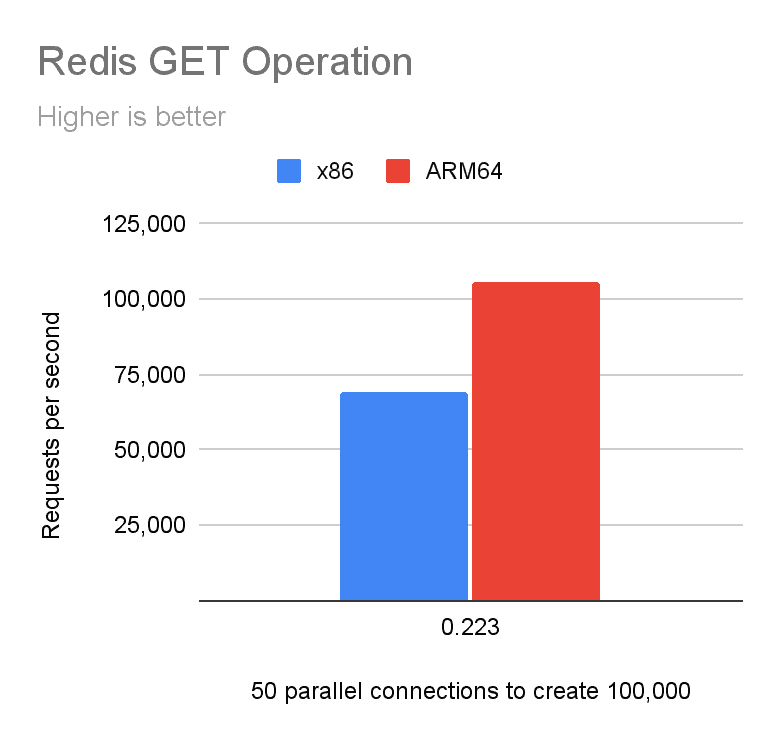
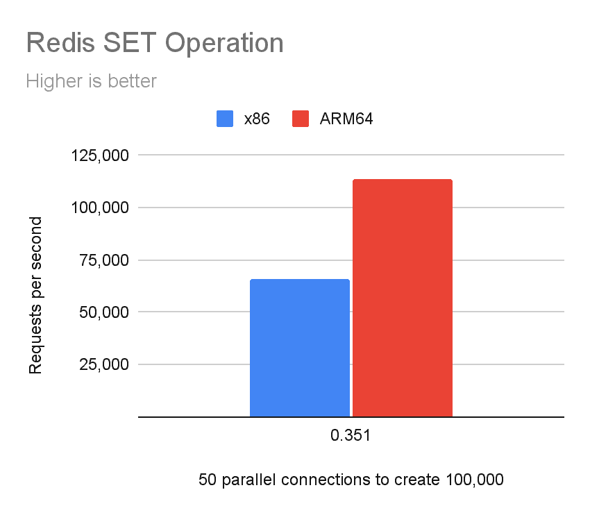

# Arm 架构是云计算的未来吗？

> 原文：<https://thenewstack.io/is-arm-architecture-the-future-of-cloud-computing/>

[Reza Ramezanpour](https://www.linkedin.com/in/rramezanpour/)

[Reza 是 Tigera 的一名开发人员，致力于促进 Calico 项目的采用。在加入 Tigera 之前，Reza 是一名系统工程师和网络管理员。](https://www.linkedin.com/in/rramezanpour/)

中央处理器(CPU)可以比作人脑，因为它们独特的架构允许它们以不同的方式求解数学方程。在撰写本文时， [x86](https://en.wikipedia.org/wiki/X86) 是云计算中使用的主流架构；然而，值得注意的是，这种架构并不是对所有场景都有效，其专有性质正在导致行业向 Arm 转移。

Arm(高级 RISC 机器)是一种 CPU 架构，用于大多数平板电脑和智能手机，以及世界上最快的超级计算机 Fugaku。Arm 的低功耗和高计算性能使其在云计算领域成为 x86 的有力竞争对手。

在本文中，我将讨论一些流行的 ARM 项目、x86 和 Arm 架构之间的主要差异，并探讨我们如何通过为开发人员提供基于 Arm 的容器环境来为他们的未来做准备。

## Arm 与 x86

越来越多的公司转向 Arm 来降低成本和能耗。虽然 x86 仍然是一个专有的 CPU 架构，但 Arm 向其他公司提供许可。这使得这些公司可以使用 Arm 的专利技术设计定制的处理器。

亚马逊定制设计的 Graviton 处理器是 Arm 在云计算中的一个很好的例子。通过使用这些处理器，AWS A1 实例提供了与 x86 EC2 实例相当的性能，同时节省了 40% [的成本](https://aws.amazon.com/ec2/graviton/)。

Arm 和 x86 的主要区别可以追溯到这些 CPU 执行指令的方式。例如，普通 x86 台式 CPU 使用复杂指令集计算机(CISC)架构的实现，允许单个指令在每个时钟周期执行多步操作。

另一方面，Arm 使用精简指令集计算机(RISC)架构的实现，允许它使用有限的、高度优化的指令集来在每个时钟周期执行单个指令。

## 武器容器

在我继续之前，让我们先解决房间里的大象。您可能会想，“许多容器运行时环境，如 Docker，可以使用`buildx`(或类似的)命令为各种 CPU 架构创建容器，那么我们为什么还要进行这样的对话呢？”

虽然`docker build --platform`可以创建一个特定于平台的映像，但是您不能从您的菜谱(Dockerfiles)中运行执行二进制文件的命令。

在下面的示例中，您可以看到由于主机和二进制体系结构类型之间的差异而导致的失败构建。

容器与主机共享 CPU 和内核，这意味着底层硬件决定了在容器环境中可以使用哪个指令集。这可以在之前的 Docker 构建输出中看到以红色突出显示。

我们使用的可执行程序被编译成二进制文件。编译是软件开发过程中神奇的一步，编译器(软件)将一段源代码(可以说是人类可读的！)并将其转换成特定于 CPU 的二进制机器代码(即 1 和 0)。简单来说:程序是其他程序做出来的。旁白:有一些基于解释器的语言可以直接从源代码中执行指令，但是我们不要陷入那个深渊。

## Linux 拯救世界

Linux 内核功能丰富，是一个模块化的软件，可以根据您的使用需求进行大量定制。其中一个特性 binfmt_misc 允许您使用解释器在系统中运行几乎任何二进制文件，而不管二进制编译的架构如何。Linux 可以被配置为使用`binfmt_misc`，并匹配二进制文件的开始字节，以识别哪个解释器适合执行它。

在我们的例子中，我们需要使用能够理解 ARM64 CPU 指令的解释器来运行所有的东西。(Linux 内核和 binfmt 是很大的话题，超出了本文的范围，但是如果您感兴趣，[kernel.org 的这篇文章](https://www.kernel.org/doc/html/latest/admin-guide/binfmt-misc.html)是开始您的旅程的好地方。)

Project [multiarch](https://github.com/multiarch/qemu-user-static) 使用相同的概念将管理程序 QEMU 注册为解释器，允许用户为容器模拟各种 CPU 架构。

## 仿真成本

仿真是在不需要实际硬件的情况下开始测试和开发解决方案的好方法。然而，值得注意的是，仿真在本机平台上增加了一层开销，使其不适合生产环境。

有限的功能和边缘情况，例如由于不是本地的而导致的较低的性能输出，可能是模拟成本的一个例子。

## 用例

近年来，编程语言已经发展到支持多架构，在大多数情况下，支持 Arm 这样的架构几乎不费吹灰之力。

Web 层项目是 Arm 集成的良好起点。举个例子，像 [Apache](https://httpd.apache.org/) 和 [NGINX](https://www.nginx.com/) 这样的项目是非常流行的网络服务器，已经支持 Arm 架构。值得注意的是，对 ARM 的支持并不是唯一的好处，因为在 Arm 环境中运行 NGINX 作为缓存服务器或反向代理将获得比 x86 更好的性能。

内存数据库是 Arm 架构可以提供改进的另一个领域。与 x86 环境相比，使用 RISC 架构，像 Redis 这样的应用程序可以获得引人注目的性能。

以下基准测试是 Redis `set`和`get`操作与 x86 和 ARM64 CPU 架构的比较。

注意:你可以在这里找到如何重现这个基准测试[的所有细节。](https://github.com/frozenprocess/Tigera-Presentations/tree/master/2021-09-24.Akraino.Multiarch.clusters)

【T8

完整的用例本身是一个巨大的主题，超出了本文的范围，但是如果你感兴趣，请查看这个 AWS 技术演讲，它分享了 ARM64 架构的一些实验和基准。

## 结论

Arm 架构似乎是 x86 系统的一个很好的替代方案，由于其效率，公司正在投资其云计算的未来。转变应用程序和集群可能会在不影响性能的情况下节省成本。

你知道你可以成为一名认证印花布操作员吗？在这个[免费的自定进度认证课程](https://academy.tigera.io/course/certified-calico-operator-level-1/)中，使用 Calico 学习 container 和 Kubernetes 网络和安全基础知识。

<svg xmlns:xlink="http://www.w3.org/1999/xlink" viewBox="0 0 68 31" version="1.1"><title>Group</title> <desc>Created with Sketch.</desc></svg>