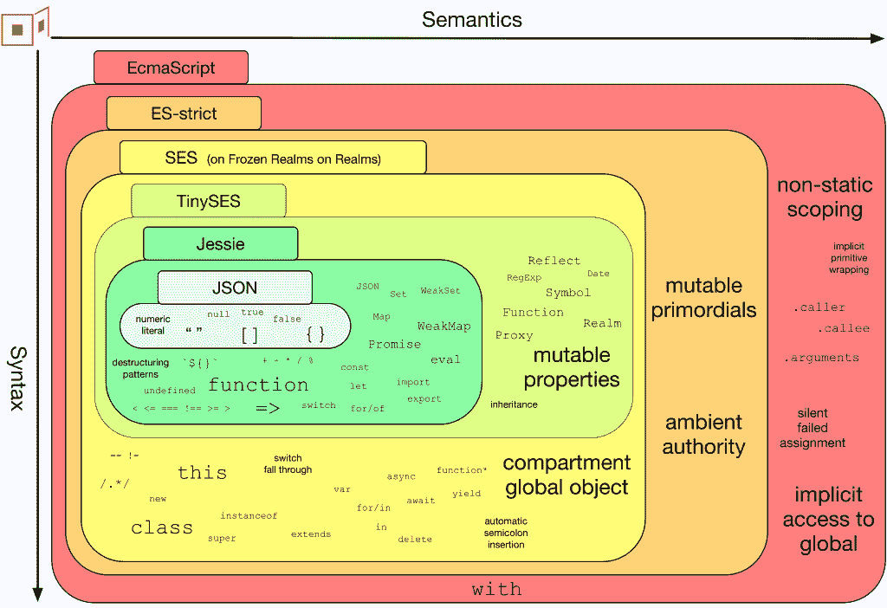

# JavaScript 是智能合约的未来吗？

> 原文：<https://thenewstack.io/is-javascript-the-future-of-smart-contracts/>

正如我们在文章[Web3 栈](https://thenewstack.io/web3-stack-what-web-2-0-developers-need-to-know/)中强调的，Web 3 中相当大一部分前端开发是用 Web 2.0 开发者非常熟悉的技术完成的:JavaScript。这意味着全球约 1600 万 JavaScript 开发人员(T2)有大量机会参与构建下一阶段的网络。现在 [Agoric](https://agoric.com/) ，一个第一层堆栈验证区块链，正在下大赌注，JavaScript 也可以用于智能合同，这是分散信任的基础，而分散信任是 Web3 分散应用开发的核心。到目前为止，智能合约主要是用 Solidity 或 Rust 这样的语言编写的。

## 什么是智能合同？

智能合约比区块链早了几十年，尽管它们已经成为区块链和 Web3 技术的同义词。正如 Agoric 的 Dean Tribble 在接受新堆栈采访时所说的，“本质上，智能合同是一种执行协议条款的软件，就像第三方之间签订的法律合同一样。”

一些熟悉的例子可能是像优步使用软件连接你到一个陌生的司机同意带你到一个预先选定的目的地；这是一种聪明的契约。交易需要一个可信的中介，在这种情况下，是一个集中的软件公司，它有特权访问信息，如您的信用卡和支付端的位置，以及驱动程序的可用性。软件连接双方，让你搭车，司机收费。

“区块链带来了复制执行，”特里布尔说，“在这里，多个司法管辖区和管理域中的机器都投票同意发生什么。跨司法管辖区的共识意味着任何组织或政府都不能损害执行的完整性。”

这允许像金融交易这样的事情跨越国界，比司机和骑手在同一个城镇更复杂。Agoric 的目标是让商业世界的大部分在这种环境下工作，这意味着它需要由几千名以上的开发人员进行编程。因此，没有比 1600 万开发人员理解的语言更好的了，允许他们使用熟悉的开发环境。

目前，区块链智能合约的编程仅限于相对较少的知道如何使用 Solidity 编程的人，Solidity 是以太坊及其第二层侧链的智能合约语言，或其他语言，如 Solana 上的 Rust。Agoric 正在帮助 JavaScript 开发人员快速跨越实现智能合约的障碍，与 React 使使用可重用组件构建 JavaScript 应用程序更容易的方式相同。

## 将 JavaScript 用于智能合约的缺点

我向特里布尔询问了潜在的负面影响，他以一个简洁的回答开始，说:“可能有负面影响，但没关系。Github 做了一项分析，Github 上的应用程序中 97%的代码来自第三方库。”

但他接着提供了更多的细节。

“特定组件模型有很多缺点，”他说。“你真的需要一种语言、框架和库，它能最小化安全隐患，同时又能使组装变得容易。React 是一个很好的例子，因为该模型具有启示性，并且解决了将事物组合在一起的正确挑战。在 React 之前有很多用户体验框架，但是 React 做得很好。我们的组件就像 React 组件，我们的框架支持使用我们的组件，并与其他组件组成应用程序。”

## 安全呢？

Agoric 在他们的组件模型中使用强化的 JavaScript 来构建可组合的智能契约，这限制了 JavaScript 运行时的能力。

“强化的 JavaScript 允许你锁定你的 JavaScript，这样就不可能做你不想让它做的事情，”特里布尔解释道。“程序的权限完全由程序运行的范围控制。我们控制范围。您完全可以使用我们提供的访问和权限运行，因此我们可以真正限制任意 JavaScript 的执行。”

Agoric 对[强化的 JavaScript](https://agoric.com/documentation/guides/js-programming/hardened-js.html#counter-example) 进行了详细的探索，其中包括以下示例图片:

相比之下，Solidity 编程模型存在安全隐患和可重入性等问题。自从有同步程序以来，可重入就一直是同步编程模型的一个问题。当一个程序在请求者得到初始请求已完成的确认之前，可以多次有效地向另一个程序重复相同的请求时，就会发生这种情况。这意味着，例如，你可以反复请求相同数量的 ETH，并在你请求的程序有时间确认你得到了钱之前不断得到更多的 ETH。威尔·沙赫达在媒体上提供了一个很好的例子。

据特里布尔称，Agoric 首席工程师布莱恩·华纳在以太坊上线前的一次安全审查中指出了这些重入攻击的风险。他也承认，这在当时可能是正确的权衡。转移到异步模型可以避免可重入性问题，但是由于这是以太坊设计中的一个基本特性，它不是一个可以解决的问题。

## 降低使用费

对以太坊最大的抱怨之一是与工作证明相关的汽油费。这个问题的核心是希望增加以太坊网络上的活动的人和希望增加费用的矿工之间的根本错位。正如特里布尔所说，“矿工是贫民窟的主人，以太坊是廉价公寓。房东获得更多钱的唯一方法就是提高房租。”

除了作为第 1 层风险证明网络，Agoric 还在寻求解决这种经济不兼容问题，以使其区块链网络的优先级与经济运行的动态相一致。因此，他们将治理令牌 BLD 和费用令牌 RUN 分开，目的是让 RUN 成为一个稳定的令牌，不会波动。

特里布尔这样解释原因:“把汽油费想象成你的房租或电费。以太坊就像用苹果股票的股份来支付你的房租。从商业规划的角度来看，这并不太好。很难比较租金是逐月上涨还是下降。相反，你想要的是用一种稳定的代币支付汽油，这意味着它需要是链条的内在组成部分，不应该进入验证器的口袋——因此没有提高租金的动力。”

这就是跑步的用武之地。特里布尔说:“执行中使用的运行进入货币储备，为供应链提供稳定性和执行增长。”“验证者的所有费用都来自借贷运行费用，而不是执行费用。这意味着，随着经济的增长，随着我寄给你更多的支票，随着我购买更多的 NFT，随着我锁定更多的代币，流通中的运行量上升，一小部分进入 BLD 持有者的赌注和授权。所以他们的报酬随着经济的增长而增长。”

## JavaScript 是智能合约的未来

Agoric 是否会成功地为其可组合的 JavaScript 智能合约组件带来大规模采用还有待观察，但 React 看起来肯定是构建基于组件的框架的成功模型。在可预测的成本控制结构中分层也将在帮助分散的应用程序理解做生意的成本方面发挥作用。Agoric 还计划实现互操作性，通过区块链间通信协议和 Chainlink oracle 网络，使以太坊和宇宙成为可能。

看起来很有意义的是，允许已经拥有丰富经验的 JavaScript 开发人员，特别是在金融领域，利用他们的知识和背景来满足金融法规遵从性指导原则和安全标准。这部分特定的开发人员也往往拥有为成千上万技术水平各异的用户实现应用程序的丰富经验，因此将他们的 UX 知识与编写智能合同的简单方法结合起来可能是一个成功的组合。

<svg xmlns:xlink="http://www.w3.org/1999/xlink" viewBox="0 0 68 31" version="1.1"><title>Group</title> <desc>Created with Sketch.</desc></svg>