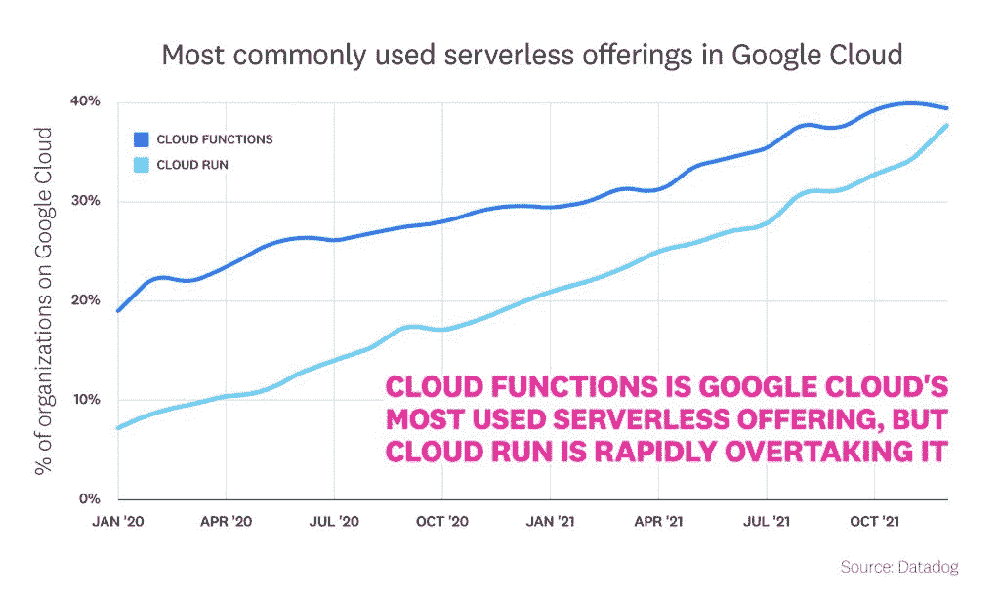
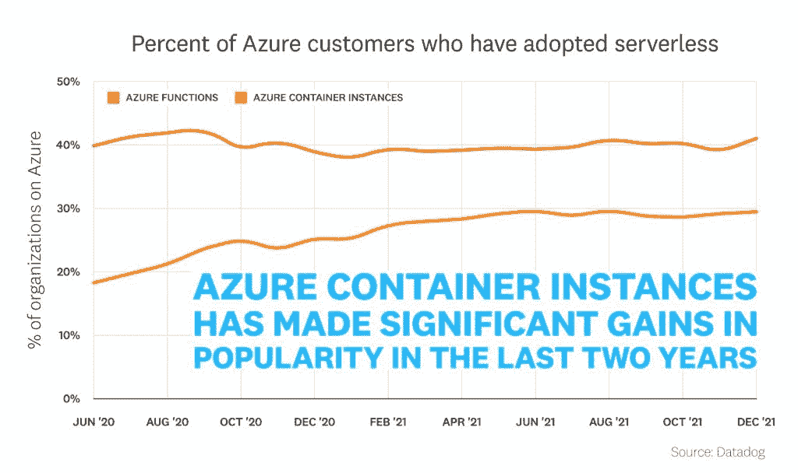
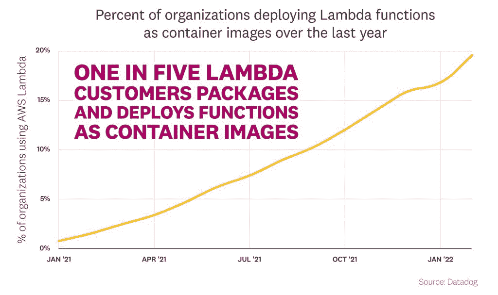

# Kubernetes 的采用在放缓吗？

> 原文：<https://thenewstack.io/is-kubernetes-adoption-slowing/>

你是否曾经买过一辆你认为有些独特的车，但后来你开始到处看到那辆车的品牌、型号和颜色？这被称为巴德尔-迈因霍夫现象，或[频率错觉](https://en.wikipedia.org/wiki/Frequency_illusion)，这是一种影响我们对频率感知的认知偏差。

我们倾向于高估我们看到或听到某事的次数，因为它最近一直在我们的脑海中。

这种偏见有时会很有帮助，比如当试图记住某人的名字或者我们把钥匙放在哪里的时候。然而，它也会让我们误入歧途，比如当我们认为我们已经看到或听到的东西比我们实际看到或听到的要多。

## **Kubernetes 真的在吃云吗？**

 [马克·辛克尔

Mark 在新兴技术和开源领域有着悠久的历史。在共同创立 TriggerMesh 之前，他是 Node.js 基金会的执行董事，也是 Citrix、Cloud.com 和 Zenoss 的高管，在那里他领导了开源项目。](https://www.linkedin.com/in/markrhinkle/) 

为什么我要提到巴德尔-迈因霍夫和库伯内特的关系？因为作为一名在 [TriggerMesh](https://triggermesh.com/?utm_content=inline-mention) 开发基于 [Kubernetes 的软件](https://www.triggermesh.com/product-overview)的开发者，我认为“每个人”都在使用 Kubernetes。然而，在我的日常业务中，我发现有限数量的用户故意使用 Kubernetes，而不是我被引导相信的那样。我一直在想，我是不是成了巴德尔-迈因霍夫现象的牺牲品，或者是否有另一种解释。

Kubernetes 由谷歌于 2014 年创建，并于 2015 年捐赠给[云原生计算基金会](https://cncf.io/?utm_content=inline-mention)。它已经成为大规模生产中运行容器的标准。从那以后，据大多数人说，它获得了巨大的成功。

然而，当我在谷歌上查看 Kubernetes 搜索趋势时，我惊讶地发现全球搜索量在过去两年中有所下降。我想知道搜索量是否是使用情况的一个很好的代理，或者这些数字是否不能说明全部情况，因为由于可扩展性和将其嵌入到其他系统中，少数开发人员和云原生工程师可以为更多用户部署系统。

**全球 Kubernetes 搜索的谷歌趋势数据**

我还研究了采用 Kubernetes 的挑战，正如 Linux 基金会培训总经理 Clyde Seepersad 在 TNS 的一篇文章中指出的那样，[你不能靠雇佣来摆脱云技能短缺](https://thenewstack.io/you-cant-hire-your-way-out-of-the-cloud-skills-shortage/)。根据 Canonical Kubernetes 和 2022 年云原生运营报告，在迁移到或使用 Kubernetes 时，缺乏内部技能是首要问题。

**迁移到/使用 Kubernetes 和容器的最大挑战**

## CNCF 称 Kubernetes 仍在增长

根据[CNCF 2021 年度调查](https://www.cncf.io/reports/cncf-annual-survey-2021/)，96%的组织正在使用或评估 Kubernetes，这是自 CNCF 2016 年开始年度调查以来的新高。在 Kubernetes 在生产中的区域采用方面，新兴技术中心非洲(73%)领先于其他更成熟的技术中心，包括欧洲(69%)和北美(55%)。此外，93%的受访者目前正在生产中使用或计划使用容器，与 2020 年调查中的 92%相呼应。

我怀疑，因为 CNCF 样本是针对云本地用户的，所以它有点倾斜，但它仍然是一个非常大的样本，并提供了良好的数据。

## **无服务器是大量采用 Kubernetes 的途径吗？**

最近，我写了一篇关于从 [COBOL 到云原生](https://thenewstack.io/going-from-cobol-to-cloud-native/)的路径。我的研究得出的一个结论是，尽管我们中的绝大多数人从未见过底层架构，但大型机仍然在我们的生活中扮演着重要的角色。回顾一下，大型机在金融行业中无处不在，全球最大的 100 家银行中有 96 家，全球最大的 10 家保险公司中有 9 家，美国最大的 25 家零售商中有 23 家，以及财富 500 强中有 71%的公司都在使用大型机。然而，我要说的是，许多使用大型机服务的人并不了解底层的基础设施。

这让我怀疑 Kubernetes 是否还在快速增长。但它正在成为云的底层结构和服务的一部分，不会暴露 Kubernetes 的复杂性，就像大型机一样。

也许无服务器计算的持续采用是 Kubernetes 采用的潜在趋势的一部分，尽管是在幕后。今年早些时候，我在一篇文章中思考过，[“无服务器只是事件驱动架构的一个中途站吗，](https://thenewstack.io/is-serverless-just-a-stopover-for-event-driven-architecture/)”我可能错过了一个更流行的趋势 Kubernetes 可能是通往无服务器的中途站。

Datadog 最近发布了其 [Datadog 无服务器状态报告](https://www.datadoghq.com/state-of-serverless/)，该报告显示无服务器的采用正以可观的速度增长。此外，许多无服务器的采用都是基于 Kubernetes 的。

**云提供商采用无服务器**

就无服务器而言，最突出的平台是 T4 的亚马逊网络服务，但它并不在幕后运行 Kubernetes。它运行在一个微型 VM 架构上，开源实现表明它不使用 Kubernetes，但提供了类似的功能。然而，大多数其他无服务器供应商都基于 Kubernetes 提供无服务器产品。

**谷歌云中最常用的无服务器产品**

来源:数据狗

来源:数据狗

许多组织已经为 Kubernetes 容器化了应用程序，但是其他组织直接将容器部署到无服务器云服务。无服务器是一个短暂的容器，可以向上扩展，然后扩展到零。也许这种无服务器的增长部分是由于容器和 Kubernetes 的采用。

来源:数据狗

## **总结**

Kubernetes 的采用仍在增长，96%的组织在使用或评估 Kubernetes。尽管采用率很高，但 Kubernetes 的采用仍面临一些挑战，包括缺乏内部技能。Kubernetes 也越来越多地嵌入到其他系统中，因此它的采用可能不像以前那样明显。无服务器计算是 Kubernetes 正在被采用的一个领域，而且这种趋势可能会继续下去。所以，也许这才是成功的真正标志——像 Linux 一样，越来越多的人使用这项技术，但更容易使用、对开发人员友好的抽象正在对它进行抽象。

<svg xmlns:xlink="http://www.w3.org/1999/xlink" viewBox="0 0 68 31" version="1.1"><title>Group</title> <desc>Created with Sketch.</desc></svg>